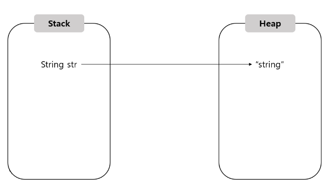

# 클래스

## 6.1 객체 지향 프로그래밍

- S/W 개발시 부품에 해당하는 객체를 먼저 생성하고 이 객체들을 하나씩 조립해서 완성된 프로그램을 만드는 기법

### 객체

- 물리적으로 존재하거나 개념적인 것 중에서 다른 것과 식별 가능한 것<br>
-  (물리적) 자동차, 자전거, 책  <br>  (개념적) 학과, 강의, 주문
- 속성(필드)과 동작(메서드)으로 구성됨

### 객체 모델링

- 현실 세계의 객체를 S/W 객체로 설계하는 것
- 현실 세계의 객체의 대표 속성과 동작을 추려내어 S/W 객체의 속성(필드)과 동작(메서드)로 정의하는 과정

### 객체의 상호작용

- 객체는 메서드를 호출하여 다른 객체의 기능을 이용함(다른 객체와 상호작용하면서 동작) 
- 메서드의 호출을 통해 객체들은 데이터를 주고 받음
- 메서드의 리턴값을 호출한 곳에서 변수로 대입받아서 사용함
```java
int result = add(70,80); // return value를 int형 변수 result에 저장
```

### 객체간 관계

- 집합 관계
- 사용 관계
- 상속 관계
  - 부모와 자식 관계를 뜻함
  - 부모의 특징인 필드, 메서드를 물려 받는 것

### 객체 지향 프로그래밍의 특징

#### 1. 캡슐화

- 객체의 데이터(필드), 동작(메서드)를 하나로 묶고 실제 구현 내용을 감추는 것
- 따라서 외부 객체는 객체 내부의 구조를 알지 못함 (객체가 제공하는 필드와 메서드만 이용가능)
- 자바는 `접근 제한자`를 이용해서 캡슐화된 멤버를 노출시킬지 여부를 결정함

#### 2. 상속

- 부모 객체가 자신이 가지고 있는 필드와 메서드를 자식 객체에게 물려주어 자식 객체가 사용할 수 있도록 하는 것
- 상속의 이점
  - 코드의 재사용성을 높여줌 
    - 잘 개발된 부모 객체의 필드&매서드를 자식이 그대로 사용할 수 있음
  - 유지 보수 시간을 줄여줌
    - 부모 객체에서 필드와 메서드를 수정하면 수정된 것을 자식이 그대로 사용할 수 있음


#### 3. 다형성

- 사용 방법은 동일하지만 실행 결과가 다양하게 나오는 성질
- 자동차 바퀴부품를 무엇을 끼느냐에 따라 자동차 성능이 달라지듯, 프로그램을 구성하는 객체(부품)를 바꾸면 프로그램의 실행 성능이 다르게 나올 수 있음

## 6.2 객체와 클래스

### 클래스

- 객체를 생성하는 설계도

### 인스턴스

- 클래스로부터 생성된 객체
- `인스턴스화`: 클래스로부터 객체를 만드는 과정

## 6.3 클래스 선언 

- 객체 생성을 할 수 있는 설계도인 클래스를 작성하는 작업
- `클래스명은 소스 파일명과 동일` 해야함

```java
public class 클래스명{
    
}   // 클래스 선언
```

- 클래스명
  - 첫문자: 대문자(숫자 X)
  - 캐멀 스타일로 작성
  - 특수 문자 $,_ 포함 가능

- 하나의 소스 파일(*.java)내에 여러 개의 클래스를 선언할 수 있음
- 소스 파일(*.java)을  컴파일시 바이트코드 파일(.class)는 클래스를 선언한 수만큼 생김
- 단, 하나의 소스 파일(*.java)에 여러 개의 클래스를 선언하는 경우 소스 파일명과 동일한 클래스만 public class로 선언할 수 있음

## 6.4 객체 생성과 클래스 변수

```java
클래스 변수 = new 클래스();
```
- new 연산자 
  - 뒤에 생성자 호출 코드가 옴
  - 객체를 생성시킨 후 객체의 주소를 리턴함




- 스택 영역에 생성된 클래스 변수는 힙 영역에 생성된 객체를 참조함


### 클래스의 용도

```java
/* Student.java */
public class Student{
    
}

/* StudentExample.java */
public class StudentExample {
    public static void main(String[] args){
        Student s1 = new Student();
        System.out.println("s1 변수가 Student 객체 참조");
        
        Studetn s2 = new Student();
        System.out.println("s2 변수가  또다른 Student 객체 참조");
    }
}
```

#### 1. 라이브러리 클래스

- 실행할 수 없으며 다른 클래스에서 이용하는 클래스

- Student

#### 2. 실행 클래스

- 메서드를 가지고 있는 실행 가능한 클래스

- StudentExample

## 6.5 클래스의 구성 멤버


```java
public class ClassName{
    int fieldName; // 필드 선언
  
    ClassName();   // 생성자 선언
  
    int methodName(){}   // 메서드 선언
}
```

- 필드
  - 객체의 데이터가 저장되는 곳

- 생성자
  - new 연산자로 객체를 생성할 경우 객체의 초기화 역할을 담당함

- 메서드
  - 객체가 수행할 동작
  

## 6.6 필드 선언과 사용

- 필드
  - 객체의 데이터를 저장하는 역할

```java
public class Car{
    /* 고유 데이터를 저장하는 필드 선언 */
  String company;
  String model;
  String color;
  int maxSpeed;
  
  /* 상태 데이터를 저장하는 필드 선언 */
  int speed;  // 현재속도
  int rpm;   // 엔진회전 수
  
  /* 부품 데이터를 저장하는 필드 선언 */
  Body body;  // 차체
  Engine engine;  // 엔진
  Tire tire;   // 타이어
}
```


### 필드 선언

- 필드는 반드시 클래스 블록에서 선언되어야 함
- 필드명은 첫 문자를 소문자로 작성해야 한다.
- 필드명은 카멜 스타일로 작성하는 것이 관례이다

```java
public class Car{
    String model = "람보르기니";  // 고유 데이터 필드
  int speed = 300;  // 상태 데이터 필드
  boolean start = true;  //  상태 데이터 필드
  Tire tire = new Tire();  // 부품 객체 필드
}
```


```java
public class Car {
    /* 필드 선언 */
  String model;
  boolean start;
  int speed;
  
  /* 생성자에서 필드 사용 */
  Car() {
      speed = 50;
  }
  
  /* 메서드에서 사용 */
  void method(){
      speed = 70;
  }
  
}

public class CarEx{
  public static void main(String[] args) {
    Car myCar = new Car();  // Car 객체 생성

    /* Car 객체의 필드값 읽기 */
    System.out.println(myCar.model);
    System.out.println(myCar.start);
    System.out.println(myCar.speed);
  }
}
```

### 필드 사용

- 필드값을 읽고 변경하는 행위
- 클래스로부터 객체가 생성된 이후에 필드(객체의 속성)를 사용할 수 있음
- 필드(객체의 속성)는 객체 내부의 생성자와 메서드 내부에서 사용할 수 있음 (객체 외부에서도 접근해서 사용가능)
  - 객체 내부: 필드명을 읽고 변경할 수 있음
  - 외부 객체: 참조 변수와 점(.)연산자를 이용해서 필드를 읽고 변경할 수 있음
  
```java
public class Car {
  /* 필드 선언 */
  String company = "쌍용";
  String model = "티볼리";
  String color = "회색";
  int maxSpeed = 300;
  int speed;
}

public class CarEx{
  public static void main(String[] args) {
    Car myCar = new Car();  // Car 객체 생성

    /* Car 객체의 필드값 읽기 */
    System.out.println(myCar.company);
    System.out.println(myCar.model);
    System.out.println(myCar.color);
    System.out.println(myCar.maxSpeed);
    System.out.println(myCar.speed);
    
    /* Car 객체의 필드값 변경 */
    myCar.speed = 60;  // 외부에서 필드 사용
    System.out.println(myCar.speed);  // 변경된 필드값 - 속도
  }
}
```


## 6.7 생성자 선언 및 호출

```java
클래스 변수  = new 클래스();  // 생성자 호출
```

- new 연산자
  - 객체 생성을 한 다음 생성자를 호출해서 객체를 초기화함

- 생성자가 성공적으로 실행이 끝나면 new 연산자는 객체의 주소를 리턴함
  - 리턴한 주소는 변수에 대입되어 객체의 필드나 메서드에 접근할 때 사용됨

### 기본 생성자

- 모든 클래스는 생성자가 존재하며, 하나 이상의 생성자를 가짐
- 클래스에 생성자 선언이 없는 경우 컴파일러는 바이트코드 파일(*.class)에 자동으로 기본 생성자를 추가함

```java
/* 소스 파일(Car.java) */
public class Car{}

/* 바이트코드 파일 (Car.class) */
public class Car{
    public Car(){}   // 컴파일러에 의해 자동으로 추가됨
}

/* new 연산자 뒤에 기본 생성자 호출 */
Car myCar = new Car();
```

- 클래스가 public으로 선언된 경우
  - 기본 생성자에도 public이 붙음
  - public 없이 class로만 선언되는 경우, 기본 생성자에 public이 붙지 않음

- 단, 명시적으로 선언한 생성자가 있는 경우 컴파일러는 기본 생성자를 추가하지 않음<br>
  (생성자를 선언하는 이유는 객체를 다양하게 초기화하기 위함임)


### 생성자 선언

- 생성자
  - 리턴 타입이 없음
  - 클래스명과 동일
  - new 연산자로 생성자를 호출
  - 생성자의 매개변수는 생성자를 호출할 때 매개변수값을 생성자 블록 내부로 전달함

```java

// 매개변수로 매개값을 대입 받음
// 매개값을 매개변수로 대입 받기 위해서 생성자가 선언되어야 함
public class Car {
    /* 생성자 선언 */
    Car(String model, String color, int maxSpeed){}
}

public class CarEx {
  public static void main(String[] args) {
    // Car 생성자 호출
    Car myCar = new Car("티볼리", "회색", 250);

  }
}
```

- 위 예시에서는 클래스 내에 직접 선언한 생성자가 있으므로 컴파일러는 기본 생성자를 추가하지 않음

### 필드 초기화

```java
public class Korean{
    /* 필드 선언 */
    String nation = "대한민국";
    String name;
    String ssn;
    
    /* 생성자 선언 */
    public Korean(String n, String s){
        /* 초기화 -> 객체 속성의 초기값으로 사용 */
      // 한국인이라 하더라도 이름과 주민번호는 각각 다르므로 생성자에서 객체의 속성을 초기화
        name = n;
        ssn = s;
    }
}
```

- 객체마다 동일한 값을 가지고 있을 경우 
  - 필드 선언시 초기값을 대입하는 것이 좋다
- 객체마다 다른 값을 가져야 하는 경우
  - 생성자에서 필드(객체의 속성)를 초기화하는 것이 좋다


### 생성자 오버로딩

- 매개변수의 타입이나 개수 및 순서등이 다르게 설정되어있는 생성자를 여러 개 선언하는 것
- 매개변수의 값으로 객체의 필드(객체의 속성)를 다양하게 초기화할 때 사용

```java
public class Car { 
  /* Car 클래스에서의 생성자 오버로딩 */
  Car() {}
  Car(String model) {}
  Car(String model, String color){}
  Car(String model, String color, int maxSpeed){}
}
```

#### 유의사항

- 매개변수의 타입과 개수 및 선언된 순서가 같은 경우<br>=> 매개변수의 이름만 바꾸는것은 생성자 오버로딩이라 볼 수 없음

```java
Car(String model, String color){}
Car(String color, String model){}  // Error. 오버로딩 X 
```

- 생성자가 오버로딩이 되어있는 경우, new 연산자로 생성자를 호출할 때 제공되는 매개값의 타입과 수에 따라 생성자가 결정됨

```java
Car car1 = new Car();  // 생성자 => Car() {}
Car car2 = new Car("티볼리");   // 생성자 => Car(String model) {}
Car car3 = new Car("티볼리", "회색");  // 생성자 => Car(String model, String color){}
Car car4 = new Car("티볼리", "회색", 250);  // 생성자 => Car(String model, String color, int maxSpeed){}
```


### 다른 생성자 호출

- 생성자 오버로딩이 많아질 경우 생성자 간의 코드중복 문제가 발생할 수 있음
- 이러한 경우 공통되는 코드를 한 생성자에서 집중적으로 작성하고 나머지 생성자는 `this`를 이용해서 공통된 코드를 가지고 있는 코드를 생성자를 호출하는 방법으로 문제를 해결하는게 좋다.

- 문제가 되는 코드
```java
Car(String model){
    /* 중복코드 */
    this.model = model;
    this.color ="은색";
    this.maxSpeed = 250;
}

Car(String model, String color){
    /* 중복코드 */
    this.model = model;
    this.color = color;
    this.maxSpeed = 250;
}

Car(String model, String color, int maxSpeed){
    /* 중복코드 */
    this.model = model;
    this.color = color;
    this.maxSpeed = maxSpeed;
}
```

- 문제를 해결한 코드
```java
Car(String model){
    this(model, "은색", 250);    
}

Car(String model, String color){
    this(model, color, 250);
}

Car(String model, String color, int maxSpeed){
    /* 공통 초기화 코드 */
    this.model = model;
    this.color = color;
    this.maxSpeed = maxSpeed;
}

```

#### this

- 생성자의 첫 줄에 작성되며 다른 생성자를 호출하는 역할
- 호출하고 싶은 생성자의 매개변수에 맞게 매개값을 제공하면 됨
- this 다음에는 추가적인 실행문을 작성할 수 있고, 호출되는 생성자의 실행이 끝나면 원래 생성자로 돌아와서 다음 실행문을 실행함.

## 6.8 메서드 선언과 호출

- 메서드
  - 객체간 상호작용하는 방법을 정의하는 것

### 메서드 선언

- 객체의 동작을 실행 블록으로 정의하는 것

#### 리턴타입

- 메서드 실행 이후 메서드가 호출한 곳으로 전달하는 결과값의 타입
- 리턴 타입이 있는 메서드는 실행 블록 내에서 return 문으로 리턴값을 반드시 지정해야 함


#### 메서드명

- 첫 문자를 소문자로 시작
- 카멜 스타일로 작성
```java
void walk(){}
void setPower(int power){}
```

### 메서드 호출

- 메서드 실행 블록을 실제로 실행하는 것
- 메서드는 객체의 동작이므로 객체가 존재하지 않는 경우 메서드를 호출할 수 없다 (클래스에서 메서드를 선언했다고 하여 바로 호출할 수 있는것이 아님)
- 클래스로부터 객체가 생성된 이후 메서드는 생성자와 다른 메서드의 내부에서 호출 될 수 있음 (+ 객체 외부에서도 호출될 수 있음)
- 객체 내부
  - 메서드명으로 호출
```java
// 생성자
Calculator(){
    powerOff();  // 호출  
}

// 메서드
void powerOn(){}
void powerOff(){}
int plus(int x, int y){}
```


- 객체 외부
  - 참조 변수와 점(.)연산자를 이용해서 호출
```java
// 생성자
Calculator(){
  powerOff();  // 호출  
}

// 메서드
void powerOn(){}
void powerOff(){}
int plus(int x, int y){}
                
void method(){
    Calculator calc = new Calculator());
    calc.powerOn();  // 호출
}
```


- 메서드가 리턴값이 있는 경우 대입 연산자를 사용해서 리턴값을 변수에 저장할 수 있음
<br> (변수의 타입은 메서드의 리턴 타입과 동일하거나 자동 타입 변환될 수 있어야 함)
```java
타입 변수 = 메서드();
```

### 가변길이 매개변수

```java
// 가변길이 매개변수 선언
int sum(int ... values);


//  가변길이 매개변수 제공 - 매개값의 개수와 상관없이 제공
int result = sum(1,2,3);
int reuslt2 = sum(1,2,3,4,5);
```

- 메서드가 가변길이 매개변수를 가지고 있을 경우 매개변수의 개수와 상관없이 매개값을 줄 수 있음
- 매개값들은 자동으로 배열로 변환되어 메서드에서 사용됨
- 따라서 메서드 호출시 배열을 직접적으로 매개값으로 제공해도 됨
```java
// 가변길이 매개변수 - 배열을 직접 매개값으로 제공
int[] values = {1,2,3};
int result3 = sum(values);

// 가변길이 매개변수 - 배열을 직접 매개값으로 제공 
int result4 = sum(new int[] {1,2,3});
```

### 예시

```java
public class Computer{
    /* 가변길이 매개변수를 갖는 메서드 */
  int sum(int ... values){
      int sum = 0;
      
      /* values는 배열 타입의 변수처럼 사용 */
      for (int i=0; i<values.length; i++){
          sum += values[i];
      }
      
      return sum; // 합산 결과를 리턴
  }
}

public class ComputerEx{
  public static void main(String[] args) {
    Computer myCom = new Computer();   // Computer 객체 생성
    
    int result1 = myCom.sum(1,2,3);  // sum() 메서드 호출시 매개값 1,2,3 제공
 
    int result2 = myCom.sum(1,2,3,4,5);  // 매개값 1,2,3,4,5 제공
    
    int values[] = {1,2,3,4,5,6,7,8,9};
    int result3 = myCom.sum(values);  // 배열을 제공
    
    int result4 = myCom.sum(new int[] {3,6,9,12});
  }
}
```

### return 문

- 메서드의 실행을 강제 종료하고 호출한 곳으로 되돌아감
- 메서드 선언에 리턴 타입이 있을 경우 return 문 뒤에 리턴값을 추가로 지정해야 함

### 메서드 오버로딩

- 메서드명을 중복해서 정의하는 것
- 매개변수의 타입 혹은 개수 및 순서가 달라야 함
- 메서드 오버로딩을 통해 다양한 매개값을 처리할 수 있다

```java
int plus(int x, int y){
    int result = x+y;
    return result;
}

// plus 메서드를 오버로딩 (매개변수의 타입이 다름)
double plus(double x, double y){
    double result = x+y;
    return result;
}
```

#### println() 메서드

- 메서드 오버로딩의 대표적인 예시
- 호출시 주어진 매객값의 타입에 따라서 오버로딩된 println() 메서드 중 하나를 선택해서 실행함
```java
void println(){}
void println(double x){}
void println(int x){}
void println(String x){}
```
#### 오버로딩 예시

```java
public class Calculator{
    // 정사각형의 넓이
    double areaRectangle(double width){
        return width*width;
    }
    
    // 직사각형의 넓이 - 메서드 오버로딩 (매개변수의 개수가 다름)
    double areaRectangle(double width, double height){
        return width*height;
    }
}
```


## 6.9 인스턴스 멤버

| 구분                | 설명                            |
|:------------------|:------------------------------|
| 인스턴스(instance) 멤버 | 객체에 소속된 멤버 (객체를 생성해야 사용가능)    |
| 정적(static) 멤버     | 클래스에 고정된 멤버 (객체 없이도 사용할 수 있음) |


### 인스턴스 멤버 선언 및 사용

```java
public class Car{
    int gas; // 인스턴스 필드 선언
  
  void setSpeed(int speed){} // 인스턴스 메서드 선언
}

public class CarEx{
  public static void main(String[] args) {
    Car myCar = new Car();   // 인스턴스 멤버를 외부에서 사용하기 위해 Car 객체 생성
    
    myCar.gas = 20;   // 참조변수로 접근해서 인스턴스를 사용
    myCar.setSpeed(50);  
  }
}
```

- gas 필드는 객체마다 따로 존재함
- setSpeed() 메서드는 메서드 영역에 저장되고 나서 공유됨 (각 객체마다 존재하지 않음)

#### tip

- 메서드는 코드의 덩어리이므로 객체마다 일일이 저장할 경우 중복 저장으로 인해 메모리 효율이 떨어짐
- 따라서 메서드 코드는 메서드 영역에 두고 공유해서 사용하는 것임 (단, 객체 없이는 사용하지 못하도록 제한을 걸어둠)


### this

- 객체 내부에서 인스턴스 멤버에 접근하기 위해 사용
- 객체가 자신을 `this`로 지칭함
- 생성자와 메서드의 매개변수명이 인스턴스의 멤버인 필드명과 동일한 경우 인스턴스의 필드임을 강조하려 할 때 주로 this를 사용함
```java
public class Car{
    /* 필드 선언 */
    String model;
    int speed;
    
    /* 생성자 선언 */
  Car(String model){
      this.model = model;   // 매개변수를 필드에 대입 (this 생략 불가)
  }
  
  /* 메서드 선언 */
  void setSpeed(int speed){
      this.speed = speed;  // 매개변수를 필드에 대입 (this 생략 불가)
  }
  
  void run(){
      this.setSpeed(100);
    System.out.println(this.model + "가 달립니다. 시속 : "+this.speed +"km/h");
    // 여기서의 this는 생략이 가능함
  }
}
```