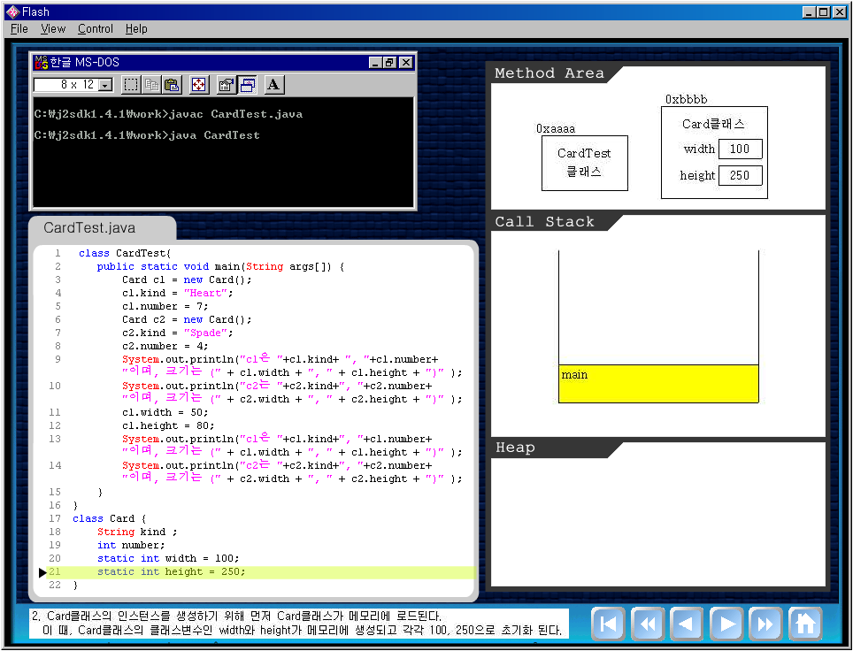
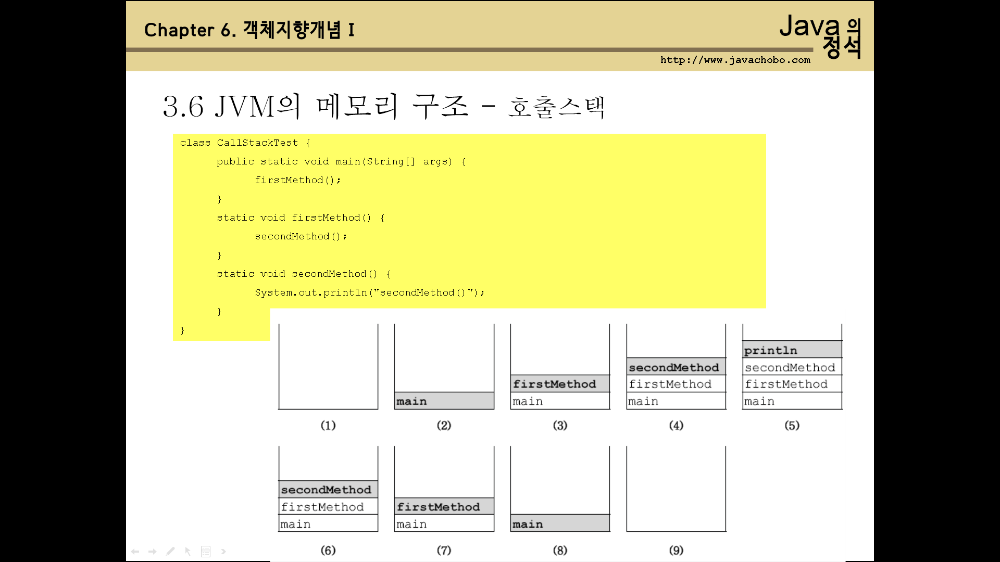
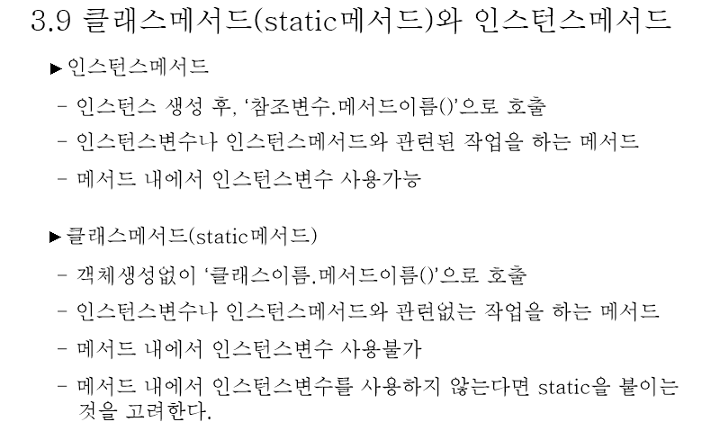
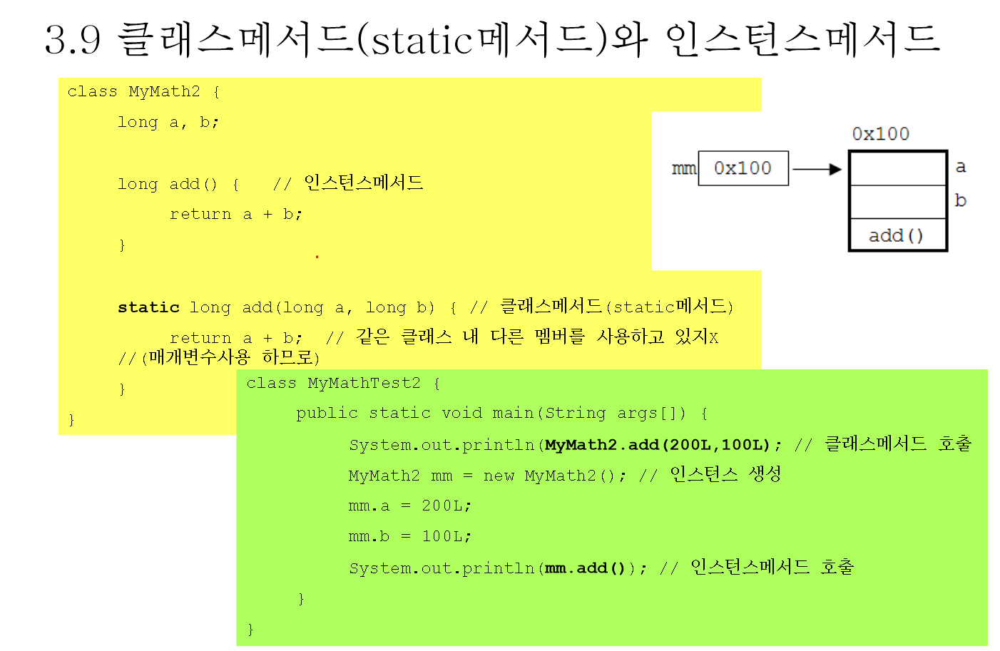
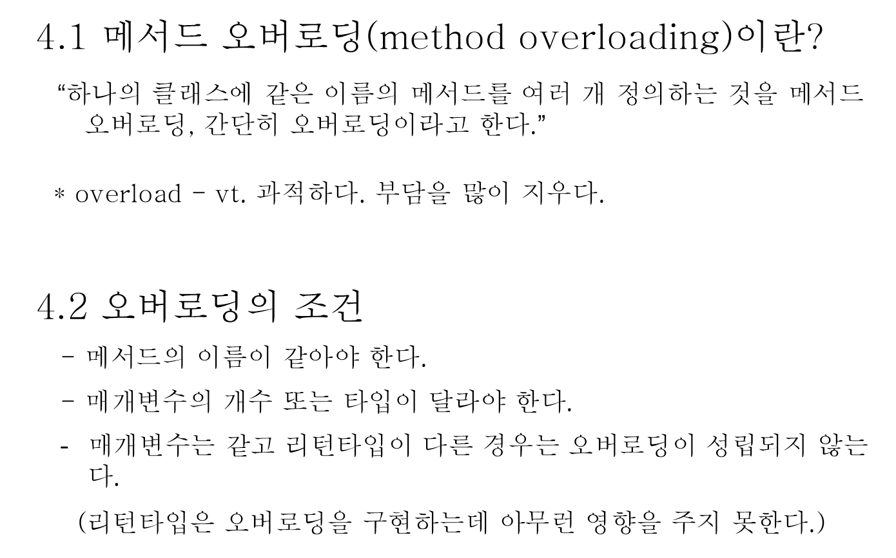
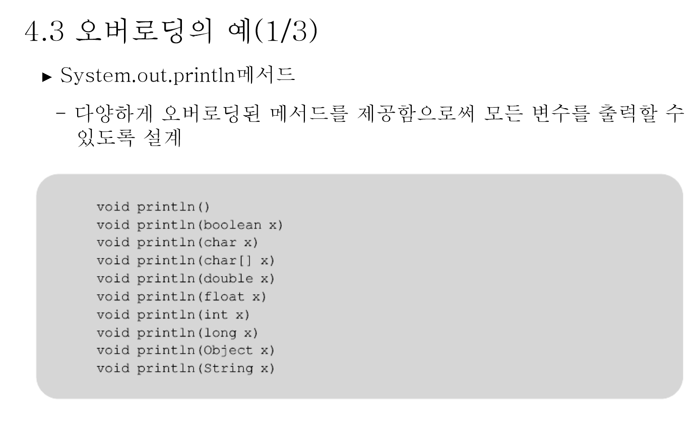
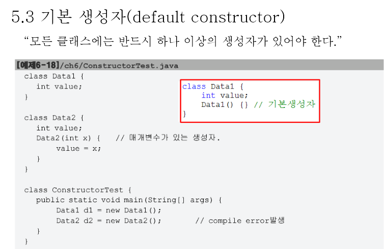

# 3.1 선언위치에 따른 변수의 종류

- 변수의 선언위치에 따라서 변수의 종류와 범위가 결정됨. 

```java
class Vairables{
    /* 클래스 영역 */
    int iv;   // 인스턴스 변수
   static int cv;   // 클래스 변수 (static변수, 공유변수)
    
    /* 메서드 영역 */
    void method(){
        int iv = 0;  // 지역 변수 
    }
}
```


- static 이 붙은 변수
  - 클래스에 속한 변수
  - 고유변수
  - 클래스 변수
  - 객체 생성하지 않아도 클래스 명으로 할당가능 (클래스 로딩시 자동할당)


- static이 붙지않은 변수
  - non-static 변수
  - 인스턴스 변수
  - 메모리 영역을 한번만 할당함 
  (아무리 우리가 클래스 객체를 여러개 생성했다 하더라도 iv변수는 1번만 생성됨)

## 정적 멤버

```java
클래스 
-> [loading (바이크코드 읽기)] 
-> class loader 
-> [바이크코드 저장] 
-> 메서드 영역 (내부에 클래스 포함 (클래스 내부에는 정적 필드와 정적 메서드 포함))
```

- `정적 멤버`란 메서드 영역의 클래스에 고정적으로 위치하는 멤버

- 자바는 class loader를 이용해서 클래스를 메서드 영역에 저장하고 사용
- 정적 멤버는 객체를 생성할 필요 없이 클래스를 통해 바로 사용이 가능함

### 정적 멤버 선언

- 필드와 메서드는 static 키워드를 추가하여 정적 멤버로 만들 수 있음

```java
public class ClassName{
    /* 정적 필드 선언 */
  static type field; // (= 초기값)
  
  /* 정적 메서드 */
  static return_type method(parameter){
      
  }
}
```

- 공통으로 사용되는 필드(객체의 속성)는 정적 필드로 선언하는 것이 좋다
<br> (객체마다 가지고 있을 필요가 없는 필드에 해당)

```java
public class Calculator{
    String color;  // 계산기별로 색상이 다를 수 있음
  static double pi = 3.141592;  // 계산기상에서 사용되는 파이값은 동일함
}
```

- 인스턴스 필드를 사용하지 않는 메서드는 정적 필드로 선언하는 것이 좋다
- Calculator 클래스의 plus()메서드나 minus() 메서드는 외부에서 주어진 매개값들을 가지고 처리하므로 정적 메서드로 선언하는 것이 좋다
<br> (하지만 인스턴스 필드인 color를 변경하는 setColor() 메서드는 인스턴스 메서드로 선언해야 함)

```java
public class Calculator{
    String color;   // 인스턴스 필드
  void setColor(String color){this.color = color;}  // 인스턴스 메서드
  static int plus(int x, int y){ return x+y;}  // 정적 메서드
  static int minus(int x, int y){return x-y};   // 정적 메서드
}
```

### 정적 멤버 사용

- 클래스가 메모리에 로딩되면 정적 멤버를 바로 사용할 수 있고, 클래스명과 함께 점(.) 연산자로 접근하면 됨

- 정적 필드와 정적 메서드는 객체 참조 변수로 접근할 수 있음

```java
public class Calculator{
    static double pi = 3.141592;
    static int plus(int x, int y){}
  static int minus(int x, int y){}
}

/* 정적 필드 pi와 정적 메서드 plus(), minus()를 사용 */
double result = 20*20*(Calculator.pi);
int result2 = Calculator.plus(15, 10);
int result3 = Calculator.minus(30,20);

/* 객체 참조 변수를 이용해서 정적 필드와 정적 메서드에 접근 */
Calculator myCalc = new Calculator();
double result4 = 20*20*(myCalc.pi);
int reuslt5 = myCalc.plus(30,40);
int result6 = myCalc.minus(60,50);
```


#### 유의사항

- 정적 요소는 클래스명으로 접근하는 것이 좋다

### 정적 블록

- 정적 필드는 필드 선언과 동시에 초기값을 주는 것이 일반적임

```java
static double pi = 3.141592;
```

- 정적 블록은 클래스가 메모리에 로딩될 때 자동으로 실행됨
- 정적 블록이 클래스 내부에 여러개가 선언되어 있는 경우에는 선언된 순서대로 실행됨
- 정적 필드는 객체 생성 없이도 사용할 수 있음 (따라서 초기화 작업을 하지 않음. 생성자는 객체 생성 후 실행됨.)

### 정적 메서드와 정적 블록은 인스턴스 멤버 사용 불가

- 정적 메서드와 정적 블록은 객체가 없어도 실행되기 때문에 내부의 인스턴스 필드나 인스턴스 메서드를 사용할 수 없다.
  (또한 객체 자신의 참조인 this도 사용할 수 없음)

```java
public class ClassName{
    /* 인스턴스 필드와 메서드 선언 */
  int field1;
  void method1(){}
  
  /* 정적 필드와 정적 메서드 선언 */
  static int field2;
  static void method2(){}
  
  /* 정적 블록 선언 */
  static{
      field1 = 10;  // compile error
    metho1();  // compile error
  
    field2 = 20; // ok
    method2(); // ok
  }
  
  /* 정적 메서드 선언 */
  static void method3(){
      this.field1 = 50; // compile error
    this.method1();  // compile error
    field2 = 60; // ok
    method2();  // ok
  }
}
```

- 정적 메소드와 정적 블록에서 인스턴스 멤버를 사용하고 싶은 경우 
객체를 먼저 생성하고 나서 참조 변수로 접근해야 함
```java
// 정적 메서드
static void Method3(){
    /* 객체 생성 */
    ClassName obj = new ClassName();
    
    /* 인스턴스 멤버 사용 */
    obj.field1 = 10;
    obj.method1();
}
```

- main() 메서드는 정적 메서드이다.
따라서 객체 생성 없이 인스턴스 필드와 인스턴스 메서드를 main() 메서드에서 바로 사용할 수 없다.
그러므로 main()메서드에서 인스턴스 멤버를 사용하고 싶은 경우
객체를 먼저 생성하고 난 다음에 참조 변수로 접근해야 한다

```java
public class Car{
    /* 인스턴스 필드 선언 */
  int speed;
  
  /* 인스턴스 메서드 선언 */
  void run(){}
  
  /* 메인 메서드 선언 */
  public static void main(String[] args){
      speed = 60;  // compile error
    run();  // compile error
  }
}
```

```java
public class Car{
  /* 인스턴스 필드 선언 */
  int speed;

  /* 인스턴스 메서드 선언 */
  void run(){}

  /* 메인 메서드 선언 */
  public static void main(String[] args){
      /* 객체 생성 */
      Car myCar = new Car();
    
      /* 인스턴스 멤버 사용 */
      myCar.speed = 60;
      myCar.run();
  }
}
```

# final 필드 & 상수

- 인스턴스 필드와 정적 필드는 언제든지 값을 변경할 수 있지만 읽기만 허용해야하는 경우가 존재하는데,
이 때 final 필드와 상수를 선언해서 사용함

## final 필드 선언

- final 필드는 초기값이 저장되면 프로그램 실행 도중에 수정할 수 없음

- final 필드에 초기값을 대입하는 방법
1. 필드 선언 시에 초기값 대입
2. 생성자에서 초기값 대입

- 유의사항
  - 복잡한 초기화 코드가 필요한 경우 혹은
  - 객체 생성 시에 외부에서 전달된 값으로 초기화하는 경우 생성자에서 해야 함

## 상수 선언

- 불변의 값을 저장하는 필드를 `상수`라 함
- 상수는 static이면서 final한 특징을 가짐 (객체마다 저장할 필요가 없고, 여러 개의 값을 가져서도 안되기 떄문)
- 상수명은 대문자로 작성하는 것이 관례 (서로 다른 단어가 혼합된 경우 언더바로 연결)

```java
static final 타입 상수 

/* 복잡한 초기화 -> 정적 블록에서 초기화 */
static{
    상수 = 초기값;
}
        
static final double PI = 3.141592;
static final double EARTH_SURFACE_AREA = 5.147185;

// 상수는 정적 필드이므로 클래스로 접근해서 읽을 수 있음
public class Earth{
    static final double EARTH_SURFACE_AREA = 5.147185;
}

public class EarthEx{
  public static void main(String[] args) {
    System.out.println(Earth.EARTH_SURFACE_AREA);
  }
}
```


- 클래스 로딩
  - 클래스가 JVM 영역의 메모리에 올라가는 것
  - 어떤 클래스든 클래스 로딩은 1번만 일어남.
  - 이떄 생성되는 객체가 cv

- iv
  - 객체 생성할 떄마다 메모리 영역을 계속 할당

- cv
  - 객체 생성과 없이 클래스 로딩만으로 자동할당되어 사용이 가능한 변수

- 클래스 변수
  - 선언위치 : 클래스 영역
  - 생성시기: 클래스가 메모리에 올라갈 때

- 인스턴스 변수
  - 선언위치: 클래스 영역
  - 생성시기: 인스턴스 생성시

- 지역 변수
  - 선언위치: 메서드 영역
  - 생성시기: 
  - 메서드 영역에 선언되는 변수

- 자바는 필요한 시점에 지역변수를 따로 선언해도 됨
- 메서드안에 선언되는 것이 지역변수. 메서드가 호출되는 동안 할당되어 사용되고 메서드 수행이 끝나면 자동으로 사라짐
- 스코프: 어떤 변수를 어디서부터 언제까지 사용할 수 있는지를 결정
- 여기서 제일 큰 영역이 클래스 스코프. 프로그램이 시작될떄 할당되어 프로그램이 종료될떄 끝남.
- 그 다음이 인스턴스 변수 영역. 그 다음이 ~

- 소멸시기
  - 생성은 개발자가 직접결정 (new 연산자 등 이용)
  - 딱 언제인지를 정확히 알수는 없다.ㅏ
  - 일반적으로 가비지가 된 상태에서 바로 청소하는것이 아니다.
  - JVM은 청소하는것이 게으르다.
  - System.gc 호출시 가비지 컬렉션을 해야하는 상황인지 체크하나 청소하는 것을 보장할 수 없다. (가비지 컬렉션은 JVM의 고유 영역이다)

  
## 3.2 클래스 변수와 인스턴스 변수

- 인스턴스 변수
  - 인스턴수가 생성될 때마다 생성되므로 인스턴스마다 각기 다른 값을 유지할 수있음
  - 클래스 객체가 만들어질때마다 메모리영역을 할당하여 객체마다 고유한 값을 가짐

- 클래스 변수
  - 모든 인스턴스가 하나의 저장공간을 공유하므로 항상 공통된 값을 가짐

- static
  - 객체 생성시마다 각각 다른 값을 가져야하면 static붙임
  - 이 멤버변수는 공통이고 하나의 값만 가져야하면 static을  붙이지 x

### 카드 예시

- 무늬와 숫자
  - static 지정 x
  - 객체 생성시마다 각각의 정보를 보관해야하므로

- 폭과 높이
  - static 지정
  - 계속적으로 할당할 필요가 없기 때문이다.  

- static 멤버는 클래스~로 접근하는게 좋다. (객체로도 접근이 가능하지만 말이다!)


- 결국 JVM은 자바 프로그램이 수행되는 동안 OS의 역할을 대신해줌
- 자바가 JVM덕에 보안적으로도 안전하다 (사이에 JVM이 보안문제에 대한 차단막역할을 함)



- 객체는 힙에 생성됨
- 가비지 컬렋션이 여기서 
- 메서드 영역은 프로그램이 끝날때까지 고정됨
- 자바는 동적로딩. 클래스를 필요할 떄마다 로딩함.


- 콜스택
  - 호출스택. 
  - 스택임

- static 멤버는 객체 생성후 객체를 통해 접근해도 됨 
- static 멤버는 클래스명으로 접근할 것 (stati)
- static은 클래스 내부의 전역변수 역할

- nonstatic은 ~
- CardTest2 파일도 CardTest1의 Card 클래스를 가져다가씀


- CardTest2
```java
package day0314.course;

public class CardTest2{
  public static void main(String args[]) throws Exception{
    System.out.println("CardTest 수행이 시작었습니다.");
    Thread.sleep(10000);
    Card c1 = new Card();
    c1.kind = "Heart";
    c1.number = 7;
    System.out.println("첫 번째 Card 객체가 생성됨");
    Thread.sleep(10000);
    Card c2 = new Card();
    c2.kind = "Spade";
    c2.number = 4;
    System.out.println("두 번째 Card 객체가 생성됨");
    Thread.sleep(5000);
    System.out.println("c1은 " + c1.kind + ", " + c1.number
            + "이며, 크기는 (" + Card.width + ", " + Card.height + ")");
    System.out.println("c2는 " + c2.kind + ", " + c2.number
            + "이며, 크기는 (" + Card.width + ", " + Card.height + ")");
    Card.width = 50;
    Card.height = 80;
    System.out.println("c1은 " + c1.kind + ", " + c1.number
            + "이며, 크기는 (" + Card.width + ", " + Card.height + ")" );
    System.out.println("c2는 " + c2.kind + ", " + c2.number
            + "이며, 크기는 (" + Card.width + ", " + Card.height + ")" );
  }
}
```

- JVM이 ~할 떄 ~ 해야하므로 main메서드는 반드시 static이 붙어있어야 함. static을 붙여주지 않으면 호출할 수 ㅇ벗음
- Thread.sleep
  - static 메서드.

- 바로 직전에 실행시킨 클래스에 대한 정보는 남아있음.
- run configuration에서 verbose:class 설정
  - 클래스 로딩하는 것을 보여줌
  - 자바는 동적 로딩이다 (어떤 클래스가 필요한 경우 최초 실행한 시점에서 한번만 로딩함)
  - JVM은 80%가 자바, 나머지 20%가 네이티브 코드(C 모듈로 생성)
  - 프로그램이 수행되는 동안 모든 class의 로딩은 1번만 수행 (또 로딩할 필요가 없으면 안함)
  - static이 아닌 경우 객체 생성과정에서~


# 문제1

- 다음은 KOSA에서 수업을 받고 있는 모든 학생들의 객체를 생성하기 위한 클래스에 정의하려는 멤버 변수들이다. 이중에서 static 제어자 설정이 적합하다고 판단되는 변수는?
- 정답: 1번 교육기관명 


# 문제2

3일간 이벤트를 진행할 계획이다. 그런데 3일 이전에라도 이벤트 응모인원이 1000명이 되면 종료하기로한다. 다음은 이벤트 옹모자에 대한 정보를 가지고 이벤트 응모 객체를 생성하기 위한 클래스를 정의하려 한다. 정의되는 멤버변수들중에 static 제어자  설정이 적합하다고 판단되는 변수를 고르시오.

1. 응모자 회원ID
2. 응모 일시
3. 응모 총 인원 
4. 선택한 상품 ID

- 정답 3번
- 각각 메모리가 할당되면 다 잃으므로. 기존에 계속해서 누적해주어야 함. 
- 객체 생성시마다 다르게 보관하려면 static을 붙이면 안됨. 
- 일관성있게 증가되어야 하는값. 유지되어야 하는값등은 static을 붙여야 함.

- 메서드에 static을 붙이는 기준
  - 메서드가 수행하는 동안 다른 클래스에 있는 nonstatic 멤버를 사용해야하는 겨웅. 예를들어 문제1의 학생이름을 리턴해야하는 함수는 (학생명은 nonstatic). nonstatic 멤버를 사용해야하는 함수는 절대로 static을 붙여서는 안됨. static을 붙인다는 것은 클래스가 로딩만해도 사용이 가능하게 만든다는 뜻이므로. 객체 생성이 되지 않아도 사용할 수 있음. 따라서 객체 생성될떄마다 사용할 수 있도록 하면 문제가 생김.
  - 같은 클래스 내 다른 static 멤버를 사용하는 경우 static을 붙임

- main 메서드에 static 붙임.
- 같은 static이어야 그냥 부를 수 있음. 아니면 객체를 생성해야 부를 수 있음. 



- 콜스택은 제일 위에 누가있느냐에 따라서 수행되는 메서드가 결정됨.


- 메서드는 호출이 끝나면 되돌아가야함. 하지만 재귀 등으로인해 계속 쌓이기만 하면 스택오버플로우가 발생함

```java
package day0314.course;

public class MainTest {
	public static void main(String[] args) {
		main(null);
	}
}

```

- null은 참조할 객체가 없을 경우에 사용 
- 스택이라는 공간에는 메서드를 ~

# 3.9 클래스 메서드(static 메서드)와 인스턴스 메서드

## 클래스 메서드

- static이 붙은 메서드
- 객체 생성을 하지 않아도 `클래스명.메서드명()`으로 호출가능

## 인스턴스 메서드

- 반드시 객체 생성을 하여 객체를 통해 호출할 수 있음




- 자바에서는 객체나 클래스 단위로 구분하므로 전역변수를 사용을 자제하라는것이 여기에 적용되지는 않음
  (C언어에 해당)
- 멤버변수가 객체 생성시마다 고유한 값을 가지면 static을 붙이면 안됨. 그렇지 않은 경우 static을 붙이면 좋음.

# 4.1 메서드 오버로딩




- 여기에 기재되지 않은 int형 배열을 받을 수 있는 이유? 다형성 때문

# [](./BlockTest.java)


# 생성자

- 객체 생성시 초기화를 구현하고 싶다면 생성자를 사용해야 함



- 생성자가 없으면 인자를 안받는 생성자가 생성됨 (컴파일시 생성자가 생성)

- 생성자
  - 구문 오류를 체크하는 과정
  - 있어야 할 자리에 없으면 채워넣는것이 컴파일의 역할 (생성자가 없으면 디폴트 생성자를 생성해서 넣어줌. 등)

# this

- 반드시 첫번쨰 행에 와야함
- 상속떄문에 다른 것들을 하고나서 사용하면 안됨
- this를 쓰는것이 불편하다고 해서 멤버변수와 매개변수를 다르게 준다면 더 불편할 것이다.
- 멤버변수를 특별히 사용하고자 하는경우 this를 사용한다.
- ~할 때 자동으로 만들어지는 변수이다.

# 변수의 초기화

- 멤버변수에 대해~
- 멤버변수는 우리가 특별히 초기화를 안해줘서 어떤 타입의 멤버변수냐에 따라서 자동으로 초기화가 일어남
- 지역변수는 반드시 값을 초기화하고 나서 r-value용도로 사용해야 함

# 6.2 멤버변수의 초기화

- non static멤버인 경우 80-90%은 객체생성시 전달되는 생성자 메서드를 통한 초기화
- 초기화 블록을 ~

# 6.3 초기화 블럭

- static 초기화블럭은 static형 멤버변수의 복잡한 초기화를 필요로할 때 사용될 수 있는 초기화


# 상속

- 자바는 기본적으로 단일 상속을 지원함
- 새로운 클래스 생성시 부모 클래스를 1개 지정해야 하나 생략하면 자동으로 java.lang 패키지 내에 Object이라는 클래스가 있는데, 이 클래스를 상속하게 됨

- java.lang.Object 클래스
  - 자바로 만들어지는 모든 클래스들의 최상위 클래스임
  - Object는 구조적으로 부모가 없다. 


```java
package day0314.course;

class MyObject {
  void printName(){
    System.out.println("자바듀크");
  }
  public String toString(){
    return "Object의 자식클래스인 MyObject 객체임";
  }
}

public class MyObjectTest {
  public static void main(String[] args) {
    MyObject my = new MyObject();
    System.out.println(my.toString());  // day0314.course.MyObject@6a5fc7f7 (클래스명@참조값)
    // 조상이 가지는 멤버들 대부분 자손에게 내려진다. (상속) (단, private형 멤버는 부모것이므로 상속되지 않음)
    // 상속받으면 자손이 자기것처럼 사용할 수 있음
    // 자바에서 만들어지는 모든 클래스는 Object의 자손이다.

    System.out.println(my);
    System.out.println("my : "+my);

    my.printName();
    // 얘는 호출만 할 수 있음. 리턴값이 없는 애임.
    // 클래스에 있는 메서드와 조상으로부터 물려받은 메서드등을 사용할 수 있다
    // 조상으로부터 물려받은것도 MyObject의 멤버가 됨
  }
}

```

- my와 my.toString()의 결과가 동일함
  - 어떠한 객체 변수든 클래스 유형의 변수든 변수값을 출력하라고 하면 자동으로 toString의 결과값을 출력하라고 강제함
  - 문자열과의 결합을 해도 동일. 

- 어떠한 클래스든 객체를 생성하게 되면 조상 클래스의 객체가 함께 생성됨
- 조상이 많으면 그만큼 객체의 크기가 커질 수 밖에 없다 (더 많은 멤버들을 상속하게 됨)
- 메모리도 그만큼 많이 요구되므로 상속에 있어 최적화를 고민하는 것이 중요하다

- 서블릿 클래스를 만드려면 http 서블릿을 상속받아야 함
- 어떤 클래스든 객체를 상속받으면 조상 클래스의 멤버가 함께 생성됨. 따라서 어떤 클래스의 객체를 생성하면  조상의 멤버도 함께 호출받을 수 있다.

- 객체 생성시 호출되는 생성자 메서드는 호출되자마자 부모 클래스의 생성자를 호출하는 특징을 가지고 있음
  - 모든 생성자는 호출되면 조상 생성자를 먼저 호출함
  - 이때 호출되는 부모 클래스의 생성자는 argument가 없는 생성자이다. (매개변수가 정의되어있지 않은 생성자는 argument가 없는 생성자)
  - 부모 클래스의 인자를 받지 않는 생성자가 없는 경우, (원래는 무조건 인자가 없는 생성자만 호출하게 되어있음) `super`라는 메서드를 이용해서 부모가 가지고 있는 생성자를 직접 호출해주어야 함 -> 강제로 호출하는 효과 (매우 중요)
  - super 메서드는 우리가 어떤 클래스를 상속하려고 보니까 부모가 인자를 안받는 생성자를 가지고 있지 않은 경우 super를 통해 호출하는것이 필수임.

- [ABCTest](./ABCTest.java)
```java
package day0314.course;

class A{
  A() {
    System.out.println("A클래스의 객체 생성!");
  }
}
class B extends A{
  B() {
    System.out.println("B클래스의 객체 생성!");
  }
}
class C extends B{
  C() {
    System.out.println("C클래스의 객체 생성!");
  }
}

public class ABCTest {
  public static void main(String[] args) {
    new C();   // 이렇게 해도 됨 (C클래스의 객체가 생성되는 동안 무슨일이 일어나는지 보자.)
    // 특정 틀래스의 객체가 생성되는 동안 -> 생성자 메서드를 호출 -> 모든 생성자는 기본적으로 호출되자마자 조상 생성자를 호출하는 기능을 내제하고 있음
  }
}
```
- 특정 틀래스의 객체가 생성되는 동안 -> 생성자 메서드를 호출 -> 모든 생성자는 기본적으로 호출되자마자 조상 생성자를 호출하는 기능을 내제하고 있음
- new C를 통해 C가 생성되자마자 부모의 생성자 호출 -> B또한 생성자 호출하자마자 부모 생성자 호출 -> A 또한  생성자 호출하자마자 부모 생성자 호출 -> 호출이 끝나고 되돌아오면 A의 생성자 메서드의 내용이 출력 -> 호출이 끝나고 되돌아오면 B 생성자 메서드의 내용이 출력 -> 호출이 끝나고 되돌아오면 C 생성자 메서드의 내용이 출력


### ABCTest 코드 조작
```java
package day0314.course;

class A{
	A() {		
		System.out.println("A클래스의 객체 생성!");
	}
}
class B extends A{
	B(int num) {		
		System.out.println("B클래스의 객체 생성!");
	}
}
class C extends B{
	C() {	// 에러 발생	
		System.out.println("C클래스의 객체 생성!");
	}
}

public class ABCTest {
	public static void main(String[] args) {
		new C();   // 이렇게 해도 됨 (C클래스의 객체가 생성되는 동안 무슨일이 일어나는지 보자.)
		// 특정 틀래스의 객체가 생성되는 동안 -> 생성자 메서드를 호출 -> 모든 생성자는 기본적으로 호출되자마자 조상 생성자를 호출하는 기능을 내제하고 있음
	}
}

```

- 항상 상속해주는 조상에 알맞게 자식을 바꿔야 함 (조상을 조작하면 해당 조상을 조작하는 다른 아이들이 영향을 받을 수 있음)
- 따라서 자식이 부모에게 맞추어야 함
- 부모 클래스가 인자를 안받는 생성자를 가지고 있지 않은 경우 super를 사용하자

### super 사용하기 - 상위의 에러 해결

```java
package day0314.course;

class A{
	A() {		
		System.out.println("A클래스의 객체 생성!");
	}
}
class B extends A{
	B(int num) {  // int num 에러 유발
		System.out.println("B클래스의 객체 생성!");
	}
}
class C extends B{
	C() {  // 에러
		super(10);  // 에러 해결
		System.out.println("C클래스의 객체 생성!");
	}
}

public class ABCTest {
	public static void main(String[] args) {
		new C();   // 이렇게 해도 됨 (C클래스의 객체가 생성되는 동안 무슨일이 일어나는지 보자.)
		// 특정 틀래스의 객체가 생성되는 동안 -> 생성자 메서드를 호출 -> 모든 생성자는 기본적으로 호출되자마자 조상 생성자를 호출하는 기능을 내제하고 있음
	}
}

```
- 모든 생성자는 호출되자마자 조상 생성자를 호출하는 ㄱ ㅣ능을 기본적으로 가지고 있다
- C는 super 메서드의 호출을 가지고 있으므로 ~ 

### super 메서드 호출 문장을 넣어주지 않는 경우

1. 이미 super가 들어간 경우
2. this를 호출문장이 있는 경우 (다른 생성자를 호출했다는 뜻이므로)

- 에러 상황
```java
package day0314.course;

public class PointTest {
	public static void main(String args[]) {
		Point3D p3 = new Point3D(1,2,3);	
		System.out.println(p3.getLocation());
	}
}
class Point {
	int x;	
	int y;
	Point(int x, int y) {
		this.x = x;
		this.y = y;
	}
	String getLocation() {
		return "x :" + x + ", y :"+ y;
	}
}
class Point3D extends Point {
	int z;
	Point3D(int x, int y, int z) {
//		super(x,y);  // 자식 클래스의 생성자에서 직접 호출해주어야 함
		this.z = z;		
	}
	String getLocation() {	// 오버라이딩
		return super.getLocation() + ", z :" + z;
	}	
}
```

- 오버라이딩
  - 부모가 가진 놈들을 자식에서 재정의


- 오류 해결

```java
package day0314.course;

public class PointTest {
	public static void main(String args[]) {
		Point3D p3 = new Point3D(1,2,3);	
		System.out.println(p3.getLocation());
	}
}
class Point {
	int x;	
	int y;
	Point(int x, int y) {
		this.x = x;
		this.y = y;
	}
	String getLocation() {
		return "x :" + x + ", y :"+ y;
	}
}
class Point3D extends Point {
	int z;
	Point3D(int x, int y, int z) {
		super(x,y);  // 자식 클래스의 생성자에서 직접 호출해주어야 함
		this.z = z;		
	}
	String getLocation() {	// 오버라이딩
		return getLocation() + ", z :" + z;   // 에러 (스택 오버플로우)
		return super.getLocation() + ", z :" + z;  // super를 사용해서 부모에 있는 getLocation 호출
	}	
}
```

- super.getLocation() -> 바로 위에 있는 부모를 거슬러서 올라가서 getLocation이 있는지 확인 
- 인스턴스형인 경우 부모도 가지고 있고 조부모도 가지고 있는 경우에 super.super 처럼 조부모의 것을 가져와서 쓰는것이 불가능 (super는 바로 상위의 조상을 찾아감)

### @annotation
- 꼭 붙이지 않아도 됨
- 오버라이딩 했음을 명시해주는 장점이 있을 뿐


# 과제1

```java
package day0314.hw01;

class Person{
    private String name;  // private이므로 자식도 접근할 수 없음
    Person (String name){
        this.name = name;
    }

    public String getInfo(){
        return name;
    }
}

class Friend extends Person{
    private String phoneNum;
    private String email;

    Friend(String name, String phoneNum, String email){
        /* 반드시 첫행에서 super를 써줘야 함 */
        super(name);  // person이 인자를 안받는 생성자가 없으므로 super를 통해 호출해주어야 함
        
      /* 이 클래스의 변수이므로 언제든지 여기서 초기화 가능하므로 super를 안써줘도 됨  */
        this.phoneNum = phoneNum;
        this.email = email;
    }

    @Override
    /* 메서드 오버라이딩 */
    public String getInfo() {
        /* super 메서드 사용 */
      return super.getInfo() + " " + phoneNum + " " + email;
    }
}

public class FriendTest {
    public static void main(String[] args) {
        Friend fr[] = new Friend[5];  
        // Friend 클래스 타입의 배열 생성 (Friend 타입의 객체들을 저장)
        // 실제 저장되는 것은 Friend 객체의 참조값
      
        // 5개의 Friend 객체 생성
        fr[0] = new Friend("김하나", "010-111-1111", "hana@hanmail.net");
        fr[1] = new Friend("박두리", "010-222-2222", "two@hanmail.net");
        fr[2] = new Friend("이세찌", "010-333-3333", "three@hanmail.net");
        fr[3] = new Friend("정네찌", "010-444-4444", "four@hanmail.net");
        fr[4] = new Friend("송다섯", "010-555-5555", "five@hanmail.net");

        // 각 Friend 객체 정보를 getInfo() 메서드를 호출하여 실행결과와 같이 출력
        System.out.println("이름\t\t전화번호\t\t메일주소");
        System.out.println("--------------------------");
        for (Friend e: friend){  // Friend형 변수 이자 friend 객체에 대한 정보를 담는 e
          System.out.println(e.getInfo());
        } // foreach문이 성능이 더 좋다.
      
      
//        for (int i=0; i<fr.length; i++){
//            System.out.println(fr[i].getInfo());
//        }
    }
}

```

## 과제1-2번

```java
package day0314.hw01;

import java.util.Random;

class Multiplication {
    private int dan;
    private int number;
    Multiplication() {}  //  이 안에 자동으로 super호출문장이 첫행에 추가됨
    Multiplication(int dan) {
        this.dan = dan;
    }
    Multiplication(int dan, int number){
        this.dan = dan;
        this.number = number;
    }
    void printPart() {
        if (number == 0) {
            for(int n=1; n <= 9; n++)
                System.out.print("\t"+dan + "*" + n+ "="+dan*n);
            System.out.println();
        } else {
            System.out.println(dan * number);
        }
    }
}

/* 상속 */
class GuGuDanExpr extends Multiplication{
    GuGuDanExpr(){

    }

    GuGuDanExpr(int dan){
        super(dan);
    }
    GuGuDanExpr(int dan, int number){
        super(dan,number);
    }


    public static void printAll(){
        for (int i=1; i<=9; i++){
            for (int j=1; j<=9; j++){
                System.out.printf("%d * %d = %d  " , i,j, i*j);
            }
            System.out.println();
        }
    }
}


public class GuGuDanApp {
    public static void main(String[] args) {
        // 파란색이 출력결과
        Random random = new Random();
        int dan = (random.nextInt(20)+1);
        int number = (random.nextInt(20)+1);

        /* 난수추출 재활용 */
//      int dan = MethodLab5.getRandom(20);
//      int number = MethodLab5.getRandom(20);
        
        //        System.out.println(dan);
//        System.out.println(number);

        GuGuDanExpr ggde;  

        if (dan<=9){
            if(number <= 9){
//                System.out.println("dan 9이하, number 9이하");
                ggde = new GuGuDanExpr(dan,number);   // 생성자를 통한 초기화
                System.out.printf("%d * %d = ",dan,number);
                ggde.printPart();
            } else{
//                System.out.println(" dan 9이하, number 10이상");
                ggde = new GuGuDanExpr(dan);  // 생성자를 통한 초기화
                System.out.printf("%d단 :", dan);
                ggde.printPart();
            }
        } else {
//            System.out.println("dan 10이상 ");
            GuGuDanExpr.printAll();  // static 형 멤버는 클래스명으로 호출 (객체를 통해 호출X)
        }
    }
}
```

- static형 멤버 적용
  - printAll은 상호작용없이 단독으로 호출해도 됨 -> static형으로 정의해도 됨
  - static형 멤버는 클래스명을 통해 호출할 것!!!!!!!!!!!!!!

- 조상에 있는 멤버변수
  - private인 경우 자손이 조작할 수 없음
  - 따라서 생성자를 통해 초기화를 해야 함 (조상에게 매개변수 전달)

- 난수추출 재활용
```java
/* 난수추출 재활용 */
int dan = MethodLab5.getRandom(20);
int number = MethodLab5.getRandom(20);
```

# [ParentChildTest.java](./ParentChildTest.java)

```java
package day0314.course;
class Parent {  
	int x = 1, y = 2;
    
    @Override  // 이것 붙이면 메서드명을 잘못적어도 에러메시지를 명시해줌 
	public String toString(int n) {  // 오버라이딩이 아님 (매개변수가 다르므로 -> 오버로딩이 된 것)
		return "Parent 클래스의 객체 입니당";
	}	
}
class Child extends Parent {
	int x = 10;
	void printInfo() {
		int x = 100;
		System.out.println(x);				//	100. 지역변수 100이 있으므로 (그냥 x는 가까운것이 우선. 지역변수 100 출력) (가까운것이 없으면 조상으로 거슬러 올라감)
		System.out.println(this.x);		//  this -> 이 클래스의 멤버변수인 10 출력 
		System.out.println(super.x);		//	1. (super를 붙였으므로 조상의 값 출력)
		System.out.println(y);				//  2. 같은 메서드 안에 y라는 지역변수가 없음. 멤버변수 영역까지 찾아감. -> 부모에게 찾아감 -> y가 있으므로 2를 출력 -> parent에도 없으면 Object까지 올라감
		System.out.println(this.y);		//	2. 멤버변수가 없음 -> 부모에게 찾아감 -> y가 있으므로 2를 출력
		System.out.println(super.y);		// 2.  super가 있으므로 조상부터 바로 찾아감.  	
		//System.out.println(z);  // 지역변수에도, 멤버변수에도, 부모에도 없으므로 주석풀면 error. 소괄호를 붙여서 z()라 하면 메서드로 인식. 소괄호 안붙이면 변수로 인식.
	}
    // tostring 처럼 s를 소문자로 잘못썼을 경우, 오버로딩도 오버라이딩도 아닌 추가메서드로 인식.
	public String toString() {  // Object 클래스에 있는 toString을 오버라이딩 함 (이름, 매개변수 동일.) (접근제어자는 같거나 좁아져야 함)
		return "Child 클래스의 객체 입니당";
	}
}

public class ParentChildTest {
	public static void main(String[] args) {
		Parent p = new Parent();  // Parent 객체 생성
		System.out.println(p.toString());   // toString 호출. Object에 있는애가 대신 호출될 것임
		System.out.println(p);  
		System.out.println("출력 1-" + p);
		
		Card c = new Card();  // Card 객체 생성
		System.out.println(c.toString());  // toString 생략해도 자동으로 toString의 결과가 등장. 
		System.out.println("출력 2-" + c);
		
		java.util.Date d = new java.util.Date();  // Date클래스는 toString을 오버라이딩 해뒀다
		System.out.println(d.toString());
		System.out.println("출력 3-" + d);
		
		Child ch = new Child();  // Child 클래스의 객체 생성
		System.out.println("출력 4-" + ch);  // 자동으로 toString이 호출되어 결과가 처리됨
		ch.printInfo();   // child 객체를 생성해서 printInfo 호출
		System.out.println(ch.x);
		System.out.println(ch.y);  // 점(.) 연산자로 접근할 수 있는 것은 멤버변수 -> child에 없으면 -> 부모에게 거슬러 올라감 
	}
}
```

- 멤버변수는 힙에 메모리 할당
- Child 객체가 생성될 때 Parent 객체도 같이 생성 (단, 별개의 객체를 생성)
- annotation은 오버라이딩을 체크만 해주는 용도


## 오버로딩

- 같은 클래스 뿐만 아니라 조상에 있는 메서드도 오버로딩 할 수 있음


# foreach문

- [참고자료](https://wikidocs.net/264)