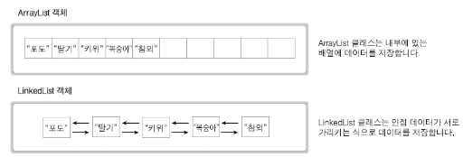
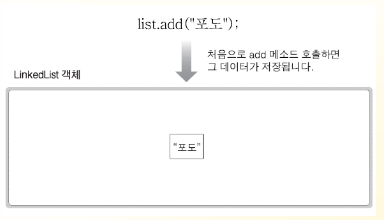
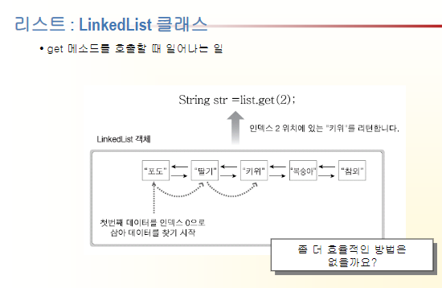
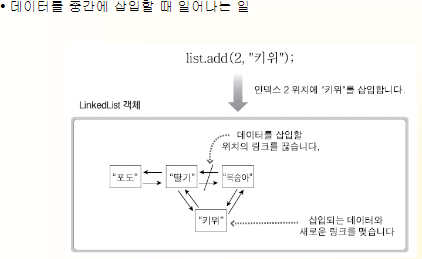

# 참조 타입

## 5.1. 데이터 타입 분류

- 참조 타입
  - 객체의 번지를 참조하는 타입
  - 모든 배열, 열거 타입(상수로만 구성된 인터페이스), 클래스 , 인터페이스 타입 변수등이 참조 타입으로 분류됨
  - 말 그대로 객체를 참조하는것을 의미
  - 참조 타입으로 선언된 변수는 객체가 생성된 메모리의 번지를 저장
  (기본 타입으로 선언된 변수는 값 자체를 저장함)

### 정수 타입

### 실수 타입

### 논리 타입

### 객체

- 객체마다의 데이터와 메서드로 구성되어있음


## 5.2. 메모리 사용 영역

- 자바 명령어를 통해 JVM이 구동되면 JVM은 OS에서 할당받은 메모리 영역을 메서드 영억, 힙 영역, 스택 영역으로 구분하여 사용함

### 메서드 영역

- 우리가 직접 구현한 자바 프로그램과 직접적으로 관련있는 영역
- 바이트코드 파일을 읽은 내용이 저장되는 영역
- 클래스가 가지고 있는 static형 멤버는 힙 영역이 아닌 클래스가 로딩되는 과정에서 미리 메서드 영역에 할당됨
- 클래스가 가지고 있는 메모리 영역이 할당되는 공간


### 힙 영역

- 우리가 직접 구현한 자바 프로그램과 직접적으로 관련있는 영역
- 객체가 생성되는 영역 (인스턴스가 만들어지는 공간)
- 클래스가 가지고 있는 static형 멤버는 힙 영역이 아닌 클래스가 로딩되는 과정에서 미리 메서드 영역에 할당됨
- 객체의 번지는 메서드 영역과 스택 영역의 상수와 번지에서 참조
- 실질적으로 가비지 컬렉션은 힙 영역에서만 발생 (청소는 minor gc와 major gc로 나뉨)
  <br>(초창기와 달리 low memory secuation으로 바뀜 => 임계영역을 벗어났을 정도가 되었을 때 가비지 컬렉션을 수행함)

- 스레드: 프로그램이 수행되는 흐름. 자바 프로그램은 구동되는 맨 처음에 메인스레드가 시작됨. JVM이 호출해줌. 스레드는 프로그램이 실행되는 동안의 실행흐름. 필요에 따라 다중 스레드를 처리할 수 있음.
- 콜 스택은 스레드별로 생성됨. 프로그램이 2개의 스레드로 동작하면 콜스택은 2개, N개의 스레드로 동작하면 콜스택은 N개임.


### 스택 영역

- 우리가 직접 구현한 자바 프로그램과 직접적으로 관련있는 영역
- 메서드를 호출할 때마다 생성되는 프레임이 저장되는 영역

### PC 레지스터 영역 


### Native 메서드 스택 영역

## 5.3. 참조 타입 변수의 ==, != 연산

### ==, != 연산자

- 객체의 번지를 비교해서 변수의 값이 같은지/아닌지를 조사
  (같은 참조값을 가짐 = 하나의 객체를 공유한다)
- 번지가 같다면 동일한 객체를 참조하는 것이고, 번지가 다르다면 다른 객체를 참조하는 것임


## 5.4. null과 NullPointerException

### null값

- null값 참조 타입 변수는 아직 번지를 저장하고 있지 않다는 뜻
- null 또한 초기값으로 사용될 수 있으므로 null로 초기화된 참조 변수는 스택 영역에 생성
  (js에서는 null과 undefined가 있음. python에서는 None으로 표기)
- 아직 참조되는 대상이 없으므로 자동으로 초기화되는 대상이 null임


### NullPointerException

- 변수가 null인 상태에서 객체의 데이터나 메서드를 사용하려 할 때 발생하는 예외
- 참조 변수가 객체를 정확히 참조하도록 번지를 대입해야 해결됨
- 자바 개발을 하면서 가장 많이 보게되는 에러


## 5.5. 문자열 (String) 타입

- 문자열은 String 객체로 생성
- char형 데이터보다 String형 데이터를 다룰 일이 더 많다
- 자바는 문자열 타입이 객체로 취급되므로 `참조형`임
  (String이라는 클래스 유형의 객체로 만들고, String 유형의 변수로 만들어서 사용)
- 문자열은 쌍따옴표로 감싸서 이용 (홑따옴표로 감싸면 `char`)
- 문자열 리터럴은 String 객체로 취급됨
```java
String name = "홍길동"   // String 객체가 됨
```

- 내용이 다르므로 각자 다른 String 객체를 가짐
```java
String name;
name = "홍길동";

String hobby = "축구";
// name과 hobby의 번지는 다르다. (참조값이 다름)
// equals 메서드를 이용해서 같은 내용으로 구성된 String 객체인지 파악
```

### 문자열 비교 - equals 

- 문자열 리터럴이 동일할 경우 String 객체를 공유 (리터럴을 사용하는 케이스에 한함)
  - 동일한 내용이므로 매번 객체를 새로 생성하지 않음
  - String 객체를 하나만 만들어서 재사용함 (같은 곳을 참조)
```java
String name1 = "홍길동";
String name2 = "홍길동";
// 동일한 객체의 번지값을 가짐

name1.equals(name2);  // true
name1 == name2;  // true
```

### 문자열 추출

- charAt() 메서드
  - 문자열에서 매개값으로 주어진 인덱스의 문자를 리턴해서 특정 위치의 문자를 얻을 수 있음
  - 인덱스는 0부터 시작함에 유의

### 문자열 길이

- length() 메서드
  - 문자열에서 문자의 개수를 알아냄

### 문자열 대체

- replace() 메서드
  - 기존 문자열은 그대로 두고, 대체한 새로운 문자열을 리턴
  - 한번 만들어진 String 객체는 내용을 바꿀 수 없음 (내용을 바꾸려면 새로운 String 객체를 생성해야 함)
  - 기존의 내용을 바꾸고 싶다면 String 객체가 아닌 String Buffer를 이용해야 함

### 문자열 분리

- split()
  - 구분자가 있는 여러 개의 문자열을 분리할 때 사용
```java
String board = "번호,제목,내용,글쓴이";
String[] arr = board.split(",");
```


## 5.6 배열 타입

- 배열
  - 연속된 공간에 값을 나열시키고, 각 값에 인덱스를 부여해 놓은 자료구조
  - 배열은 힙 공간에 생성

### 배열 변수 선언

### 값 목록으로 배열 생성


```java
타입[] 변수 = { 값0, 값1, 값2, ... };
```

- 배열 변수를 선언한 시점과 값 목록이 대입되는 시점이 다르다면 new 타입[]을 중괄호 앞에 붙여줌
```java
변수 
```


### new 연산자로 배열 생성

- 한번 만들어진 배열은 길이를 바꿀 수 없음
- 길이 예측이 안된다면 ArrayList나 Collections API를 사용 (길이가 가변적)

- new 연산자로 값의 목록은 없지만 향후 값들을 저장할 목적으로 배열을 미리 생성
```java
타입[] 변수 = new 타입[길이];
```

- new 연산자로 배열을 처음 생성하면 배열 항목은 기본값으로 초기화됨
- 유니코드는 4bit씩 쪼개어서 숫자 4개로 표현 


#### 데이터 타입 

```java
|데이터 타입| |초기값|
|:--
```


### 배열 길이

- 배열의 length 필드는 읽기만 가능하므로 값을 변경할 수 없음

## 5.7 다차원 배열

- 배열 항목 내 또 다른 배열이 대입된 배열

### 값 목록으로 다차원 배열 생성

- 값 목록으로 다차원 배열 생성시 배열 변수 선언할 때 타입 뒤에 대괄호 []를 차원의 수만큼 붙임
  (값 목록도 마찬가지로 차원의 수만큼 중괄호를 중첩)

- 행의 배열이 각 열에 대한 참조 배열
- `배열.length` 연산 수행시 행을 참조함 (행의 개수가 등장)
- `행.length` 열의 배열 개수가 나옴

## 5.8 객체 참조 배열

- 기본 타입 (byte, char, short, int, long, double, boolean) 배열은 각 항목에 값을 직접 저장

## 5.9 배열 복사

- 자바 상 배열은 한 번 생성하면 길이 변경이 불가
- 더 많은 저장 공간이 필요한 경우 더 큰 길이의 배열을 새로 만들고 이전 배열로부터 항목들을 복사해야 함
- System 클래스는 모든 멤버가 static. System 상 모든 메서드는 `System.메서드명`으로 사용가능
- ArrayList라는 API를 사용하는 것도 권장


## 5.10 for문

- 배열 및 컬렉션 처리에 용이함

```java
for (타입변수 : 배열){
    // 싱행문
        }
```


## 5.11 main() 메서드 & String[] 매개변수

### Stringp[] args 매개변수

- 명령행 데이터 (프로그램 argument)를 전달하면 JVM이 이것을 String형 배열로 담아서 줌
  (아무리 숫자를 입력해도 문자열로 보내줌)
- 자바 프로그램을 실행하기 위해 main 메서드를 작성하면서 문자열 배열 형태인 String[] args 매개변수가 필요
- 프로그램 실행시 입력 값이 부족하면 길이가 0인 String 배열 참조


## 5.12 열거 타입 (enum)

- 클래스의 특별한 형태. 클래스처럼 정의해서 사용
- 상수로만 구성됨
- 요일, 계절처럼 한정된 값을 갖는 타입
- 열거 타입의 이름으로 소스 파일(.java)를 생성하고 한정된 값을 코드로 정으
- 열거 타입명은 첫 문자를 대문자로 쓰고 캐멀 스타일로 작성하는 것이 관례임

```java

```


# 자바 파일 단위

- 기본적으로 패키지 단위로 구성되어있음

## 패키지

- 클래스들을 묶는 단위
- 실제로는 폴더가 됨
- 즉, 패키지는 클래스 파일을 묶는 폴더임
- 자바 내에서 구성된 클래스들은 기능별 패키지로 묶여있음
- 패키지를 정의하는 기준은 정의하기 나름이다. 어떤 기준으로 정의하든 간에 단위는 패키지이다.
- 자바 소스의 제일 위에 패키지 선언이 되어있어야 함
- 자바 클래스를 만들 때 패키지화를 반드시 해야하는 것은 아님.
- 클래스의 정식 명칭 : 
  - `패키지명.클래스명`처럼 사용함
- 클래스에 따라서 하나의 패키지만 있는게 아니라 서브 패키지가 있을 수 있음
  - `메인패키지명.서브패키지명.서브패키지의서브패키지명.클래스명`처럼 사용

- 특정 패키지의 클래스나 인터페이스 사용시 `import`문을 사용
  - `java.lang`은 자동 import 됨
  - 따라서 `java.lang`에 있는 math 클래스, system 클래스, exception 클래스 등은 그냥 사용해도 됨

### 퀴즈> 자바가 최초로 발표되었을 때 패키지 개수가 몇개였을까? (JDK 1.0버전. 지금 명칭은 Java 1버전)

- 8개

# [CharacterTest](src/day0320/course/CharacterTest.java)

## Wrapper 클래스
 
- 기본형 데이터를 객체로 만들어서 사용할 때 Wrapper 클래스를 사용함
  - ex) int형 데이터를 객체로 포장해서 쓰고싶을 떄 사용


| 기본형 | Wrapper 클래스 |
|:---:|:-----------:|
| int |   Integer   |
|char|Character|
|double|Double|
|boolean|Boolean|

- 지금은 자동으로 해당 객체로 만들어져 들어감
- 어떤 타입의 Wrapper 클래스냐에 따라 그 타입과 관련된 유용한 메서드를 제공함

### Charcter형의 Wrapper 클래스

```java

```

# DateTimeTest

```java
package day0320.course;

import java.text.DateFormat;
import java.text.ParseException;
import java.text.SimpleDateFormat;
import java.time.LocalDate;
import java.time.LocalDateTime;
import java.time.LocalTime;
import java.time.Period;
import java.time.format.TextStyle;
import java.util.Date;
import java.util.GregorianCalendar;
import java.util.Locale;
// util 패키지 - 잡다한 기능. 다양한 기능의 패키지가 모여있음. 유용한 애들임.

public class DateTimeTest {

	public static void main(String[] args) throws Exception {
		Date d = new Date();
		System.out.println(d.toString());
		System.out.println(d.getTime());  // 1970년 1월 1일을 기준으로 해서 흐른시간 리턴

		GregorianCalendar gc = new GregorianCalendar();
		System.out.println(gc.get(GregorianCalendar.DAY_OF_WEEK));   // 23.03.20 월 기준 - 2 (자바는 일요일이 1)
		gc = new GregorianCalendar(2023, 2, 31);// 0이 1월 11은 12월
		System.out.println(gc.get(GregorianCalendar.DAY_OF_WEEK));

		System.out.println(timeToStrDate(new Date().getTime()));
		System.out.println(parseStrDate("2019년 01월 01일"));

		LocalDate currentDate = LocalDate.now();
		LocalDate targetDate = LocalDate.of(2023, 7, 26);  // 교육 종료일
		System.out.println(currentDate.getDayOfWeek());

		// 한국어를 기준으로 요일 정보를 추출
		System.out.println(currentDate.getDayOfWeek().getDisplayName(TextStyle.SHORT, Locale.KOREAN));
		System.out.println(currentDate.getDayOfWeek().getDisplayName(TextStyle.FULL, Locale.KOREAN));		
		System.out.println(targetDate.getDayOfWeek());
		System.out.println(targetDate.getDayOfWeek().getDisplayName(TextStyle.SHORT, Locale.KOREAN));
		System.out.println(targetDate.getDayOfWeek().getDisplayName(TextStyle.FULL, Locale.KOREAN));
		
		LocalTime currentTime = LocalTime.now();
		LocalTime targetTime = LocalTime.of(9, 10, 20);
		System.out.println(currentTime);
		System.out.println(targetTime);

		LocalDateTime currentDateTime = LocalDateTime.now();   // 웹 프로그래밍 할 때 많이 사용
		LocalDateTime targetDateTime = LocalDateTime.of(2023, 12, 25, 12, 30);
		// 오버로딩 되어있으므로 초까지 기재해도 됨

		System.out.println(currentDateTime);
		System.out.println(targetDateTime);
	}

	public static String timeToStrDate(long time) {
		DateFormat formatter = new SimpleDateFormat("MM-dd-yyyy");  // munite과의 구분하기 위해서 월은 MM을 사용
		return formatter.format(time);
	}

	public static Date parseStrDate(String strDate) throws ParseException {
		DateFormat formatter = new SimpleDateFormat("yyyy년 MM월 dd일");
		return formatter.parse(strDate);
	}

}

```


# [EqualsTest2]()

```java
package day0320.course;

import java.util.Scanner;

public class EqualsTest1 {
	public static void main(String[] args) {
		String s1 = "가나다";
		String s2 = "가나다";
		String s3 = new String("가나다");  // 내용과 관련없이 String 객체가 무조건 생김. 각각에 대한 String 객체가 생김
		String s4 = new String("가나다");  // 내용과 관련없이 String 객체가 무조건 생김. 각각에 대한 String 객체가 생김

		System.out.println(s1 == s2);
		// true. 하나의 String 객체를 공유하는지 묻는 것.
		// 자바 프로그램상 리터럴이 같으면 객체가 하나만 생성되어 재사용 됨

		System.out.println(s3 == s4);
		// 내용과 관련없이 String 객체가 무조건 생김. 각각에 대한 String 객체가 생김

		System.out.println(s3.equals(s4));
		// s3가 참조한 String 객체의 내용과 s4가 참조한 String 객체의 내용이 동일한지 묻는 것
		// 객체가 참조하는 내용이 같은지 확인하려면 equals를 이용
		
		Scanner scan = new Scanner(System.in);
		System.out.print("문자열 입력 : ");
		String inputStr = scan.next();
		if(inputStr.equals(s1)) 
			System.out.println("\"가나다\"를 입력했군요...");
		else 
			System.out.println("\"가나다\"가 아니군요...");
		scan.close();
	}
}

```
- equals()
  - 객체가 참조하는 내용이 같은지 확인할 때 사용

- 자바는 문자열을 만들 때에 쌍따옴표를 사용함
- 쌍따옴표안에 쌍따옴표를 일반문자처럼 사용하고 싶으면 백슬래쉬(\)를 사용
  (쌍따옴표의 고유기능을 제거(escape)함))

# equalsTest2

```java
package day0320.course;
public class EqualsTest2 {
	public static void main(String[] args) {
		if(args.length == 1) {
			System.out.println("전달된 프로그램 아규먼트 : " + args[0]);
			if(args[0].equals("자바"))
				System.out.println("자바의 마스코트는 듀크입니다.");
			else if(args[0].equals("리눅스"))
				System.out.println("리눅스의 마스코트는 턱시입니다.");
			else
				System.out.println("몰라용!!");
		} else {
			System.out.println("프로그램 아규먼트를 한 개만 전달하세요!!");
		}
	}
}

```

# StringBuffer

```java
package day0320.course;

public class StringBufferTest {

  public static void main(String[] args) {
    StringBuffer buffer = new StringBuffer();
    String str = "자바프로그래밍";
    buffer.append(str);

    System.out.printf("%s\n", buffer);
    buffer.reverse();
    System.out.printf("%s\n", buffer);
    System.out.printf("길이 : %d\n", buffer.length());
    buffer.append(str);
    buffer.append(str);
    buffer.append(str);
    System.out.printf("%s\n", buffer);

    StringBuffer bf1 = new StringBuffer("가나다");
    StringBuffer bf2 = new StringBuffer();
    bf2.append("가나다");
    System.out.printf("%b\n", bf1.equals(bf2));
    // equals는 Object 클래스가 가지고 있는 equals를 각각의 클래스들이 필요에 따라서 오버라이딩함.
    //  String과 달리 String Buffer는 equals를 오버라이딩 하지 않음. 따라서 Object에 있는 equals를 호출.
    // Object에 있는 equals는 등가연산과 같음. 여기서는 각각의 참조값이 다르므로 등가연산 수행시 다를 수 밖에 없다.
    // String Buffer는 String 으로 변환해서 equals를 호출하도록 권장됨
    // doc을 찾아봤을 때 equals가 없다면 Object에 있는 equals를 호출하므로 등가연산과 동일함.

    System.out.printf("%b\n", bf1 == bf2);
    System.out.printf("%b\n", bf1.toString().equals(bf2.toString()));
  }
}
```

- 네트워크마다 받아오는 문자열을 읽을 떄마다 붙이면 (+)연산자 대신 StringBuffer를 이용하는게 좋다
  ( (+)연산자를 사용하면 String 객체를 쓸데없이 또만들기 때문이다)
```java
str = "a"+a+"b"+b+"c"+c;  
// + 연산을 할 떄마다 Strign 객체를 계속 만듦
// 하지만 Java5이후에는 컴파일러에 의해 최적화가 발생
```

```java
String str="";
while(true){
    str += br.readline();  
    // br = buffered read 객체. 한행읽어서 가져다가 붙이는 행위
      // 이런식으로 구현하면 자바 컴파일러가 어떻게 하지를 못함
        // 따라서 이러한 경우에는 String Buffer를 사용하도록 하자
}
```


# StringTest

```java
package day0320.course;
public class StringTest {
	public static void main(String[] args) {
		System.out.println("1".length());    				
		System.out.println("가나다".length()); 					
		System.out.println("abc".charAt(1)); 			
		System.out.println("abc".toUpperCase());	 
		
		String str1 = "ABCDEFGHIJ";
		String str2 = "abcdefgfhij";		
		System.out.println(str1.substring(4));     		        
		System.out.println(str1.substring(0, 3));  		
		System.out.println(str2.indexOf("f"));       		  
		System.out.println(str2.lastIndexOf("f"));      
		System.out.println(str2.replace('h', 'H')); 	    
		
		String str3 = "java jdbc html5 css javascript servlet jsp ajax";
		String[] ary = str3.split(" ");   
		
		for(int i=0; i < ary.length; i++){
			System.out.println(ary[i]);
		}		
		char ch[] = str3.toCharArray();
		System.out.println(str3.length() + " ---- " + ch.length);
		for(int i=0; i < ch.length; i++){
			System.out.print(ch[i] + " ");
		}
	}
}
```

# 자바의 제네릭 구문

- 제네릭 프로그래밍을 할 수 있도록 지원하는 것이 제네릭 구문

## 제네릭 프로그래밍 

- 제네릭 프로그래밍은 프로그램에서 처리할 데이터 타입을 일반화시킴
<br> => 재사용성을 높임
- 클래스에서 처리할 데이터 타입을 클래스를 만들 때 결정하는 것이 아니라 클래스를 객체 생성할 때
결정함
- Java5 버전에서 제네릭을 적용한 것이 Collection API여서 그렇지, 실제로는 Collection API 이상의 능력을 가진 구문이다!

```java
package day0320.course;

import java.util.Date;

public class CreateGenericTest {
    public static void main(String[] args) {
        Value1 v1 = new Value1();
        v1.put("가나다");  // v1은 String 객체만 전달 가능
        String s1 = v1.get();
        System.out.println(s1);

        //v1.put(new Date());  // error
        // String은 final class임. 자손도 못가짐.

        Value2 v2 = new Value2();
        v2.put("리액트");
        //String s2 = v2.get();  // error. 가져올 때 형변환 해야함
        String s2 = (String)v2.get();
        System.out.println(s2);

        //Date d2 = v2.get(); // error. 가져올 때 형변환 해야함
        v2.put(new Date());
        Date d2 = (Date) v2.get();
        System.out.println(d2);

        /* 제네릭 */
        Value3<String> v3 = new Value3<>();
        // 타입 파라미터:  <> 안에 들어가는 타입 정보. 반드시 객체형만 사용해야 함 (기본형 사용불가)
        // v3는 String형을 담을 수 있는 객체
        v3.put("노드");
        String s3 = v3.get();
        System.out.println(s3);


        Value3<Date> v4 = new Value3<>();
        // v4가 참조하는 객체는 Date형 객체
        // 클래스를 다룰 때에는 어떤 타입을 다룰지 고정하지 않게 만들어줌
        // 객체 생성시 타입 파라미터를 어떻게 설정하느냐에 따라 사용시점에서 타입을 결정함
        // 타입 매개변수로 전달되는 형태에 따라 클래스 내부의 <T>는 해당 형태로 모두 바뀜

        v4.put(new Date());
        Date d4 = v4.get();
        System.out.println(d4);


        Value3<Integer> v5 = new Value3<>();
        //v3.put(new Date());
        // error. 집어넣을 떄부터 다른 타입을 허용하지않음.
        // 제네릭 덕분에 타입 파라미터의 위배되는 데이터를 처리하려고 할 떄 컴파일시 이에대한 에러를 미리 체크해서 알려줌
        // 제네릭: 객체 생성시점에 클래스가 다루는 데이터의 타입을 결정
    }
}

class Value1 {
    // Value1은 String 객체만(혹은 String의 자손만) 처리할 수 있음

    String obj;
    void put(String obj){
        this.obj = obj;
    }
    String get() {
        return obj;  // get 메서드 호출시 obj 값을 리턴함
    }
}

class Value2 {
    // Value2 가지고는 어떤 타입의 객체든 저장하고 꺼내고 싶음.
    // 따라서 타입을 Object형으로 설정해주자.
    // Value2는 어떤 타입의 객체든 전달할 수 있음
    // 대신 꺼내올 떄에는 Object형으로 리턴되므로 원하는형으로 형변환해서 가져와야 함


    Object obj;
    void put(Object obj){
        this.obj = obj;
    }
    Object get() {
        return obj;  // get 메서드 호출시 obj 값을 리턴함
    }
}

/* 제네릭 적용 */
// 어떤 타입의 객체든 처리할 수 있게 해줌
// Value2와 달리 받아올 때 형변환을 하지 않아도 됨
// 제네릭은 C#에서 왔다고 한다.
class Value3<T>{
    // T에 뭘 쓰든 무관
    // 객체 생성시 Type 매개변수 하나 받을 것이라는 뜻
    // 타입 매개변수로 전달되는 형태에 따라 클래스 내부의 <T>는 해당 형태로 모두 바뀜
    // 객체를 생성하는 시점에서 입맛에 맞게 어떤 타입의 데이터를 다룰것인지를 결정함
    // 어떤 타입 파라미터를 전달하느냐에 따라 해당 타입에 특화된 클래스를 만드는 것임
    // 클래스에 대한 활용력이 좋아짐 (꺼내올 때 형변환을 하지 않아도 됨)

    T obj;
    // 멤버변수의 타입을 T로 지정

    void put(T obj){
        this.obj = obj;
    }

    T get(){
        return obj;
    }
}
```
### 제네릭 프로그램이 적용된 것

#### ArrayList<E>
#### LinkedList<E>
#### HashSet<E>

- 공통점
  - 데이터들을 하나로 묶어서 보관하는 Collection 클래스

#### HashMap<K,V>

- 데이터값 + 데이터값에 고유한 이름(Key)을 저장 
<br>=> key & value 쌍으로 정의

- 객체 생성시 KEY에 해당되는 타입과 VALUE에 해당되는 타입을 같이 지정해주어야 함

- 타입 파라미터를 주지않고 객체를 생성하는 경우
<br> => 자동으로 타입 파라미터로 Object가 전달됨
<br> => 꺼낼 때 형변환은 해야함

# LinkedList


- 문자열 객체들만 잔뜩 넣거나, Interger 객체들만 잔뜩 넣는것처럼 한가지 타입만 잔뜩 넣고 테스트하는것이 일반적

```java
package day0320.course;

import java.util.Iterator;
import java.util.LinkedList;

public class GenericTest {
	public static void main(String[] args) {
		LinkedList list = new LinkedList();
		// 타입 매개변수를 주지않았으므로 타입은 자동으로 Object로 설정됨

		list.add("java");
		list.add(100);
		// String으로 바뀔 수 없는 것을 String으로 바꾸려고 해서 에러 발생
		// 만약, 위에서 타입 매개변수를 Object 형이 아닌 String형으로 설정시 여기서 바로 에러가 남
		
		list.add("servlet");
		list.add("jdbc");

		for (int i = 0; i < list.size(); i++)
			System.out.println(list.get(i));
		System.out.println();

		for (Object value : list) {
			String s = (String) value;
			System.out.println(s);
		}
		System.out.println();

		Iterator iter = list.iterator();
		while (iter.hasNext()) {
			Object value = iter.next();
			String s = (String) value;
			System.out.println(s);
		}
	}
}

```


```java
package day0320.course;

import java.util.Iterator;
import java.util.LinkedList;

public class GenericTestNew {
  public static void main(String[] args) {
    // 제네릭스 라는 구문이 적용되어 만들어진 클래스의 객체 생성시
    // 타입 파라미터라는 것을 사용한다.
    LinkedList<String> list = new LinkedList<>(); // 타입파라미터
    list.add("java");
    list.add("100");
    list.add("servlet");
    list.add("jdbc");

    /* 속도가 느림 */
    for (int i = 0; i < list.size(); i++)
      System.out.println(list.get(i));
    // 위에서 컬렉션 객체를 통해 데이터형을 미리 설정해뒀으므로 데이터를 넣을 때 제대로 된 타입의 데이터가 들어가는지 체킹 가능
    System.out.println();

    /* 속도가 빠름. */
    for (String value : list) {
      // 꺼내올 때 바로 String형으로 꺼내오겠다고 설정해놨으므로 바로 꺼내올 수 있었음
      System.out.println(value);
    }
    System.out.println();

    /* 속도가 빠름. 내부에서 iterator사용 */
    Iterator<String> iter = list.iterator();
    while (iter.hasNext()) {
      String s = iter.next();
      System.out.println(s);
    }
  }
}
```

- 어떤 메서드를 전달할 때 iterator 객체를 받는다고 하면 제일 아래의 while문을 사용해야 함
- iterator 내부에는 hasNext()메서드와 Next() 메서드가 있음
  (다음것이 있는지 체킹하는 메서드 /  다음것을 읽어오는 메서드)

# Collection API

## 자료구조

- 데이터를 효율적으로 사용할 수 있도록 구조를 만들어서 저장해둔 것
- 자바는 각 자료구조를 지원하는 API를 내장하고 있음

## 자료구조 클래스

- 리스트
  - 배열 리스트 (ArrayList)
  - 연결 리스트 (LinkedList)

- 스택
  - LinkedList
  - LastInFirstOut
  - ex) Undo 버튼 (가장 최근에 수행한것부터 취소)
- 큐
  - LinkedList
  - FirstInFirstOut
  - 네트워크 프로그램에서 많이 사용
  - ex) 메시지 큐
- 해쉬 테이블
  - HashMap
    - 똑같은 데이터를 집어넣으면 오버라이딩
  - Hashtable
    - key & value 쌍으로 저장
- 집합(set)
  - HashSet
    - 똑같은 데이터를 집어넣을 경우 error
    - HashSet을 상속하는 애들은 HashSet의 특성을 물려받음


- 리스트
  - 중복된 데이터 저장이 가능함
  - 저장순서가 중요할 경우에 사용

- 집합
  - 똑같은 값이 1번만 저장되게 만들고 싶을 때 사용
  - 저장순서를 보장하지 않음

## 자료구조 클래스 사용법

```java
ArrayList<String> list = new ArrayList<String>();
// String: 타입 파라미터 (뒤에는 기재안하도 됨)
// new ArrayList: String 객체를 담을 수 있는 ArrayList 객체를 생성
        
//타입 파라미터에 의해 저장 데이터의 타입이 제한됨
list.add("포도");  // String 타입의 데이터 추가 가능
lsit.add(new Integer(30)); // Integer 타입 데이터 추가 불가능
```


### 리스트

- 데이터를 일렬로 늘어놓은 자료구조



- 리스트로 사용할 수 있는 클래스
- 리스트 자료구조를 위해 제공되는 Collection API (저장/처리 방식이 다름)
  - ArrayList 클래스
    - 기본적으로 10개의 방을 만들어서 데이터를 채움
    - 10개가 꽉차면 자동으로 늘어남
    - 처리할 수 있는 데이터 개수의 제한이 없음 (방을 늘려서 처리함)
    - 많은 양의 데이터를 넣고 읽는 용도로 쓸 떄 유리
  - LinkedList 클래스
    - 데이터를 집어넣고 나서 순차적으로 찾아갈 때 유리
    - 편집 작업이 많을 경우에 유리
  
#### ArrayList

- ArrayList 지정시 기본적으로 10개의 방을 가짐
- 데이터를 가져올 때 get 메서드를 이용함 (인덱스에 해당하는 위치의 데이터를 가져옴)
- 배열의 인덱스 계산을 이용하여 위치를 빠르게 찾아갈 수 있음
- 실제로 저장되어 있는 크기만큼 가져옴


#### LinkedList

- 부모가 List임
- ArrayList와 공통으로 쓰이는 것들은 List로부터 물려받음


```java
LinkedList<String> list = new LinkedList<String>();
list.add("포도")
```



- 객체 생성시 노드 객체가 만들어지고 거기에 코드가 들어감




- 첫 노드를 찾아가야 두번쨰 노드를 찾아갈 수 있음. 두번쨰 노드를 찾아가야 3번쨰 노드를 찾아갈 수 있음.....
- 성능이 AraayList보다 떨어짐
- 게시판의 데이터를 구현할 떄 LinkedList를 사용하면 매우 느림




- LinkedList는 편집에 유리함
- 순서대로 데이터를 읽어올 떄 유리 (데이터를 읽어올 때 LinkedList의 get 대신 iterator 사용할 것 OR 향상된 for문 이용)


# 해쉬 테이블

- 여러개의 방/통(bucket)을 만들어 놓고 그에 알맞은 키 값을 이용하여 데이터를 방 번호를 계산하는 자료구조
- 전체에서 계산하기 보다는 특정 범위의 방에서 계산하는것이 소요시간이 적음
- 데이터를 찾을 때 훨씬 빠르게 찾을 수 있게 만들어 줌

## HashMap 클래스

- 해쉬 테이블로 사용할 수 있는 클래스
- 타입 파라미터를 2개(key,value) 줘야함
```java
HashMap<Key, Value> hashtable = new HashMap<Key, Value>(n);
// 버킷의 크기는 생성자를 이용해서 지정할 수 있음
// n: 버킷의 크기 지정

```

- 리스트와 set은 조상 계열이 동일하나 Map은 조상이 다르다
- 인자를 2개 줌 (key, value)
- 키에 대한 해시코드를 계산함
<br> => 이 결과값을 가지고 몇번째 통(bucket)에 저장할것인지를 결정함
<br> => 이 해시코드를 기반으로 하여 내부적으로 통(buekct)을 결정

```java
hashtable.put("포터", new Integer(10));
Integer num = hashtable.get("포터"); 
// 포터라는 key를 줌
// 이 해시코드를 기반으로해서 어느 버킷에 있는지를 계산
// 키값을 기준으로해서 몇번쨰 통에 들어있는지를 파악하여 전체통을 계산하지 않고도 데이터를 가져올 수 있음

hashtable.remove("포터")
// 키를 가지고(키에 대한 해쉬코드를 가지고) 몇번째 통에 있는지 파악하여 삭제
```


## HashMap 클래스 예제

```java
package day0320.course;

import java.util.HashMap;

public class HashMapExample1 {
	public static void main(String args[]) {
		HashMap<String, Integer> map = new HashMap<String, Integer>();
		map.put("해리", Integer.valueOf(95));
		map.put("헤르미온느", 100);
		map.put("론", 85);
		map.put("드레이코", 93);
		map.put("네빌", 70);
		map.put("헤르미온느", 55); // JDK 1.5 Auto Boxing 구문
		System.out.println(map);
		Integer num = map.get("헤르미온느");
		System.out.println("헤르미온느의 성적은? " + num);
		System.out.println(map);
	}
}

```

- 데이터가 몇개 들어있을까?
  - 6개 (X)
  - 5개 (O) => 헤르미온느 데이터를 새로운 애로 대체함

- put을 했는데 사이즈가 늘어나지 않으면 똑같은애가 있었다는 뜻

- key에 해당되는 객체는 동일한 값을 체킹할 수 있는 객체여야 함
  (똑같은 값의 키가 이미 있으면 차장서 새로운 값으로 바꿈.)

# 집합

- 저장되는 데이터의 순서는 유지하지 않음
- 중복데이터를 허용하지 않음
- 내부적으로 새로운 데이터가 add될때마다 이미 들어가있는 데이터와 똑같은지 항상 확인하여 새로운 녀석은 넣어주지 않음
  - 이러한 비교를 빨리 할 수 있도록 데이터를 보관할 때에는 haah구조를 활용함
  - type parameter를 이용함
- 이미 보관되어있는 애와 똑같은 애가 있으면 넣어주지 않음
- 데이터를 꺼내는 메서드를 가지고 있지 않음
  (get 메서드가 없음)
- get 메서드는 없지만 iterator객체를 생성해서 데이터를 꺼내든지, enhancement for를 이용하든지, toArray를 이용해서 배열로 변환해서
사용하는 방법, hashset에 있는 애들 모두를 array로 변환하는 방법 등을 추천

```java
package day0320.course;

import java.util.HashSet;
import java.util.Iterator;

public class SetExample1 {
	public static void main(String args[]) {
		HashSet<String> set = new HashSet<String>();
		System.out.println(set.add("자바"));
		System.out.println(set.add("카푸치노"));
		System.out.println(set.add("에스프레소"));
		System.out.println(set.add("자바"));  // false. add가 실패
		System.out.println("저장된 데이터의 수 = " + set.size());  // 3

		for (String s : set)
			System.out.println(s);

		Iterator<String> iterator = set.iterator();
		while (iterator.hasNext()) {
			String str = iterator.next();
			System.out.println(str);
		}
		System.out.println(set);
	}
}

```

- add수행시 데이터가 이미 들어갔는지를 계산함
- set은 꺼낼 때에는 for-each문 혹은 iterator 객체 or 배열로 변환해서 사용해야 함


# 실습1

```java

```