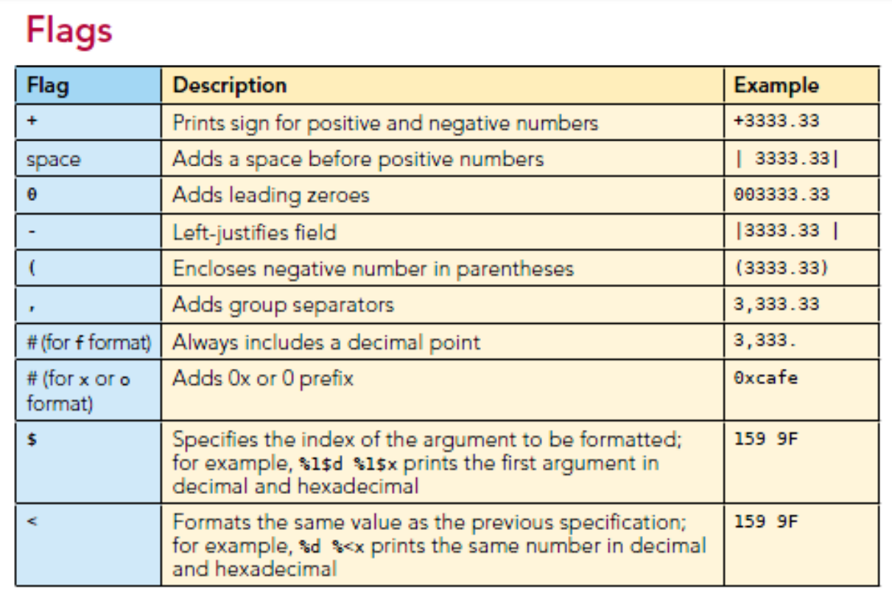
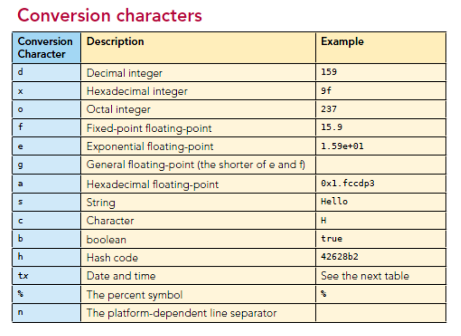

# 객체직렬화

- File I/O 만큼 자주 사용하지는 않음

- 하지만 고급 프로그래밍을 하다보면 자바 객체를 어딘가에 저장해뒀다가 이를 가져와서 처리해아하는 과정이 필요할 수 있는데 이때 사용해야하는 API를 익히는데 도움이 되는것이 `객체직렬화`

- 분산처리 프로그래밍에서 필수임

- 메모리에서 생성되어 있는 객체를 자바 프로그래밍을 실행시켜서
내부에 생성된 여러 객체들은 자바 프로그래밍이 사라지면 더 이상 유지되지않음이때 어느 객체의 내용을
보관해뒀다가 나중에 다시 사용하겠다고 하면
객체직렬화가 생기기 이전에는 멤버변수의 값을
하나하나 넣어놨다가 하나하나 읽어들이는 처리를 했었음

- 웹 서버에는 방문을 한 클라이언트에 대한 정보를
보관하는것을 세션 트래킹이라고 함.
각 클라이언트들에 어떤 클라이언트에 대한 정보인지를
유지시켜주는데, 일반적으로 서버들은 어떤 이유에서든
재기동 될 수 있다. 
이 경우 클라이언트에 대한 정보를 보관해뒀다가 다시 읽어서
서버에 문제가 있었다는것을 클라이언트에게 최대한 알리지 않는 것을
서버에서 최대한 지원해줌.

- 실수로 브라우저를 줄이거나 로그아웃이 된 경우
객체 직렬화가 내부적으로 쓰인다

- 객체직렬화는 자바프로그래밍이 수행되는 동안
객체의 상태를 보관해뒀다가 그대로 다시 불러오는 것임

- 아무객체나 직렬화가 될 수 있지는 않고,
Externalizable 인터페이스나 Serializable 인터페이스를 상속하는 클래스여야 함

- 객체를 직렬화한다?
  - 메서드는 실행코드가 바뀌지 않는다.
  - 멤버변수는 바뀔 수 있다.
  - 따라서 직렬화는 멤버변수에서만 일어난다.
  - 메서드는 보관할 필요가 없기 때문이다 
  - 객체를 보관하는 바뀔 수있는 내용을 바이트 단위로 변환해서 네트워크를 통해 다른 머신에게 전달하거나 혹은 하드디스크의 파일에 보관하는 처리를 주로하는데. 이떄 사용되는 API가 Object INPUT 스트림과 Object output strea임


# Serializable

- 얘를 상속하는지 여부에 따라 직렬화 가능 여부를 따짐
- 인터페이스 내에 추상 메서드를 정의하지 않아도 됨


# Date 객체 2개 저장

```java
package day0322.course;
import java.io.FileOutputStream;
import java.io.ObjectOutputStream;
import java.util.Date;
public class SerialTest1 {
   public static void main(String[] args) throws Exception{ 
      FileOutputStream fos = 
    		  new FileOutputStream("c:/iotest/test1.ser");
      // 출력모드로 오픈. 바이트스트림 사용. 파일의 확장자가 딱 정해져 있지는 않지만 serializable의 약어로 ser을 많이 사용 (txt는 사용불가)

      ObjectOutputStream oos = 
    		  new ObjectOutputStream(fos);

      oos.writeObject(new Date());
      // Date의 객체에 객체직렬화해서 write -> 시리얼라이자블을 추가상속하고 있음을 알 수 있음

      Thread.sleep(3000);
      oos.writeObject(new Date());
      // Date 객체를 2개 내보냄.

      oos.close();
      fos.close();
      System.out.println("직렬화 출력 완료");      
   }
}
```


# SerialTest3

```java
package day0322.course;
import day0313.course.Student2;

import java.io.FileOutputStream;
import java.io.ObjectOutputStream;
import java.util.Date;


public class SerialTest3 {
   public static void main(String[] args) throws Exception{ 
      FileOutputStream fos = 
    		  new FileOutputStream("c:/iotest/test2.ser"); 
      ObjectOutputStream oos = 
    		  new ObjectOutputStream(fos);
      oos.writeObject(new Date());
      Thread.sleep(3000);
      oos.writeObject(new Date());
      // Date 객체는 이미 Serializable을 추가상속하고 있음

      Student2 st = new Student2("duke", 27, "Java프로그래밍");
      oos.writeObject(st);
      oos.close();
      fos.close();
      System.out.println("직렬화 출력 완료");      
   }
}
```

- https://docs.oracle.com/en/java/javase/11/docs/api/java.base/java/util/Date.html
  - Date가 Serializable, Cloneable, Comparable<Date>를 상속하고 있음

- Student2가 Serializable을 상속받게 고쳐주면 에러가 안남

```java
package day0313.course;

import java.io.Serializable;

public class Student2 implements Serializable {
    private static final long serialVersionUID = 1L;
    // 시리얼 버전 uid가 일치하면 멤버변수 사양이 맞기 않더라도 일치하는 애들은 넣어주기 위한 것.
    // 작렬화해서 저장할 떄의 클래스 멤버와 저장된걸 꺼내서 가져올 떄의 클래스 멤버가 같기만 하면 됨.
    
    /* 멤버 변수 */
    String name;
    int age;
    String subject;

    public Student2(String name, int age, String subject){
        this.name = name;
        this.age = age;
        this.subject = subject;
    }

    public void printStudentInfo(){
        System.out.printf("%s학생의 나이는 %d입니다.\n", name, age);
    }

    public void study(){
        System.out.printf("%s학생은 %s과목을 학습합니다.\n" , name, subject);
    }
}
```

```java
 private static final long serialVersionUID = 1L;
    // 시리얼 버전 uid가 일치하면 멤버변수 사양이 맞기 않더라도 일치하는 애들은 넣어주기 위한 것.
    // 작렬화해서 저장할 떄의 클래스 멤버와 저장된걸 꺼내서 가져올 떄의 클래스 멤버가 같기만 하면 됨.
```

- 객체직렬화
  - 클래스 이름을 먼저 내보내고 클래스가 가진 nonstatic형 멤버변수를 차례로 내보내는 것
  - static형은 객체 영역에 없으므로 직렬화 대상이 아님
  - 객체가 가진 nonstatic형 멤버변수들을 차곡차곡 바이트값 그대로, 순서대로 보관하는 것
  - 값만 보관하면 이 값이 어떤 객체에 대한 값인지를 알 수 없으므로 어떤 클래스로부터 가져온 객체인지 클래스명도 같이 넣어줌
  - 읽을 때에는 read Object를 하면 파일에서 어떤 클래스에 대한 직렬화인지에 대한 객체를 생성하고 보관되어 있던 내용들로 멤버변수를 바꿔줌. 그렇게 되면 보관된 내용을 그대로 가져온것과 같은꼴이 됨.
  - 기본적으로 클래스가 가진 인스턴스 멤버들은 모두 직렬화 대상이 됨.
  - 객체직렬 대상 중 어떤 멤버변수는 직렬화가 되지 않도록 만들고 싶다면 제어자 `transient`를 사용함.
  - `transient`설정시 직렬화 할 떄에만 제외. 나중에 다시 읽으면 기본값을 가짐.
    (String형의 기본값은 null. int형의 기본값은 0)
  


- transient 설정 예시
```java
package day0322.course;
import java.io.FileOutputStream;
import java.io.ObjectOutputStream;
import java.io.Serializable;
class StepDTO implements Serializable{
	private static final long serialVersionUID = -9060430121447664088L;
	private String stepId;
	transient private String password;
	// transient: 일시적임.
	// 이 멤버변수의 값은 영구적으로 보관될 수 없다. 
	// 인스턴스 멤버변수 중 transient를 붙이면 객체의 직렬화의 대상에서 제외됨
	private int age;
	transient private int score;
	// transient: 일시적임.
	// 인스턴스 멤버변수 중 transient를 붙이면 객체의 직렬화의 대상에서 제외됨
	public StepDTO(String stepId, String password, int age, int score) {
		super();
		this.stepId = stepId;
		this.password = password;
		this.age = age;
		this.score = score;
	}
	public String getStepId() {
		return stepId;
	}
	public void setStepId(String stepId) {
		this.stepId = stepId;
	}
	public String getPassword() {
		return password;
	}
	public void setPassword(String password) {
		this.password = password;
	}
	public int getAge() {
		return age;
	}
	public void setAge(int age) {
		this.age = age;
	}	
	public int getScore() {
		return score;
	}
	public void setScore(int score) {
		this.score = score;
	}
}

public class SerialTest5 {
   public static void main(String[] args) throws Exception{ 
      FileOutputStream fos = 
    		  new FileOutputStream("c:/iotest/test3.ser"); 
      ObjectOutputStream oos = 
    		  new ObjectOutputStream(fos);
      
      StepDTO dto  = new StepDTO("unico", "@12345", 33, 100);
      oos.writeObject(dto);
      oos.close();
      fos.close();
      System.out.println("직렬화 출력 완료");      
   }
}
```

```java
package day0322.course;
import java.io.FileInputStream;
import java.io.ObjectInputStream;

public class SerialTest6 {
   public static void main(String[] args) throws Exception{ 
      FileInputStream fis = 
    		  new FileInputStream("c:/iotest/test3.ser"); 
      ObjectInputStream ois = new ObjectInputStream(fis); 
      StepDTO dto = (StepDTO)ois.readObject();
      System.out.println("Student객체 데이터 : ");
      System.out.println(dto.getStepId());  // transient 제어자를 붙여서 읽을 떄에는 기본값 null 출력
      System.out.println(dto.getPassword()); // transient 제어자를 붙였으므로 객체직렬화 대상에서 벗어나서 읽어들일 떄에는 기본값 0을 출력
      System.out.println(dto.getAge());
      System.out.println(dto.getScore());
      ois.close();
      fis.close();
   }
}
```


# System.out.printf

- Java5에서 추가

```java
printf(format, arguments);
```
- 포맷문자열 주고, 포맷문자의 개수에 따라 인자를 지정

<br>

```
format: %[argument_index$][+-flag][width]conversion
```
- 콤마(,)도 flag가 됨. flag를 안주면 (+) 이니까 오른쪽 정렬.

<br>

```java
int a = 20;
long b = 20000L;
float c = 34.56F;
double d = 123.123;
char e = 'A';
GregorianCalendar today = GregorianCalendar.getInstance();
System.out.println("1 : "+a +" "+b+" "+c+" "+d+" "+ e);  JAVA2 방식
System.out.printf("2 : %d %d %f %f %c %n", a, b, c, d, e);
System.out.printf("3 : %f %1$a %1$e %1$f %1$g \n", 32.3453453453);
System.out.printf("4 : %1$h %1$d %2$f %3$c \n", a, d, e);
System.out.printf("5 : %1$20d%n", a);
System.out.printf("6 : %-20d%n", a);
System.out.printf("7 : %1$20.10f%n", 2345.0123456789);
System.out.printf("8 : 오늘의 날짜는 %1$tY 년 %1$tm 월 %1$td 일 입니다.\n", today);
// 날짜 포맷 지정
// tY: 그레고리형 캘린더와 같은 날짜 및 시간 데이터에서만 사용할 수 있음
```




<br>

- 포맷문자




# URL 프로그래밍

- URL 클래스를 이용하는 프로그래밍이다 (java.net)
- I/O 프로그래밍에 속한다고도 볼 수 있고, 네트워크 프로그래밍에도 속한다.
- 네트워크에 대한 전문지식이 없어도 사용할 수 있는 API임
- 입출력 스트림의 역할을 다양하게 테스트할 때 활용할 수 있다 (I/O프로그래밍의 응용)

## URL

- Uniform Resourse Locator의 약어
- 어떠한 자원의 위치를 알리는 단일화된 형식의 문자열/주소
- 각 기관 및 개인의 웹 사이트의 주소 문자열은 `HTTP URL`

## HTTP URL

- 웹 사이트의 주소 문자열
- 단일화된 형식의 문자열임 -> 하나로 통일화 되어있음 (프로토콜://~ 꼴)

## JDBC URL

- 접속할 DB 서버(자원)와 JDBC 드라이버 정보(자원)를 정해진 규격으로 작성한 문자열
- 자원의 정보를 알리는 차원에서 URL이라 볼 수 있음

## java.net.URL 클래스

- 웹 서버에 접속하여 컨텐트(content)를 요청하는 프로그램을 개발할 때 사용
- 브라우저를 사용하지 않고도 URL 클래스를 이용하면 웹 서버에 컨텐트를 요청할 수 있는 자바 프로그램을 짤 수 있음
- 객체 생성, openStream() 메서드(GET 방식)를 위주로 파악하면 됨
- 인터넷 상 수많은 컨텐트를 끌어와서 트렌드 분석한 결과를 웹 페이지에 반영하는 등의 작업을 할 때 유용함

### openStream() 메서드
- 웹 서버 호출시 사용
- 응답한 내용을 읽어서 사용할 때 이용 (따라서 return 값이 inputStream 객체임)

# JSON

- JavaScript Object Notation
- 자바의 객체와 비슷한 형식으로 작성하는 문서 작성 형식
- 각 언어별 JSON을 다루기 위해 필요한 API를 지원함
- https://www.json.org/json-en.html

```java
package day0322.course;

import java.io.BufferedReader;
import java.io.InputStream;
import java.io.InputStreamReader;
import java.net.URL;

import org.json.JSONArray;
import org.json.JSONObject;

public class URLTest8 {

	public static void main(String[] args) {
		try {
			URL req = new URL(
					"http://openapi.seoul.go.kr:8088/796143536a756e69313134667752417a/json/LampScpgmtb/1/100/");

			InputStream is = req.openStream();
			BufferedReader br = new BufferedReader(new InputStreamReader(is));
			StringBuffer bf = new StringBuffer();
			String line;
			while (true) {
				line = br.readLine();
				if (line == null)
					break;
				bf.append(line);
			}

			JSONObject obj = null;

//			try {
				obj = new JSONObject(bf.toString());
				// JSON Object로 만들어서 처리
			
//			} catch (Exception e) {
//				System.out.println("파싱 오류");
//				e.printStackTrace();
//			}

			System.out.println(obj.toString());
			System.out.println(obj.keySet());
			JSONObject lamp = obj.getJSONObject("LampScpgmtb");
			JSONArray row = lamp.getJSONArray("row");

			for(Object e : row) {
				System.out.println(((JSONObject)e).getString("CLS_NM"));
			}
		} catch (Exception e) {
			System.out.println("오류 : " + e.getMessage());
		}
	}
}
```

- .xml파일과 .JSON 파일은 응답되는 문서형식이 다르기 떄문에 문서를 읽고 처리하는 API와 방법이 달라진다.