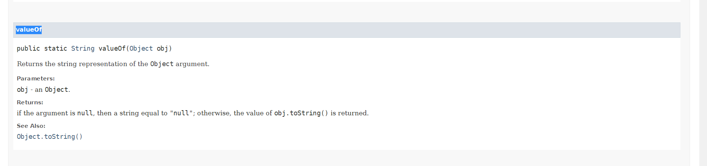

# 자바 API
- [자바 베이스 모듈](https://docs.oracle.com/en/java/javase/11/docs/api/java.base/module-summary.html)
- [11버전에 기반한 자바 API](https://docs.oracle.com/en/java/javase/11/docs/api/index.html)
- 패키지명이 org로 시작
  - 표준화위원회에서 정해놓은 것을 자바가 서포트하기 위한 API

- [DOM 프로그래밍](https://www.google.com/search?q=dom+%ED%94%84%EB%A1%9C%EA%B7%B8%EB%9E%98%EB%B0%8D&oq=dom+%ED%94%84%EB%A1%9C%EA%B7%B8%EB%9E%98%EB%B0%8D&aqs=chrome..69i57.3398j0j1&sourceid=chrome&ie=UTF-8)

- base 모듈을 기반으로 학습

# 접근 제어자

## [TimeTest](./TimeTest.java)

```java
package day0316.course;

public class TimeTest { 
      public static void main(String[] args) { 
            Time t = new Time(12, 35, 30); 
            System.out.println(t); 
            t.hour = 30;
            System.out.println(t); 
            t.minute = -10;
            System.out.println(t); 
      } 
}

class Time {
      /* 멤버변수 */
      // static 설정 X -> Time 클래스의 객체 만들때마다 달라져야하므로
      // 외부에서 접근이 허용됨 -> 메서드를 통해 접근이 가능하도록 수정 (메서드에서는 설정하려는 값이 유효범위인지 체크 -> 유효범위라면 값 설정이 가능하게 만듦. 아니면 값 설정 못하게 만듦)
      int hour; 
      int minute; 
      int second; 

      /* 인자가없는 생성자가 없으므로 상속시 super가 필요함 */
      Time(int hour, int minute, int second) { 
            this.hour = hour; 
            this.minute = minute; 
            this.second =second; 
      } 

      public String toString() { 
    	  return String.format("%d시 %d분 %d초", hour, minute, second); // System.out.printf() - 화면으로 출력
      } 
} 
```

- `30시`, `-10분`
  - 말이 안됨

- String.format 메서드
  - 호출방법: 
  - System.out.printf와 유사 (얘는 화면에 내보내는 기능)

- int형의 저장범위를 넘어서 저장하려고 하면 오버플로우 발생
- 자바는 unsigned가 존재하지 않음 (자바상 int는 양/음의 값 모두를 저장)


## [참고자료](./TimeTest2.java)

```java
package day0316.course;

public class TimeTest2 {
	public static void main(String[] args) {
		Time2 t = new Time2(12, 35, 30);
		System.out.println(t);
		t.setHour(30);
		System.out.println(t);
		t.setMinute(-10);
		System.out.println(t);
		t.setHour(t.getHour()+2);
		System.out.println(t);
	}
}

class Time2 {
	// 인스턴스 멤버변수를 외부에서 직접 접근하지 못하도록 private으로 설정
	// 일반적으로 static 변수는 접근 제한이 없도록 public으로 설정
	private int hour;
	private int minute;
	private int second;

	Time2(int hour, int minute, int second) {
		setHour(hour);
		setMinute(minute);
		setSecond(second);
	}

	// getter - 멤버변수의 값을 읽어감
	public int getHour() {
		return hour;
	}

	public void setHour(int hour) {
		if (hour < 0 || hour > 23)
			return;
		this.hour = hour;
	}

	public int getMinute() {
		return minute;
	}

	public void setMinute(int minute) {
		if (minute < 0 || minute > 59)
			return;
		this.minute = minute;
	}

	public int getSecond() {
		return second;
	}

	public void setSecond(int second) {
		if (second < 0 || second > 59)
			return;
		this.second = second;
	}

	public String toString() {
		return String.format("%d시 %d분 %d초", hour, minute, second);
	}
}
```


## [참고자료](./InetAddressTest.java)

- 생성자에 private을 설정
  - 이 클래스는 new 방법을 통해서는 객체 생성이 불가능하다는 뜻
  
- 자바의 기본적인 객체 생성 방법
```java
new 생성자메서드호출식
```

- runtime은 생성자를 private으로 막아놓고 호출못하게 해둠 (0315 자료참고)
- 컴파일러가 만들어주는 애는 무조건 public임
- 생성자로는 객체 생성을 못하고 팩토리 메서드를 통해 대신 객체 생성을 하도록 만들고 싶은 경우,
생성자 호출을 못하게 private으로 막아야 함
<br> 그런다음 클래스 안에 객체 생성을 대시냏주는 팩토리 메서드가 존재하고 있을 것이다
<br> 간혹 다른 클래스가 가지는 경우도 존재함
<br> 문서를 보았을 때 생성자에 대한 사양이 안보이면 클래스에 대한 메서드를 훑어보면서
객체 생성을 대신하는 친구가 있는지 살펴볼 것
  (static이 붙어서 객체 생성없어도 되는지 확인할 것. 객체 생성을 대신해주는 메서드는
100% static형)

### [inet address](https://docs.oracle.com/en/java/javase/11/docs/api/java.base/java/net/package-summary.html)

- 자바 네트워크 관련 API
- [Inet4 Address](https://docs.oracle.com/en/java/javase/11/docs/api/java.base/java/net/Inet4Address.html)

```java
package day0316.course;
import java.net.*;
public class InetAddressTest {
	public static void main(String[] args) throws Exception {
		InetAddress inet = InetAddress.getLocalHost();
		System.out.println(inet);
		inet = InetAddress.getByName("www.naver.com");  // getByName -> 도메인명을 삽입해서 IP주소 알아냄
		System.out.println(inet);
	}
}

```

## [Math class](https://docs.oracle.com/en/java/javase/11/docs/api/java.base/java/lang/Math.html)

- 순서
1. 필드 서머리
2. 메서드 서미리
3. 생성자 서머리

- Math 클래스는 모두가 static
  - 객체 생성할 일이 없다.
  - Math.XXX꼴로 사용
  - 자식을 만들 수 없다
  - 따라서 생성자 private으로 막아놓았다 (그러므로 외부에서 호출할 일이 없다)
  - 이 클래스는 그냥 가져다가 쓴다 (static 클래스이다)

<br>


# 리팩토링

- 이미 만들어진 클래스를 바꾸는 것

# 추상클래스

- 클래스를 하나의 부모로 묶기위해서 새로운 부모를 생성.
상속의 기능을 지원하는 abstract 클래스로 지정하자.
- 이러한 추상 클래스 p는 a,b,c의 부모 클래스이다.

# 인터페이스 입문

- 하나의 클래스를 상속하면서 다른 인터페이스를 더 상속하는 것에는 제한이 없다
- 인터페이스는 여러개를 상속해도 된다. (자바상 단일상속의 부족한 점을 메우기 위해 사용)
- 추상클래스는 상속시 `extends`, 인터페이스는 `implement`를 사용함
- 프로그래밍을 하면서 고려해야하는 여러 내용들에는 인터페이스가 한 역할을 한다.
- JDBC 또한 클래스보다 인터페이스가 훨씬 많음
- 인터페이스를 사용하면 의존성이 적어짐
- 추상클래스보다 인터페이스를 더 많이 활용함
- 최근에는 인터페이스가 더 확장되어 인터페이스의 활용력이 훨씬 더 커졌다
- 추상클래스로 된 api들이 아직도 있으므로 추상클래스 대신 모두 인터페이스로 쓰자!라고 하긴 어려움

# 자바의 인터페이스

- 인터페이스는 클래스의 특별한 형태이다 
(인터페이스는 컴파일시 `.class`라는 확장자로 만들어짐)
- 추상클래스와 유사함 (객체 생성 불가. 상속만 가능)
- 다중상속이 가능함
- 인터페이스 생성시 2개 이상의 인터페이스를 상속할 수 있음 (클래스는 2개 이상의 클래스를 상속할 수 없음)
- 인터페이스를 상속하는 클래스를 구현할 경우, 여러 인터페이스를 설정할 수 있다

# 인터페이스 생성

```java
interface 인터페이스명;
```

``
``

- 클래스처럼 기존에 이미 만들어진 인터페이스를 상속하여 새로운 인터페이스를 만들 수 있음

```java
// 부모 여러명 지정가능.
interface 인터페이스명 [extends 부모인터페이스, ...]{ /* header */
        /* body */
        명시적 초기화를 하고 있는 상수; (public static final)
        abstract 메서드; //  내부의 메서드는 무조건 public, abstract (접근제어자를 생략해도 자동으로 붙음)
        static 메서드// java8 버전부터 추가
        default 메서드// java8 버전부터 추가
}

/* 인터페이스 상속 */
class 클래스명 implements 부모인터페이스1, 부모인터페이스2, ... , 부모인터페이스n {
    
} 
// 이 클래스의 객체는 인터페이스에 있는 것들을 오버라이딩 해놨을 것임.
// 따라서 인터페이스의 이름을 정할 때에는 ~~Able꼴로 정하는 경우가 많음.
```

- 인터페이스는 일반변수는 있을 수 없다
  - 대신 명시적 초기화를 하고 있는 상수는 존재할 수 있음 (그냥 상수는 X)
  - 명시적 초기화는 변수 선언하면서 대입 연산자로 값 넣는것을 뜻함

##인터페이스 내부
  - 
- 인터페이스 내부에 정의된 상수는 제어자가 반드시 public, static, final임
- 원래 인터페이스는 추상메서드만 있을 수 있었음 

- 인터페이스는 어떤 객체들이 갖게될 메서드들의 스펙을 정의한 것
  (프로그램에 있어 의존성 및 확장성을 효율적으로 만듦)

# [DrawableTest](./DrawableTest.java)

```java
package day0316.course;
import java.util.Random;
interface Drawable {
// 인터페이스는 추상클래스를 상속으로만 사용할 수 있음
// 객체생성이 안됨.
void draw();
// 인터페이스 내 body가 없는 메서드 정의 -> 자동으로 public abstract가 붙음 (static인 경우  안 붙음)
// 인터페이스 내에서 정의되는 메서드는 무조건  자동으로 public이 되므로 오버라이딩시 public을 붙여야 함
}
class Rect implements Drawable { // implement를 뺴더라도 Rect객체가 Drawble위치에 갈 수 없음
// 상속시 인터페이스가 가지고 있는 추상메서드를 몇개든 무조건 오버라이딩 해야함

	// 인터페이스 내에서 정의되는 메서드는 무조건  자동으로 public이 되므로 오버라이딩시 public을 붙여야 함
	public void draw() {
		System.out.println("사각형을 그립니다.");
	}
}
class Circle implements Drawable {
public void draw() {
System.out.println("원을 그립니다.");
}
}
class Diamond implements Drawable  {
public void draw() {
System.out.println("마름모를 그립니다.");
}
}
public class DrawableTest {
public static void main(String[] args) {
Random rand = new Random();
// Random클래스  -> Math.random보다 사용하기 편함. 객체 생성을 해야함 . 원하는 타입의 난수를 리턴할 수 있음
// 원하는 탕비의 난수를 꺼낼 수 있도록 메서드 제공

		int num = rand.nextInt(3);
		// nextInt(3) -> 0~2 사이의 난수를 정수로 꺼내줌
		// nextDouble -> 실수형 난수. nextBoolean -> True 또는 False

		Drawable d = null;
		// null로 초기화를 하지 않으면 output(d)에서 에러남.
		// d라는 변수는 어떤 객체가 담겨지게 될 텐데. 문제는 if ~ else if를 사용하고있다.
		// 근데 어느 블록에도 해당이 안되면 d는 r-value가 되어 아무값도 가지지 않을 수 있기 떄문에.
		// d는 객체를 참조하는 변수 (참조형변수) -> 0으로 초기화할 수 없음 -> null으로 초기화 해야함
		// null -> 참조할 객체가 아직은 존재하지 않음을 뜻함

		if(num == 0)
			d = new Rect();
			// d 변수의 타입은 Drawble형. 객체를 담을 변수의 타입과 실제 객체의 타입이 다름
		// 하지만 자손 객체가 Drawble을 상속하므로 ok
		else if(num == 1)
			d = new Circle();		
		else if(num == 2)
			d = new Diamond();		
		output(d);
	}
	public static void output(Drawable d){
		System.out.println("전달된 객체의 클래스명 : "+
	                        d.getClass().getName());
		d.draw();
	}
}

```

# [InterfaceTest1](./InterfaceTest1.java)

- 인터페이스 내부에 정의되는 메서드는 무조건 public이 됨

```java
package day0316.course;

interface Printable {
	// 인터페이스상의 상수 -> 자동으로 public staic final이 붙음
	// 하지만 명시적 초기화는 반드시 해야함
	public static final int PRINT_TYPE1 = 1;
	static final int PRINT_TYPE2 = 2;
	final int PRINT_TYPE3 = 3;
	int PRINT_TYPE4 = 4;
//	int PRINT_TYPE4;
	// 명시적 초기화를 하지않은 상태에서 변수선언시 error

	/* 메서드 멤버 -> 추상메서드로 정의하고 있음 */
	// 인터페이스상 추상메서드 -> abstract 키워드로 판단 x -> body가 아닌 세미콜론(;)으로 마무리 하는 경우를 추상메서드로 판단
	// 반드시 오버라이딩해야하는 메서드가 3개가 됨
	public abstract void print(int type);
	abstract void setPage(int su);
	boolean isAvailable();
}

abstract class Shape3 {
	String color;

	abstract void draw();

	/* 일반 메서드 */
	void setColor(String color) {
		this.color = color;
	}
}

// Circle3 -> 다양한 타입으로 쓸 수 있음 (Object형 요구하는 자리, Shape3형 요구하는 자리, Printable요구하는 자리 모두에 갈 수 있음)
class Circle3 extends Shape3 implements Printable {
	int page;

	// 미완성 메서드를 오버라이딩하고 있음
	void draw() {
		System.out.println(color + " 원을 그리는 기능");
	}

	/* 인터페이스 상속을 통해 오버라이딩 하고 있는 메서드이므로 public을 반드시 붙여야함 */
	public void print(int type) {
		System.out.println(type + "번 방식으로 " + page + "페이지를 프린팅한다.");
	}

	public void setPage(int page) {
		this.page = page;
	}

	public boolean isAvailable() {
		if (color.equals("흰색"))
			return false;
		else
			return true;
	}
}

class Rectangle3 extends Shape3 {
	// 일반 메서드는 앞에 public을 붙이지 않아도 에러 발생x
	void draw() {
		System.out.println(color + " 사각형을 그리는 기능");
	}
}

class Triangle3 extends Shape3 {
	void draw() {
		System.out.println(color + " 삼각형을 그리는 기능");
	}
}

public class InterfaceTest1 {
	public static void main(String args[]) {
		printOut(new Circle3());
//		printOut(new Rectangle3()); // 컴파일 오류가 발생하는 행 -> 얘는 Printable으로써 역할을 하지 못함 (Pritable을 상속하고 있는 객체가 아니라는 뜻)
	}

	// 매개변수 타입이 Printable 타입 -> 전달되는 객체가 반드시 Printable을 구현하고 있는 객체만 올 수 있다는 뜻 (Printable을 상속하고 있는 객체여야 함)
	// 인터페이스가 가지는 메서드를 오버라이딩
	static void printOut(Printable prt) {
		// Printable 객체는 Printable이 구현하고 있는 자손의 객체를 받아서 메서드 구현.
		//  어떤 변수가 어떤 클래스 유형이다. 어떤 인터페이스 유형이다. 하면 접근할 수 있는 멤버으 ㅣ사양을 결정
		// 이 변수가 참조할 수있는 객체의 타입이 정해짐
		// Printable이 가지고 있는 isAvailable등을 사용할 수 있음
		// setColor는 Printable이 가지고 있지 않음
		
		prt.setPage(100);
		// prt가 어떤 유형의 변수냐에 따라서 접근할 수 있는 멤버의 사양이 다름 
		// 여기서는 Object, Printable인터페이스에 정의된 애들만 등장할 수 있음. prt로는 setColor에 접근 불가
		// draw메서드는 Circle3가 추가하고 있는 메서드이므로 Printable에 없는 객체이므로 그냥 호출할 수 없음
		// setColor는 Printable에 없기 떄문에 그냥 호출할 수 없음.
		// prt가 참조하는 객체는 Printable의 멤버를 가지고 있음. 하지만 prt로는 setColor, draw등을 그냥 호출할 수 없음
		// 이 경우 해당 자손형으로 강제 형변환을 하자.

		((Circle3)prt).draw(); // 점연선자가 우선순위가 높으므로 괄호를 하나 더 감싸줘야 강제형변환이 적용됨
		((Shape3) prt).setColor("파란색");
		// 해당 자손형에서 강제 형변환을 통해 prt가 접근할 수 없는 멤버였던 것을 접근할 수 있게 만듦
		// Circle3는 Shape3를 상속하고 있음. draw나 setColor는 Shape3에서 상속받으므로 Shape3로 형변환해서 접근해도 됨
		// Shape3로부터 물려받은 클래스의 메서드 사양이기 때문이다.
		// 결론: 해당 자식 클래스의 형태로 변환하자 
		
		// 일일이 형변환하기 귀찮을 경우에는 자손 유형의 변수(Circle3)형으로 변수를 하나 만들자
		// 자식 = 부모 꼴인경우 해당 자식 형태로 강제 형변환을 해야함
		Circle3 cobj = (Circle3) prt;
		cobj.draw();
		cobj.setColor("노란색");
		// 이후 prt가 받는 객체에 ~
		// 자손유형으로 일일이 형변환해서 접근하기 보다는 변수에 담아서 접근해도 됨
		
		
		if (prt.isAvailable())
			prt.print(Printable.PRINT_TYPE2);
	}
}

```

# [InterfaceTest2](./InterfaceTest2.java)


# 과제
```java
package emp;

// 사용하는애보다 사용되는 애를 먼저 기재하자.
// Bonus를 Sales와 Secretary보다 늦게 입력시 계속 에러표시가 뜸.

interface Bonus{
    void incentive(int pay);
}

abstract class Employee{
    private String name;
    private int number;
    private String department;
    private int salary;


    /* setter & getter */
    public String getName() {
        return name;
    }

    public void setName(String name) {
        this.name = name;
    }

    public int getNumber() {
        return number;
    }

    public void setNumber(int number) {
        this.number = number;
    }

    public String getDepartment() {
        return department;
    }

    public void setDepartment(String department) {
        this.department = department;
    }

    public int getSalary() {
        return salary;
    }

    public void setSalary(int salary) {
        this.salary = salary;
    }

    public Employee(){};
    public Employee(String name, int number, String department, int salary){
        this.name = name;
        this.number = number;
        this.department = department;
        this.salary = salary;
    }

    /* 추상 메서드 */
    public abstract double tax();
}

class Secretary extends Employee implements Bonus{
    public Secretary(){};
    public Secretary(String name, int number, String department, int salary){
        super(name,number,department,salary);
    }
    public double tax(){
        return getSalary()*0.1;
    }

    public void incentive(int pay){
        setSalary(getSalary()+(int)(pay*0.8));
    }
}

class Sales extends Employee implements Bonus{
    public Sales(){};
    public Sales(String name, int number, String department, int salary){
        super(name, number, department, salary);
    };
    public double tax(){
        return getSalary()*0.13;
    }
    public void incentive(int pay){
        setSalary(getSalary()+(int)(pay*1.2));
    };

    public double getExtraPay(){
        return getSalary()*0.03;
    }
}

public class Company {
    public static void main(String[] args) {
        Employee emp[] = new Employee[2];
        emp[0] = new Secretary("Duke", 1, "secretary",800);
        emp[1] = new Sales("Tuxi", 2, "sales",1200);

        printEmployee(emp,true);

        System.out.println("\n[인센티브 100 지급]");
        ((Bonus)emp[0]).incentive(100);
        ((Bonus)emp[1]).incentive(100);
        printEmployee(emp,false);
    }

    public static void printEmployee(Employee[] emp, boolean isTax){
        if(!(isTax)){
            System.out.println("name \t department \t salary \t tax \t extra pay");
            System.out.println("-------------------------------------------------------");

            for (Employee el: emp) {
                if (el.getDepartment().equals("sales")) {
                    System.out.printf("%s \t %s \t\t\t %d \t\t %.1f \t %.1f\n", el.getName(), el.getDepartment(), el.getSalary(), el.tax(), ((Sales) el).getExtraPay());
                } else {
                    System.out.printf("%s \t %s \t\t %d \t\t %.1f \t \n", el.getName(), el.getDepartment(), el.getSalary(), el.tax());
                }
            }
            System.out.println();

        } else {
            System.out.println("name \t department \t salary \t extra pay");
            System.out.println("------------------------------------------------");
            for (Employee el: emp) {
                if (el.getDepartment().equals("sales")) {
                    System.out.printf("%s \t %s \t\t\t %d \t\t %.1f\n", el.getName(), el.getDepartment(), el.getSalary(), ((Sales) el).getExtraPay());
                } else {
                    System.out.printf("%s \t %s \t\t %d \t \n", el.getName(), el.getDepartment(), el.getSalary());
                }
            }
            System.out.println();
        }
    }
}

```

- emp은 Employee의 자식 객체
  - 부모객체의 이름으로도 불릴 수 있음 (우리도 어디가서 부모를 대신함)

- .equals 대신 instanceof 연산자를 사용할 것
  - `el instanceof Sales` 로 수정하기 

- 개선한 코드
```java
package emp;

// 사용하는애보다 사용되는 애를 먼저 기재하자.
// Bonus를 Sales와 Secretary보다 늦게 입력시 계속 에러표시가 뜸.

interface Bonus{
    void incentive(int pay);
}

abstract class Employee{
    private String name;
    private int number;
    private String department;
    private int salary;


    /* setter & getter */
    public String getName() {
        return name;
    }

    public void setName(String name) {
        this.name = name;
    }

    public int getNumber() {
        return number;
    }

    public void setNumber(int number) {
        this.number = number;
    }

    public String getDepartment() {
        return department;
    }

    public void setDepartment(String department) {
        this.department = department;
    }

    public int getSalary() {
        return salary;
    }

    public void setSalary(int salary) {
        this.salary = salary;
    }

    public Employee(){};
    public Employee(String name, int number, String department, int salary){
        this.name = name;
        this.number = number;
        this.department = department;
        this.salary = salary;
    }

    /* 추상 메서드 */
    public abstract double tax();
}

class Secretary extends Employee implements Bonus{
    public Secretary(){};
    public Secretary(String name, int number, String department, int salary){
        super(name,number,department,salary);
    }
    public double tax(){
        return getSalary()*0.1;
    }

    public void incentive(int pay){
        setSalary(getSalary()+(int)(pay*0.8));
    }
}

class Sales extends Employee implements Bonus{
    public Sales(){};
    public Sales(String name, int number, String department, int salary){
        super(name, number, department, salary);
    };
    public double tax(){
        return getSalary()*0.13;
    }
    public void incentive(int pay){
        setSalary(getSalary()+(int)(pay*1.2));
    };

    public double getExtraPay(){
        return getSalary()*0.03;
    }
}

public class Company {
    public static void main(String[] args) {
        Employee emp[] = new Employee[2];
        emp[0] = new Secretary("Duke", 1, "secretary",800);
        emp[1] = new Sales("Tuxi", 2, "sales",1200);

        printEmployee(emp,true);

        System.out.println("\n[인센티브 100 지급]");
        ((Bonus)emp[0]).incentive(100);
        ((Bonus)emp[1]).incentive(100);
        printEmployee(emp,false);
    }

    public static void printEmployee(Employee[] emp, boolean isTax){
        if(!(isTax)){
            System.out.println("name \t department \t salary \t tax \t extra pay");
            System.out.println("-------------------------------------------------------");

            for (Employee el: emp) {
                if (el instanceof Sales) {
                    System.out.printf("%s \t %s \t\t\t %d \t\t %.1f \t %.1f\n", el.getName(), el.getDepartment(), el.getSalary(), el.tax(), ((Sales) el).getExtraPay());
                } else {
                    System.out.printf("%s \t %s \t\t %d \t\t %.1f \t \n", el.getName(), el.getDepartment(), el.getSalary(), el.tax());
                }
            }
            System.out.println();

        } else {
            System.out.println("name \t department \t salary \t extra pay");
            System.out.println("------------------------------------------------");
            for (Employee el: emp) {
                if (el instanceof Sales) {
                    System.out.printf("%s \t %s \t\t\t %d \t\t %.1f\n", el.getName(), el.getDepartment(), el.getSalary(), ((Sales) el).getExtraPay());
                } else {
                    System.out.printf("%s \t %s \t\t %d \t \n", el.getName(), el.getDepartment(), el.getSalary());
                }
            }
            System.out.println();
        }
    }
}

```

- incentive 
  - 보너스를 추가 상속하면서 구현함

- Bonus형으로 형변환 
  - `((Bonus) emp[0]).incentive(100)`

- getExtraPay
  - sales만 단독으로 추가하고 있음
  - 따라서 Sales 형으로 바꾸어야 사용이 가능함

# 실습2

## getter & setter
- 멤버변수 > 생성자 > 일반변수 순으로 작성 getter & setter는 일반변수임 

```java
package day0316.hw;

interface Rentable{
    void rent();  // 추상 메서드 (제어자는 생략해도 public abstract가 자동으로 붙음)
}

// 항상 사용되는 애를 먼저 만들기 때문에 TV를 먼저 만들기
class TV{
    private String model;
    private int size;
    private int channel;
    public TV(){}  // 메서드 블록 끝에 세미콜론 붙이지 말자.
    public TV(String model, int size, int channel){
        this.model = model;
        this.size = size;
        this.channel = channel;
    }

    public void channelUp(){
        channel++;  // 11이 되는 순간 밑의 if블록으로 들어가서 실행
        if(channel>10){
            channel=1;
        }
//        channel++; // 얘가 if 블록보다 먼저 나와야 함
    };

    public void channelDown(){
        channel--;   // 연산 수행 후 1보다 작아지면 if블록으로 들어감  (먼저 조정 하고나서 요구사항대로 세팅)
        if(channel<1){
            channel=10;
        }
//        channel--;  // 얘가 if블록보다 먼저 나와야 함
    };

    /* getter & setter */
    public String getModel() {
        return model;
    }

    public void setModel(String model) {
        this.model = model;
    }

    public int getSize() {
        return size;
    }

    public void setSize(int size) {
        this.size = size;
    }

    public int getChannel() {
        return channel;
    }

    public void setChannel(int channel) {
        this.channel = channel;
    }
}

class SaleTV extends TV{
    private int price;

    /* 생성자 */
    public SaleTV(){}  // 블록 끝에 세미콜론 붙이지 말자.
    public SaleTV(int price, String model, int size, int channel){
        super(model,size,channel);
        this.price = price;
    }

    /* 일반변수 */
    public void play(){
        // 채널 정보는 부모의 getter 메서드를 호출해서 처리
        System.out.printf("판매 TV 채널의 %d번 프로를 플레이합니다.\n",getChannel());
    };

    public void sale(){
        System.out.printf("%s 모델의 상품을 판매합니다. %,d원을 지불해주세요.\n",getModel(),price);
    };

    /* Object 클래스의 toString을 오버라이딩 */
    public String toString(){
        // price는 이 클래스 내부의 멤버변수이므로 그대로 사용해도 됨
        // get모델 , get프라이스는 조상의 멤버변수이므로 getter 메서드를 호출해서 사용
        return String.format("판매상품정보 : 모델명(%s), 가격(%,d원), 크기(%d)",getModel(),price,getSize());
    };

    /* getter & setter */
    public int getPrice() {
        return price;
    }

    public void setPrice(int price) {
        this.price = price;
    }

}

class RentalTV extends TV implements Rentable{
    private int price;

    /* 생성자 */
    public RentalTV(){};
    public RentalTV(int price, String model, int size, int channel){
        super(model, size, channel);
        this.price = price;
    }

    public void play(){
        System.out.printf("대여 TV 채널의 %d번 프로를 플레이합니다.\n",getChannel());
    };
    public void rent(){
        System.out.printf("%s 모델의 상품을 대여합니다. %,d원을 지불해주세요.\n",getModel(),price);
    };
    public String toString(){
        return String.format("대여상품정보 : 모델명(%s), 가격(%,d원), 크기(%d)",getModel(),price,getSize());
    };


    /* getter & setter */
    public int getPrice() {
        return price;
    }

    public void setPrice(int price) {
        this.price = price;
    }
}


public class TVTest {
    public static void main(String[] args) {
        /* 객체 생성 */
        SaleTV saletv = new SaleTV(300000,"SALETV-1",40,1);
        RentalTV rentaltv = new RentalTV(100000,"RENTALTV-10",42,1);

        for (int i=0; i<2; i++){
            saletv.channelUp();
            rentaltv.channelDown();
        }
        rentaltv.channelDown();

        // 객체를 전달해서 메서드 호출
        printAll(saletv);
        printAll(rentaltv);

        // 매개변수 타입이 Rentable -> saletv는 Reantable의 자손이 아니므로 전달 불가
        printRentalTV(rentaltv);
    }

    static void printAll(TV tv){
        System.out.println(tv);  // tv와 tv.toString()는 출력 결과가 동일
//        System.out.println(tv.toString());  // tv가 상속하는 Object의 toString 이용 (toString 생략해도 자동으로 참조하게된 객체의 toString 메서드 수행결과가 호출됨)
        if(tv instanceof RentalTV){  // 실제 참조하는 객체가 RentalTV인지 확인. (참조하게 된 객체의 가장 하위영역의 객체부터 찾아감)
            ((RentalTV) tv).play();  // 형변환해서 호출
        } else if (tv instanceof SaleTV){  // tv의 자손이 뭐가 더 있는지 모르므로 else문 대신 else if 사용
            ((SaleTV) tv).play();
            ((SaleTV) tv).sale();
        }
        // if-else if 문이 아닌 if문 2개 적어주면 비교가 2번씩 수행됨. -> 메모리 낭비
//        if (tv instanceof SaleTV){
//            ((SaleTV) tv).play();
//            ((SaleTV) tv).sale();
//        }
    }

    static void printRentalTV(Rentable tv){
        tv.rent();
    }
}

```
## 실습 해석

- 계층도
```java
Object

TV

SaleTV
```

- TV에 대한 객체 생성시 조상인 Object에 대한 객체도 생성됨 
  - Object에 대한 멤버도 사용할 수 있게 됨

- 자손의 객체는 조상유형의 객체에 대입할 수 있음
- Object형 변수는 Object 까지. Tv형 멤버변수는 Object + Tv가 가지는 멤버들까지 참조할 수 있음.
- 어떤 객체를 생성한다
  - 어떤 객체냐에따라 해당 클래스 유형의 변수에 담아서 써야 형변환 없이 편하게 담아서 사용할 수 있음

- Object 클래스는 toString을 이미 가지고 있음. (TV는 toString을 가지고 있음! Object에게 물려받았으므로 toString을 호출할 수 있다!)
- TV는 자기가 내장하고 있는 것 외에도 Object로부터 물려받은 것 까지는 호출할 수 있는 권한을 가지고 있다


- TV타입의 매개 변수 선언 후
  - SaleTV객체 생성시 SaleTV객체 & TV 객체 & Object는 한 덩어이라고 생각해야함.
  - 따라서 조상으로부터 물려받은 모든 멤버를 객체 생성하게 됨 (메모리 할당하게 됨)
  - 이 객체를 SaleTV형 매개변수에 담아서 사용하면 이 3개 모두의 멤버변수를 사용할 수 있음.

- 자손에서 추가된 것은 호출할 수 없음. 호출하고 싶다면 자손으로 강제 형변환해서 호출해야함.
- toString은 Object로부터 물려받았으므로 어디서든 호출할 수 있음
- toString을 오버라이딩 안하고 호출하려고 하면 최하위 영역부터 최상단 영역까지 거슬러 올라가면서 호출할 toString을 찾아감.
  (Object의 toString은 객체에 대한 참조값을 return함. toString을 하위영역에서 오버라이딩해서 사용해야 원하는대로 출력될 것임)

### toString 
- 어떤 객체든 toString을 호출 할 수 있다
- 이 객체에 대한 정보를 하나의 문자열로 return 


# java.lang.System

- [참고 자료](https://docs.oracle.com/en/java/javase/11/docs/api/java.base/java/lang/System.html)
- 자바상 static형은 미리 메모리영역을 할당
- err과 out은 PrintStream객체를 참고함


# html로 만드는 웹 페이지의 특징
- 하이퍼링크를 쓸 수 있다 (클릭시 페이지 이동이 일어난다)

# String class



- [사이트](https://docs.oracle.com/en/java/javase/11/docs/api/java.base/java/lang/String.html)
- 인자로 전달된 객체에 대한 정보를 하나의 문자열로 리턴 (toString 결과가 리턴)

# [MySingletonTest](./MySingletonTest.java)

- 생성자 중 팩토리 메서드중 대신 설계하도록 만들어진것이 있는데 그 중 하나가 싱글톤이다

## 싱글톤

- 자바 프로그램이 수행되는 동안 객체가 1개만 생성되도록 만들고 싶을 때 쓰는 것 중 대표적인 것이 `runtime`객체
- 우리가 수행시키는 프로그램은 하나의 JVM위에서 수행됨
- 하나의 싱글톤 중 대표적인 것이 `Runtime`

- 생성자 메서드는 이미 만들어진 객체를 초기화하는 애임 (생성자 가지고는 객체를 1개만 만들라는 명령을 구현할 수 없음)

```java
package day0316.course;

class MySingleton {
	 // 클래스가 메모리에 올라갈 때 (클래스가 로딩될 때)

	// 메모리에 객체를 (미리) 생성하도록 만듦
	private static MySingleton obj = new MySingleton();
	private MySingleton() {		
	}

	// 미리 생성한 마이 싱글톤 객체를 리턴
	static MySingleton getMy() {
		return obj;
	}

	void printMyName() {
		System.out.println("유니코");	
	}
	void printFavoriteFood() {
		System.out.println("떡볶이");	
	}
}
public class MySingletonTest {
	public static void main(String[] args) {
		//MySingleton my = new MySingleton(); // error. Visible이 아님과 존재하지 않음은 다름
		MySingleton my = MySingleton.getMy();  // 이 클래스는 객체 생성을 위해 getMy() 메서드를 호출해야 함
		// 팩토리 메서드명은 뭘로 하든 상관없지만 일반적으로 `get인스턴스`라는 이름을 많이씀.
		// 혹은 create땡땡땡으로 작명함
		// MySingleton 객체가 생성된 후 리턴

		my.printMyName();
		my.printFavoriteFood();
		System.out.println(my);  // 전달된 객체의 toString 리턴값 (마이싱글톤이 toString이 없으므로 Object의 toString 호출)
		System.out.println(MySingleton.getMy());  // 마이싱글톤 객체를 달라고 함
		System.out.println(MySingleton.getMy());
	}
}

```

## 싱글톤 패턴 예제2
```java
package day0316.course;

class MySingleton2 {
    private static MySingleton2 obj = null; // 클래스 로딩할때 미리 객체생성하지 않음
//    private MySingleton2() {
//    } // 막아줘야 함

    // getMy 호출시 객체 생성해서 리턴
    // 계속 수행하는 것이 아님. 만들어진 객체를 갖다줌.
    static MySingleton2 getMy() {
        if(obj == null){
            obj = new MySingleton2();
        }
        return obj;
    }

    void printMyName() {
        System.out.println("듀크");
    }
    void printFavoriteFood() {
        System.out.println("갈비");
    }
}
public class MySingletonTest2 {
    public static void main(String[] args) {
        //MySingleton my = new MySingleton(); // error. Visible이 아님과 존재하지 않음은 다름
        MySingleton2 my = MySingleton2.getMy();  // 이 클래스는 객체 생성을 위해 getMy() 메서드를 호출해야 함
        // 팩토리 메서드명은 뭘로 하든 상관없지만 일반적으로 `get인스턴스`라는 이름을 많이씀.
        // 혹은 create땡땡땡으로 작명함
        // MySingleton 객체가 생성된 후 리턴

        my.printMyName();
        my.printFavoriteFood();
        System.out.println(my);  // 전달된 객체의 toString 리턴값 (마이싱글톤이 toString이 없으므로 Object의 toString 호출)
        System.out.println(MySingleton2.getMy());  // 마이싱글톤 객체를 달라고 함
        System.out.println(MySingleton2.getMy());
    }
}

```

### `obj = new MySingleTon2()`

```java

// new 연산자를 이용해서 객체 생성하는 방법은 
// 객체 생성 후 생성자를 던져줌 (초기화를하기 위함)
```


# 내용 보충

## Getter & Setter

- 객체의 데이터(필드)를 외부에서 마음대로 읽고 변경한다면 객체의 무결성이 깨질 수 있음<br>
ex) 자동차의 속력은 음수X => 외부에서 자동차 속력 (데이터 객체)을 음수로 변경할 경우 무결성이 깨짐

```java
Car myCar = new Car();
myCar.speed = -100;  // 객체 데이터를 외부에서 조작 => 객체의 무결성 위배
```

- 이러한 문제점을 막고자 객체 지향 프로그래밍에서는 외부에서의 데이터(필드)접근을 막고 메서드를 통해 접근한다.
- 메서드를 통해 객체의 데이터(필드)에 접근할 경우 메서드는 데이터를 검증하여 유효한 값만 객체의 데이터(필드)에 저장할 수 있다
- 그러한 역할을 메소드는 `Setter`이다.


### Setter 예제

```java
private double speed;

public void setSpeed(double speed){
    if(speed<0){
        this.speed = 0; 
        return;  // 매개값이 음수인 경우 메서드 실행 종료
    } else {
        this.speed = speed;
    }
}
```

- 객체의 데이터(필드)인 speed는 private 접근 제한을 가지므로 외부에서 접근하지 못함
- speed 데이터(필드)를 변경하기 위해서는 Setter인 setSpeed() 메서드를 이용해야 함


- 외부에서 객체의 데이터(필드)를 읽을 떄에도 메서드가 필요한 경우가 존재하는데 이럴 떄 `Getter`를 사용한다.<br>
  (데이터(필드) 값이 객체 외부에서 사용하기에 부적절한 경우, 메서드로 적절한 값으로 변환해서 리턴할 수 있기 때문임)

### Getter 예제

```java
private double speed;  // speed 단위는 마일

public double getSpeed(){
    double km = speed*1.6;
    return km;
}  // 필드값인 마일을 km 단위로 환산한 다음 외부로 리턴
```

- speed 데이터(필드)는 private 접근 제한을 가지므로 외부에서 읽지 못한다. 따라서 speed 데이터(필드)를 읽기 위해서는 Getter인 getSpeed()를 이용해야 한다.
- getSpeed() 메서드는 마일 단위의 데이터(필드)값을 km 단위로 변환해서 외부로 리턴함

### Getter & Setter 기본 작성 방법

```java
private 타입 fieldName;   // 필드 접근 제한자 - private

/* Getter */
public 타입 getFieldName(){
    return fieldName;
}
// 접근 제한자 - public
// 리턴타입 - fieldtype
// 메서드 - get + 필드명(첫 글자를 대문자로 씀)

/* Setter */
public void setFieldName(타입 fieldName){
    this.fieldName = fieldName;  
}
// 접근 제한자 - public 
// 리턴 타입 - void
// 메서드명: set + 필드명(첫 글자를 대문자로 씀)
// 매개변수 타입 - 필드타입
```

### Getter & Setter 예제

- 예제1
```java
class Car{
    // 데이터(필드) 선언
  private int speed;
  private boolean stop;
  
  // speed 데이터(필드)의 Getter & Setter 선언
  public int getSpeed(){
      return speed;
  }
  
  public void setSpeed(int speed){
      if (speed < 0){
          this.speed = 0;
          return;
      } else {
          this.speed = speed;
      }
  }
  
  // stop 데이터(필드)의 Getter & Setter 선언
  public boolean isStop(){
      return stop;
  }
  
  public void setStop(boolean stop){
      this.stop = stop;
      if(stop == true){
          this.speed = 0;
      }
  }
}

public class CarExample{
  public static void main(String[] args) {
    Car myCar = new Car();  // 객체 생성

    /* 속도변경을 잘못한 사례 */
    myCar.setSpeed(-50);
    System.out.println("현재 속도: "+myCar.getSpeed());

    /* 올바른 속도변경 사례 */
    myCar.setSpeed(60);
    System.out.println("현재 속도: "+myCar.getSpeed());

    /* 차량 정지 */
    if(myCar.isStop()){
      myCar.setStop(true);
    }
    System.out.println("현재 속도: "+myCar.getSpeed());
  }
}
```  

## 싱글톤 패턴

```java
private 클래스() {}
```

- 애플리케이션 전체에서 단 한개의 객체만 생성해서 사용하고 싶을 때 사용하는 패턴
- 생성자의 접근 제어자를 private으로 설정해서 외부에서 new 연산자를 통해 생성자를 호출할 수 없도록 막음
- 이렇게 되면 생성자를 호출할 수 없게 되므로 외부에서 마음대로 객체를 생성하는 것이 불가능진다.
  (싱글톤 패턴만이 제공할 수 있는 static method를 통해서 간접적으로 객체를 얻을 수 있게 된다.)

### 기본 형태

```java
public class 클래스명{
    private static 클래스 singleton = new 클래스();  // (1)
    // private 접근 권한을 갖는 static 데이터(필드) 선언과 초기화
  
  private 클래스() {}
  // private 접근 권한을 갖는 생성자 선언 
  
  public static 클래스 getInstance(){  // (2)
      return singleton;
  }
  // public 접근 권한을 갖는 정적 메서드 선언
}
```

- (1)
  - 자신의 타입으로 정적 필드를 선언하고 미리 객체를 생성해서 초기화시킴
  - private 접근 제한자를 붙여서 외부에서 데이터(필드)값을 변경하지 못하도록 막음

- (2)
  - 외부에서 객체를 얻는 유일한 방법은 `getInstance()` 메서드를 호출하는것이 되도록 설정하는 것
  - `getInstance()`메서드가 리턴하는 객체는 정적 데이터(필드)가 참조하는 싱글톤 객체임


### 예제1

```java
package day0316.course;

class MySingleton {
	 // 클래스가 메모리에 올라갈 때 (클래스가 로딩될 때)

	// 메모리에 객체를 (미리) 생성하도록 만듦
	private static MySingleton obj = new MySingleton();
	private MySingleton() {		
	}

	// 미리 생성한 마이 싱글톤 객체를 리턴
	static MySingleton getMy() {
		return obj;
	}

	void printMyName() {
		System.out.println("유니코");	
	}
	void printFavoriteFood() {
		System.out.println("떡볶이");	
	}
}
public class MySingletonTest {
	public static void main(String[] args) {
		//MySingleton my = new MySingleton(); // error. Visible이 아님과 존재하지 않음은 다름
		MySingleton my = MySingleton.getMy();  // 이 클래스는 객체 생성을 위해 getMy() 메서드를 호출해야 함
		// 팩토리 메서드명은 뭘로 하든 상관없지만 일반적으로 `get인스턴스`라는 이름을 많이씀.
		// 혹은 create땡땡땡으로 작명함
		// MySingleton 객체가 생성된 후 리턴

		my.printMyName();
		my.printFavoriteFood();
		System.out.println(my);  // 전달된 객체의 toString 리턴값 (마이싱글톤이 toString이 없으므로 Object의 toString 호출)
		System.out.println(MySingleton.getMy());  // 마이싱글톤 객체를 달라고 함
		System.out.println(MySingleton.getMy());
	}
}

```

- 팩토리 메서드 패턴
  - 객체지향 디자인 패턴
  - 부모 클래스에 알려지지 않은 구체적인 클래스를 생성하는 패턴
  - 자식 클래스가 어떤 객체를 생성할지를 결정하는 패턴
  - 부모 클래스 코드에 구체적인 클래스 이름을 감추기 위한 방법으로도 사용함
  
  
- [팩토리 메서드](https://refactoring.guru/ko/design-patterns/factory-method)
- [정적 팩토리 메서드](https://tecoble.techcourse.co.kr/post/2020-05-26-static-factory-method/)

### 예제2

```java
package day0316.course;

class MySingleton2 {
    private static MySingleton2 obj = null; // 클래스 로딩할때 미리 객체생성하지 않음
//    private MySingleton2() {
//    }  // 막아줘야 함

    // getMy 호출시 객체 생성해서 리턴
    // 계속 수행하는 것이 아님. 만들어진 객체를 갖다줌.
    static MySingleton2 getMy() {
        if(obj == null){
            obj = new MySingleton2();
        }
        return obj;
    }

    void printMyName() {
        System.out.println("듀크");
    }
    void printFavoriteFood() {
        System.out.println("갈비");
    }
}
public class MySingletonTest2 {
    public static void main(String[] args) {
        //MySingleton my = new MySingleton(); // error. Visible이 아님과 존재하지 않음은 다름
        MySingleton2 my = MySingleton2.getMy();  // 이 클래스는 객체 생성을 위해 getMy() 메서드를 호출해야 함
        // 팩토리 메서드명은 뭘로 하든 상관없지만 일반적으로 `get인스턴스`라는 이름을 많이씀.
        // 혹은 create땡땡땡으로 작명함
        // MySingleton 객체가 생성된 후 리턴

        my.printMyName();
        my.printFavoriteFood();
        System.out.println(my);  // 전달된 객체의 toString 리턴값 (마이싱글톤이 toString이 없으므로 Object의 toString 호출)
        System.out.println(MySingleton2.getMy());  // 마이싱글톤 객체를 달라고 함
        System.out.println(MySingleton2.getMy());
    }
}
```