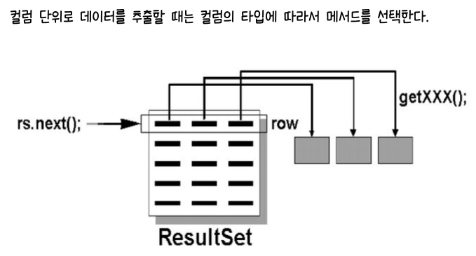
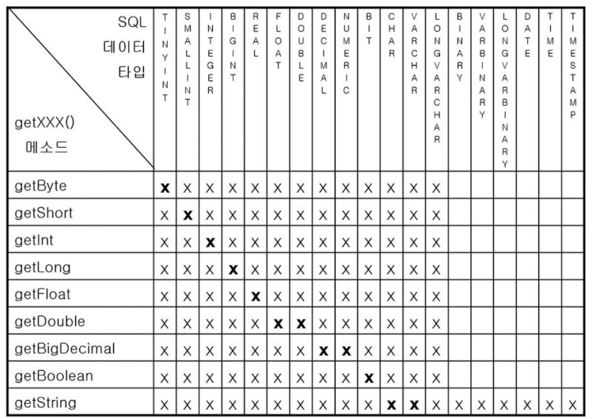

# 내부클래스

- 클래스 안에 정의되는 클래스
<br>=> 밖에 있는 클래스는 외부클래스(outer class)


- 내부 클래스에서는 외부 클래스의 멤버들에 접근할 수 있음


- 내부 클래스에서는 캡슐화를 통해 코드의 
- 객체를 필요로 하는 자리에 클래스를 만드는 것임 
<br> => 소스코드 리뷰시 이것저것 열 필요가 없음
- 객체를 만드는 자리에 클래스를 만드는 것
<br> => 프로그램 유지보수에 좋음

## 내부 클래스의 멤버

- static inner member

- non-static inner member

## 지역 변수의 멤버

### named inner local
  - 클래스가 정의된 named 안에서만 쓸 수 있으므로 지역변수의 유사

### anonymous inner local
  - 다른 inner class에 비해 만드는 방법이 특이함
  - 얘가 정의된 메서드 내에서만 쓸 수 있음
  - 이름이 없으므로 객체 생성은 1번만 할 수 있음 (클래스 정의가 곧 객체 생성임)
  - 객체를 여러번 사용해야하는 경우 anonymous inner local로 만들면 비효율적임


## 내부 클래스의 종류


- 자바의 실행 파일은 바이너리 파일이 아님. 바이트코드임. (자바만의 기술로 만들어진 바이트코드. JVM이 이를 읽고 해석해서 시스템을 수행함.)
- 바이너리 파일은 내부에 OS정보가 들어감.
- 소스안에 정의된 실행 파일이 각각 생성됨.
- 내부클래스도 내부클래스별로 실행파일이 각각 생성됨. 하지만 단독으로 정의된 파일과는 다름.
- 내부클래스는 항상 외부클래스이름이 밖에 붙음. 외부클래스와 내부클래스를 구분하기 위해서 달러($)가 붙음.
- 자바에서는 명칭 구분을 위해 언더바(_)와 달러($)를 사용.


### 멤버 클래스

- 클래스의 멤버로 정의

```java
class OuterClassP{
    ... // 멤버클래스
    
    void test(){
        
    }
}
```
#### 내부 클래스 종류


```java
class A{
    class B{
        // 인스턴스 클래스
    }
    
    static class C{
        // static class
    }
}
```

##### 1. 인스턴스 클래스
- 외부클래스$내부클래스.class (클래스명 규칙)
- 멤버가 static형이 아니면 객체 생성부터 해야함
- 객체 생성 방법
```java
A a = new A(); // A에 세들어사니까 A에 대한 객체를 먼저 생성해야함
A.B b = new B();  // 점(.)으로 접근시 앞이 소문자면 패키지. 여기서는 대문자니까 클래스명임.
b.멤버;
```


##### 2. static class
- 외부클래스$내부클래스.class (클래스명 규칙)
- 객체 생성 방법
```java
A.C.멤버
```

- 내부 멤버 중 많이 사용됨


### 로컬 클래스

- 특정 클래스가 가지고 있는 특정 메서드 내에 정의됨

```java
class OuterClass{
    void test(){
        ...    // 로컬 를래스
    }
}
```


#### 내부 클래스 종류

##### 1. 이름이 있는 로컬 클래스
  
- 외부클래스$N내부클래스.class (클래스명 규칙)
  - N은 숫자임. 실제로는 달러대신 점(.)을 많이사용


```java
class X{
    int num;
    void sum(final int i){
        int total = 20;
        final String s = "test";
        class Y{
            멤버들...
          // X$1Y.class명의 클래스 파일이 생성
          // Y클래스 내에서는 X 클래스의 멤버 변수 num, sum() 메서드의 final 지역변수 s를 사용할 수 있음
          // Y클래스는 sum() 메서드 내에서만 사용이 가능함
        }
        Y y = new Y();
        y.멤버들;
    }
}
```

- 제어자 중 final만 지역변수에서도 정의할 수 있음.
- 메서드 내에서만 사용가능한데 상수로 정의하고 싶은 경우에 final로 지정.
- 주인집인 X가 가진 멤버들은 같은 영역내에 있으므로 Y클래스에서도 사용할 수 있음. (같은 주인집에 세 들어 사니까 공유 가능!)
- final 형으로 정의된 변수들은 Y클래스에서도 사용이 가능함.


##### 2. 이름이 없는 로컬 클래스 


- 외부클래스$N.class (클래스명 규칙)
    - N은 숫자임. 
    - $1.class 꼴이면 inner class임을 추측가능

- 얘를 함수처럼 만든 것이 `람다`

- 메서드 호출 시 매개변수의 타입이 추상 클래스 형이거나 인터페이스 형이어서 가볍게 구현(자손) 클래스를 만들고
  객체를 생성해서 전달하려는 경우 유용하게 사용될 수 있는 구문

```java
class N{
    void pr(Test t){
      ...
    }
    
    void sam(){
        pr(new Test(){ 
            // anonymous inner local class 정의 (인자를 전달하는 자리에 위치시킴. 객체 생성해서 전달하는 역할)
            // 클래스의 정의와 객체 생성을 동시에 하는 일회용 클래스
            // 객체 생성과 클래스 body를 한번에 묶어놓은 것임
          // 이름 날리고 앞에 객체 생성식을 붙임.
          // 중괄호 부분이 클래스의 body
            멤버들...
        });
      ...
    }
}
```

- `N$1.class` 꼴로 생성될 것임
- 내부 클래스는 해당 자리에서 한번만 객체 생성이 가능한 일회용 클래스임


- 내부 익명 클래스 생성
```java
new 클래스명(){
        // 이름없는 inner local class
    // 객체 생성식 & 블록 지정
        // 블록 내부에 구현할 멤버를 정의
}
```

- 익명 클래스의 경우 new 키워드 뒤의 생성자 메서드의 명칭이 기존 클래스 명인 경우에는, 자동적으로 이 클래스의
  자손 클래스가 되며, 인터페이스 명인 경우에는 이 인터페이스를 구현하여 추가 상속하는 클래스로서 부모 클래스는
  Object 이 된다. 


###### 이름없는 inner local class 예제

```java
package day0323.day14;

class LocalTest {
	String name = "Java";

	void pr(final String s) {
		final int su = 100;
		System.out.println(s + " : " + su);
		class Local {
			// LocalTest$1Local꼴로 생성될 것임
			// Local 클래스가 객체 생성되어 사용되려면 pr메서드가 호출되어야 함.
			void pr(String ls) {
				System.out.println("s : " + s);
				System.out.println("ls : " + ls);
				System.out.println(name);  // 멤버변수 name 출력
				System.out.println(su);  // pr 메서드 내부의 final형 지역변수인 su의 값을 출력
			}
		}
		Local lt = new Local();  // 객체 생성
		lt.pr("Local Test"); // 문자열 전달
	}
}

public class InnerTest2 {
	public static void main(String args[]) {
		LocalTest l = new LocalTest();
		l.pr("Main Call");
	}
}

```
- 포함하고 있는 inner local 사용 가능

###### 예제


- `javap day14.InnerTest3$1` 입력시

```java
package day0323.day14;

abstract class Test {
  Test() {
    System.out.println("No Argument sample");
  }

  abstract void output(String s);
}

public class InnerTest3 {
  void pr(Test o) {  // pr 호출하려면 Test를 전달해야함.
    // Test는 추상클래스임.
    // 따라서 얘를 전달할 얘를 생성해야 함
    o.output("Test");
  }

  public static void main(String args[]) {
    System.out.println("Main start !!");
    day14.day14.InnerTest3 n = new day14.day14.InnerTest3();  // 객체 생성하여 pr을 전달할 것임
    n.pr(new Test() {
      // anaonymouse inner local class를 생성
      // 어떤 클래스/인터페이스를 대신해서 만들것이냐에 따라 대신해서 만들것을 앞에 붙여줌.
      // 누구에 대한 객체 생성하는식을 앞에 붙이냐에 따라서 누구를 상속하느냐가 정해짐. -> Test를 상속하게 됨
      // new Test()를 통해 Test 클래스의 자식이 됨.
      // 어떤 클래스/인터페이스를 상속하느냐에 따라서 new 생성자() 호출식을 지정
      // 매개변수 pr에 객체 전달
      // output 호출하면서 Test를 전달하고 있음
      // 이름없는 inner local의 부모가 Test임
      // 이름없는 얘도 클래스이므로 생성자를 가지고 있음 -> 부모의 생성자 호출

      int su = 100;


      // output 메서드를 오버라이딩
      // 추상 메서드 (미완성 메서드)를 오버라이딩해야 함
      public void output(String s) {
        System.out.println("Anonymous Class : " + s);
        System.out.println("Anonymous Class : " + su);
      }
    });
  }
}

```


###### 예제

```java
package day0323.day14;

interface Testable {
  final static String FS = "Interface Test"; // 상수 (값과 메모리 공간을 고정함)

  abstract void output(String s);
}

public class InnerTest4 {
  void pr(Testable o) {
    o.output("Test");
    System.out.println(Testable.FS);
    // System.out.println(o.su); // 자손에서 추가된 멤버는 접근할 수 없다.
  }

  public static void main(String args[]) {
    System.out.println("Main start !!");
    day14.day14.InnerTest4 n = new day14.day14.InnerTest4();
    // 이 이름 없는 Inner 클래스는 Testable 와 Object 의 자손이 된다.
    n.pr(new Testable() {
      // 이름없는 inner local class는 한번만 생성이 가능함
      // new 다음에 인터페이스에 대한 객체 생성식이 나옴
      // 이 객체 생성식을 통해 Testable을 추가상속하는 클래스가됨.
      // (추상 메서드와 추상 클래스는 new 키워드로 생성자 생성할 수 없음)
      // 이 inner local class의 부모는 자동으로 Object이 됨 + Testable을 추가 상속하게 됨
      // extends절을 생략하면 자동으로 Object이 부모가 됨
      int su = 100; // 멤버변수

      /* 외부 클래스의 메서드 오버라이딩 */
      // 이름 없는 inner local class를 추상메서드로 만들 수 없음
      // 얘는 인터페이스니까 생성자는 정의할 수 없음.
      // 자손의 객체를 조상유형의 변수에 전달할 수 있지만 조상 유형의 변수로 자손에 추가된것에 접근을 할 수는 없음
      public void output(String s) {
        // 얘는 구현안하면 에러남
        System.out.println("Anonymous Class : " + s);
        System.out.println("Anonymous Class : " + su);
      }
    });
  }
}

```

- 인터페이스를 상속한다?
  - 인터페이스를 추가 상속함으로서 인터페이스의 자격을 갖춤
  <br>(클래스 상속은 걔를 상속하면 추가 상속 못함)

<br>  


## MySQL

```sql
mysql> create database edudb; -- edudb 생성
Query OK, 1 row affected (0.01 sec)

mysql> create user 'jdbctest'@'%'identified by '비밀번호';
-- '%' : 클라이언트의 제한을 주지 않음
    
mysql> grant all on edudb.* to 'jdbctest'@'%';
Query OK, 0 rows affected (0.01 sec)
    
mysql> flush privileges;
Query OK, 0 rows affected (0.00 sec)
```

- cmd창에서 로그인
```sql
mysql -u jdbctest -p
-- 로그인
```

- 경로 설정
  - 사용자 디렉토리에 넣은 경우 경로는 파일명만 지정해주면 됨


```sql
mysql> select USER(); -- 만들어져 있는 유저정보 확인
```

## DB, TABLE, 열의 이름이 확실하지 않을 때 조회하는 방법

### 현재 서버에 어떤 DB가 있는지 보기
SHOW DATABASES;

### 현재 서버에 어떤 TABLE이 있는지 보기
#### 데이터베이스에 있는 테이블 정보 조회
SHOW TABLE STATUS;

#### 테이블 이름만 간단히 보기
SHOW TABLES;

#### employees 테이블의 열이 무엇이 있는지 확인
DESCRIBE emp 또는 DESC emp;


## 중복된 것은 하나만 남기는 DISTINCT

- 2개의 컬럼을 꺼낼 때 두 컬럼이 모두 같아야 중복된 것으로 봄 (둘 중에 하나만 같으면 중복된것이 아님.)
- SELECT는 원래 SELECT ALL이라는 의미이나 여기서 쓰이는 것은 SELECT DISTINCT임


## 날짜 관련 함수

- %Y
  - 네자리로 연도 표시

- %y
  - 두자리로 연도 표시

## 서브쿼리

- 결과가 하나의 데이터를 꺼내는지, 여러개 꺼내는지에 따라서 같이 사용되는 연산자가 달라짐
  (단일 행 연산자의 경우)


## 수업

```sql
mysql> show tables;
+-----------------+
| Tables_in_edudb |
+-----------------+
| course1         |
| course2         |
| dept            |
| emp             |
| locations       |
| salgrade        |
+-----------------+
6 rows in set (0.00 sec)

mysql> insert into reply (name, content, refid) values ('도우너','탕수육',1);
ERROR 1146 (42S02): Table 'edudb.reply' doesn't exist
mysql> create table reply(
    -> id int primary key auto_increment,
    -> nam varchar(30),
    ->
    ->
    -> ^C
mysql> create table reply(
    -> id int primary key auto_increment,
    -> name varchar(30),
    -> content varchar(120),
    -> refid int references meeting (id) on delete cascade
    -> );
Query OK, 0 rows affected (0.02 sec)

mysql> insert into reply(name, content, refid) values ('도우너', '탕수육' ,1);
Query OK, 1 row affected (0.01 sec)

mysql> insert into reply(name, content, refid) values ('고길동', '짜장면' ,1);
Query OK, 1 row affected (0.00 sec)

mysql> insert into reply(name, content, refid) values ('또치', '초밥' ,3);
Query OK, 1 row affected (0.01 sec)

mysql> insert into reply(name, content, refid) values ('희동이', '깐풍기', 1);
Query OK, 1 row affected (0.01 sec)

mysql> insert into reply(name, content, refid) values ('둘리', '우동', 3);
Query OK, 1 row affected (0.01 sec)

mysql> select * from reply;
+----+--------+---------+-------+
| id | name   | content | refid |
+----+--------+---------+-------+
|  1 | 도우너 | 탕수육  |     1 |
|  2 | 고길동 | 짜장면  |     1 |
|  3 | 또치   | 초밥    |     3 |
|  4 | 희동이 | 깐풍기  |     1 |
|  5 | 둘리   | 우동    |     3 |
+----+--------+---------+-------+
5 rows in set (0.01 sec)

mysql> show tables;
+-----------------+
| Tables_in_edudb |
+-----------------+
| course1         |
| course2         |
| dept            |
| emp             |
| locations       |
| reply           |
| salgrade        |
+-----------------+
7 rows in set (0.00 sec)

mysql> select * from information_schema_table_constraints where table_name;
ERROR 1146 (42S02): Table 'edudb.information_schema_table_constraints' doesn't exist
mysql> select * from information_schema_table_constraints where table_name = 'reply';
ERROR 1146 (42S02): Table 'edudb.information_schema_table_constraints' doesn't exist
mysql> select * from information_schema_table_constraints where table_name = 'reply';
ERROR 1146 (42S02): Table 'edudb.information_schema_table_constraints' doesn't exist
mysql>
mysql> create table visitor (
    ->   id int primary key auto_increment,
    ->   name varchar(15) not null,
    ->   writedate datetime not null,
    ->   memo varchar(100) not null
    -> );
Query OK, 0 rows affected (0.02 sec)

mysql> create table imgtest (
    ->     id int primary key auto_increment,
    ->     filename  varchar(45) not null,
    ->     imgcontent  mediumblob not null
    -> );
Query OK, 0 rows affected (0.03 sec)

mysql> insert into visitor (name, writedate, memo) values('둘리', now(), '호이호이~~');
Query OK, 1 row affected (0.01 sec)

mysql> insert into visitor (name, writedate, memo) values('또치', '2021-12-25', '난 타조라네^^');
Query OK, 1 row affected (0.00 sec)

mysql> insert into visitor (name, writedate, memo) values('도우너', '1990-8-20', '깐따삐아 별이서 왔어용');
Query OK, 1 row affected (0.00 sec)

mysql> select * from visitor;
+----+--------+---------------------+------------------------+
| id | name   | writedate           | memo                   |
+----+--------+---------------------+------------------------+
|  1 | 둘리   | 2023-03-23 14:47:40 | 호이호이~~             |
|  2 | 또치   | 2021-12-25 00:00:00 | 난 타조라네^^          |
|  3 | 도우너 | 1990-08-20 00:00:00 | 깐따삐아 별이서 왔어용 |
+----+--------+---------------------+------------------------+
3 rows in set (0.00 sec)

mysql> create table meeting(
    ->     id int primary key auto_increment,
    ->     name  varchar(24),
    ->     title  varchar(120),
    ->     meetingdate  datetime
    -> );
Query OK, 0 rows affected (0.03 sec)

mysql> insert into meeting (name, title, meetingdate) values('유니코', '일식먹을사람 메뉴 정하세요', '2023-04-23 12:30');
Query OK, 1 row affected (0.00 sec)

mysql> insert into meeting (name, title, meetingdate) values('듀크', '중식먹을사람 메뉴 정하세요', '2023-03-28 15:00');
Query OK, 1 row affected (0.00 sec)

mysql> insert into meeting (name, title, meetingdate) values('턱시', '분식먹을사람 메뉴 정하세요', '2023-03-31 10:30'));
ERROR 1064 (42000): You have an error in your SQL syntax; check the manual that corresponds to your MySQL server version for the right syntax to use near ')' at line 1
mysql>
mysql> select * from meeting;
+----+--------+----------------------------+---------------------+
| id | name   | title                      | meetingdate         |
+----+--------+----------------------------+---------------------+
|  1 | 유니코 | 일식먹을사람 메뉴 정하세요 | 2023-04-23 12:30:00 |
|  2 | 듀크   | 중식먹을사람 메뉴 정하세요 | 2023-03-28 15:00:00 |
+----+--------+----------------------------+---------------------+
2 rows in set (0.00 sec)

mysql> create sequence reply_seq start with 1 increment by 1;
ERROR 1064 (42000): You have an error in your SQL syntax; check the manual that corresponds to your MySQL server version for the right syntax to use near 'sequence reply_seq start with 1 increment by 1' at line 1
mysql> select * from reply;
+----+--------+---------+-------+
| id | name   | content | refid |
+----+--------+---------+-------+
|  1 | 도우너 | 탕수육  |     1 |
|  2 | 고길동 | 짜장면  |     1 |
|  3 | 또치   | 초밥    |     3 |
|  4 | 희동이 | 깐풍기  |     1 |
|  5 | 둘리   | 우동    |     3 |
+----+--------+---------+-------+
5 rows in set (0.00 sec)

mysql>
mysql> select * from information_schema.table_constraints where table_name = 'reply';
+--------------------+-------------------+-----------------+--------------+------------+-----------------+----------+
| CONSTRAINT_CATALOG | CONSTRAINT_SCHEMA | CONSTRAINT_NAME | TABLE_SCHEMA | TABLE_NAME | CONSTRAINT_TYPE | ENFORCED |
+--------------------+-------------------+-----------------+--------------+------------+-----------------+----------+
| def                | edudb             | PRIMARY         | edudb        | reply      | PRIMARY KEY     | YES      |
+--------------------+-------------------+-----------------+--------------+------------+-----------------+----------+
1 row in set (0.02 sec)

mysql>
mysql> select * from information_schema.table_constraints where table_name = 'reply';
+--------------------+-------------------+-----------------+--------------+------------+-----------------+----------+
| CONSTRAINT_CATALOG | CONSTRAINT_SCHEMA | CONSTRAINT_NAME | TABLE_SCHEMA | TABLE_NAME | CONSTRAINT_TYPE | ENFORCED |
+--------------------+-------------------+-----------------+--------------+------------+-----------------+----------+
| def                | edudb             | PRIMARY         | edudb        | reply      | PRIMARY KEY     | YES      |
+--------------------+-------------------+-----------------+--------------+------------+-----------------+----------+
1 row in set (0.00 sec)

mysql> show tables;
+-----------------+
| Tables_in_edudb |
+-----------------+
| course1         |
| course2         |
| dept            |
| emp             |
| imgtest         |
| locations       |
| meeting         |
| reply           |
| salgrade        |
| visitor         |
+-----------------+
10 rows in set (0.00 sec)

```

# JDBC

- JDBC의 API는 대부분이 인터페이스임

- 인터페이스의 자식 클래스를 직접 구현할 필요 없음
  <br>(대부분의 API가 인터페이스이지만 인터페이스의 실행코드를 JDBC 드라이브 프로그램이 제공함)
  <br>(자바로 DB 연결시 해당 DB서버에 알맞는 드라이버를 이용해야 함)

- JDBC 의 경우 대부분의 API 가 인터페이스이다.
  Connection, Statement, ResultSet, PreparedStatement …………
- 여러 이유로 자식 클래스의 객체 생성을 대신 하여 사용되도록 하려는 경우 인터페이스 대부분의 JDBC 프로그램에서는 위의 API 들에서 제공되는 메서드를 호출해야 한다.
  
## 예를 들어
  
- Connection
  - createStatement()
  - getMetaData()
  
- Statement
  - executeQuery()
  - executeUpdate()
  
- ResultSet
  - next()
  - getXXX()
  


- 이 API 들의 객체를 생성하기 위해서는 이 API 들을 상속하여 구현하고 있는 자식 클래스가 필요한데 그
  자식 클래스들을 바로 JDBC 드라이버가 제공한다. JDBC 드라이버라는 것은 JDBC 에서 인터페이스를 설계되
  어 있는 API 들의 자식 클래스들을 제공하는 프로그램이라고 할 수 있다. 즉 어떠한 DB 서버용 드라이버냐에
  따라서 제공되는 자식 클래스들의 수행 코드가 다르게 만들어져 있는 것이다. JDBC API 내에서는 JDBC 드라
  이버가 제공하는 각 인터페이스들의 자식 클래스가 어떠한 이름의 클래스인지 모르고도 프로그래밍 가능하도록
  팩토리 메서드라는 것을 제공하고 있다. 일반 메서드로서 다른 클래스의 객체생성을 대신해주는 메서드를 팩
  토리 메서드라고 한다.

## JDBC 기술의 구성

### JDBC API

- 모든 DB 서버에 대해 공통적

#### 인터페이스


#### 클래스

- DriverManager (중요)
- Date
- Time
- TimeStamp


### JDBC 드라이버
  - DB 서버마다 달라짐

## 예제

- JDBC 드라이버를 로딩하는 부분
```java
package day0323.day14;

import java.sql.Connection;
import java.sql.DatabaseMetaData;
import java.sql.DriverManager;
import java.sql.SQLException;

public class ConnectMySQL {
  public static void main(String[] args) {
      /* 드라이버를 찾을 수 없을 때 에러표시를 직접 구현 */
    try {
      Class.forName("com.mysql.cj.jdbc.Driver");
      // JDBC를 상속하는 애가 대장
    } catch (ClassNotFoundException cnfe) {
      System.out.println("해당 클래스를 찾을 수 없습니다." + cnfe.getMessage());
      return;
    }
    String url = "jdbc:mysql://localhost:3306/edudb?characterEncoding=UTF-8&serverTimezone=UTC";
    // JDBC url
    
    String user = "jdbctest";
  }
}

```

- JDBC API는 대부분 껍데기 이다. 따라서 드라이버없이 JDBC는 실행되기 어렵다.
- JDBC URL 문자열
  - 기본 규격은 정해져 있음
  - 접속하려는 DB서버와 드라이버에 따라서 조금씩 다름

- JDBC URL 
```java
jdbc:DB서버이름:JDBC드라이버에 대한 정보와 드라이버에게 전달할 정보
// JDBC드라이버에 대한 정보와 드라이버에게 전달할 정보는 드라이버마다 다름

```
  - 항싱 jdbc로 시작함 (HTTP URL이 http로 시작하는 것과 동일)
  - 이후에 `:`가 오고 다음에 `접속할 DB 서버 이름`이 옴


```java
String passwd = "jdbctest";
try (Connection conn = DriverManager.getConnection(url, user, passwd);){
        DatabaseMetaData md = conn.getMetaData();
        System.out.println("DBMS 서버 명 : "+md.getDatabaseProductName()); System.out.println("DBMS 서버 버전 : "+md.getDatabaseProductVersion());
        System.out.println("사용자명 : "+md.getUserName());
} catch (SQLException se) {
    System.out.println(se.getMessage());
}
```
- 기본적으로 MYSQL서버는 3306포트를 열어놓고 공유

- DB서버는 사용하고 나서 close()해야함
<br> (연결하고 사용한 다음에 접속 세션을 반납해야하는데 이것을 안하면 서버 프로그램에 문제가 생김)
<br> (우리는 try catch 문으로 수행)


- 


## 과정

### 1. Driver 로드

### 2. Connection 얻기

### 3. (sql 객체를 얻기위해) Statement 작성

### 4. SELECT 명령을 실행하고 실행 결과를 ResultSet에 담기

```java
ResultSet rs = stmt.excuteQuery("SELECT ename, sal FROM emp");
```

- where절이 없으므로 모든 행에 대해 ename컬럼과 sal 컬럼을 가져오겠다는 것

### 5. ResultSet 객체에서 값 꺼내오기

```java
rs.next()
String name = rs.getString("ename")
int salary = rs.getInt("sal") 
// 숫자를 숫자로 얻기 위해 getInt 사용
```

### 6. 커넥션 반환하기

- 반환 작업은 사용했던 객체를 역순으로 담음

```sql
rs.close();
stmt.close();
conn.close();
```

## ResultSet

```java
while(rs.next()) { 
    // next를 수행 -> 다음 행으로 넘어감 -> 반복 -> 거짓이면 더이상 행이 없음 -> while문 탈출
    // 컬럼단위로 데이터를 추출한다.
}

// execute query가 리턴하는 것은 객체
// 경우에 따라 select의 결과가 없을 수도 있다. 
// 그때에는 execute query가 rs에게 내용이 비어있는 resultSet객체을 리턴한다.
// 비어있는 resultSet객체가 없으면 select 결과가 없다는 뜻
```

- ResultSet 객체는 첫번쨰 추출된 객체의 0번째 줄을 가리키고 있음
- 첫번째 행을 읽기 위해서는 `next() 메서드`를 호출해야 함



- 행 단위로 읽어옴



- 굵은 x: 타입별 권장되는 메서드

# SelectEmp

```java
package day0323.day14;

import java.sql.Connection;
import java.sql.DriverManager;
import java.sql.ResultSet;
import java.sql.Statement;

public class SelectEmp {
  public static void main(String[] args) throws Exception {
    String url = "jdbc:mysql://localhost:3306/edudb?characterEncoding=UTF-8&serverTimezone=UTC";
    String user = "jdbctest";
    String passwd = "jdbctest";
    Connection conn = DriverManager.getConnection(url, user, passwd);

    System.out.println(conn.getClass().getName());  // 실제 리턴된 객체 확인

    Statement stmt = conn.createStatement(); // statement 객체 확인 (Statement는 인터페이스라 객체가 확인이 안되므로 자식 클래스의객체가 리턴됨)

    System.out.println(stmt.getClass().getName());

    ResultSet rs = stmt.executeQuery("select ename, job, format(sal, 0) sal, deptno  from emp");
    // emp 테이블로 부터 ename ~ deptno 컬럼을 꺼냄
    // sal만 format함수의 결과로 꺼냄 (format함수는 두번쨰 인자가 소수점 몇번쨰까지 나타낼 것인지를 지정. 0이면 소수점 이하는없음.)
    // format 함수 쓰면 1000단위마다 콤마. 숫자가 아닌 문자열이 됨.
    // format(sal, 0) sal 에서 뒤의 sal은 별칭

    System.out.println(rs.getClass().getName());

    /* 타이틀 출력 */
    System.out.printf("%10s%10s%10s%10s\n", "성명", "직무", "급여", "부서");
    System.out.println("  -----------------------------------------");

    /* 중요 */
    // rs에 담기는 resultSet 객체는 첫번째행 바로 전의 결과를 담고 있으므로 next를 호출해서 첫번쨰행으로 가야함
    // 또 next 호출해서 그 다믕행으로 계속해서 옮겨가야함. next 결과가 거짓이면 더 이상 옮겨갈 행이 없는 것
    while (rs.next()) {
      System.out.printf("%10s%10s%10s원%10d\n",
              /* select 절의 컬럼 순서에 따라서 추출해낼 수도 있음 */
              rs.getString("ename"), rs.getString("job"),
//						rs.getString("1"), rs.getString("2"), // 위와 동일

              rs.getString("sal"), rs.getInt("deptno"));
//						rs.getString("3"), rs.getInt("4"));  // 위와 동일
    }
    rs.close();
    stmt.close();
    conn.close();
  }
}

```

# [VisitorList.java](VisitorList.java)

```sql
mysql> select * from visitor;
+----+--------+---------------------+------------------------+
| id | name   | writedate           | memo                   |
+----+--------+---------------------+------------------------+
|  1 | 둘리   | 2023-03-23 14:47:40 | 호이호이~~             |
|  2 | 또치   | 2021-12-25 00:00:00 | 난 타조라네^^          |
|  3 | 도우너 | 1990-08-20 00:00:00 | 깐따삐아 별이서 왔어용 |
+----+--------+---------------------+------------------------+
3 rows in set (0.00 sec)
```


```java
package day0323.day14;
import java.sql.Connection;
import java.sql.DriverManager;
import java.sql.ResultSet;
import java.sql.Statement;
public class VisitorList {
  public static void main(String[] args) throws Exception {
    String url = "jdbc:mysql://localhost:3306/edudb?characterEncoding=UTF-8&serverTimezone=UTC";
    String user = "jdbctest";
    String passwd = "jdbctest";
    Connection conn = DriverManager.getConnection(url, user, passwd);
    Statement stmt = conn.createStatement();
    String sql = "SELECT id, name, writedate, memo FROM visitor";
    // where 절이 없으므로 모든 행을 다 꺼내오겠다는 뜻
    // id대신 1, name 대신 2, writedate 대신 3, memo 대신 4를 써도 됨

    ResultSet rs = stmt.executeQuery(sql);
    while (rs.next()) {
      System.out.print(rs.getString("id") + "\t");
      System.out.print(rs.getString("name") + "\t");
      System.out.print(rs.getString("writedate") + "\t");
      System.out.println(rs.getString("memo"));
    }
    rs.close();
    stmt.close();
    conn.close();
  }
}
```

- 가급적 `*`을 쓰지 말고 컬럼명을 나열하자
  <br>(가독성 향상. *는 컬럼 순서대로 나열 됨)


# [VisitorList4.java](VisitorList4.java)

```java
package day0323.day14;
import java.sql.Connection;
import java.sql.DriverManager;
import java.sql.ResultSet;
import java.sql.Statement;
public class VisitorList4 {
	public static void main(String[] args) {
		String url = "jdbc:mysql://localhost:3306/edudb?characterEncoding=UTF-8&serverTimezone=UTC";
		String user = "jdbctest";
		String passwd = "jdbctest";
		String sql = "SELECT id, name, DATE_FORMAT(writedate, '%Y년 %m월 %d일') writedate, memo FROM visitor";
		try (Connection conn = DriverManager.getConnection(url, user, passwd);
				Statement stmt = conn.createStatement();			
				ResultSet rs = stmt.executeQuery(sql);) {	
			// if문을 통해 이미 next했으므로 그다음행으로 넘어가고 그다음에 바로 while문을 쓰면 또 다음행으로 넘어가니까 첫번쨰행이 생략됨.
			// 따라서 do while문을 통해 첫번쨰행을 반드시 읽게끔 만들어줌.
			if(rs.next() ) {				
				do {
					System.out.print(rs.getString("id")+"\t");
					System.out.print(rs.getString("name")+"\t");
					System.out.print(rs.getString("writedate")+"\t");
					System.out.println(rs.getString("memo"));
				} while (rs.next());
			} else {
				System.out.println("추출된 행이 없숑!!");
			}			
		} catch (Exception e) {
			System.err.println("오류 발생 : " + e);
		} 
	}
}
```

