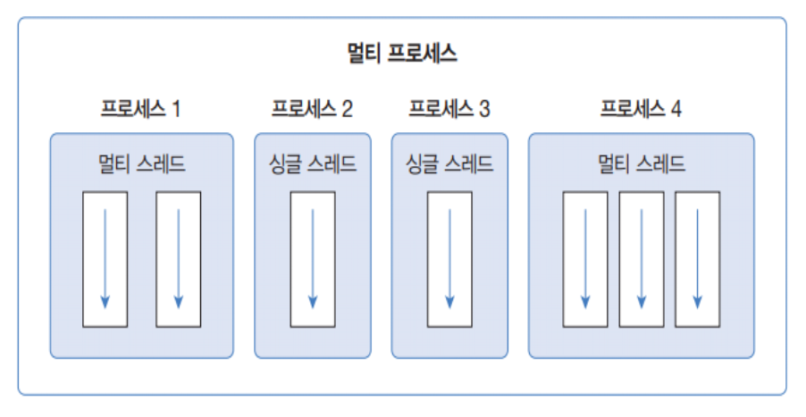
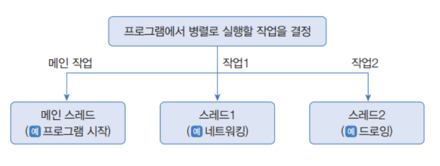
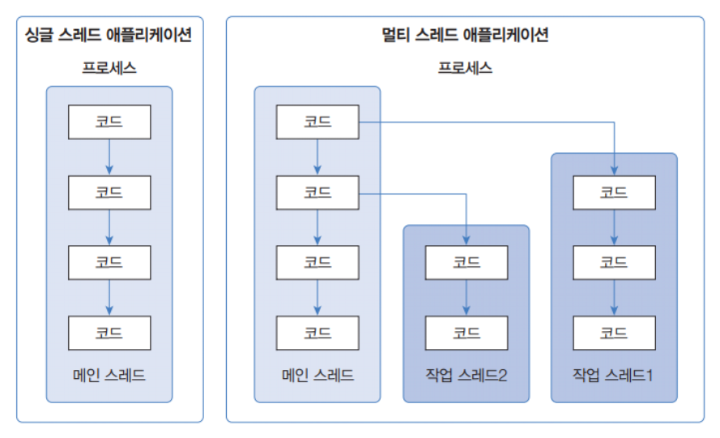
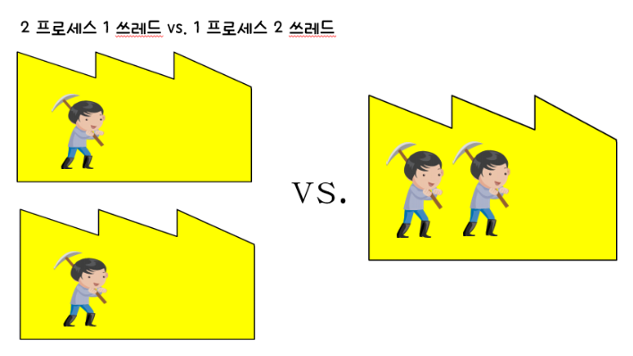
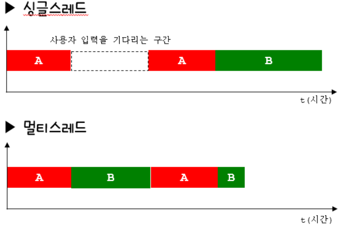
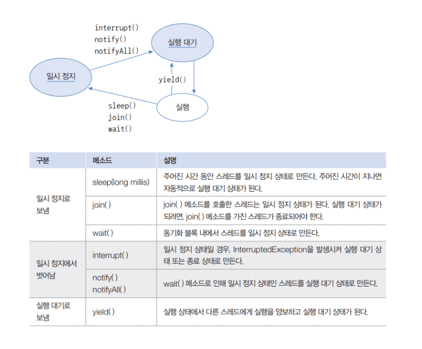
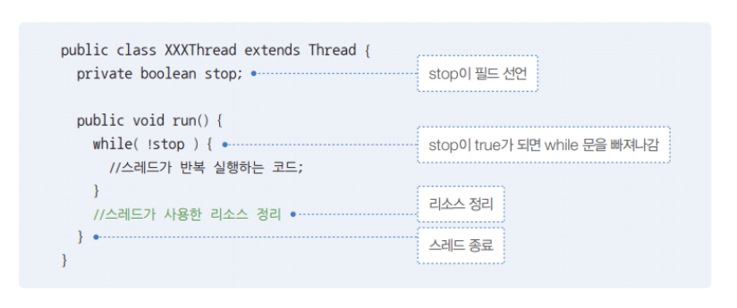
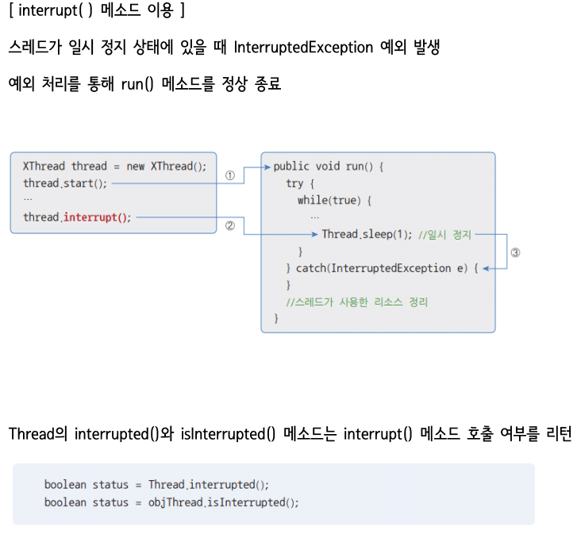

# 멀티스레드 프로그래밍

- OS에 의존적인 프로그래밍
- OS의 여러 작업을 스케줄링 해달라는 프로그래밍
- C언어로 멀티스레드 프로그래밍을 하는것은 쉽지않지만 Java는 API나 JVM이 작업을 어느정도 대신해줌
- 멀티스레드 프로그래밍은 상속을 통해서 구현을 편하게 할 수 있다

<BR>

# 프로세스
  - 실행중인 프로그램/파일/애플리케이션 <BR>(수행이 시작되면 프로세스가 됨. 수행이 해제되면 프로세스 상태에서 해제됨)
  - 자원(resources)과 스레드로 구성


## 멀티 프로세스
    - 실행 중인 프로그램이 2개 이상인 것
    - 프로그램 단위의 멀티 태스킹
    - OS가 해주는 작업



<BR>

# 멀티 태스킹
    - 두 가지 이상의 작업을 동시에 처리하는 것

<BR>

# 스레드
  - 프로세스 내에서 코드의 실행 흐름
  - 프로세스 내에서 실제 작업을 수행함
  - 모든 프로세스는 하나 이상의 스레드를 가지고 있음



- 메인 스레드
  - 자바 프로그램은 메인 스레드가 기동되면서 시작됨
  - 자식 스레드의 부모
  - 메인 스레드 내에서 또 다른 스레드를 기동시키면 추가로 기동되는 스레드는 `자식 스레드(작업 스레드)`
  - 메인 스레드는 내부에 기동할 것이 없더라도 자식 스레드가 기동되면 자식 스레드가 끝날 때까지 기다렸다가 종료됨


- 스레드를 여러개 기동시키면 각각의 역할을 병렬적으로 기동시킴


- CPU가 하나이면 어느시점에서 CPU가 얘네를 기동시킬 수 있는 능력은 하나이고, CPU 입장에서 하나만 처리할 수 있다
  - 하지만 프로그램이 항상 CPU만 사용하는 것도 아니고 대기상태 등도 존재한다
  - 이러한 경우 CPU가 다른 스레드에 의해 기동될 수 있는 기회를 주기도 한다
  - 최근에는 멀티코어(CPU가 여러개)가 등장하였으므로 각각의 코어가 스레드들을 담당하여 처리해주므로 멀티스레드 프로그램을 구현했을 때 수행성능이 더욱 좋아진다


## 멀티 스레드
  - 두 개의 코드 실행 흐름. 두 가지 이상의 작업을 처리
  - 프로그램 내부에서의 멀티 태스킹



- 스레드가 여러개 일 때에는 수행 효율이 높다
- 방 청소를 하더라도 한 명이서 하는 것보다 여러명이서 분업하면 작업 효율이 높고 빠르게 일을 처리할 수 있는것과 같은 이치이다
- 대표적으로 `브라우저` 내부에서 여러 스레드들이 기동된다


<BR>


# 프로세스 & 스레드의 관계

- `프로세스: 스레드 = 공장 :일꾼`
- 최소한 하나의 스레드가 있어야 프로세스가 된다.


- 싱글 스레드 프로세스
  - 공장 하나 지어놓고 일꾼이 1명 인것


- 멀티 스레드 포르세스
  - 공장 하나 지어놓고 내부에 여러 일꾼이 일하는 것


<BR>

## 프로세스를 늘릴까? 스레드를 늘릴까?




- 하나의 프로세스를 새로 생성하는 것보다 하나의 새로운 스레드를 생성하는 것이 비용이 적게 든다
  <BR>(공장 짓는 비용보다 노동비가 더 저렴하다)


- CPU가 여러 프로세스를 각각 수행시켜주는 것(Round-robin scheduling / CONTEXT SWITCHING)보다 하나의 프로세스를 수행시키는 것이 더 효율적이다
<BR> 

- 프로세스를 왔다갔다 하는 것보다 스레드를 왔다갔다하는 것이 더 성능이 좋다


- 결론: <B>멀티 스레드 프로그래밍이 다중 처리 방식에 있어 성능이 좋다!</B>

<BR>


# 멀티 스레드로 개발해보자 (작업 순서)

1. 기동시킬 각 스레드들의 기능을 파악
- 똑같은 기능을 여러개 띄울 것인가? 각각의 기능을 여러개 띄울 것인가? 파악
  - 똑같은 기능을 여러개 띄우려면 스레드 클래스 1개만.
  - 각각의 기능이 5개 필요한 경우 스레드 클래스는 5개가 필요함


2. 기동시킬 기능만큼의 스레드 클래스 생성

- java.lang.Thread를 상속하여 수행시키고자 하는 기능을 Run() 메서드를 오버라이딩 하여 구현
- 스레드 클래스 내에 작업 수행 및 중단등의 기능이 모두 포함되어 있음
- Runnable이라는 인터페이스를 구현해서 만들 수도 있음 (자바의 약점인 다중상속 극복)


<br>

# 스레드 개발 방법

1. Thread 클래스를 상속

- 조성이 가지는 메서드를 얼마든지 가져다 쓸 수 있음

```JAVA
class MyThread extends Thread{
    public void run(){
        /* 작업 내용 */ 
        // Thread 클래스의 run()을 오버라이딩
    }
}

class Ex{
  public static void main(String[] args) {
    MyThread myt = new MyThread();
    myt.start();
  }
}
```

<br>


2. Runnable 인터페이스를 구현

- 스레드의 기능을 구현
  - 스레드의 기능을 이 클래스가 가지게끔 하는 것뿐임 (이것 자체가 스레드가 아님)


```java
class MyThread implements Runnable{
    public void run(){
        /* 작업 내용 */
        // Runnable 인터페이스의 추상메서드 run()을 구현
    }
}


class Ex{
  public static void main(String[] args) {
    MyThread myt = new MyThread();
    Thread t = new Thread(myt);  // 스레드 클래스의 객체를 추가 생성해야 함 (runnable을 구현하고 있는 생성자 전달)
    myt.start();
  }
}
```

<br>


# 싱글스레드 VS 멀티스레드



- A기능 수행하고 B기능을 수행하는 프로그램이 있다고 가정

## 싱글스레드

- A기능을 수행하는 동안 사용자 입력을 기다림
- B기능은 A기능이 끝나야 수행됨


## 멀티스레드

- A기능하는 스레드, B기능하는 스레드가 따로있음
- 입력을 기다리는 동안 B기능을 수행함 (전체적인 수행효율이 높음)
- A가 꼭 끝난다음 B가 수행되어야 한다면 멀티스레드로 구현하면 안됨! (각자 수행해도 될 경우에 멀티스레드 이용)

<br>


# [ThreadEx01](ThreadEx01.java)

- 이 프로그램은 3개의 스레드로 구현됨 (Main 스레드 2개 + 스레드 1개)
- Time slice & Round Robin은 동일
- 스레드 기동시 자동으로 이름이 부여됨
  <BR>(Thread-0, Thread-1, Thread-2,...)
  <br>(메인 스레드의 default name은 Main임)


- run() 메서드
  - 스레드의 기능을 구현하는 메서드
  - 접근제어자가 public -> 오버라이딩시에도 반드시 public 설정해야함<br>(접근제어자가 더 축소되면 안됨!)
  

## 오버라이딩시 지켜야할 규칙
  - 조상의 메서드의 오버라이딩시 조상이 가지고 있는 메서드의 throws절을 자손에서도 똑같은 예외에 대해 throws할 수 있고 안할수도있음
  - 다만 조상이 throws절을 가지고 있지않으면 자손에서 throws절을 추가할 수 없음
  - 조상이 가지는 run()메서드는 throws절이 없으므로 run()메서드 내에서 예외처리를 해야하는 경우가 발생하는데 throws절로 예외처리할 수 없고 반드시 `try-catch 구문`을 이용해야함
- <b>조상이 throws하고 있는 예외보다 더 많은 범위의 예외를 throws할 수 없다!!!!</b>
<br>(조상 예외가 더 범위가 크다!!!)

- Thraed.sleep할 경우에도 throws가 아닌 try-catch를 해야한다!


<br>

# 예제

- 두 예제가 한 묶음


-  [ThreadEx02](ThreadEx02.java)
    - 자식 스레드를 기동시키면 자식 스레드에 대한 콜스택에 각각 생성됨

- [ThreadEx03](ThreadEx03.java)


<br>

# 예제

- 두 예제가 한 묶음

-  [ThreadEx04](ThreadEx04.java)
-  [ThreadEx05](ThreadEx05.java)
    - 병렬적으로 두가지 작업 수행


<BR>


# 단일스레드 vs 멀티스레드 예제

- [ThreadEx06](ThreadEx06.java)
  - 메인 스레드 하나로만 동작함 (단일 스레드)


- [ThreadEx07](ThreadEx07.java)
  - 멀티 스레드
  - 부모에서 입력 & 자식 스레드에서 10~1을 출력하도록 병렬적으로 처리
  - 자식 스레드는 별개로 10~1을 병렬적으로 출력함


<br>

# 예제

- [ThreadEx08](ThreadEx08.java)
  - 스레드 개수: 4개 (메인, A,B,C)
  - 객체 생성시 이름을 부여하면 그 이름대로 기동됨 => 부여하지 않으면 JVM이 자동으로 이름 부여
  - 스케줄링이 어떻게 되느냐에 따라 출력결과가 다름 (수행할때마다 출력결과가 똑같다고 보장할 수 없음)
  - 메인 스레드가 자기에게 주어진 기능을 모두 수행하면 원래는 메인 메서드 수행을 끝내면 메인 메서드는 끝난다.
    - 하지만 여기서는 메인 메서드의 코드를 모두 수행했음에도 종료되지 않고 자식 스레드가 다 끝날때까지 대기하고 있다.
    - 기본적으로 메인 스레드는 자기가 기동시킨 자식스레드가 끝날때까지 기다리고 있다가 다 끝나면 비로소 메인 스레드가 종료된다.

<br>

- [ThreadEx09](ThreadEx09.java)

    - 자식 스레드가 다 끝나고 나서 메인 스레드의 기능이 수행되게 하고 싶은 경우 어떻게 하면 될까?
      - join() 메서드를 이용하자 
      - `threadA.join()` : A가 끝나고 나서 메인 스레드의 기능이 수행됨

<br>

# 예제

## [ThreadEx10](ThreadEx10.java)

- 스레드의 상태를 점검해보는 예제


- start 
  - 스레드를 기동시키는 메서드


- 스레드를 종료시키는 메서드 
  - 없음. 스레드 스스로 종료될 수 있게 구현해야 함 (stop 메서드는 사라짐)
  - 사용하던 자원을 반납하는 등의 작업을 수행한 후에 종료할 수 있게 구현해야 함

<br>

# 스레드 상태

- 하나의 스레드가 기동되면 그 스레드는 CPU에 의해 수행상태일수도 있고, 잠시 대기하는 상태일 수도 있다
- 기동된 스레드가 현재 어떤 상황인지를 알리는 것을 `스레드 상태`라 한다
- 실행 상태와 대기 상태를 반복하며 run()메서드의 모든 코드를 수행하고나면 자동으로 종료됨

## 1. 실행 대기 상태 (runnable (ready))

- 실행 중이지 않은 상태
- 대기 큐에서 실행을 기다리고 있는 상태

- JVM이 여러 스레드들을 돌아가며 수행할 수 있게끔 CPU 권한을 부여하는데
기동된 스레드들을 돌아가는 큐에 담아놓고 수행을 시킴
<BR>=> 1초동안 쉬는 경우 큐에서 제외시킴
<BR>=> 쉰다고 안했고 일을 계속할 것인데, 내 권한이 끝났을 경우 => RUNNABLE 상태
<BR>=> SLEEP을 끝냄

### 실행 대기 상태로 만드는 - yield() 메서드

## 2. 실행 상태 (running)

- CPU 스케줄링에 따라 CPU를 점유하고 run() 메서드를 실행
- 스케줄링에 의해 다시 실행 대기 상태로 돌아갔다가 다른 스레드가 실행 상태 반복

## 3. 종료 상태

- 실행 상태에서 run() 메서드가 종료되어 실행할 코드 없이 스레드의 실행을 멈춘 상태

## 4. 일시 정지 상태

- 실행 중이지 않은 상태
- 스레드가 실행할 수 없는 상태
- 스레드가 다시 실행 상태로 가기 위해서는 일시 정지 상태에서 실행 대기 상태로 가야 함




### 일시정지 상태로 만드는 - Thread 클래스의 sleep() 메서드

- 실행 중인 스레드를 일정 시간 멈추게 함
- 매가값 단위: milsec(1/1000)

### 일시정지 상태로 만드는 - join() 메서드

### 일시정지 상태로 만드는 - wait() 메서드


## [ThreadEx11](ThreadEx11.java)
## [ThreadEx12](ThreadEx12.java)
## [ThreadEx13](ThreadEx13.java)

- 스레드를 종료시킬 때에는 스레드 스스로 종료될 수 있게끔 조건을 주어야 함
<br>(stop 변수와 같은 변수를 이용)

# stop() 메서드 

- 안전하게 스레드 종료

- 스레드를 안전하게 종료하려면 사용하던 리소스(파일, 네트워크 연결)를 정리하고 run() 메서드를 빨리
종료해야함

- while문으로 반복 실행시 조건을 이용해서 run() 메서드 종료를 유도함



<br>

# 예제

## [ThreadEx14](ThreadEx14.java)

- 자식 스레드의 run() 메서드 내에서는 Thread.interrupted 메서드를 호출시 Thread가 interrupt 메서드에 의해서 interrupt 메서드 신호가 호출된 상태라면 Thread.interrupted가 true가 됨
- 스레드의 스케줄링은 항상 running인것이 아니라 not running , ready 상태를 거쳐서 처리됨




<br>


# 데몬 스레드 예제

## [ThreadEx15](ThreadEx15.java)

- 다른 스레드들의 도우미 역할을 하는 스레드를 만들 수 있다


- 기동시키전에 데몬화를 시켜야함. 기동하고나서는 데몬화를 시킬 수 없다


# 데몬 프로세스

- 다른 프로세스의 서포트 역할

- 윈도우즈OS에서는 서비스에서 불리는 프로그램이 리눅스상에서는 데몬 프로세스에 해당됨
- 윈도우즈OS가 처음 기동되면 이러 프로그램이 자동 기동됨 
<BR>=> 이들을 서비스라함 (시스템이 기동될 떄 자동으로 기동되는 프로그램)
<BR>=> 이들 중 다른 프로세스의 서포트 역할을 하는 프로세스가 존재함

# 데몬 스레드

- 주 스레드의 작업을 돕는 `보조적인 역할을 수행하는 스레드`
- 주 스레드가 종료되면 데몬 스레드도 따라서 자동 종료
  <BR>(메인스레드가 없다면 데몬 스레드가 불필요)
- EX) 워드프로세서의 자동 저장, 미디어 플레이어의 동영상 및 음악 재생, 가비지 컬렉터

- 주 스레드가 데몬이 될 스레드의 `setDemon(true)`를 호출

