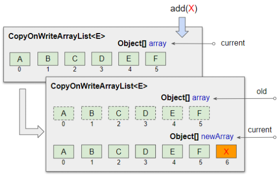

# 멀티스레드 프로그래밍

- OS에 의존적인 프로그래밍
- OS의 여러 작업을 스케줄링 해달라는 프로그래밍
- C언어로 멀티스레드 프로그래밍을 하는것은 쉽지않지만 Java는 API나 JVM이 작업을 어느정도 대신해줌
- 멀티스레드 프로그래밍은 상속을 통해서 구현을 편하게 할 수 있다

<BR>

# 프로세스
  - 실행중인 프로그램/파일/애플리케이션 <BR>(수행이 시작되면 프로세스가 됨. 수행이 해제되면 프로세스 상태에서 해제됨)
  - 자원(resources)과 스레드로 구성


## 멀티 프로세스
    - 실행 중인 프로그램이 2개 이상인 것
    - 프로그램 단위의 멀티 태스킹
    - OS가 해주는 작업


<BR>

# 멀티 태스킹
    - 두 가지 이상의 작업을 동시에 처리하는 것

<BR>

# 스레드
  - 프로세스 내에서 코드의 실행 흐름
  - 프로세스 내에서 실제 작업을 수행함
  - 모든 프로세스는 하나 이상의 스레드를 가지고 있음


- 메인 스레드
  - 자바 프로그램은 메인 스레드가 기동되면서 시작됨
  - 자식 스레드의 부모
  - 메인 스레드 내에서 또 다른 스레드를 기동시키면 추가로 기동되는 스레드는 `자식 스레드(작업 스레드)`
  - 메인 스레드는 내부에 기동할 것이 없더라도 자식 스레드가 기동되면 자식 스레드가 끝날 때까지 기다렸다가 종료됨


- 스레드를 여러개 기동시키면 각각의 역할을 병렬적으로 기동시킴


- CPU가 하나이면 어느시점에서 CPU가 얘네를 기동시킬 수 있는 능력은 하나이고, CPU 입장에서 하나만 처리할 수 있다
  - 하지만 프로그램이 항상 CPU만 사용하는 것도 아니고 대기상태 등도 존재한다
  - 이러한 경우 CPU가 다른 스레드에 의해 기동될 수 있는 기회를 주기도 한다
  - 최근에는 멀티코어(CPU가 여러개)가 등장하였으므로 각각의 코어가 스레드들을 담당하여 처리해주므로 멀티스레드 프로그램을 구현했을 때 수행성능이 더욱 좋아진다


## 멀티 스레드
  - 두 개의 코드 실행 흐름. 두 가지 이상의 작업을 처리
  - 프로그램 내부에서의 멀티 태스킹


- 스레드가 여러개 일 때에는 수행 효율이 높다
- 방 청소를 하더라도 한 명이서 하는 것보다 여러명이서 분업하면 작업 효율이 높고 빠르게 일을 처리할 수 있는것과 같은 이치이다
- 대표적으로 `브라우저` 내부에서 여러 스레드들이 기동된다


<BR>


# 프로세스 & 스레드의 관계

- `프로세스: 스레드 = 공장 :일꾼`
- 최소한 하나의 스레드가 있어야 프로세스가 된다.


- 싱글 스레드 프로세스
  - 공장 하나 지어놓고 일꾼이 1명 인것


- 멀티 스레드 포르세스
  - 공장 하나 지어놓고 내부에 여러 일꾼이 일하는 것


<BR>

## 프로세스를 늘릴까? 스레드를 늘릴까?


- 하나의 프로세스를 새로 생성하는 것보다 하나의 새로운 스레드를 생성하는 것이 비용이 적게 든다
  <BR>(공장 짓는 비용보다 노동비가 더 저렴하다)


- CPU가 여러 프로세스를 각각 수행시켜주는 것(Round-robin scheduling / CONTEXT SWITCHING)보다 하나의 프로세스를 수행시키는 것이 더 효율적이다
<BR> 

- 프로세스를 왔다갔다 하는 것보다 스레드를 왔다갔다하는 것이 더 성능이 좋다


- 결론: <B>멀티 스레드 프로그래밍이 다중 처리 방식에 있어 성능이 좋다!</B>

<BR>


# 멀티 스레드로 개발해보자 (작업 순서)

1. 기동시킬 각 스레드들의 기능을 파악
- 똑같은 기능을 여러개 띄울 것인가? 각각의 기능을 여러개 띄울 것인가? 파악
  - 똑같은 기능을 여러개 띄우려면 스레드 클래스 1개만.
  - 각각의 기능이 5개 필요한 경우 스레드 클래스는 5개가 필요함


2. 기동시킬 기능만큼의 스레드 클래스 생성

- java.lang.Thread를 상속하여 수행시키고자 하는 기능을 Run() 메서드를 오버라이딩 하여 구현
- 스레드 클래스 내에 작업 수행 및 중단등의 기능이 모두 포함되어 있음
- Runnable이라는 인터페이스를 구현해서 만들 수도 있음 (자바의 약점인 다중상속 극복)


<br>

# 스레드 개발 방법

1. Thread 클래스를 상속

- 조성이 가지는 메서드를 얼마든지 가져다 쓸 수 있음

```JAVA
class MyThread extends Thread{
    public void run(){
        /* 작업 내용 */ 
        // Thread 클래스의 run()을 오버라이딩
    }
}

class Ex{
  public static void main(String[] args) {
    MyThread myt = new MyThread();
    myt.start();
  }
}
```

<br>


2. Runnable 인터페이스를 구현

- 스레드의 기능을 구현
  - 스레드의 기능을 이 클래스가 가지게끔 하는 것뿐임 (이것 자체가 스레드가 아님)


```java
class MyThread implements Runnable{
    public void run(){
        /* 작업 내용 */
        // Runnable 인터페이스의 추상메서드 run()을 구현
    }
}


class Ex{
  public static void main(String[] args) {
    MyThread myt = new MyThread();
    Thread t = new Thread(myt);  // 스레드 클래스의 객체를 추가 생성해야 함 (runnable을 구현하고 있는 생성자 전달)
    myt.start();
  }
}
```

<br>


# 싱글스레드 VS 멀티스레드


- A기능 수행하고 B기능을 수행하는 프로그램이 있다고 가정

## 싱글스레드

- A기능을 수행하는 동안 사용자 입력을 기다림
- B기능은 A기능이 끝나야 수행됨


## 멀티스레드

- A기능하는 스레드, B기능하는 스레드가 따로있음
- 입력을 기다리는 동안 B기능을 수행함 (전체적인 수행효율이 높음)
- A가 꼭 끝난다음 B가 수행되어야 한다면 멀티스레드로 구현하면 안됨! (각자 수행해도 될 경우에 멀티스레드 이용)

<br>


# [ThreadEx01](ThreadEx01.java)

- 이 프로그램은 3개의 스레드로 구현됨 (Main 스레드 2개 + 스레드 1개)
- Time slice & Round Robin은 동일
- 스레드 기동시 자동으로 이름이 부여됨
  <BR>(Thread-0, Thread-1, Thread-2,...)
  <br>(메인 스레드의 default name은 Main임)


- run() 메서드
  - 스레드의 기능을 구현하는 메서드
  - 접근제어자가 public -> 오버라이딩시에도 반드시 public 설정해야함<br>(접근제어자가 더 축소되면 안됨!)
  

## 오버라이딩시 지켜야할 규칙
  - 조상의 메서드의 오버라이딩시 조상이 가지고 있는 메서드의 throws절을 자손에서도 똑같은 예외에 대해 throws할 수 있고 안할수도있음
  - 다만 조상이 throws절을 가지고 있지않으면 자손에서 throws절을 추가할 수 없음
  - 조상이 가지는 run()메서드는 throws절이 없으므로 run()메서드 내에서 예외처리를 해야하는 경우가 발생하는데 throws절로 예외처리할 수 없고 반드시 `try-catch 구문`을 이용해야함
- <b>조상이 throws하고 있는 예외보다 더 많은 범위의 예외를 throws할 수 없다!!!!</b>
<br>(조상 예외가 더 범위가 크다!!!)

- Thraed.sleep할 경우에도 throws가 아닌 try-catch를 해야한다!


<br>

# 예제

- 두 예제가 한 묶음


-  [ThreadEx02](ThreadEx02.java)
    - 자식 스레드를 기동시키면 자식 스레드에 대한 콜스택에 각각 생성됨

- [ThreadEx03](ThreadEx03.java)


<br>

# 예제

- 두 예제가 한 묶음

-  [ThreadEx04](ThreadEx04.java)
-  [ThreadEx05](ThreadEx05.java)
    - 병렬적으로 두가지 작업 수행


<BR>


# 단일스레드 vs 멀티스레드 예제

- [ThreadEx06](ThreadEx06.java)
  - 메인 스레드 하나로만 동작함 (단일 스레드)


- [ThreadEx07](ThreadEx07.java)
  - 멀티 스레드
  - 부모에서 입력 & 자식 스레드에서 10~1을 출력하도록 병렬적으로 처리
  - 자식 스레드는 별개로 10~1을 병렬적으로 출력함


<br>

# 예제

- [ThreadEx08](ThreadEx08.java)
  - 스레드 개수: 4개 (메인, A,B,C)
  - 객체 생성시 이름을 부여하면 그 이름대로 기동됨 => 부여하지 않으면 JVM이 자동으로 이름 부여
  - 스케줄링이 어떻게 되느냐에 따라 출력결과가 다름 (수행할때마다 출력결과가 똑같다고 보장할 수 없음)
  - 메인 스레드가 자기에게 주어진 기능을 모두 수행하면 원래는 메인 메서드 수행을 끝내면 메인 메서드는 끝난다.
    - 하지만 여기서는 메인 메서드의 코드를 모두 수행했음에도 종료되지 않고 자식 스레드가 다 끝날때까지 대기하고 있다.
    - 기본적으로 메인 스레드는 자기가 기동시킨 자식스레드가 끝날때까지 기다리고 있다가 다 끝나면 비로소 메인 스레드가 종료된다.

<br>

- [ThreadEx09](ThreadEx09.java)

    - 자식 스레드가 다 끝나고 나서 메인 스레드의 기능이 수행되게 하고 싶은 경우 어떻게 하면 될까?
      - join() 메서드를 이용하자 
      - `threadA.join()` : A가 끝나고 나서 메인 스레드의 기능이 수행됨

<br>

# 예제

## [ThreadEx10](ThreadEx10.java)

- 스레드의 상태를 점검해보는 예제


- start 
  - 스레드를 기동시키는 메서드


- 스레드를 종료시키는 메서드 
  - 없음. 스레드 스스로 종료될 수 있게 구현해야 함 (stop 메서드는 사라짐)
  - 사용하던 자원을 반납하는 등의 작업을 수행한 후에 종료할 수 있게 구현해야 함

<br>

# 스레드 상태

- 하나의 스레드가 기동되면 그 스레드는 CPU에 의해 수행상태일수도 있고, 잠시 대기하는 상태일 수도 있다
- 기동된 스레드가 현재 어떤 상황인지를 알리는 것을 `스레드 상태`라 한다
- 실행 상태와 대기 상태를 반복하며 run()메서드의 모든 코드를 수행하고나면 자동으로 종료됨

## 1. 실행 대기 상태 (runnable (ready))

- 실행 중이지 않은 상태
- 대기 큐에서 실행을 기다리고 있는 상태

- JVM이 여러 스레드들을 돌아가며 수행할 수 있게끔 CPU 권한을 부여하는데
기동된 스레드들을 돌아가는 큐에 담아놓고 수행을 시킴
<BR>=> 1초동안 쉬는 경우 큐에서 제외시킴
<BR>=> 쉰다고 안했고 일을 계속할 것인데, 내 권한이 끝났을 경우 => RUNNABLE 상태
<BR>=> SLEEP을 끝냄

### 실행 대기 상태로 만드는 - yield() 메서드

## 2. 실행 상태 (running)

- CPU 스케줄링에 따라 CPU를 점유하고 run() 메서드를 실행
- 스케줄링에 의해 다시 실행 대기 상태로 돌아갔다가 다른 스레드가 실행 상태 반복

## 3. 종료 상태

- 실행 상태에서 run() 메서드가 종료되어 실행할 코드 없이 스레드의 실행을 멈춘 상태

## 4. 일시 정지 상태

- 실행 중이지 않은 상태
- 스레드가 실행할 수 없는 상태
- 스레드가 다시 실행 상태로 가기 위해서는 일시 정지 상태에서 실행 대기 상태로 가야 함


### 일시정지 상태로 만드는 - Thread 클래스의 sleep() 메서드

- 실행 중인 스레드를 일정 시간 멈추게 함
- 매가값 단위: milsec(1/1000)

### 일시정지 상태로 만드는 - join() 메서드

### 일시정지 상태로 만드는 - wait() 메서드


## [ThreadEx11](ThreadEx11.java)
## [ThreadEx12](ThreadEx12.java)
## [ThreadEx13](ThreadEx13.java)

- 스레드를 종료시킬 때에는 스레드 스스로 종료될 수 있게끔 조건을 주어야 함
<br>(stop 변수와 같은 변수를 이용)

# stop() 메서드 

- 안전하게 스레드 종료

- 스레드를 안전하게 종료하려면 사용하던 리소스(파일, 네트워크 연결)를 정리하고 run() 메서드를 빨리
종료해야함

- while문으로 반복 실행시 조건을 이용해서 run() 메서드 종료를 유도함


<br>

# 예제

## [ThreadEx14](ThreadEx14.java)

- 자식 스레드의 run() 메서드 내에서는 Thread.interrupted 메서드를 호출시 Thread가 interrupt 메서드에 의해서 interrupt 메서드 신호가 호출된 상태라면 Thread.interrupted가 true가 됨
- 스레드의 스케줄링은 항상 running인것이 아니라 not running , ready 상태를 거쳐서 처리됨


<br>


# 데몬 스레드 예제

## [ThreadEx15](ThreadEx15.java)

- 다른 스레드들의 도우미 역할을 하는 스레드를 만들 수 있다


- 기동시키전에 데몬화를 시켜야함. 기동하고나서는 데몬화를 시킬 수 없다


# 데몬 프로세스

- 다른 프로세스의 서포트 역할

- 윈도우즈OS에서는 서비스에서 불리는 프로그램이 리눅스상에서는 데몬 프로세스에 해당됨
- 윈도우즈OS가 처음 기동되면 이러 프로그램이 자동 기동됨 
<BR>=> 이들을 서비스라함 (시스템이 기동될 떄 자동으로 기동되는 프로그램)
<BR>=> 이들 중 다른 프로세스의 서포트 역할을 하는 프로세스가 존재함

# 데몬 스레드

- 주 스레드의 작업을 돕는 `보조적인 역할을 수행하는 스레드`
- 주 스레드가 종료되면 데몬 스레드도 따라서 자동 종료
  <BR>(메인스레드가 없다면 데몬 스레드가 불필요)
- EX) 워드프로세서의 자동 저장, 미디어 플레이어의 동영상 및 음악 재생, 가비지 컬렉터

- 주 스레드가 데몬이 될 스레드의 `setDemon(true)`를 호출

<br>

# 동기화하지 않은 예제

## [ThreadEx18](ThreadEx18.java)

- 화장실에서 누군가가 볼일을 보고 있다면 기다리는 작업이 필요함
- 하나의 스레드만 가지고 있었다면 (내 방에 화장실이 있는경우)크게 문제가 없었을 것이나 
다섯개의 스레드가 동시에 opendoor를 호출한다는 문제점(5명이 동시에 공용화장실을 열려고함)이 있다

- 호출이 끝날때까지 기다리게끔 만드려면 Washroom 메서드를 `동기화`시켜서 이 메서드가 수행되는 동안
다른 메서드를 호출하지 못하게 만들자.

# 동기화한 예제

## [ThreadEx18_Sync](ThreadEx18_Sync.java)

- 메서드에 `synchronized`키워드를 설정 (해당 키워드는 멤버에는 붙일 수 없고 메서드에 붙일 수 있다.)

- 메서드 수행시점 기준 하나의 스레드만 수행하는 것을 보장함


<br>

# 동기화 메서드와 블록

- 스레드 작업이 끝날 때까지 객체에 잠금을 걸어서 스레드가 사용 중인 객체를 다른 스레드가 변경할 수 없게 만들 수 있다


## 동기화 메서드 및 블록을 선언하는 방법

- 인스턴스와 정적 메서드에 `synchronized`키워드를 붙이면 됨
- 동기화 메서드를 실행하는 즉시 객체는 잠금이 일어나고, 메서드 실행이 끝나면 잠금이 풀림
- 메서드 일부 영역 실행 시 객체 잠금을 걸고 싶다면 동기화 블록을 만들면 됨
- `synchronized`가 부여되어 있는 모든 메서드들은 그 중 하나를 호출하더라도 나머지 모두가 잠기는 효과가 발생함


<br>

# 동기화된 컬렉션

- Collection API는 기본적으로 동기화를 지원하지 않음


- 두 개 이상의 스레드가 하나의 컬렉션 객체를 공유해서 사용할 수 있다
  - 이 경우 두 스레드가 하나의 컬렉션 객체에 데이터를 경쟁잭으로 넣는다면 어느 순간
  데이터 손실이 발생할 수 있다. 
  - 그렇다면 한 스레드가 접근할 때 다른 스레드는 대기하게끔 만드는게 좋을 것이다.
  - 컬렉션 객체는 우리가 만든 API가 아니므로 다른 방법을 이용해서 동기화를 한다.


## 컬렉션 동기화하는 방법

- Vector 이용 
  <BR>(ArrayList의 올드 버전)
  <BR> (무조건 동기화를 하므로 속도가 느림)


- StringBuffer 
<BR>(문자열을 편집할 때 사용. String 객체는 한번 만들어지면 변경을 할 수 없는데, 문자열에 대한 편집 작업이 많을 경우 StringBuffer 이용함)
<BR> (무조건 동기화를 하므로 속도가 느림)
<BR> (동기화가 필요없을 경우 StringBuilder 이용)


- Collections의 synchronizedXXX() 메서드

### Collections synchronized 

- 비동기화 상태인 각종 컬렉션 객체를 포장해서 동기화 기능을 부여 해줌


#### Collections synchronized 하지 않은 예제 - [ThreadEx19.java](ThreadEx19.java)

- 손실되는 케이스가 발생


#### Collections synchronized 수행한 예제 - [ThreadEx19_sync1](ThreadEx19_sync1.java)

#### Collections synchronized 수행한 예제 - [ThreadEx19_sync2](ThreadEx19_sync2.java)


# Collections.synchronizedList(List 객체) & CopyOnWriteArrayList<>()



- read 작업량 < write 작업량 : SynchronizedList 유리
- read 작업량 > write 작업량 : CopyOnWriteList 유리

- SynchronizedList는 get 작업에서도 락이 걸리기때문에 멀티 쓰레드 환경에서 조회가 많은 작업일 경우에는 오버헤드가 더 크다. CopyOnWriteList는 set, add 과정에서 데이터를 복제후 설정하는 방식으로 사용하기때문에 추가적인 오버헤드가 발생한다. 
- 따라서 멀티스레드 환경에서 어떤 작업이 주로 수행되는가에 따라 사용될 리스트를 선택해야 한다.


<br>


# 람다

- 자바에서도 함수형 프로그래밍이 가능하게 만들어줌


- 함수형 프로그래밍
  - 함수를 정의하고 이 함수를 데이터 처리부로 보내 데이터를 처리하는 기법
  - 함수를 일반 데이터처럼 다루는 기법
  - 함수를 호출하면서 내가 원하는 기능에 함수를 전달해서 원하는대로 결과를 얻어낼 수 있음


## 람다식
  - 메서드 정의를 하나의 식으로 표현한 것
  - 자바에서 함수적 프로그래밍 지원 기법으로서 `익명 클래스 객체`가 됨 (익명 클래스가 되는것이 아니다)

```java
/* 오버라이딩 해야하는 것 */
interface Sample{
    int calc(int n);
}

/* pr메서드의 인자가될 자격을 갖춤 */
class SampleImpl implements Sample{
    // 인터페이스 구현이 주 목적이라면 뒤에 Impl을 붙여주자
    public int calc(int n){
        return n+1;
    }
}

Sample obj = new SampleImpl();
MyTest.pr(obj);


class MyTest{
    static void pr(Sample p){
        p.calc(10);
    }
}

/* 익명 내부 클래스 - 꼭 기억할 것. 가장 많이 쓰임 */
// 메서드 호출시점에서 익명 클래스를 만들어서 처리하고 싶을 경우
// 전달해야하는 타입(지금은 인터페이스)과 new 객체생성식을 쓰고 중간에 전달할 값을 기재
// 익명 내부 클래스는 클래스 파일이 만들어질 때 -> outerclass$1, outerclass$2, ... 처럼 익명 클래스가 정의 되는 순서대로 숫자가 붙음
// 람다식으로 MyTest.pr 얘를 대신하는 식을 만드는 것이다
// 람다식은 전달받을 매개변수만 지정함
MyTest.pr(new Sample() {
    public int calc(int n){
        return n+10;    
    }    
});

```
- 오버라이딩 해야할 메서드가 하나이면 람다식으로 대신할 수 있음
  - 오버라이딩 해야할 메서드를 함수처럼 취급함 (여기서는 인터페이스)


```java
/* 위의 내용을 람다식으로 대신한 것 */
// 람다식은 전달받은 매개변수만 지정함

MyTest.pr((int n) -> {return n+100});
MyTest.pr((n) -> {return n+100;});
MyTest.pr(n -> {return n+100;});
MyTest.pr(n -> n+100);
```

- 전달해야할 객체가 인터페이스이고 내부에 정의된 메서드가 1개일 때 람다식을 사용하는것이 좋다.
- 자바스크립트의 화살표함수를 떠올리면 이해하기가 쉽다
- 매개변수 지정시 타입을 생략하고 변수명만 줘도 됨 (개수만 맞으면 됨)
  - n이 어떤 타입을 갖는지 오버라이딩한 메서드를 보면 알 수 있다

- 매개변수 한개일 때에만 괄호를 생략할 수 있다 (0개,2개,3개, ... ,n개 일떄에는 괄호 생략 불가)

- 수행코드가 하나의 문장인 경우에 한해서 블록을 해제할 수 있고, 리턴문도 해제할 수 있다


- 람다 함수 사용식

```java
(매개변수 -> {호출시 수행하는 코드})
```


<br>

# 함수형 인터페이스

- 추상 메서드를 하나만 가지고 있는 인터페이스
- 람다식으로 만들 수 있는 객체는 인터페이스야하고 추상 메서드가 반드시 하나여야 함
  <br>(default, static 메서드는 더 있어도 무관. 추상 메서드는 반드시 1개여야 함)


## 인터페이스를 람다식으로 바꿔보자

- 예제 1

```java
// 인터페이스
public interface Runnable{
    void run();
}

// 람다식
() -> { ... }
```


- 예제 2

```java
// 인터페이스
@FunctionalInterface 
// 컴파일러에게 오버라이딩 하고 있으니 오버라이딩이 제대로 되는지 확인 하라고 하는 것
// annotation을 붙여서 인터페이스를 만들면 함수형 인터페이스로서의 자격을 가지는지(추상 메서드가 1개인지) 확인하라는 것
// 추상 메서드가 1개이면 에러안남. 0개나 2개 이상일 경우 에러 발생
public interface Calculable{
    void calculate(int x, int y);
    // @가 안붙어도 메서드가 1개이면 에러 안남.
}


// 람다식
(x,y) -> { ... }
```

- 인터페이스가 함수형 인터페이스임을 보장하기 위해서는 `@FunctionalInterface`를 붙임
  - 컴파일 과정에서 추상 메서드가 1개인지 검사해서 정확한 함수형 인터페이스를 작성할 수 있게 도와줌


<br>

# 매개변수가 없는 람다식

- 함수형 인터페이스의 추상 메서드에 매개변수가 없는 경우임
- 실행문이 두 개 이상일 경우에는 중괄호를 생략할 수 없고, 하나일 경우에만 생략할 수 있음

```java
() -> {
    실행문;
    실행문;
}
```


```java
// 실행문 하나 -> 중괄호 생략 가능
() -> 실행문
```


<br>

# 매개변수가 있는 람다식

- 매개변수 선언시 타입 생략 가능

```java
(타입 매개변수, ... ) -> {
    실행문;
    실행문;
}
```

```java
(매개변수, ...) -> {
    실행문;
    실행문;
}
```

<br>

# 리턴값이 있는 람다식

- 함수형 인터페이스의 추상 메서드에 리턴 값이 있는 경우
- return문이 하나만 있는 경우에는 중괄호와 함께 return 키워드를 생략할 수 있음
- 리턴값은 연산식 또는 리턴값이 있는 메서드의 호출식으로도 대체 가능함

```java
(매개변수, ...) -> {
    실행문;
    return 값;
}
```

```java
(매개변수, ...) -> 값
```


<br>

# 메서드 참조

- 메서드를 참조해서 매개변수의 정보 및 리턴 타입을 알아내어 람다식에서 불필요한 매개변수를 제거

```java
(left, right) -> Math.max(left, right);
```


<br>

# 예제

## [LambdaTest1.java](./LambdaTest1.java)
## [LambdaTest2.java](./LambdaTest2.java)
## [LambdaTest3.java](./LambdaTest3.java)

- 객체를 변수에 담아서 여러번 사용하는 것은 anonymous inner local class, 람다식 또한 가능하다

- [내부 클래스 참고자료](http://www.tcpschool.com/java/java_usingClass_innerClass)

## [LambdaTest4.java](./LambdaTest4.java)

- 추상메서드가 2개이므로 람다식 이용불가

- anonymous inner local class를 이용하여 객체 생성


<br>

## [LambdaTest5.java](./LambdaTest5.java)
