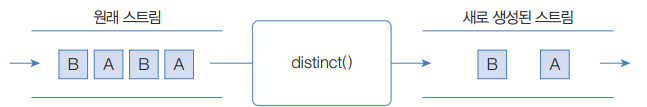

# 람다

## 예제 - [LambdaTest6.java](./LambdaTest6.java)

### 메서드 참조

```java
(left, right) -> Math.max(left, right);
```

- 메서드를 참조하여 매개변수의 정보 및 리턴 타입을 알아내어 불필요한 매개변수를 제거

<br>

#### 정적 메서드와 인스턴스 메서드 참조

- 람다식에서 정적 메서드를 참조할 경우 클래스명 뒤에 `::`기호를 붙이고 정적 메서드명을 기재

```java
클래스 :: 메서드
```

<br>

- 인스턴스 메서드일 경우 객체를 생성한 다음 참조 변수 뒤에 `::`기호를 붙이고 인스턴스 메서드명을 기재

```java
참조변수 :: 메서드
```

<br>

####  생성자 참조

- 객체를 생성하는 것
- 람다식이 단순히 객체를 생성하고 리턴하도록 구성되면 람다식을 생성자 참조로 바꿀 수 있음

```java
(a,b) -> { return new 클래스(a,b) };
```

<br>

- 클래스명 뒤에 `::` 기호를 붙이고 new 연산자를 기술

```java
클래스 :: new
```

- 만약에 생성자가 오버로딩되어 여러 개가 있을 경우, 컴파일러는 함수형 인터페이스의 추상 메서드가 
동일한 매개변수 타입과 개수를 가지고 있는 생성자를 찾아 호출함
<br> (해당 생성자가 존재하지 않으면 컴파일 에러 발생)


<br>


## 예제 - [LambdaTest7.java](./LambdaTest7.java)

- 메서드 호출식만으로도 람다식을 대신할 수 있다


## 예제 - [LambdaTest8.java](./LambdaTest8.java)


## 예제 - [LambdaTest9.java](./LambdaTest9.java)

## 예제 - [LambdaTest10.java](./LambdaTest10.java)

- 구현해야하는 메서드의 사양부터 체크할 것

<br>

## 예제 - [LambdaTest11.java](./LambdaTest11.java)

- Comparable을 상속하지 않으면 두번쨰 인자로 Comparator 객체를 만들어서 전달해야함
  - Comparator 객체가 없다면 내부의 compareTo메서드를 호출하겠다는 뜻


### 매개변수의 메서드 참조

- 람다식으로 제공되는 a 매개변수의 메서드를 호출할 때 b 매개변수를 매개값으로 사용

```java
(a,b) -> { a.instanceMethod(b) };
// 첫번째 인자.메서드(두번쨰 인자)
// 클래스 :: 메서드명으로 대신할 수 있음
```

- a 클래스명 뒤에 `::` 기호를 붙이고 이름을 기술
```java
클래스 :: instanceMethod

String :: compareToIgnoreCase
```

<br>

## 예제 - [LambdaTest12.java](./LambdaTest12.java)

- functional interface를 제네릭 타입으로 만들 수 있음


<br>

# 17. 스트림

- 대용량 데이터 처리를 위해 추가됨

- Java 8부터 Stream API가 추가됨


# I/O Stream


- 자바 프로그램이 수행하는데 있어 필요한 것을 외부로부터 읽거나 내보냄
- byte stream, 문자 stream 등을 이용
- I/O의 타겟 장치는 표준입출력 장치 (Standard I/O)
- readLine은 네트워크에서 오는 애들을 읽을 때 개행문자가 인식되지 않으면 입력이 안된것으로 보므로
개행문자가 나타날 떄까지 계속 읽음
- readLine으로 읽으면 내보낼 때에는 println을 이용해야함 (개행문자 포함하므로)


<br>

# Java8에서 추가된 Stream


- 컬렉션/배열 (데이터가 여러개 들어감)등에 저장된 요소들을 하나씩 참조하면서 코드를 실행할 수 있는 기능
- Java 8부터 컬렉션 및 배열의 요소를 반복 처리하기 위해 스트림을 사용함
<br> (스트림 -> 데이터의 흐름)


- 스트림 사용시 반복문을 사용하지 않고도 컬렉션/배열이 가지는 요소들에 접근 가능
- 이때 수행하고 싶은/처리하는 기능은 람다식(함수)으로 만들어서 전달함 

- 무엇을 할것인지는 람다식으로 전달

```java
Stream <String> stream = list.stream();
stream.forEach( item -> /* item 처리*/ );
```
- List 컬렉션의 stream() 메소드로 Stream 객체를 얻고, forEach() 메소드로 요소를 어떻게 처리할지 람다식으로 제공하여 처리한다.


- Java8부터 새로이 추가된 java.util.stream 패키지에는 여러 Stream API들이 포함되어 있음


<br>

## 스트림 객체가 가지는 메서드

- 전달된 람다식에 기반하여 수행함
- 함수형 인터페이스를 인자값으로 갖는 경우가 많다


<br>

# 스트림 이용요약

- 스트림객체에서 제공하는 메서드를 이용하여 각각이 동일한 동작을 수행하게 함


- `map` -> 스트림 객체가 가지는 요소들에 대해 변화되는 작업을 수행해서 내보냄
- 변환한 다음 `forEach` 메서드를 이용하여 스트림 객체가 가지는 요소에 대해 반복처리 작업 수행
- `System.out::println` -> 내보냄

<br>

# 스트림의 특징

- 스트림이라는 객체를 통해 일관성 있게 처리할 수 있음
- 자료의 대상과 관계없이 동일한 연산을 수행할 수 있음
- ArrayList, LinkedList, HashSet등은 iterator 객체를 만들어서 쓸 수 있음
<br> => 스트림 객체도 스트림 객체를 통해 Collection 데이터들을 다룰 수 있음
<br> => 스트림이 제공하는 여러 메서드와 매커니즘을 이용하여 데이터의 종류의 관계없이 일관성 있게 처리할 수 있음


- 한 번 만들어진 스트림은 재사용될 수 없음 (일회성)


- 스트림 연산은 기존의 자료를 변경하지 않고, 새로운 메모리 위에서 동작함


- 중간연산을 담당하는 메서드와 과 최종 연산을 담당하는 메서드가 구분되어, 최종 연산이 수행된 이후 모든 연산이 적용되는 `지연연산`을 지원함

## 지연연산

- lazy execution. 게으른 수행

- 점(.)과 어떤 메서드를 호출하면 뭐가 호출되었는지 그때그때 보는게 아닌 전체를 살펴보고 효율적인 수행방식을 결정
- 빅데이터 처리를 위해 생성된 API들은 대부분 지연연산을 도입함


<br>

# 외부 반복자 & 내부 반복자


## 외부 반복자

- 일반적으로 사용하는 루프처럼 요소를 사용하는 쪽에서 직접 컬렉션 요소를 하나씩 꺼내 와서 반복 처리
- 기존의 for문을 사용하는 것

<br>

## 내부 반복자

- 처리할 행동(보통 콜백 함수)을 컬렉션 요소에 넘겨주어 반복 처리
- 내부에서 알아서 처리함
- 외부 반복자보다 성능이 뛰어나다


- 스트림을 쓰는 것은 내부 반복자
- 요소 처리 방법을 컬렉션 내부로 주입시켜서 요소를 반복 처리
  
- 개발자 코드에서 제공한 데이터 처리 코드(람다식)를 가지고 컬렉션 내부에서 
요소를 반복 처리 내부 반복자는 멀티 코어 CPU를 최대한 활용하기 위해 요소들을 분배 시켜 병렬 작업 가능


### 내부 반복자의 특징

- 내부 반복자이므로 처리 속도가 빠르고 병렬 처리에 효율적
- 람다식으로 다양한 요소 처리를 정의
- 중간 처리와 최종 처리를 수행하도록 파이프 라인 형성
- 내부 반복자의 이점은 어떻게 요소를 반복시킬 것인가는 컬렉션에 맡겨두고,
  개발자는 요소 처리 코드에만 집중
- 요소들의 반복 순서를 변경하거나, 멀티 코어 CPU를 최대한 활용하기 위해 요소들을 분배시켜
  병렬 작업을 할 수 있게 도와줌

```java
/* 스트림 사용 X */
List <String> list = Arrays.asList("A", "B", "C", "D"); // 스트림 사용 X
        
Iterator<String> iter = list.iterator();
while(iter.hasNext()){
    String name = iter.next();
    System.out.println(name);
}
```

- 데이터가 많을수록 스트림을 사용하는것이 효율적이다

```java
/* 스트림 사용 O */
Stream<String> stream = list.stream();
list.stream().forEach(name -> System.out.println(name));
```


<br>

# 스트림 파이프라인

- 컬렉션의 오리지널 스트림 뒤에 필터링 중간 스트림이 연결될 수 있고, 그 뒤에 매핑 중간 스트림이 연결될 수 있음

- 최종처리 메서드는 필수로 호출해야 함
<br> (forEach, count, ...)


- 중간 스트림
  - 메서드 호출에 의해 중간중간 불러와지는 것들
  - 필터링, 매핑 등은 중간 연산
  - 최종연산에 해당되는 것을 호출하고 나면 스트림 구조를 유지하지 않음
  - 최종 연산처리하는 메서드를 중간에서 호출하면 더 이상 스트림 구조가 유지되지 않으므로 주의할것
  <br>(최종 연산에 해당되는 메서드는 마지막에 호출할 것!)


## 스트림 파이프라인 예제

```bash
명렁1 | 명령2 | 명령3   ...
# 명령1의 실행결과를 명령2에게, 명령2의 실행결과를 명령3에...
# 계속해서 다음 명령에게 이전 명령의 결과를 넘겨줌


pr -ef | more
# ps -ef : 모든 프로세스 정보 출력 -> 그냥 실행시 한페이지에 정보가 나오는게 아니라 화면이 넘어감
# | : 파이프 기호. Windows에서는 지원하지 않음 (앞 명령의 수행 결과를 다음 명령어 넘김)
# ps -ef | more : 화면에 출력 되는 것(ps -ef의 결과)을 다음 명령인 more에 넘겨줌

ls | ws -l
# ls의 결과를 받아와서 행의 개수를 세어줌. 현재 디렉토리 내 파일 개수 셈
```


- filter 메서드에 전달하는 함수(람다식)의 리턴값의 유형
  - boolean
  - true일 경우 해당 요소를 그 다음 스트림에게 넘겨줌
  - false일 경우 해당 요소는 제외됨


<br>


## 스트림 파이프라인 예제2

- 오리지널 스트림과 집계 처리 사이의 중간 스트림들은 최종 처리를 위해 요소를 걸러내거나(필터링), 요소를 변환시키거나(매핑), 정렬하는 작업을 수행
  최종 처리는 중간 처리에서 정제된 요소들을 반복하거나, 집계(카운팅, 총합, 평균) 작업을 수행


- 점수만 가지고 작업하고 싶을 경우 점수만 뽑아내면 되니까 map을 사용


<br>


# 스트림 인터페이스

- java.util.stream 패키지에는 BaseStream 인터페이스를 부모로 한 자식 인터페이스들이 제공되며
BaseStream에는 모든 스트림에서 사용할 수 있는 공통 메소드들이 정의되어 있다.

## 스트림 API


## 스트림 객체 만드는 방법


- 컬렉션 객체에는 스트림메서드가 상속되어 있음
- ArrayList로 스트림을 만드려면 ArrayList.Stream()처럼 사용하면 됨 


- Closed
  - 붙어있으면 end값 포함
  - 붙어 있지 않으면 end값 제외


- Files.lines(Path, Charset)
  - 파일의 내용을 읽어서 스트림 객체를 만들어줌
  - 두번째 인자로 UTF-8이 주어지면 메모장등을 UTF-8로 읽는다는 것


<br>


# 파일로부터 스트림 얻기

- java.nio.file.Files의 lines() 메소드로 텍스트 파일의 행 단위 스트림을 얻을 수 있음 


# 스트림의 중간 처리 메서드와 최종 처리 메서드 

- Stream은 요소에 대해 중간 처리와 최종 처리를 수행할 수 있다.


- 실수 데이터로만 구성된 스트림을 만들면 double 스트림이 생성됨

- Optional의 경우
  - 숫자형식의 스트림 객체에서만 호출할 수 있고, 그냥 호출하면 타입 떄문에 에러 발생
  - 따라서 타입에 맞는 스트림 객체를 사용하도록 하자


<br>


## 중간연산 처리 담당 메서드


- 메서드 리턴값의 유형이 Stream객체
  - 메서드를 연속적으로 이어서 호출할 수 있음 (체이닝 호출 방식)
  - 리턴결과를 변수에 담지 않아도 되니까 이어서 호출할 수 있음
  - 점(.) 연산자에 의해 최종 연산까지 구현해놓으면 전체적으로 해석을 함


- 중간 처리(매핑, 필터링, 정렬 등)는 여러 번 사용할 수 있다.

```java
stream.map(...).filter(...).distinct(...)

// map -> 람다식 전달해서 매핑규칙 준수해야함
```


### 필터링

- 요소를 걸러내는 중간 처리 기능


### distinct() 메서드

- 요소의 중복을 제거



### filter() 메서드

- 매개값으로 주어진 Predicate가 true를 리턴하는 요소만 필터링


### 매핑

- 스트림의 요소를 다른 요소로 변환하는 중간 처리 기능

#### 매핑 메서드

- mapXxx(), asDoubleStream(), asLongStream(), boxed(), flatMapXxx()


#### mapXxx() 메소드

- 요소를 다른 요소로 변환한 새로운 스트림을 리턴


```java
map(Function<T,R>)
// 전달받은 애를 내용만 바꿀 때 사용
```
- Function : 함수형 인터페이스
- T : 첫번쨰 타입 파라미터. 람다식이 전달받는 요소의 타입.
- R : 두번째 타입 파라미터. 리턴되는 타입.

<br>

```java
IntStream
```
- 전달받은 애를 Int형으로 바꿀 떄 사용

#### flatMapXxx() 메소드

- 하나의 요소를 복수 개의 요소들로 변환한 새로운 스트림을 리턴


### 정렬

- 요소를 오름차순 또는 내림차순으로 정렬하는 중간 처리 기능


#### Comparable 구현 객체의 정렬


<br>

## 최종연산 처리 담당 메서드


- 최종 처리(반복, 집계처리 등)는 결과 처리이므로 한 번만 사용할 수 있다.
- 최종 결과값은 하나 

- 리턴값이 Stream 객체가 아님


```java
stream.map(...).filter(...).distinct(...).collect(...) // 불가능
stream.map(...).filter(...).distinct(...).count() // 불가능 -> count는 최종연산을 담당
```

### 집계

- 리턴 결과가 NULL이라서 NullPointerException인 경우를 대비해 optional 객체로 포장해서 리턴

<br>

# 예제 - [StreamExample0.java](./StreamExample0.java)

- STREAM 사용 & 미사용

# 예제 - [StreamExample1.java](./StreamExample1.java)

- map
  - 그냥 스트림 객체를 만들 수 없음
  - map의 EntrySet을 이용해야함

# 예제 - [StreamExample2.java](./StreamExample2.java)

- 람다식을 주면 원하는 것만 출력할 수 있음

- 받은 것만 출력하기 위해서 람다식을 이용할 수 있다

```java
stream = list.stream();
stream.forEach(System.out :: println);          
```

# 예제 - [StreamExample3.java](./StreamExample3.java)

# 예제 - [StreamExample4.java](./StreamExample4.java)

# 예제 - [StreamExample5.java](./StreamExample5.java)

- 결과값이 json/dictionary 형식 
  - `key(name) : value` 꼴

- 행 단위로 읽어서 스트림 생성

## JSON (JavaScript Object Notation)

- JS의 객체 만드는 형식과 JSON 형식은 유사함<BR>
- [참고자료](https://www.json.org/json-en.html)


# 예제 - [StreamExample6.java](./StreamExample6.java)

- filter 메서드
  - 리턴값 유형이 boolean인 람다식만 지정 가능


# 예제 - [StreamExample7.java](./StreamExample7.java)

- collect : 인자를 어떤 타입으로 모을것인지를 지정해줌

# 예제 - [StreamExample8.java](./StreamExample8.java)

- distinct : 중복되는 애들을 걸러낸 결과를 내보냄


# 예제 - [StreamExample9.java](./StreamExample9.java)

<br>

# 예제 - [StreamExample12.java](./StreamExample12.java)
