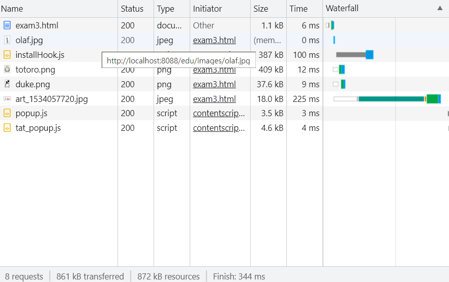

# 네트워크

## 서버

- 먼저 연결 요청을 기다리는 프로그램
- 서버 프로그램은 무엇인가를 서비스하는 역할의 프로그램
<br>(어떤 서비스를 하는지는 서버마다 다름)

### 자바상 서버 구현

#### 1. java.net.Socket

- 입력받는 것은 입력 스트림 이용
- 상대방에게 내보내는 것은 출력 스트림 이용
- 바이트 스트림만 다루므로 문자열 객체로 바꿔서 내보내는 과정을 우리가 수행해야 함

#### 2. accept()

- 클라이언트가 연결요청할 떄까지 무제한 대기
- 클라이언트가 보낸 연결 요청을 가지고 소캣객체를 가지고 가서 통신함


<br>

## 클라이언트

- 연결 요청을 수행하는 프로그램
- 서버의 서비스를 필요로 하는 프로그램
- 웹에서 클라이언트의 90%정도는 `브라우저`를 지칭
<br> (회사마다 브라우저를 대체하는 프로그램이 있는 경우도 존재)

### 자바상 클라이언트 구현

#### 1. java.net.Socket(서버주소, 포트번호)

- 소켓 객체를 직접 생성
- 서버주소와 포트번호를 가지고 직접 서버를 찾아감
- 서버주소가 잘못 되었거나 서버가 기동되어 있지 않은 상태에서 클라이언트를 테스트 하려고 하면 접속이 안됨
- 소켓 객체가 생성되었다는 것은 클라이언트와 연결이 되었다는 것임
- 서버로 부터 보내지는 입력 스트림으로, 보내고 싶은 것은 출력 스트림을 이용해서 출력함


<br>

## 네트워크 마다 다른 통신 방식


- 우리가 구현하고자 하는 네트워크 프로그래밍마다 통신방식을 정할 수 있음
- TCP 기반의 네트워크 프로그래밍에 사용할 수 있도록 ServerSocket이 자바에 갖추어져 있음
- 클라이언트와 통신하는 것은 Socket 객체임


### 1. 패킷 방식

- 문자를 주고 받는 것
- 패킷을 날리는 방식으로 통신을 하고 싶으면 UDP 프로토콜을 택해서 개발해야 함

### 2. 접속해서 통신

- 친구와 전화 통화
- 접속을 한 상태에서 통신하고 싶으면 TCP 기반의 통신을 해야 함


<br>

## bind() exception

- 이미 사용하고 있는 포트번호를 또 사용하려고 하는 것 


<br>

## http의 기본 포트 번호

- 80


<br>

## TCP/IP 예제

### [TcpIpServer.java](./TcpIpServer.java)

- 패키지화된 클래스는 패키지 디렉토리에 들어와서 실행시키면 인식을 못함
- 클래스명 앞에 패키지명까지 붙여야 공식적인 클래스명임

- cmd 창을 열고 다음과 같은 작업을 수행할 것

```bash
...생략...\Git\dktechin_TIL\out\production\week05>java day19.course.TcpIpClient
서버에 연결중입니다. 서버IP :127.0.0.1
서버로부터 받은 메시지 :[서버로부터의 공지] 어서오세용... 즐거운 목요일입니다.....
연결을 종료합니다.
연결이 종료되었습니다.
```

### [TcpIpServer3.java](./TcpIpServer3.java)

- accept 호출 후 기다리다가 연결 요청이 없으면 기다리지 않고 죽음
- 이때 `serverSocket.setSoTimeout`를 이용함

### [TcpIpServer4.java](./TcpIpServer4.java)


- cmd 창을 열고 다음과 같은 작업을 수행할 것

  - accept 되면 클라이언트에 대한 입출력 객체를 만들어서 처리한 것

```bash
...생략...\dktechin_TIL\out\production\week05>java day19.course.TcpIpClient
서버에 연결중입니다. 서버IP :127.0.0.1
서버로부터 받은 메시지 :[응대한 스레드-Thread-1]/127.0.0.1:6601님 환영합니다~~
연결을 종료합니다.
연결이 종료되었습니다.
```


### [TcpIpClient5.java](./TcpIpClient5.java)

- [TcpIpServer5.java](./TcpIpServer5.java)를 먼저 구동시켜야 함
- 그 다음 cmd창에 다음과 같이 입력할 것

```shell
... 생략 ... \Git\dktechin_TIL\out\production\week05>java day19.course.TcpIpClient5
[ 메시지 송수신 서버에 연결되었습니다. ]
안녕
하세요
ㅋㅋㅋ
```

- 결과 화면
```shell
[ 메시지 송수신 서버가 준비되었습니다. ]
[수신]안녕
[수신]하세요
[수신]ㅋㅋㅋ
```


### [TcpIpMultichatClient.java](./TcpIpMultichatClient.java)

- [TcpIpMultichatServer.java](./TcpIpMultichatServer.java)와 같이 구동


<br>

# WEB

## WWW (World Wide Web)

- 인터넷에 연결된 컴퓨터들을 통해 사람들이 정보를 공유할 수 있는 전 세계적인 정보 공간
- 인터넷에서 


- 간단히 `웹`이라 부르곤 하지만 엄연히 다른개념임 
<br> => 웹은 인터넷 상에서 동작하는 하나의 서비스일 뿐임 (ex. 전자 메일)


<br>

## 웹의 구성요소

### 1. 웹 서버

### 2. 웹 클라이언트

- 브라우저

### 3. HTTP 프로토콜 

- 웹 서버와 웹 클라이언트가 통신할 때 사용하는 통신 규약

### 4. HTML 등

<br>


## W3C

- World Wide Web Consortium
- 웹을 발전시키는 기관
- 각 나라마다 참여하는 조직이 있음
- 팀 버너스리가 W3C를 만듦

<br>

## HTML

- HTML이전: 태그
- HTML5: 태그 + API(JavaScript로 만들어짐)

### API는 왜 등장했는가?

- 웹 표준에 기반한 웹페이지 개발을 지원하기 위해 등장함


<br>


## WAS (Web Application Server)

- 웹 개발을위해 우리가 사용하는 edu 폴더를

  - WAS(Tomcat)에서는  `컨텍스트`라 함
  - 웹 개발자는 `웹 애플리케이션`이라 함


## HTTP URL 문자열

```html
http://localhost:8088/edu/htmlexam/exam().html 
// http url 이라함
```

## URI (Uniform Resource Identity)

- 실제로 서버에게 전송되는 것


```html
http://localhost:8088/edu/htmlexam/exam().html 
// http url 이라함
```


- 서버주소, 포트번호를 제외한 나머지 `/edu/htmlexam/exam().html `를 `URI`라 함
  - edu는 `context path`
  - 어떤 context에 있는 파일을 요청하는지를 결정함. 여기서는 edu라는 context를 요청한다는 것
  - 보통 context와 context path는 동일하게 간다
 

<br> 

# HTTP

## HTTP 상태코드

- HTTP 프로토콜에서 정의해놓은 응답코드

| 코드  |메시지|설명|
|:----|:---|:---|
| 200 |   |  |


<br>

##  clover.png 요청하기

```shell
http://localhost:8088/edu/images/clover.png
```


<br>


## [참고예시- 톰캣 서버 구동해야 보임](http://localhost:8088/edu/htmlexam/exam0.html)


- HTML 태그의 content(시작태그와 종료태그 사이부분) 또는 속성의 값에 의한 내용이 브라우저의 document 영역에 출력될 때(렌더링 될 때)
`block style tag`와 `inline style tag`로 나뉨

### block style tag

- 태그의 내용이 렌더링되는 영역이 그 행 끝까지 잡힘

- `div`, `header`, `footer`, `section`, `nav`, `form`, `table`, `ul`, `li`, `ol`, ...

### inline style tag

- 태그의 내용이 렌더링되는 영역이 content(시작태그와 종료태그의 사이부분)의 내용만큼 잡힘

- `a`, `img`, `input`, `span`, ...


### HTML상 개행문자, 공백 여러개

- 공백 1개로 처리
- HTML상 개행처리를 하고 싶다면 `<br>`이용

<br>

## http://localhost:8088/edu/htmlexam/exam1.html

- HTML상 Enter를 아무리 쳐도 공백은 하나로 인식함

## http://localhost:8088/edu/htmlexam/exam2.html

## http://localhost:8088/edu/htmlexam/exam3.html

- 경로를 상대경로로 작성

```html


<hr>
<br>
<br>
<br>
```

- 경로를 절대경로로 작성

```html
<br>
<!-- 다른 웹 사이트의 이미지를 가져올 때에는 프로토콜부터 작성해야하므로 절대경로로 작성 -->
```


- Network 탭



이미 렌더링되어있는 것은 다시 끌어오는것이 아니라 `캐쉬`기능을 이용함
<br>(브라우저는 캐쉬기능을 이용해서 서버에서 변경된 것이 없다면 이미 브라우저에 렌더링된 것을 그대로 보여줌)

## http://localhost:8088/edu/htmlexam/exam4.html

- 이미지로 링크를 만들고 싶으면 `<a></a>` 사이에 ``태그를 삽입

## http://localhost:8088/edu/htmlexam/exam5.html

### HTML5의 특징

- 동영상을 `<video>`만으로도 대부분 플레이할 수 있음
<br>(이전에는 ActiveX등을 이용)


### 유튜브 영상 끌어오기

- video 태그로 가져오는 것을 막아놓음
- 따라서 iframe 태그를 이용해야 함

<br>

