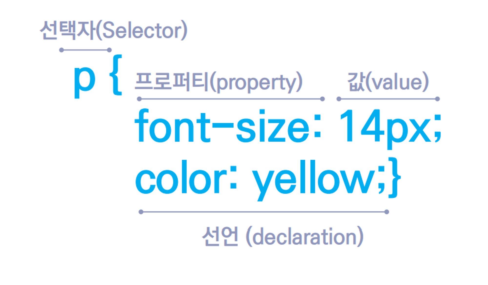
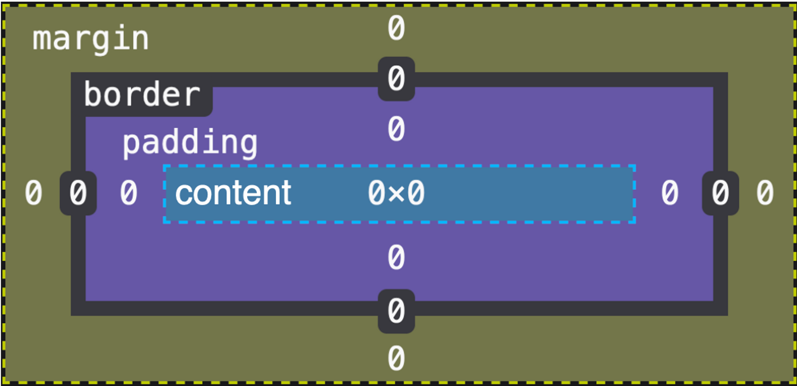
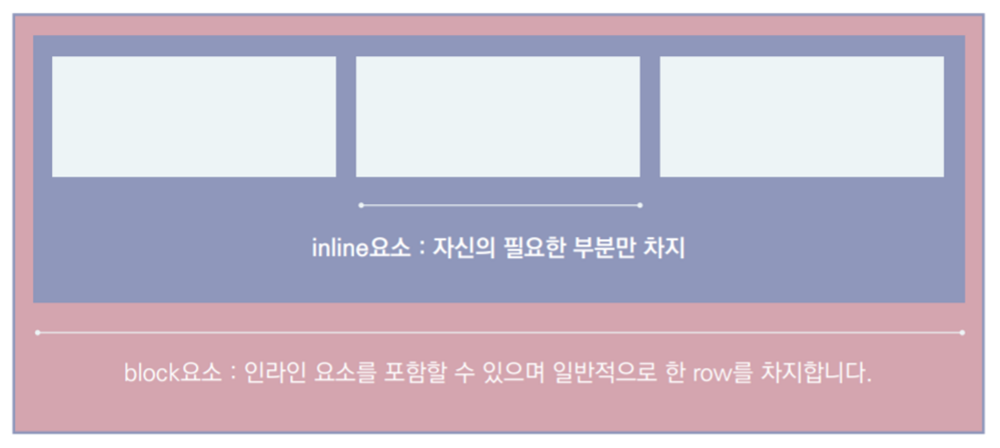
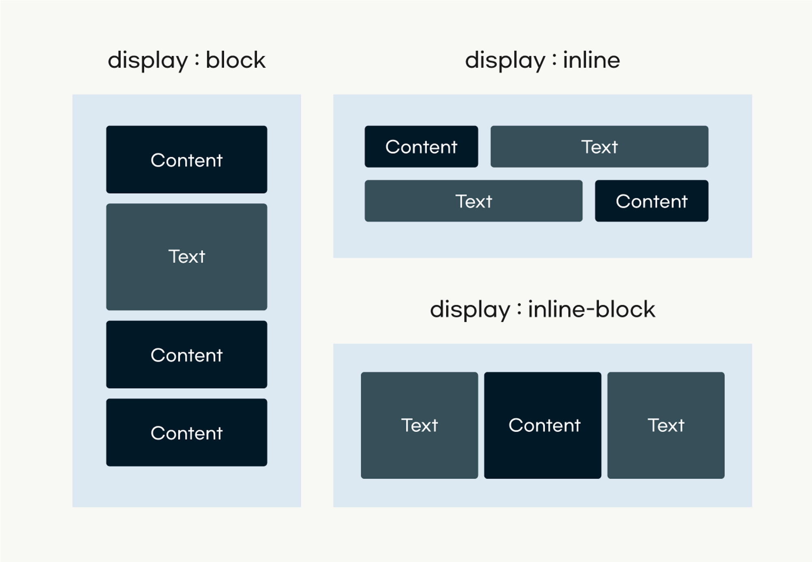

# HTML

## HTML5 태그 리스트

### Metadata Content

- 문서의 정보를 포함하여 현재 문서와 다른 문서의 관계를 설정함 
<br>(+ 나머지 내용의 표현이나 행동을 설정)
<br>(+ 분류되지 않은 정보들을 포함)

- base, link, meta, noscript, script, style, template, title, ...

#### `<!DOCTYPE html>`

- DTD(Document Type Definition)이라 부름
- 문서의 타입에 대한 정보를 제공함
- 제거하면 브라우저는 쿼크모드(하위 호환성 모드)로 html을 랜더링하게 됨
<br>(쿼크모드는 브라우저마다 구현 방식이 달라 다르게 동작할 가능성이 있으므로 반드시 최상단에 선언해야 함)

#### `<html>`

- document element
- 문서의 최상위 요소
- lang 속성을 통해 문서의 주 언어를 설정할 수 있음
<br> (주 언어 설정은 검색엔진과 스크린 리더의 동작에 영향을 미침)

#### `<head>`

- 문서에 적용되는 메타데이터의 집합


#### `<title>`

- 문서의 제목을 뜻함
- 반드시 한번만 사용되어야 함


#### `<link>`

- 외부 자원을 문서와 연결하는 역할을 함


### Flow content

- Body 요소 내에서 사용되는 대부분의 요소들
- a, article, aside, b, br, button, canvas, div, footer, form, input, section, select, span, table, picture, ...

#### `<body>`

- 실제로 사용자에게 보여지는 부분


#### `<div>`

- 요소를 감싸주는 태그
- 보통 자신이 감싼 하위요소들을 한꺼번에 스타일링하기 위해서 사용함
- 레이아웃을 나눌 때 사용하기도 함
- 아무런 의미가 없음
- `<article>`, `<section>`, `<header>`, `<nav>`는 기본적으로 `<div>`와 같은 역할을함
<br> 하지만 이들은 의미가 부여되어있음
<br> 따라서 이들은 모두 `<div>`로 바꿔 쓸 수 있으나 보다 적합한 요소를 찾은 후 대용할 태그가 없다면
`<div>`를 사용하도록 하자


#### `<a>`

- `<a href="경로">`꼴로 사용함
- HTML의 핵심적인 요소로서 링크를 만들 때 사용함
- href 속성을 통해 경로 지정
- `<a>` 요소 안의 자식으로는 `<a>`나 `<button>`과 같이 사용자와 인터렉션이 가능한 요소를
자식으로 두지 않음

#### `<span>`

- 보통 한 줄을 묶는 용도로 사용 (보통 텍스트 라인을 묶을 때 사용. 특별한 의미 없음)
- 여러 요소를 묶어서 컨트롤하기 위한 영역으로 id를 주거나 클래스를 사용하기도 함


<br>

### Sectioning content

- Header 요소와 Footer 요소의 범위 내에서 컨텐츠를 그룹화하여 구조화함
- article, aside, nav, section, ...


#### `<article>`

- 독립적으로 구분하거나 재사용할 수 있는 구획
- 어떤 페이지에 붙여도 독립적으로 사용할 수 있는 부분


#### `<section>`

- 일반적으로 연관성 있는 문서의 구획을 나누고자할 때 사용되는 요소
- `<section>`은 하나의 그룹화된 컨텐츠를 담으므로 문단의 흐름상 다른곳에 떼어다가 붙이면 이상함
<br>(사이트 내 연관 컨텐츠를 담음 -> 다른 서비스에 가져다 놓으면 이상함)

#### `<nav>`

- nav(네이게이션, 탐색)요소는 현재 페이지 내 또는 다른 페이지로의 링크를 보여주는 구획을 나타냄

- 보통 메뉴에 사용됨
- 탐색을 위해 요소를 묶어주는 역할

```html
<nav>
    <a href="https://www.daum.net/">다음</a>
    <a href="https://google.com">구글</a>
    <a href="https://naver.com">네이버</a>
</nav>
```


#### `<aside>`

- 문서의 흐름을 따라가지 않고 간접적으로 관련있는 별개의 구획을 만들 때 사용함
<br> (html 페이지 내 주요 컨텐츠와 상관없는 별개의 컨텐츠를 다룰 때 사용)

- 보통 사이드나, 각주 혹은 관련된 광고 영역으로 활용됨


<br>

### Heading content

- Section 요소의 헤더(제목)를 정의
- h1, h2, h3, h4, h5, h6

#### `<header>`

- 특정한 컨텐츠의 시작 부분을 나타내는 요소
- 일반적으로 구역의 제목을 포함

##### `<h1> ~ <h6>`

- heading은 제목을 지정하기 위해 사용함
- 중요도에 따라 다르게 사용
- `<h1>`요소는 페이지당 한 번만 사용할 것을 권장함

- heading 태그를 사용하면 브라우저는 heading 태그 다음에 나오는 요소들을 heading 태그(제목)에 속하는 구역의
컨텐츠들이라고 인식함 (다음의 heading 태그가 나오기 직전까지)


### [자주 사용하는 HTML 태그  확인하기](https://www.advancedwebranking.com/seo/html-study/)


# 예제

## [exam8.html](./exam8.html)
## [exam10.html](./exam10.html)

<br>

# CSS

## Bootstrap

- 전역 css 설정과 동일
- 부트스트랩의 코드를 직접 수정하기보다는 지역적인 inline 방식을 수정하면 이것이 우선시되므로 
내가 원하는 대로 css를 수정할 수 있다
<br> (직접 부트스트랩 코드를 수정하려고 하면 굉장히 골치가 아프다!)

## CSS의 기본 구조



### 1. 선택자 (Selector)

- 우리가 지정할 HTML 요소를 선택할 때 사용

### 2. Property

- 지정하고 싶은 속성의 이름

### 3. Value

- 프로퍼티에 대응되는 값

<br>

## 다중 스타일시트

- CSS 파일 안에 CSS를 포함하는 것

```css
@import "myStyle.css";
```

### at-rule

- `@`가 붙는 문법

#### :one: @charset

- 스타일시트에서 사용하는 문자 인코딩을 지정
- 문서에서 가장 먼저 선언함

#### :two: @import

- 다른 스타일 시트에서 스타일 규칙을 가져옴 
- @charset 바로 다음에 선언되어야 함

#### :three: @font-face

- 디바이스에 없는 폰트를 다운받아 적용할 때 사용함

#### :four: @keyframes

- 애니메이션을 만들 때 사용함

#### :five: @media

- 사용자 디바이스에 따른 스타일을 분기 처리하고자 할 때 사용

#### :six: @supports

- 특정 CSS속성을 브라우저가 지원하는지 확인하고 스타일을 선언하고자할 때 사용

<br>

## 선택자 우선순위

### :one: 후자 우선의 원칙

- 동일한 선택자가 연속적으로 사용되면 뒤에 있는 선택자가 우선시 됨

```html
<!DOCTYPE html>
<html lang="ko">
    <head>
        <style>
            p {
                color: red;
                font-size: 20px;
            }
    
            p {
                color: green;
            }
        </style>
    </head>
    
    <body>
        <p>
            Lorem ipsum dolor, sit amet consectetur adipisicing elit. Qui, dolor voluptatem inventore deleniti eligendi omnis corporis iste adipisci consectetur ad officia quasi, doloribus fuga? Expedita error ad sunt reiciendis sapiente.
        </p>
    </body>
</html>
```

- 두번째 타입의 선택자가 우선시되므로 첫번째 타입 선택자의 color:red는 
두번쨰 타입 선택자의 color값인 green으로 덮어씌워짐


### :two: 구체성(Specificity)의 원칙

- 한 선택자가 다른 선택자보다 더 구체적으로 작성되었다면 구체적인 선택자가 우선시됨

```html
<head>
    <style>
        p.color-red {
            color: red;
            font-size: 20px;
        }

        p {
            color: green;
        }
    </style>
</head>

<body>
    <p class="color-red">
        Lorem, ipsum dolor sit amet consectetur adipisicing elit. Praesentium, dolor repudiandae tempora consequatur
        maxime animi ad! Quibusdam beatae laudantium itaque eos, cupiditate vero reiciendis assumenda natus
        reprehenderit eveniet at enim?
    </p>
</body>
```

둘다 같은 선택자를 사용해서 `<p>`를 가리키고 있지만 첫번쨰 선택자가 두번째 선택자보다 더 구체적이므로
첫번쨰 선택자의 스타일이 적용됨

#### 가중치

- 어떤 선택자가 더 구체적인지를 판단하는 기준
- 구체성의 원칙은 가중치를 기준으로 작동함
- 보통 `id > class > 타입`순으로 가중치가 적용됨


#### 우선순위 계산

| 이름           | 점수    |
|:-------------|:------|
| inline-style | 1000점 |
|id 선택자|100점|
|클래스 선택자<br>가상 선택자<br> 속성 선택자|10점|
|타입<br>가상 요소 선택자|1점|
|전체 선택자(*)|0점|

### :three: 중요성의 원칙

- `!important`
<br>
가중치 점수를 무시하고 무조건적인 우선순위를 지님<br>
우선 순위 계산에 있어 방해요소이므로 사용을 자제할 것

<br>

## CSS Box Model

- 모든 HTML 요소들은 브라우저에서 렌더링될 때 CSS 박스 모델에 따라 네모난 박스로 표시됨

### 박스 구성

- HTML 요소들은 모두 박스들을 가지고 있으며 총 4가지의 박스로 이루어져 있다



#### content box

- 요소의 컨텐츠가 표시되는 영역
- 넓이는 `width`, 높이는 `height`속성을 사용해서 설정할 수 있음

#### padding box

- 컨텐츠와 테두리 사이의 공간
- `padding`과 관련된 속성을 사용해서 제어할 수 있음

#### border box

- 컨텐츠와 패딩을 둘러싸는 테두리
- `border`과 관련된 속성을 사용해서 제어할 수 있음

#### margin box

- border 바깥 쪽 영역
- 요소와 요소 사이의 공백 역할을 함
- `margin`과 관련된 속성을 사용해서 제어할 수 있음

<br>

### 박스의 유형

- CSS 박스는 크게 2가지 유형으로 나뉨



#### :one: block box

- 사용 가능한 공간을 양 옆으로 100% 사용
- 사용하지 못하는 공간은 마진 영역으로 채움
- 상위 컨테이너에서 사용 가능한 공간을 채움
- `width`와 `height` 속성을 사용해서 스타일을 컨트롤할 수 있음
- `padding`, `margin`, `border`속성을 사용해서 스타일을 컨트롤 할 수 있으며, 해당 속성들이 다른 요소들을 밀어냄


#### :two: inline box


- 기본적으로 컨텐츠 박스만큼의 크기를 가짐
<br>(따라서 새 줄로 행을 바꾸지 않음)

- `width`와 `height`속성을 사용할 수 없음

- `padding`과 `border`속성을 사용할 수 있지만 `margin`속성은 좌우만 조절할 수 있음
<br>(해당 속성들의 top, bottom값들은 다른 요소들을 밀어내지 않음)


#### display

- 박스의 성질(유형)을 지정해서 다른 박스들과 어떤 방식으로 위치가 배치될지를 결정함

##### :one: 외부 디스플레이 타입

- 외부의 다른 형제, 부모 박스들과의 배치에 영향을 미침



###### inline

- 인라인 박스로 박스의 유형을 결정함

```css
div { display: inline }
```


###### block

- 블록 박스로 박스의 유형을 결정함

```css
div { display: block }
```


###### inline-block

- inline과 block 속성의 특징이 함께 존재하는 박스

- inline처럼 한 줄에 여러 요소가 존재할 수 있고
- block처럼 width, height, margin, padding 등 모든 값을 지정할 수 있음

```css
div { display: inline-box }
```


##### :two: 내부 디스플레이 타입 

- 내부 자식 박스들의 배치에 영향을 미침

###### flex

- 내부 자식 요소들의 위치를 부모 컨테이너 요소 안에서 X축 혹은 Y축의 단방향으로 설정하는 속성

###### grid

- 내부 자식 요소들의 위치를 부모 컨테이너 요소 안에서 X축과 Y축을 모두 이용해서 배치하는 속성

<br> 

### 표준 CSS Box Model

- 표준 CSS 박스 모델에서 전체적인 크기는 content box, border box, padding box의 너비와 높이값을 
모두 더해서 정해짐

#### margin

- 마진 속성에는 auto값이 존재함
<br> => 요소의 크기를 나머지 마진영역을 반으로 나누어 left와 right에 골고루 분배함
<br> => 따라서 auto를 이용하면 손쉽게 수평정렬을 구현할 수 있음
<br> (top, bottom에는 auto값을 적용할 수 없음)


##### 마진 겹침

- 요소와 요소 사이에 margin-top 혹은 margin-bottom의 공간이 있을 경우 더 높은 값의 마진이 적용되는 현상

- 부모 요소와 자식 요소가 존재할 때, 자식 요소의 margin-top 혹은 margin-bottom 값이 부모의 높이에 영향을 미치지 않음
<br>(원래라면 기본적으로 요소의 content 영역의 넓이와 높이는 자식 영역의 높이와 넓이값에 좌우됨)

##### 마진 겹침 해결 방법

###### :one: 부모요소에 overflow 속성 값을 적용

```html
<style>
  .parent {
    overflow: hidden;
    margin-top: 30px;
    background-color: yellow;
  }

  .child {
    width: 100px;
    height: 50px;
    margin-top: 50px;
    background-color: red;
  }
</style>

<div class="parent">
  <div class="child"></div>
</div>
```

`overflow: hidden` 설정을 통해 부모를 넘어가는 자식이 보이지 않게 만듦


###### :two: 부모 요소에 `display: inline-block` 적용

```html
<style>
  .parent {
    display: inline-block;
    margin-top: 30px;
    background-color: yellow;
  }

  .child {
    width: 100px;
    height: 50px;
    margin-top: 50px;
    background-color: red;
  }
</style>

<div class="parent">
  <div class="child"></div>
</div>
```

- div는 박스의 성질이 `block`임
- `display: inline-block`을 적용할 경우 요소의 컨텐츠 영역만큼 넓이를 차지함
