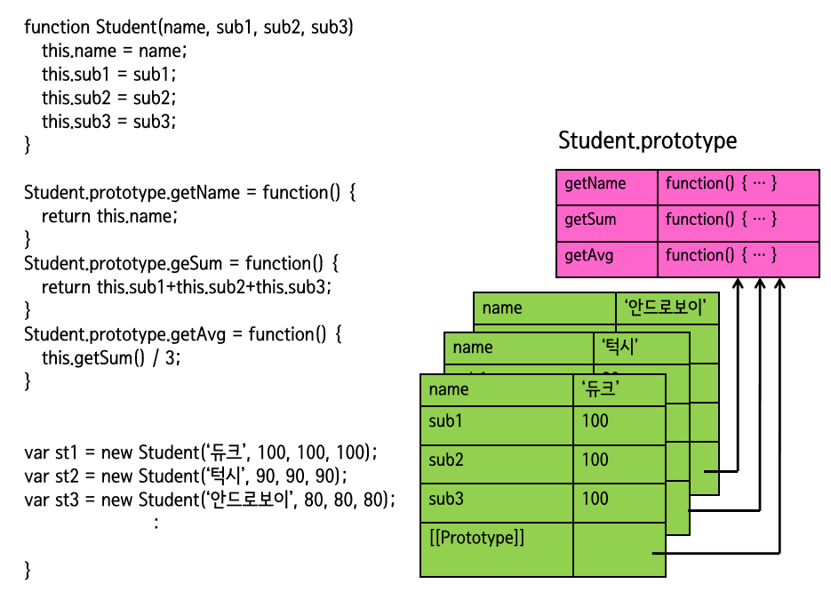

# JavaScript

## 객체지향 프로그래밍 (OOP)

- `객체지향 프로그래밍`은 프로그램을 작성할 때 객체들을 만들어서 서로 소통하도록 만드는 방법을 뜻함
- 자바스크립트 객체를 `데이터의 묶음`이라 하면, 객체지향의 객체는 `우리가 표현하고 싶은 구체적인 사물을 추상적으로 표현한 것`
  이라 볼 수 있음

- 나를 객체로 표현한다면 다음과 같이 나타낼 수 있음

```js
const me = {
    name: 'danny',
    address: '서울특별시',
    phoneNum: '010-1234-5678',
    canRun: function(){console.log('danny is running')};
}
```

- 객체는 행동과 상태를 가짐 (행동: 메서드, 상태: 프로퍼티)

- 나에게 새로운 능력을 부여해보면 다음과 같음

```js
const me = {
  name: "danny",
  address: "서울특별시",
  phoneNum: "010-1234-5678",
  canRun: function () {
    console.log("danny is running");
  },
  learning: function (subject) {
    subject.levelUp();
  },
};
```

- 그리고 새로운 객체를 만들어보도록 하자

```js
const subject = {
  level: 1,
  levelUp: function () {
    this.level++;
  },
};
```

- 이제 능력을 발휘하도록 하자

```js
me.learning(subjcet);
```

- 위의 코드를 종합하면 다음과 같다

```js
const me = {
  name: "danny",
  address: "서울특별시",
  phoneNum: "010-1234-5678",
  canRun: function () {
    console.log("danny is running");
  },
  learning: function (subject) {
    subject.levelUp();
  },
};

const subject = {
  level: 1,
  levelUp: function () {
    this.level++;
  },
};

me.learning(subjcet);
```

이처럼 객체와 객체가 서로 메서드를 통해 상호작용하게 하는 것이 `객체지향 프로그래밍`이다
<br>

위의 객체를 통해 원하는 결과를 얻어냈지만 문제가 존재한다.
<br>
해당 객체는 한번 만들고나면 끝이기 떄문에 비효율적이다<br>
객체를 효율적으로 생성하기 위해서는 `객체 리터럴 방법`, `생성자 함수 방법`등을 이용하면 좋다

<br>

### 객체 리터럴

- 생성

```js
const person = {};
person.이름 = "홍길동";
person.취미 = "악기";
person.특기 = "프로그래밍";
person.장래희망 = "생명공학자";
for (var key in person) writeColor(person[key], "h3", "red");
document.writeln("==================");
delete person.취미;
for (var key in person) writeColor(person[key], "h3", "blue");
```

- 사용 예시

```js
const student = {
  이름: "홍길동",
  국어: 92,
  수학: 98,
  영어: 96,
  과학: 98,
};
for (let key in student) document.write(student[key], "h3");
```

- 동일한 객체가 여러개 필요한 경우 객체 리터럴보다 생성자 함수를 이용하는 것이 좋다

<br>

### 생성자

- 객체 생성시 new 연산자와 함께 사용하는 함수
- 생성자를 사용할 경우 얕은 복사 문제를 해결할 수 있음
- 객체의 멤버를 초기화하는 함수

- 내장 생성자 예시

```js
let myArr = new Array(1, 2, 3, 4, 5);
```

- 생성자를 통해 생성된 객체는 같은 `프로퍼티`와 `메서드`를 공유할 수 있음

```js
let myArr = new Array(1, 2, 3, 4, 5);
let myArr2 = new Array(6, 7, 8, 9);

myArr.length;
myArr2.length;

myArr.forEach((el) => console.log(el));
myArr2.forEach((el) => console.log(el));
```

- 생성자 함수 사용 예시

```js
function Student(name, korean, math, english, science) {
  this.이름 = name;
  this.국어 = korean;
  this.수학 = math;
  this.영어 = english;
  this.과학 = science;
}
var st1 = new Student("둘리", 96, 98, 92, 98);
// new - 빈객체 생성
// new Student("둘리", 96, 98, 92, 98) - 객체 초기화

var st2 = new Student("또치", 92, 98, 96, 98);
var st3 = new Student("도우너", 76, 96, 94, 90);

document.write(
  st1.이름 +
    " : " +
    st1.국어 +
    ", " +
    st1.수학 +
    ", " +
    st1.영어 +
    ", " +
    st1.과학,
  "h2"
);

document.write(
  st2.이름 +
    " : " +
    st2.국어 +
    ", " +
    st2.수학 +
    ", " +
    st2.영어 +
    ", " +
    st2.과학,
  "h2"
);

document.write(
  st3.이름 +
    " : " +
    st3.국어 +
    ", " +
    st3.수학 +
    ", " +
    st3.영어 +
    ", " +
    st3.과학,
  "h2"
);
```

#### 커스텀 생성자

- 생성자는 함수이므로 기본적으로 함수가 필요하다
- 생성자 함수는 암묵적으로 대문자로 시작하는 이름을 가진다

```js
function Factory();
let robotA = new Factory();  // new 키워드를 통해 객체 생성
```

Factory 생성자 함수는 따로 return 값을 가지지는 않으나 new 키워드가 앞에 붙게되면 실행되었을 때 자동적으로 객체를 생성하고 반환함
<br>
이렇게 만들어져서 반환되는 객체를 `인스턴스(instance)`라 함

```js
robotA instanceof Factory; // 생성자 함수와 객체의 관계 확인
```

<BR>

- 프로퍼티와 메서드를 가지는 로봇 객체 생성

```js
function NewFactory(name) {
  this.name = name;
  this.sayYourName = function () {
    console.log(`제 이름은 ${this.name}입니다`);
  };
}
```

함수 안에서의 this는 함수를 호출한 객체를 참조한다<br>
하지만 생성자 함수 앞에 new 연산자가 사용되면 함수안의 this는 생성자가 만들어낸 객체(인스턴스)를 참조한다<br>
(this는 생성자함수를 통해 만들어진 인스턴스를 지칭함)

- 인스턴스는 다음과 같이 생성한다

```js
let robotA = new Factory("아이크");
```

##### 예제

- 음식 이름의 배열을 전달하면 배열안에서 랜덤하게 메뉴를 뽑아내는 로봇객체의 생성자를 만들기

```js
const koreanFood = ["비빔밥", "치킨", "갈비탕", "갈비찜", "찜닭", "닭한마리"];
const chineseFood = ["짜장면", "짬뽕", "탕수육", "깐풍기", "유린기", "볶음밥"];
const JapaneseFood = ["초밥", "소바", "라멘", "타꼬야끼"];

function FoodPickingSystem(food) {
  this.food = food;
  const chosenFood = food[Math.floor(Math.random() * food.length)];
  this.choice = function () {
    return `이번에 추천할 음식은 ${chosenFood}입니다.`;
  };
}

let whatToEat = new FoodPickingSystem(koreanFood);
console.log(whatToEat.choice());

let whatToEat2 = new FoodPickingSystem(chineseFood);
console.log(whatToEat2.choice());

let whatToEat3 = new FoodPickingSystem(JapaneseFood);
console.log(whatToEat3.choice());
```

<br>

### prototype

- 자바스크립트의 모든 객체는 prototype 객체를 가지고 있음
  <br> (모든 객체는 프로토타입으로부터 프로퍼티와 메서드를 상속받음)

- 자바스크립트의 모든 객체는 최소한 하나 이상의 다른 객체로부터 상속을 받으며, 이때 상속되는
  정보를 제공하는 객체를 `prototype`이라 함

- prototype은 공간을 가리키는 참조임
- 객체 안에 존재하지 않고 생성자함수 내에서 존재함(객체 안에 있는 것은 `__proto__`)
- 모든 인스턴스가 공유하는 공간을 prototype을 통해 생성함
- 프로토타입을 이용하면 메모리 공간의 낭비가 적어짐

#### 프로토타입은 왜 등장했는가

- 우리가 손쉽게 객체를 생산할 수 있지만, 객체의 메서드를 등록 할때마다 새로운 함수를 생성하고 있다는 문제가 존재합니다.

- 50개의 객체를 생성할 때마다 50개의 함수를 새로 만들어야 하므로 자원이 낭비됩니다.

```js
this.sayYourName = function () {
  console.log(`삐리비리. 제 이름은 ${this.name}입니다. 주인님.`);
};
```

- 이러한 자원의 낭비를 줄이기 위해서 프로토타입이 등장하였다

```js
function NewFactory2(name) {
  // 생성자함수
  this.name = name;
}

// 생성자함수로 만든 인스턴스들이 동일한 프로토타입의 공간을 바라보게 됨
NewFactory2.prototype.sayYourName = function () {
  // sayYourName이라는 또다른 프로퍼티를 만들고 있음
  // 함수를 새로이 할당하는 과정 (프로토타입에 새로운 함수를 등록함)
  console.log(`삐리비리. 제 이름은 ${this.name}입니다. 주인님.`);
};
```

#### 프로토타입이란?

- prototype은 특정 객체에 대한 참조임
  <br>(즉, 어떠한 공간을 가리키고 있음)

- 생성자 함수가 인스턴스를 생성하게 되면 그 안에는 숨겨진 프로퍼티인 `[[Prototype]]`이 존재함
  <br> (코드상에서는 `__proto__`로 표현됨)

- `__proto__` 프로퍼티는 자신을 만든 생성자 함수의 `prototype`을 참조하는 역할을 함
  <br>(즉, new 키워드를 통해서 생성자 함수의 `prototype`과 인스턴스의 `__proto__`가 연결됨)
  <br>(`prototype`은 생성자 함수에, `__prototype__`은 인스턴스에 존재함)

- 프로토타입은 모든 인스턴스가 하나의 메서드를 공유하도록 만들어서 자원을 더 효율적으로 사용하도록 도와줌

```js
function Test() {} // 생성자 함수

const obj = new Test(); // 인스턴스 생성

obj.__proto__ === Test.prototype; // true
```

##### 비효율적


##### 효율적



- `생성자명.prototype.메서드명` = function(){} 꼴 사용
- 메서드는 Student.prototype이라는 영역에 따로 존재하게 되고 이를 참조하게 됨
- 따라서 메서드는 prototype에 넣는것이 메모리를 효율적으로 사용할 수 있음

##### prototype VS **proto**

###### prototype

- 함수안에 존재하는 참조값

###### **proto**

- 객체 안에 존재하는 숨겨진 프로퍼티
- 인스턴스는 `__proto__`를 통해 생성자 함수의 `prototype`에 접근하여 필요한 여러가지의 값을 사용할 수 있음

```js
function Test() {}

const obj = new Test();

console.log(obj.prototype); // undefined
console.log(obj.__proto__); // {constructor: ƒ}
```

<br>

#### 프로토타입 체인

- 자바스크립트에서 new 연산자를 사용해서 생성한 객체는 생성자의 프로토타입을 자신의 프로토타입으로
  상속받음

```js
var obj = new Object(); // 이 객체의 프로토타입은 Object.prototype입니다.
var arr = new Array(); // 이 객체의 프로토타입은 Array.prototype입니다.
var date = new Date(); // 이 객체의 프로토타입은 Date.prototype입니다.
```

- Object.prototype 객체는 어떠한 프로토타입도 가지지 않으며, 아무런 프로퍼티도 상속받지 않음
- 또한 자바스크립트에 내장된 모든 생성자나 사용자 정의 생성자는 이 객체를 프로토타입으로 가짐

```js
var date = new Date();
// 이 객체는 Date.prototype 뿐만 아니라 Object.prototype도 프로토타입으로 가집니다.
```

이와 같이 프로토타입이 상속되는 가상의 연결고리를 `프로토타입 체인`이라 함
<br>
Object.prototype 객체는 이러한 프로토타입 체인에서도 가장 상위에 존재하는 프로토타입임
<br>
따라서 자바스크립트의 모든 객체는 Object.prototype 객체를 프로토타입으로 상속받음

#### 프로토타입 생성

- 프로토타입을 생성하는 가장 기본적인 방법은 객체 생성자 함수(object constructor function)를 작성하는 것임

- 생성자 함수를 작성하고 new 연산자를 사용해 객체를 생성하면, 같은 프로토타입을 가지는 객체들을 생성할 수 있음

```js
function Dog(color, name, age) {
  this.color = color; // 색에 관한 프로퍼티
  this.name = name; // 이름에 관한 프로퍼티
  this.age = age; // 나이에 관한 프로퍼티
}

var myDog = new Dog("흰색", "마루", 1); // 이 객체는 Dog라는 프로토타입을 가짐.

document.write(
  "우리 집 강아지는 " +
    myDog.name +
    "라는 이름의 " +
    myDog.color +
    " 털이 매력적인 강아지입니다."
);
```

#### 객체에 프로퍼티 및 메서드 추가

- 이미 생성된 객체에 새로운 프로퍼티 및 메서드를 추가하는 방법은 다음과 같음

```js
function Dog(color, name, age) {
  this.color = color;
  this.name = name;
  this.age = age;
}

var myDog = new Dog("흰색", "마루", 1);

myDog.family = "시베리안 허스키"; // 품종에 관한 프로퍼티를 추가함.
myDog.breed = function () {
  // 털색을 포함한 품종을 반환해 주는 메소드를 추가함.
  return this.color + " " + this.family;
};

document.write("우리 집 강아지는 " + myDog.breed() + "입니다.");
```

이렇게 새로이 추가된 프로퍼티와 메서드는 오직 해당 인스턴스(여기서는 myDog 인스턴스)에만 존재함
<br>
(이미 생성된 다른 Dog 객체나 차후에 생성되는 어떠한 다른 Dog 객체에도 추가되지 않음)

#### 프로토타입에 프로퍼티 및 메서드 추가

- 프로토타입은 생성자 함수에 프로퍼티와 메서드를 직접 추가해야만 이후에 생성되는 모든 다른 객체에도 적용할 수 있음

```js
function Dog(color, name, age) {
  this.color = color;
  this.name = name;
  this.age = age;
  this.family = "시베리안 허스키"; // 프로토타입에 프로퍼티를 추가할 때에는 기본값을 가지게 할 수 있음.
  this.breed = function () {
    return this.color + " " + this.family;
  };
}

var myDog = new Dog("흰색", "마루", 1);
var hisDog = new Dog("갈색", "콩이", 3);
document.write(
  "우리 집 강아지는 " +
    myDog.family +
    "이고, 친구네 집 강아지도 " +
    hisDog.family +
    "입니다."
);
```

#### prototype 프로퍼티

- prototype 프로퍼티를 이용하면 현재 존재하고 있는 프로토타입에 새로운 프로퍼티나 메소드를 손쉽게 추가할 수 있음

```js
function Dog(color, name, age) {
  this.color = color;
  this.name = name;
  this.age = age;
}

Dog.prototype.family = "시베리안 허스키";
// 현재 존재하고 있는 Dog 프로토타입에 family 프로퍼티를 추가함.

Dog.prototype.breed = function () {
  // 현재 존재하고 있는 Dog 프로토타입에 breed 메소드를 추가함.
  return this.color + " " + this.family;
};

var myDog = new Dog("흰색", "마루", 1);
var hisDog = new Dog("갈색", "콩이", 3);

document.write(
  "우리 집 강아지는 " +
    myDog.family +
    "이고, 친구네 집 강아지도 " +
    hisDog.family +
    "입니다."
);
document.write("우리 집 강아지의 품종은 " + myDog.breed() + "입니다.<br>");
document.write("친구네 집 강아지의 품종은 " + hisDog.breed() + "입니다.");
```

<br>

### 객체의 상속

- 자바스크립트의 상속은 기본적으로 prototype을 통해 일어남

```js
const obj = {};
```

<br>

## this

### 객체 안에서의 this

### 이벤트 핸들러 안에서의 this
