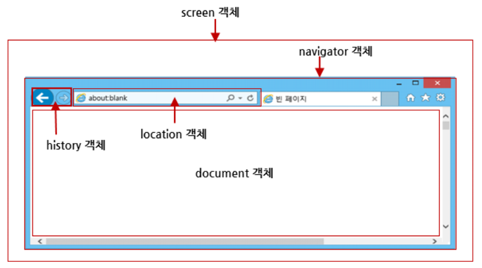
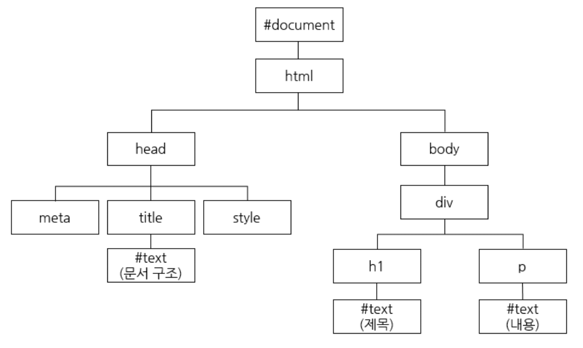

# JavaScript

## 객체지향 프로그래밍 (OOP)

- `객체지향 프로그래밍`은 프로그램을 작성할 때 객체들을 만들어서 서로 소통하도록 만드는 방법을 뜻함
- 자바스크립트 객체를 `데이터의 묶음`이라 하면, 객체지향의 객체는 `우리가 표현하고 싶은 구체적인 사물을 추상적으로 표현한 것`
  이라 볼 수 있음

- 나를 객체로 표현한다면 다음과 같이 나타낼 수 있음

```js
const me = {
    name: 'danny',
    address: '서울특별시',
    phoneNum: '010-1234-5678',
    canRun: function(){console.log('danny is running')};
}
```

- 객체는 행동과 상태를 가짐 (행동: 메서드, 상태: 프로퍼티)

- 나에게 새로운 능력을 부여해보면 다음과 같음

```js
const me = {
  name: "danny",
  address: "서울특별시",
  phoneNum: "010-1234-5678",
  canRun: function () {
    console.log("danny is running");
  },
  learning: function (subject) {
    subject.levelUp();
  },
};
```

- 그리고 새로운 객체를 만들어보도록 하자

```js
const subject = {
  level: 1,
  levelUp: function () {
    this.level++;
  },
};
```

- 이제 능력을 발휘하도록 하자

```js
me.learning(subjcet);
```

- 위의 코드를 종합하면 다음과 같다

```js
const me = {
  name: "danny",
  address: "서울특별시",
  phoneNum: "010-1234-5678",
  canRun: function () {
    console.log("danny is running");
  },
  learning: function (subject) {
    subject.levelUp();
  },
};

const subject = {
  level: 1,
  levelUp: function () {
    this.level++;
  },
};

me.learning(subjcet);
```

이처럼 객체와 객체가 서로 메서드를 통해 상호작용하게 하는 것이 `객체지향 프로그래밍`이다
<br>

위의 객체를 통해 원하는 결과를 얻어냈지만 문제가 존재한다.
<br>
해당 객체는 한번 만들고나면 끝이기 떄문에 비효율적이다<br>
객체를 효율적으로 생성하기 위해서는 `객체 리터럴 방법`, `생성자 함수 방법`등을 이용하면 좋다

<br>

### 객체 리터럴

- 생성

```js
const person = {};
person.이름 = "홍길동";
person.취미 = "악기";
person.특기 = "프로그래밍";
person.장래희망 = "생명공학자";
for (var key in person) writeColor(person[key], "h3", "red");
document.writeln("==================");
delete person.취미;
for (var key in person) writeColor(person[key], "h3", "blue");
```

- 사용 예시

```js
const student = {
  이름: "홍길동",
  국어: 92,
  수학: 98,
  영어: 96,
  과학: 98,
};
for (let key in student) document.write(student[key], "h3");
```

- 동일한 객체가 여러개 필요한 경우 객체 리터럴보다 생성자 함수를 이용하는 것이 좋다

<br>

### 생성자

- 객체 생성시 new 연산자와 함께 사용하는 함수
- 생성자를 사용할 경우 얕은 복사 문제를 해결할 수 있음
- 객체의 멤버를 초기화하는 함수

- 내장 생성자 예시

```js
let myArr = new Array(1, 2, 3, 4, 5);
```

- 생성자를 통해 생성된 객체는 같은 `프로퍼티`와 `메서드`를 공유할 수 있음

```js
let myArr = new Array(1, 2, 3, 4, 5);
let myArr2 = new Array(6, 7, 8, 9);

myArr.length;
myArr2.length;

myArr.forEach((el) => console.log(el));
myArr2.forEach((el) => console.log(el));
```

- 생성자 함수 사용 예시

```js
function Student(name, korean, math, english, science) {
  this.이름 = name;
  this.국어 = korean;
  this.수학 = math;
  this.영어 = english;
  this.과학 = science;
}
var st1 = new Student("둘리", 96, 98, 92, 98);
// new - 빈객체 생성
// new Student("둘리", 96, 98, 92, 98) - 객체 초기화

var st2 = new Student("또치", 92, 98, 96, 98);
var st3 = new Student("도우너", 76, 96, 94, 90);

document.write(
  st1.이름 +
    " : " +
    st1.국어 +
    ", " +
    st1.수학 +
    ", " +
    st1.영어 +
    ", " +
    st1.과학,
  "h2"
);

document.write(
  st2.이름 +
    " : " +
    st2.국어 +
    ", " +
    st2.수학 +
    ", " +
    st2.영어 +
    ", " +
    st2.과학,
  "h2"
);

document.write(
  st3.이름 +
    " : " +
    st3.국어 +
    ", " +
    st3.수학 +
    ", " +
    st3.영어 +
    ", " +
    st3.과학,
  "h2"
);
```

#### 커스텀 생성자

- 생성자는 함수이므로 기본적으로 함수가 필요하다
- 생성자 함수는 암묵적으로 대문자로 시작하는 이름을 가진다

```js
function Factory();
let robotA = new Factory();  // new 키워드를 통해 객체 생성
```

Factory 생성자 함수는 따로 return 값을 가지지는 않으나 new 키워드가 앞에 붙게되면 실행되었을 때 자동적으로 객체를 생성하고 반환함
<br>
이렇게 만들어져서 반환되는 객체를 `인스턴스(instance)`라 함

```js
robotA instanceof Factory; // 생성자 함수와 객체의 관계 확인
```

<BR>

- 프로퍼티와 메서드를 가지는 로봇 객체 생성

```js
function NewFactory(name) {
  this.name = name;
  this.sayYourName = function () {
    console.log(`제 이름은 ${this.name}입니다`);
  };
}
```

함수 안에서의 this는 함수를 호출한 객체를 참조한다<br>
하지만 생성자 함수 앞에 new 연산자가 사용되면 함수안의 this는 생성자가 만들어낸 객체(인스턴스)를 참조한다<br>
(this는 생성자함수를 통해 만들어진 인스턴스를 지칭함)

- 인스턴스는 다음과 같이 생성한다

```js
let robotA = new Factory("아이크");
```

##### 예제

- 음식 이름의 배열을 전달하면 배열안에서 랜덤하게 메뉴를 뽑아내는 로봇객체의 생성자를 만들기

```js
const koreanFood = ["비빔밥", "치킨", "갈비탕", "갈비찜", "찜닭", "닭한마리"];
const chineseFood = ["짜장면", "짬뽕", "탕수육", "깐풍기", "유린기", "볶음밥"];
const JapaneseFood = ["초밥", "소바", "라멘", "타꼬야끼"];

function FoodPickingSystem(food) {
  this.food = food;
  const chosenFood = food[Math.floor(Math.random() * food.length)];
  this.choice = function () {
    return `이번에 추천할 음식은 ${chosenFood}입니다.`;
  };
}

let whatToEat = new FoodPickingSystem(koreanFood);
console.log(whatToEat.choice());

let whatToEat2 = new FoodPickingSystem(chineseFood);
console.log(whatToEat2.choice());

let whatToEat3 = new FoodPickingSystem(JapaneseFood);
console.log(whatToEat3.choice());
```

<br>

### prototype

- 자바스크립트의 모든 객체는 prototype 객체를 가지고 있음
  <br> (모든 객체는 프로토타입으로부터 프로퍼티와 메서드를 상속받음)

- 자바스크립트의 모든 객체는 최소한 하나 이상의 다른 객체로부터 상속을 받으며, 이때 상속되는
  정보를 제공하는 객체를 `prototype`이라 함

- prototype은 공간을 가리키는 참조임
- 객체 안에 존재하지 않고 생성자함수 내에서 존재함(객체 안에 있는 것은 `__proto__`)
- 모든 인스턴스가 공유하는 공간을 prototype을 통해 생성함
- 프로토타입을 이용하면 메모리 공간의 낭비가 적어짐

- [참고자료](https://poiemaweb.com/js-prototype)

#### 프로토타입은 왜 등장했는가

- 우리가 손쉽게 객체를 생산할 수 있지만, 객체의 메서드를 등록 할때마다 새로운 함수를 생성하고 있다는 문제가 존재합니다.

- 50개의 객체를 생성할 때마다 50개의 함수를 새로 만들어야 하므로 자원이 낭비됩니다.

```js
this.sayYourName = function () {
  console.log(`삐리비리. 제 이름은 ${this.name}입니다. 주인님.`);
};
```

- 이러한 자원의 낭비를 줄이기 위해서 프로토타입이 등장하였다

```js
function NewFactory2(name) {
  // 생성자함수
  this.name = name;
}

// 생성자함수로 만든 인스턴스들이 동일한 프로토타입의 공간을 바라보게 됨
NewFactory2.prototype.sayYourName = function () {
  // sayYourName이라는 또다른 프로퍼티를 만들고 있음
  // 함수를 새로이 할당하는 과정 (프로토타입에 새로운 함수를 등록함)
  console.log(`삐리비리. 제 이름은 ${this.name}입니다. 주인님.`);
};
```

#### 프로토타입이란?

- prototype은 특정 객체에 대한 참조임
  <br>(즉, 어떠한 공간을 가리키고 있음)

- 생성자 함수가 인스턴스를 생성하게 되면 그 안에는 숨겨진 프로퍼티인 `[[Prototype]]`이 존재함
  <br> (코드상에서는 `__proto__`로 표현됨)

- `__proto__` 프로퍼티는 자신을 만든 생성자 함수의 `prototype`을 참조하는 역할을 함
  <br>(즉, new 키워드를 통해서 생성자 함수의 `prototype`과 인스턴스의 `__proto__`가 연결됨)
  <br>(`prototype`은 생성자 함수에, `__prototype__`은 인스턴스에 존재함)

- 프로토타입은 모든 인스턴스가 하나의 메서드를 공유하도록 만들어서 자원을 더 효율적으로 사용하도록 도와줌

```js
function Test() {} // 생성자 함수

const obj = new Test(); // 인스턴스 생성

obj.__proto__ === Test.prototype; // true
```

##### 비효율적


##### 효율적


- `생성자명.prototype.메서드명` = function(){} 꼴 사용
- 메서드는 Student.prototype이라는 영역에 따로 존재하게 되고 이를 참조하게 됨
- 따라서 메서드는 prototype에 넣는것이 메모리를 효율적으로 사용할 수 있음

##### prototype VS **proto**

###### prototype

- 함수안에 존재하는 참조값

###### **proto**

- 객체 안에 존재하는 숨겨진 프로퍼티
- 인스턴스는 `__proto__`를 통해 생성자 함수의 `prototype`에 접근하여 필요한 여러가지의 값을 사용할 수 있음

```js
function Test() {}

const obj = new Test();

console.log(obj.prototype); // undefined
console.log(obj.__proto__); // {constructor: ƒ}
```

<br>

#### 프로토타입 체인

- 자바스크립트에서 new 연산자를 사용해서 생성한 객체는 생성자의 프로토타입을 자신의 프로토타입으로
  상속받음

```js
var obj = new Object(); // 이 객체의 프로토타입은 Object.prototype입니다.
var arr = new Array(); // 이 객체의 프로토타입은 Array.prototype입니다.
var date = new Date(); // 이 객체의 프로토타입은 Date.prototype입니다.
```

- Object.prototype 객체는 어떠한 프로토타입도 가지지 않으며, 아무런 프로퍼티도 상속받지 않음
- 또한 자바스크립트에 내장된 모든 생성자나 사용자 정의 생성자는 이 객체를 프로토타입으로 가짐

```js
var date = new Date();
// 이 객체는 Date.prototype 뿐만 아니라 Object.prototype도 프로토타입으로 가집니다.
```

이와 같이 프로토타입이 상속되는 가상의 연결고리를 `프로토타입 체인`이라 함
<br>
Object.prototype 객체는 이러한 프로토타입 체인에서도 가장 상위에 존재하는 프로토타입임
<br>
따라서 자바스크립트의 모든 객체는 Object.prototype 객체를 프로토타입으로 상속받음

#### 프로토타입 생성

- 프로토타입을 생성하는 가장 기본적인 방법은 객체 생성자 함수(object constructor function)를 작성하는 것임

- 생성자 함수를 작성하고 new 연산자를 사용해 객체를 생성하면, 같은 프로토타입을 가지는 객체들을 생성할 수 있음

```js
function Dog(color, name, age) {
  this.color = color; // 색에 관한 프로퍼티
  this.name = name; // 이름에 관한 프로퍼티
  this.age = age; // 나이에 관한 프로퍼티
}

var myDog = new Dog("흰색", "마루", 1); // 이 객체는 Dog라는 프로토타입을 가짐.

document.write(
  "우리 집 강아지는 " +
    myDog.name +
    "라는 이름의 " +
    myDog.color +
    " 털이 매력적인 강아지입니다."
);
```

#### 객체에 프로퍼티 및 메서드 추가

- 이미 생성된 객체에 새로운 프로퍼티 및 메서드를 추가하는 방법은 다음과 같음

```js
function Dog(color, name, age) {
  this.color = color;
  this.name = name;
  this.age = age;
}

var myDog = new Dog("흰색", "마루", 1);

myDog.family = "시베리안 허스키"; // 품종에 관한 프로퍼티를 추가함.
myDog.breed = function () {
  // 털색을 포함한 품종을 반환해 주는 메소드를 추가함.
  return this.color + " " + this.family;
};

document.write("우리 집 강아지는 " + myDog.breed() + "입니다.");
```

이렇게 새로이 추가된 프로퍼티와 메서드는 오직 해당 인스턴스(여기서는 myDog 인스턴스)에만 존재함
<br>
(이미 생성된 다른 Dog 객체나 차후에 생성되는 어떠한 다른 Dog 객체에도 추가되지 않음)

#### 프로토타입에 프로퍼티 및 메서드 추가

- 프로토타입은 생성자 함수에 프로퍼티와 메서드를 직접 추가해야만 이후에 생성되는 모든 다른 객체에도 적용할 수 있음

```js
function Dog(color, name, age) {
  this.color = color;
  this.name = name;
  this.age = age;
  this.family = "시베리안 허스키"; // 프로토타입에 프로퍼티를 추가할 때에는 기본값을 가지게 할 수 있음.
  this.breed = function () {
    return this.color + " " + this.family;
  };
}

var myDog = new Dog("흰색", "마루", 1);
var hisDog = new Dog("갈색", "콩이", 3);
document.write(
  "우리 집 강아지는 " +
    myDog.family +
    "이고, 친구네 집 강아지도 " +
    hisDog.family +
    "입니다."
);
```

#### prototype 프로퍼티

- prototype 프로퍼티를 이용하면 현재 존재하고 있는 프로토타입에 새로운 프로퍼티나 메소드를 손쉽게 추가할 수 있음

```js
function Dog(color, name, age) {
  this.color = color;
  this.name = name;
  this.age = age;
}

Dog.prototype.family = "시베리안 허스키";
// 현재 존재하고 있는 Dog 프로토타입에 family 프로퍼티를 추가함.

Dog.prototype.breed = function () {
  // 현재 존재하고 있는 Dog 프로토타입에 breed 메소드를 추가함.
  return this.color + " " + this.family;
};

var myDog = new Dog("흰색", "마루", 1);
var hisDog = new Dog("갈색", "콩이", 3);

document.write(
  "우리 집 강아지는 " +
    myDog.family +
    "이고, 친구네 집 강아지도 " +
    hisDog.family +
    "입니다."
);
document.write("우리 집 강아지의 품종은 " + myDog.breed() + "입니다.<br>");
document.write("친구네 집 강아지의 품종은 " + hisDog.breed() + "입니다.");
```

<br>

### 객체의 상속

- 자바스크립트의 상속은 기본적으로 prototype을 통해 일어남

```js
const obj = {
  // obj 객체
  name: "test", // name 프로퍼티
};
console.log(obj.hasOwnProperty("name")); // true

const arr = [1, 2, 3];
console.log(arr.hasOwnProperty("name")); // false
```

Array 함수의 `__proto__`가 Object 함수의 `prototype`을 참조하고 있기 때문에
Array의 `prototype`에 존재하지 않는 Object 객체의 프로퍼티와 메서드를 사용할 수 있음<br>
(자바스크립트의 타입들은 기본적으로 Object 타입을 상속받고 있음)<br>

이처럼 자기 자신에게 존재하지 않는 프로퍼티나 메서드를 프로토타입을 통해 추적하는 과정을
`프로토타입 체이닝`이라 함<br>

<br>

- 직접 만든 생성자 함수를 통해 상속을 받아보도록 하자

```js
/* 부모 */
function Parent() {
  this.name = "danny";
}
Parent.prototype.rename = function (name) {
  this.name = name;
};
Parent.prototype.sayName = function () {
  console.log(this.name);
};

/* 자식 */
function Child() {
  Parent.call(this);
}
// call -> 함수의 메서드(this의 대상 바꿈).
// this는 인스턴스를 지칭하므로 Parent함수에 대한 인스턴스와 연결함

Child.prototype = Object.create(Parent.prototype);
// Object.create() 메서드는 지정된 프로토타입 객체 및 속성(property)을 갖는 새 객체를 만듦

Child.prototype.canWalk = function () {
  console.log("now i can walk!!");
};

/* 인스턴스 생성 및 사용 */
const child = new Child();
// child 인스턴스는 Child 생성자 함수를 바라보게 함

console.log(child.name);
// danny
// 부모의 프로퍼티를 가져와서 사용할 수 있게 됨

child.rename("Daniel");
console.log(child.sayName()); // Daniel
```

call 함수는 Child함수의 this가 Parent 생성자 함수의 this를 바라보게 만듦<br>
(즉, Child를 통해 생성된 인스턴스의 this가 Parent함수 안의 프로퍼티에 접근할 수 있게 됨)
<br>

Object.create 함수는 주어진 인자를 Child.prototype에 연결하는 역할을 함<br>
(즉, Parent 객체의 프로토타입을 Child 객체의 프로토타입이 참조하게 만듦)<br>

이 과정을 통해 Child 객체는 Parent 객체의 모든것을 상속받게 됨
<br>
<br>

## Class

- 객체를 생산하는 도면
- 클래스의 결과물 : 인스턴스 생성
  <br>(생성자를 이용한 타입 생성과 그 결과가 정확히 일치함)
- 자바스크립트만의 사용자 정의 타입 생성(객체 생성)방법을 다른 언어의 클래스 문법으로 바꾸어 준것이 자바스크립트의 `클래스`임

<br>

- 생성자 이용

```js
function Robot(name) {
  this.name = name;
}

Robot.prototype.sayYourName = function () {
  console.log(`삐리비리. 제 이름은 ${this.name}입니다. 주인님.`);
};
```

- 클래스 이용

```js
class Robot {
  constructor(name) {
    this.name = name;
  }

  sayYourName() {
    console.log(`삐리비리. 제 이름은 ${this.name}입니다. 주인님.`);
  }
}
```

- `constructor`

  - 클래스의 생성자 함수
  - 생성자 함수는 new 키워드가 호출될 때(인스턴스가 생성될 때) 자동으로 실행됨
  - 반드시 한 클래스당 하나만 정의되고, 한 클래스당 한번만 사용할 수 있음

- `sayYourName`
  - 메서드를 정의함
  - 메서드는 클래스가 생성한 인스턴스를 통해 사용할 수 있음

### class 상속

- 파생 클래스(derived class): 상속받는 클래스
- 부모 클래스의 프로퍼티를 상속받기 위해 super 함수를 이용함
  <br>(이 경우 super는 부모 생성자를 참조함)

- super 사용시 유의사항
  - 만약 파생 클래스에서 생성자 함수를 사용하고 싶은 경우, 반드시 super 함수를 사용해야 함
  - 파생 클래스에 생성자 함수가 없다면 super 함수가 자동으로 호출되어 부모 클래스의 프로퍼티를 상속 받게 됨
  - 생성자 함수에서 this값을 사용할 경우, super 함수는 반드시 this보다 먼저 실행되어야 함

```js
class Robot {
  constructor(name) {
    this.name = name;
  }

  sayYourName() {
    console.log(`삐리비리. 제 이름은 ${this.name}입니다. 주인님.`);
  }
}

class ChildRobot extends Robot {
  constructor(name) {
    super(name);
    // super를 통해 부모의 프로퍼티 상속받음
    // super는 부모의 생성자 함수를 참조함

    this.ownName = "브랜든";
    // 얘가 super보다 먼저나오면 error
  }

  sayChildName() {
    this.sayYourName();
    // 상속을 받았으므로 부모 클래스의 메서드를 사용할 수 있게 됨 (this로 접근 가능)
  }
}
```

#### 슈퍼 클래스 & 서브 클래스

| 특징\명칭                      | 슈퍼 클래스                                                                                        | 서브 클래스                                                                                                                                                                                                                                                |
| :----------------------------- | :------------------------------------------------------------------------------------------------- | :--------------------------------------------------------------------------------------------------------------------------------------------------------------------------------------------------------------------------------------------------------- |
| 다른 명칭                      | 부모 클래스<br>베이스 클래스                                                                       | 자식 클래스<br>파생 클래스                                                                                                                                                                                                                                 |
| 의미                           | 상속을 해줌으로써 기능이 확장된 클래스                                                             | 상속을 받아 기능을 확장하는 클래스<br>생성한 객체에서 상속받은 속성을 사용할 수 있음                                                                                                                                                                       |
| constructor                    | 슈퍼 클래스에서 constructor 생략 가능<br>생략시 자동 생성<br>서브 클래스의 `super()`에 의해 호출됨 | 생략시 constructor(arguments){super(arguments)} 자동생성<br>인스턴스 생성 과정에서 상속받은 클래스의 속성과 메서드 접근 권한 추가를 위해 `super()`를 반드시 호출해야 함<br> `new`연산자와 함께 함수를 호출할 경우 서브 클래스의 constructor가 호출(실행)됨 |
| 상속 받은(한) 클래스 속성 접근 | 슈퍼 클래스로 생성된 객체는 서브 클래스의 속성에 접근할 수 없음                                    | 슈퍼 클래스의 constructor 호출: `super(arg, ...)`<br>슈퍼 클래스의 프로퍼티 호출: `super.슈퍼클래스의 프로퍼티명`<br>슈퍼 클래스의 메서드 호출: `super.슈퍼클래스의 메서드명`                                                                              |

<br>

### 비공개 프로퍼티

- 객체 내부의 중요한 정보를 안전하게 보호하여 프로그램이 예기치 않게 변경되는 것을 방지함
- 데이터를 외부에서 함부로 수정할 수 없게끔 도와줌

```js
class Robot {
  #password; //  클래스 내 비공개 프로퍼티 선언

  constructor(name, pw) {
    this.name = name;
    this.#password = pw; // 비공개 프로퍼티에 인자 할당
  }

  sayYourName() {
    console.log(`삐리비리. 제 이름은 ${this.name}입니다. 주인님.`);
  }

  getPassword() {
    return this.#password; // 인스턴스의 패스워드
  }

  setPassword(pw) {
    // 값을 수정
    this.#password = pw;
  }
}

const robot = new Robot("DANNY", "1234");
console.log(robot.name); // 'DANNY'
console.log(robot.#passowrd); // error

// Uncaught Error: Cannot read private member #passowrd from an object whose class did not declare it at <anonymous>
```

- `#` 키워드를 이용하면 프로퍼티를 비공개로 전환할 수 있음
- `#password`값에 접근하고 수정하기 위해서는 반드시 해당 기능의 메서드를 사용해야함
  <br> (getter, setter)

- 이외에도 클로저를 이용해서 비공개 프로퍼티를 만들 수 있음

#### 클로저

- 외부에서 접근할 수 없는 폐쇄된 공간에 접근하기 위해 사용되는 테크닉
- 클래스 이전에 비공개로 사용하던 방

#### getter, setter

- getter
  - 값을 불러오는 메서드
- setter

  - 값을 수정하는 메서드

- 비공개 프로퍼티를 사용하는 경우 getter, setter 메서드를 이용해서 외부에서 변경 할 수 있음
  <br>(프로퍼티를 함수를 통해 가공해야하는 경우에 사용하면 좋음)

- getter, setter 메서드를 이용해서 객체의 프로퍼티에 접근하듯 값을 다룰 수 있음
  <br> (getter, setter를 이용해서 정보를 조회 및 수정할 수 있음)

```js
class Robot {
  #password;

  constructor(name, pw) {
    this.name = name;
    this.#password = pw;
  }

  sayYourName() {
    console.log(`삐리비리. 제 이름은 ${this.name}입니다. 주인님.`);
  }

  /* get, set 키워드를 사용해서 객체의 프로퍼티에 접근하듯 값을 다룰 수 있게 됨 */
  // 메서드명도 동일해짐
  get password() {
    return this.#password;
  }

  set password(pw) {
    this.#password = pw;
  }
}

const bot = new Robot("재현", 1234); // 인스턴스 생성

bot.password = 5678; // setter 함수의 추가로 인해 수정이 가능해짐
console.log(bot.password); // 5678
```

<br>

### static field

프로퍼티에는 2가지 종류의 프로퍼티가 존재함

1. 인스턴스 프로퍼티

   - 주어진 특정한 인스턴스(객체)들과 공유되는 데이터를 가짐
   - 객체에서 접근을 해주어야 함
   - 개별의 객체들만이 가져야 하는 속성

2. 스태틱 프로퍼티
   - 모든 객체 인스턴스들과 공유되는 데이터를 가짐
   - 클래스에서 접근을 해주어야 함
   - 클래스 자체가 가지는 속성

```js
class Student {
  static isHuman = true;
  static age = "19";
  subject = "TypeScript";
  #id;
  constructor(id, name, topics) {
    this.#id = id;
    this.name = name;
    this.topics = topics;
  }

  get id() {
    return this.#id;
  }
  set id(val) {
    this.#id = val;
  }
}

let student1 = new Student(11, "danny", ["반복문", "조건문", "인터페이스"]);
console.log(student1.isHuman); // undefined
console.log(student1.age); // undefined

console.log(student1.isHuman); // true
console.log(Student.age); // 19
```

### 프로퍼티에 대해 알아두면 좋은 사항

- 프로퍼티는 객체나 클래스의 속성(또는 상태)임
- 프로퍼티는 값을 직접 받거나 할당할 수 있음
- `객체.프로퍼티` 또는 `gettter 메서드`를 이용해서 프로퍼티를 조회할 수 있음
- `객체.프로퍼티 = ~` 또는 `setter 메서드`를 이용해서 프로퍼티 재할당 및 수정이 가능함
- `#`을 이용해서 외부로부터 접근이 불가능한 `private 필드`로 설정이 가능함
- `static`을 이용하면 클래스 자체에 속성 혹은 상태를 지정할 수 있음

<br>

## this

- 생성자 함수 내부에서의 this -> 새로이 만들어진 객체 참조
- 전역 코드에서의 this -> 윈도우 객체 참조
- 이벤트 함수에서의 this -> 이벤트가 발생하게 된 대상 객체 참조

### 객체 안에서의 this

### 이벤트 핸들러 안에서의 this

<br>

## BOM (Browser Object Model)



- 웹 브라우저와 관련된 모든 객체들의 집합
- 문서 이외의 모든 것을 제어하기 위해 브라우저(호스트 환경)가 제공하는 추가 객체
- 웹 브라우저의 창이나 프레임을 추상화해서 프로그래밍적으로 제어할 수 있도록 제공하는 수단
- BOM은 전역객체인 Window의 프로퍼티와 메서드들을 통해 제어할 수 있음

- [참고자료](https://wlrma-study.gitbook.io/js-study/do-it-javascript/10.-bom)
- [참고자료2](https://www.zerocho.com/category/JavaScript/post/573b321aa54b5e8427432946)

<br>

### Window 객체

- 전역 객체 Window는 모든 객체가 소속된 객체임
- 창이나 프레임을 뜻함
- Window 객체는 식별자 window를 통해서 얻을 수 있음 (생략 가능)
- 전역 변수는 window 객체의 프로퍼티와 메서드임
- 모든 객체는 window의 자식임 (ECMAScript상 Global 객체라고도함)
- ECMAScript의 전역객체이면서 웹브라우저의 창이나 프레임을 제어하는 역할을 함

#### 사용 예시

```html
<!-- Window 객체의 메서드인 alert 호출-->
<script>
  alert("Hello world");
  window.alert("Hello World");
</script>
```

```html
<!--  전역변수 a에 접근-->
<script>
  var a = 1;
  alert(a);
  alert(window.a);
</script>
```

```html
<script>
  var a = { id: 1 };
  alert(a.id);
  alert(window.a.id);
</script>
<!--객체를 만드는 것은 windwo 객체의 프로퍼티를 만드는 것임-->
```

#### setInerval

- [참고자료 1](https://developer.mozilla.org/ko/docs/Web/API/setInterval)
- [참고자료 2](https://ko.javascript.info/settimeout-setinterval)
- [참고자료 3](https://www.w3schools.com/jsref/met_win_setinterval.asp)

<br>

### location 객체

- 브라우저 객체 모델의 종류로 URL 정보를 제공
- `location.href`에 새로운 문자열을 삽입하여 href의 속성을 바꾸면 새로운 문자열로 페이지 이동이 발생
- 문서의 주소와 같은 객체로 Window 객체의 프로퍼티임
- location 객체를 이용해서 윈도우의 문서 URL을 변경할 수 있고, 문서의 위치와 관련해서 다양한 정보를 얻을 수 있음
- 현재 URL을 읽고 새로운 URL로 변경(redirect)할 수 있게 해줌

#### 현재 윈도우의 URL 알아내기

```js
console.log(location.toString(), location.href);
```

#### URL Parsing

- location 객체는 URL을 의미에 따라서 별도의 프로퍼티를 제공함

```js
console.log(
  location.protocol,
  location.host,
  location.port,
  location.pathname,
  location.search,
  location.hash
);
```

#### 현재 문서를 이동

```js
/*  현재 문서를 http://egoing.net으로 이동한다 */
location.href = "http://egoing.net";

/*  현재 문서를 http://egoing.net으로 이동한다 */
location = "http://egoing.net";
```

#### 현재 문서를 리로드

```js
location.reload();
```

#### gelocation

- 네트워크를 통해 위치정보를 받아옴

- [참고자료](https://developer.mozilla.org/en-US/docs/Web/API/Geolocation_API/Using_the_Geolocation_API)
- [참고자료2](https://guide.ncloud-docs.com/docs/api-api-2-1)
- [참고자료3](http://www.tcpschool.com/html/html5_api_geolocation)
- [참고자료4](https://developers.google.com/maps/documentation/javascript/geolocation?hl=ko)
- [참고자료5](https://apis.map.kakao.com/web/sample/geolocationMarker/)
- [참고자료6](https://www.w3schools.com/html/html5_geolocation.asp)
- [참고자료7](https://www.gov-ncloud.com/product/applicationService/geoLocation)

- [예제코드1](./exam4.html)

<br>

### navigator 객체

- 브라우저와 OS에 대한 정보를 제공하는 객체
- 브라우저의 호환성 문제를 위해서 사용함

#### navigator.userAgent

- 현재 사용중인 브라우저 정보를 알려줌

#### navigator.platform

- 브라우저가 실행 중인 운영체제정보를 알려줌

<br>

### history 객체

- 방문 기록에 대한 정보를 제공하는 객체

<br>

### screen 객체

- 모니터에 대한 정보를 제공하는 객체

<br>

## DOM (Document Object Model)

- 문서 객체 모델(DOM)은 객체 지향 모델로서 구조화된 문서를 표현하는 형식임
- 플랫폼/언어 중립적으로 구조화된 문서를 표현하는 W3C의 공식 표준임
  <br>(W3C가 표준화한 여러개의 API의 기반이 됨)
- 브라우저는 서버로부터 응답된 웹 컨텐츠 내용을 파싱한 다음 트리구조로 각 HTML태그마다 DOM 기술을 적용하여
  JS객체를 생성함
  <br> => 바로 이 객체가 `DOM 객체`임

- DOM 객체를 통해서 HTML 문서의 내용을 접근하여 읽는 기능 뿐만 아니라 내용을 수정/삭제/추가 등 변경하는 기능을 처리할 수 있음

### HTML DOM 구조



- body의 자식 태그 : div(1개)
- body의 자손 태그 : div, h1, p (3개)
- body의 자식 노드 :

```html
<body>
  <div>
    <h1></h1>
    <p></p>
  </div>
</body>
```

### document 객체

#### document.getElementsByTagName("찾고자 하는 태그명")

- 리턴값: NodeList (유사배열 객체이므로 없으면 비어있는 리스트가 리턴)

#### document.getElementById("찾고자하는 태그의 id속성값")

- 리턴값: Node

#### document.getElementByClassName("클래스 속성값")

- 태그에 정의되어있는 태그의 속성값으로 찾음
- 리턴값: NodeList (유사배열 객체이므로 없으면 비어있는 리스트가 리턴)

#### document.querySelector("css 선택자")

- CSS 선택자를 어떻게 주느냐에 따라서 태그 탐색에 있어 활용성이 좋음
- 조겐에 맞는 녀석들 중 가장 먼저 인식된 애 하나만 리턴
- 리턴값: Node

#### document.querySelectorAll("CSS 선택자")

- 조건에 맞는 녀석들 모두를 리턴
- 리턴값: NodeList (유사배열 객체이므로 없으면 비어있는 리스트가 리턴)

#### Node.textContent

- 모든 요소들이 가지고 있는 속성
- 찾아온 요소 객체에 대한 text 형식에 대한 컨텐츠를 꺼낼 때 사용
- textContent는 html 태그를 태그로 인정하지 않고 일반 문자열로 인식
  <br>(태그가 태그로 렌더링 되기를 원한다면 innerHTML을 써야 함)
  <br> (과거의 innerText가 textContent로 바뀜)

- [참고자료](https://developer.mozilla.org/ko/docs/Web/API/Node/textContent)

#### Element.innerHTML

- 서브 태그가 있다면 textContent 대신 innerHTML을 사용해야 함
- [참고자료](https://developer.mozilla.org/ko/docs/Web/API/Element/innerHTML)

<br>

### Node

- [참고자료](http://www.tcpschool.com/ajax/ajax_basic_node)

<br>

### setTimeOut

- [참고자료](https://developer.mozilla.org/ko/docs/Web/API/setTimeout)

### setInterval
