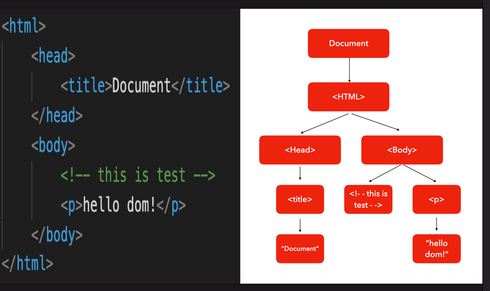

## DOM (Document Object Model)

- HTML 문서의 내용을 트리형태로 구조화하여 웹페이지와 프로그래밍 언어를 연결시켜주는 역할을 함
  <br> (`노드`: 이때 각각의 요소와 속성 및 컨텐츠를 표현하는 단위)



### DOM 트리에 접근하는 방법

- document 객체
  - 브라우저가 불러온 웹 페이지를 나타내며 DOM 트리의 진입점 역할을 수행함
  - document 객체를 통해 HTML 문서에 접근할 수 있음

- 예시
```js
/* 해당 id를 가진 요소에 접근 */
document.getElementById(); 

/* 해당 모든 요소에 접근 */
document.getElementsByTagName();

/* 해당 클래스를 가진 모든 요소에 접근 */
document.getElementsByClassName();

/* css 선택자로 단일 요소에 접근하기 */
document.querySelector('selector');

/* css 선택자로 여러 요소에 접근하기 */
document.querySelectorAll('selector'); 
```

### DOM 제어 명렁어

#### :one: 이벤트 삽입

- 삽입할 이벤트 형태: `target.addEventListener(type, listener)` 
- listener 함수와 인수에는 이벤트에 대한 정보가 담겨 있음


```html
<body>
    <button>Hello</button>
    <script>
      const myBtn = document.querySelector("button");
      myBtn.addEventListener('click', function(){
        console.log("hello world");
      })
    </script>
</body>
```

#### :two: 클래스 제어

- DOM api를 통해 요소의 class 속성을 제어할 수 있음 

```html
<body>
    <button>버튼을 파란색으로</button>
    <script>
      myBtn.addEventListener('click', function(){
        myBtn.classList.add("blue");  // blue 클래스 속성값 지정
        myBtn.classList.remove("blue");  // 클래스 제거
        myBtn.classList.toggle("blue");  // 클래스를 토글함. 없으면 넣어줌
        myBtn.classList.contains("blue");  // 클래스 존재 유무 확인
      })
    </script>
</body>
```

#### :three: 요소 제어 

- DOM api를 이용해서 요소를 새로이 생성하고, 위치시키고, 제거할 수 있음

```html
<ul></ul>
<button>make me more!</button>
<style>
  // document.createElement(target); target 요소를 생성
  // document.createTextNode(target); target 텍스트를 생성
  // element.appendChild(target);    target 요소를 element의 자식으로 위치시킴
  // element.removeChild(target);    element의 target 자식 요소를 제거함 
                                     
  const myBtn = document.querySelector("button");
  const myUl = document.querySelector("ul");

  myBtn.addEventListener('click', function(){
  for(let i=0; i < 5; i++){
    const myLi = document.createElement('li');
    myUl.appendChild(myLi);
  }
  })
</style>
```

#### :four: JavaScript 문자열을 사용해 element, text 노드를 생성 및 추가

- DOM api를 이용해서 요소 안의 값에 접근하여 값을 가져오거나 변경할 수 있음

```html
<body>
<p></p>
<input type="text">
<button>Write Something!</button>

<script>
const myBtn = document.querySelector("button");
const myP = document.querySelector("p");
const myInput = document.querySelector("input");

myBtn.addEventListener('click', function(){
	myP.textContent = myInput.value;
});

// input 요소에 'input' 이벤트를 연결하여 실시간으로 값이 반영되게 만듦
myInput.addEventListener('input', ()=>{
  myP.textContent = myInput.value;
});

myP.innerHTML = "<strong>I'm Strong!!</strong>";
myP.outerHTML = "<div></div>";

</script>
</body>
```

##### innerHTML
  - 요소(element) 내에 포함된 HTML 마크업을 가져오거나 설정함
  - innerText 속성은 요소의 렌더링된 텍스트 콘텐츠를 나타냄
  <br>(innerText는 "사람이 읽을 수 있는" 요소만 처리함)

##### textContent 
  - textContent 속성은 노드의 텍스트 콘텐츠를 표현함


<br>

## JS 이벤트

- `이벤트`: 시스템에서 발생하는 작업 또는 사건
- 특정 버튼을 클릭하거나 DOM 로드가 완료되는 등의 이벤트가 발생할 경우, 브라우저는 이러한 이벤트를 감지할 수 있음

### 이벤트 예시

- 시스템은 이벤트가 발생할 경우 일종의 신호를 생성하고 작성된 코드를 실행시킴
  <BR>EX) 사용하자 키보드의 키를 눌렀을 떄 특정 함수를 호출해서 어떠한 로직을 실행시키고 싶은 경우
  <BR> => 브라우저가 사용자의 키보드의 키 입력 감지
  <BR> => 특정 키에 대한 이벤트 발생
  <BR> => 해당 이벤트에 대한 함수를 호출하도록 브라우저에 위임

- 예시) `<button>`이 눌렸을 떄 배경을 임의의 색상으로 변경하는 코드

```html
<body>
  <button>버튼 클릭시 색깔 바꾸기</button>
  <script>
    const button = document.querySelector("button");

    function randomNumber(num) {
      return Math.floor(Math.random() * (num + 1));
    }

    button.addEventListener("click", () => {
      const randomColor = `rgb(${randomNumber(255)}, ${randomNumber(
        255
      )}, ${randomNumber(255)})`;
      document.body.style.backgroundColor = randomColor;
    });
  </script>
</body>
```

본 예시는 이벤트를 등록하는 메서드 `addEventListener()`를 이용하여 이벤트 흐름과 이벤트를 처리하는 함수가 전달됨
<br>
이로 인해 사용자는 버튼의 `addEventListener()`메서드를 호출해서 click 이벤트와 이벤트가 발생했을 때 호출되는 함수(임의의 RGB 색상 생성함수)를 전달해서 버튼이 눌릴 때마다 해당 이벤트를 감지하여 함수를 호출함

<br>

### 인라인 이벤트 모델

- 지역적
- 제일 먼저 추가된 이벤트 모델
- 지금까지 계속 사용하고 있음
- 이벤트 모델: 이벤트 발생시 수행 코드

- 어떤 이벤트가 발생했을 떄 내가 원하는 기능이 수행되게끔 하기위해서 태그에 구현
- `<태그명 on이벤트명="처리할 코드">` 꼴

  - 명시적으로 어떤 이벤트를 등록하는지 구분할 수 있음
  - click 이벤트를 등록하고 싶다면 `<태그명 onClick>`꼴로 사용
  - 처리할 코드가 많다면 함수로 만들어놓고 함수를 호출하는 식으로 사용

<br>

- `<태그명 on이벤트명="처리할 코드"; return false>`

  - 해당 태그가 default event handler를 내장하고 있는 경우 등록한 이벤트도 수행하고 마지막에 수행되는것이 false값이라면 default handler는 수행하지 않음 (default 이벤트 핸들러가 없다면 default 이벤트 핸들러를 수행하지 않을 것임)

- 예시: `onClick = "..." `

- 등록한 이벤트를 해제하는 방법이 없음

<br>

### 고전 이벤트 모델

- 전역적
- 전역적 이벤트 모델에 속하는 애들은 이벤트가 발생했을 때 js엔진이 호출해줌 (콜백 메서드. 콜백 메서드 - 어떤 상황이 되었을 경우 자동으로 호출되는 메서드)
- 인라인 이벤트 모델처럼 태그에 구현하는 것이 아님
- HTML 태그가 아닌 독립된 JS영역에 구현
- 태그의 DOM 객체를 찾아와야 함
- DOM 객체를 찾았을 경우 찾은 DOM 객체의 이벤트 핸들러에 해당되는 함수를 등록함
  <BR> (이벤트 처리코드를 함수로 만들어서 처리)

<br>

- `찾아온 DOM 객체.on이벤트명 = 함수(return false)`꼴
  - 반드시 함수로 만들어서 등록해야 함
  - on이벤트명에 해당하는 속성을 만들어서 등록함. (메서드로 만들어서 등록함. 반드시 소문자로 작성할 것)
  - 기본 이벤트 핸들러가 수행되지 않도록 하고 싶으면 `return false`추가

<br>

- 등록한 이벤트를 해제하는 방법이 존재

  - `DOM객체.on이벤트명 = null` => 더이상 수행할 함수가 없으므로 이벤트 핸들러가 해제됨

- 2개 이상의 함수를 등록할 수 없음. 마지막에 등록한 애만 수행되고 이전의 것은 사라짐.

<br>

### 표준 이벤트 모델

- 전역적
- 전역적 이벤트 모델에 속하는 애들은 이벤트가 발생했을 때 js엔진이 호출해줌 (콜백 메서드. 콜백 메서드 - 어떤 상황이 되었을 경우 자동으로 호출되는 메서드)
- `DOM객체.addEventListener("이벤트명", 함수)`
- HTML 태그가 아닌 독립된 JS영역에 구현

<br>

- 등록한 이벤트를 해제하는 방법이 존재

  - `DOM객체.removeEventListener("이벤트명",함수)`

- `이벤트객체.preventDefault()`를 호출하면 기본 이벤트 핸들러를 수행하지 않음

- 2개 이상의 함수를 등록할 수 있음. 이전에 등록된 핸들러도 수행하고 나중에 등록된 핸들러도 수행됨.

#### 마우스 이벤트

#### 키보드 이벤트

#### 포커스 이벤트

<br>

### 이벤트 핸들러

<br>

### load event

- [exam12.html](./exam12.html)
- [exam12_1.html](./exam12_1.html)
- [exam12_2.html](./exam12_2.html)

<br>

## canvas API

- 재미로 볼것
- [exam12.html](./exam14.html)

<br>

## 이벤트 버블링 & 이벤트 캡쳐링

- [stopPropagation](https://developer.mozilla.org/en-US/docs/Web/API/Event/stopPropagation)
- [stopPropagation2](https://www.w3schools.com/jsref/event_stoppropagation.asp)

## 이벤트 캡쳐링

<br>

## JSON
