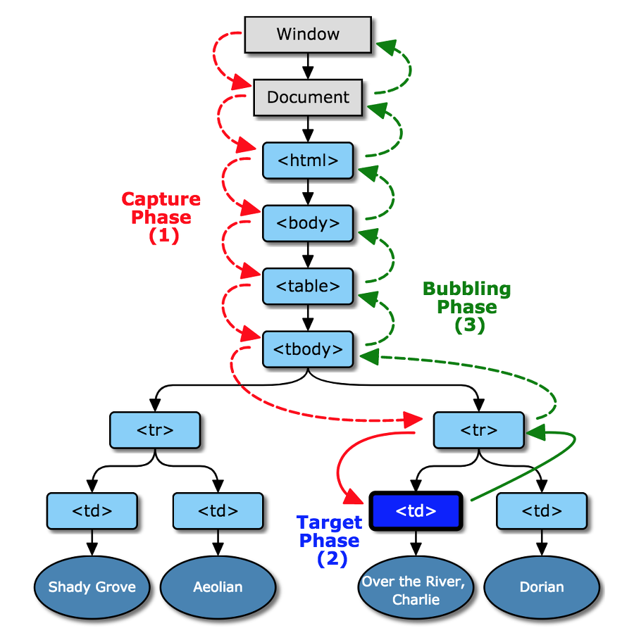
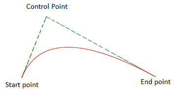
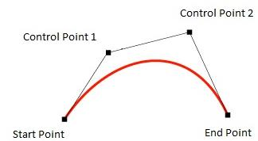
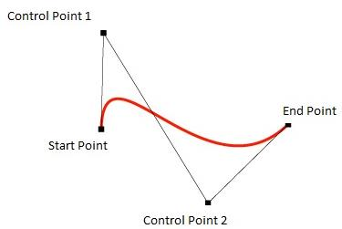
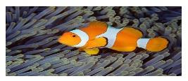
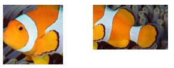
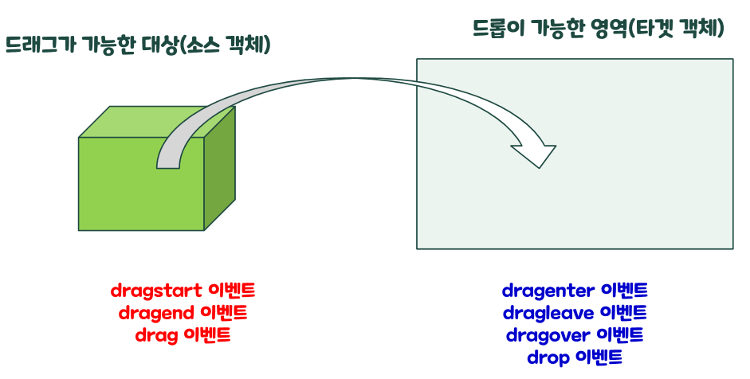
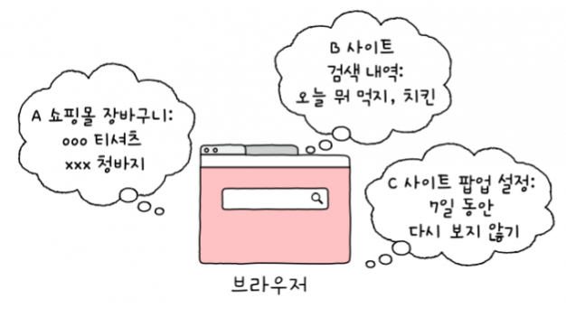
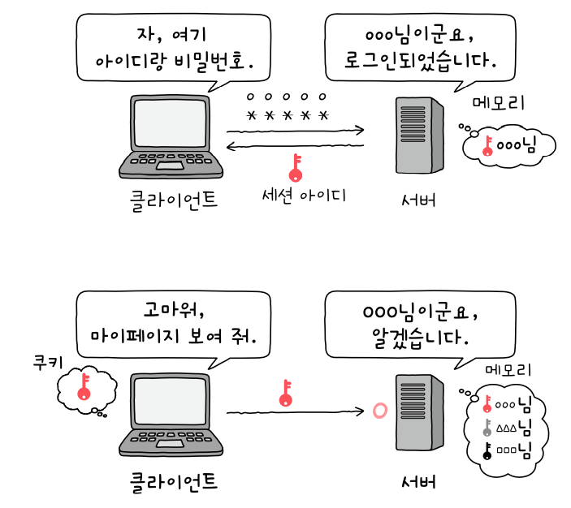

# 이벤트 캡처링



- 캡처링은 자동으로 일어나는게 아니라 이벤트 핸들러를 등록할떄 설정함
- 자손에서 발생한 이벤트에 대한 처리를 조상 태그가 가로채서 먼저 수행함
-

# HTML5의 유용한 API

## Canvas API

- 자바스크립트로 웹 페이지에 그림을 그릴 수 있도록 지원하는 HTML5 API
- 자동화 및 공정관리 프로그램 등으로 돌던 애들을 웹 기반으로 바꿀 때에 많이 사용함
- 캔버스로 그림을 그리기 위해서 그림을 그리는 공간을 `<cavnas>`태그로 마련해야 함

### HTML Canvas Object

- 얘를 가지고 getContext() 메서드를 호출함
- 이를 통해 2차원 그래프, 3차원 그래프 등을 그릴 수 있음(getContext("2d"), getContext("3d"))
- 리턴값: 캔버스 객체

- 웹스크립트로 그림을 그리기 위해서는`<canvas>` 태그를 DOM 객체로 접근해야한다.
- `<canvas>` 엘리먼트를 사용하여 그림을 그리기위한 영역을정의하고 스크립트(JavaScript 코드)로 그림을 그림

### 그림을 그리기 위해 지원하는 메서드

- fillRect(x, y, width, height) : 색이 칠해진 사각형을 그린다.
- strokeRect(x, y, width, height) : 테두리만 있는 사각형을 그린다.
- clearRect(x, y, width, height) : 인자로 지정된 특정영역을 지우고 완전히 투명하게 만든다.
- beginPath() : 경로를 시작한다. (항상 3시방향이 시작점)
- closePath() : 경로를 종료한다.
- stroke() : 경로를 따라서 테두리선을 그린다.
- fill() : 설정된 스타일로도 형을 채운다.
- moveto(x,y) : (x,y) 위치로 시작점을 옮긴다.
- lineto(x,y) : x에서y까지 직선을 그린다.
- strokeText(msg, x, y) : (x,y) 위치에 텍스트를 테두리선만 그린다.
- fillText(msg, x, y) : (x,y) 위치에 텍스트를 색을채워서 그린다.
- measureText(msg) : 측정된 문자열의 길이정보를 저장한 TextMetrics 객체를 리턴한다.
- arc(x, y, r, startAngle, endAngle, anticlockwise) : (x,y)에서 시작하여 반시계방향 (anticlockwise)으로 반지름(r)만큼의원을 그린다.

#### 곡선을 그리기 위해서 지원하는 메서드

- quardraticCurveTo(cp1x, cp1y, x, y) : 한개의 조절점(cp1x,cp1y)을 이용해(x,y)까지의 곡선을 그린다
- bezierCurveTo(cp1x, cp1y, cp2x, cp2y, x, y) : 두개의 조절점(cp1x,cp1y)와(cp2x,cp2y)를 이용해(x,y)까지의 곡선을 그린다.
  <br> (조절점이 대칭되게 있으면 S자가 됨)







- drawImage(image, sx, sy)
- drawImage(image, sx, sy, sWidth, sHeight)
- drawImage(image, sx, sy, sWidth, sHeight, dx, dy, dWidth, dHeight)
- 이미지 파일을 읽어서 주어진 위치에 주어진 크기로 또는 슬라이스하여 그린다.





### 그라디언트와 패턴

#### 그라디언트

#### 패턴

#### save()

- 캔버스의 상태정보를 스택에 저장
- 회전이나 크기 조절과 같이 캔버스에 적용된 변형 내용

#### restore()

- 스택에 저장된 상태 정보를 읽어옴

### 캔버스 스타일

#### 색상

##### fillStyle

- 채워질 색상 지정

##### strokeStyle

- 테두리 색상 지정
- CanvasGradient 객체, CanvasPattern 객체를 지정할 수 있음

##### globalAlpha

- 투명도를 지정함
- 0 (완전 투명) ~ 1(완전 불투명) 사이의 값을 가짐

#### 선

### 캔버스 저장

- 그려진 캔버스의 그림(이미지)을 보관하기 위해 스토리지에 보관하려면 반드시 텍스트 형식이어야 함
  <br> (data url 형식으로 변환해서 저장해야 함)
  <br> (캔버스 object 객체가 제공하는 `toDataURL` 등을 이용할 것)

<br>

## Multimedia API

### `<video>`와 `<audio>` 태그 관련 API

- controls, autoplay, loop

  - 설정 여부를 조정하는 boolean 타입의 속성

- currentTime

  - 현재의 재생 위치를 초 단위로 나타내는 속성

- duration

  - 오디오 또는 비디오 파일의 길이를 초단위로 나타내는 속성

- ended/paused

  - 재생의 종료여부 또는 일시 정지 여부를 나타내는 속성

- canPlayType(type)

  - 브라우저가 해당 미디어 타입을 재생할 수 있는지를 나타내는 문자열

- play()

  - 현재 위치에서 재생을 시작함

- pause()
  - 오디오가 재생 중일 경우 일시정지함

<br>

## Drag & Drop API

### Drag & Drop이란?

- 사용자 편의성을 고려한 UI 기능임
- 마우스를 사용하여 애플리케이션 간에 파일이나 애플리케이션의 데이터를 전달하는 기능으로서 다양한 이벤트의 핸들러를 구현하여 처리함
- 웹 애플리케이션에서 화면 상에 나타나는 요소를 옮기거나 외부에 있는 파일을 읽어 웹 페이지에 출력 또는 업로드 하는 용도로 사용됨

### Drag & Drop 이벤트



- 어디인가에 가져다 놓으면 Drop 이벤트가 발생

- 소스 객체

  - Drag&Drop가 가능한 대상 객체 (마우스로 집어서 옮길 수 있는 대상)
  - HTML5 요소들은 draggable 속성의 값을 true로 설정하면 드래그가 가능한 소스객체가 됨
  - 이미지만 Drag&Drop이 적용될 수 있는 태그임 (다른 것들은 draggable 속성을 true로 설정해야 Drag&Drop이 가능해짐)
  - img 요소는 기본적으로 draggable 속성의 값이 true이며 다른 요소들은 직접 draggable의 속성값을 설정 해주어야 함
  - 소스 객체에서 drag start&drag end가 수행
  - 소스 객체에서 `dragstart이벤트 (필수)`, `dragend 이벤트`, `drag 이벤트`가 발생

- 타겟 객체
  - Drop을 할 수 있는 영역의 객체
  - 소스 객체를 가져다가 어디에 떨어뜨려놓는 것이 드롭인데, 드롭의 효과를 처리할 수 있는 객체가 `타겟 객체`.
  - 마우스로 대상을 쥐고 있다가 놓으면 타겟 객체에서 Drop 이벤트가 발생함
  - 타겟 객체에서 `dragenter 이벤트`, `dragleave 이벤트`, `dragover 이벤트`, drop 이벤트`가 발생

### dataTransfer 객체

- 드래그되는 소스 객체에서 Drop이 일어나느 타겟 객체로 전달하려는 데이터를 저장하는 객체

<br>

## 쿠키

- 크롬이나 사파리 등의 브라우저에 저장되는 작은 텍스트 조각
<br> (사용자가 가지고 있는 정보)


- 사용자에게 맡겨도 될 (타인에게 탈취되거나 사용자에 의해 조작되어도 크게 문제되지 않을)정보를 브라우저에 저장함으로써 
웹사이트 이용을 편리하게 해주는 것이 `쿠키`임


- 쿠키를 설정하면 사이트에 로그인하지 않아도 장바구니에 물건을 담아두거나 검색 기록에서 이전에 입력한 검색어들을 찾아볼 수 있음
- 내 웹 서핑 내역이 마케팅과 광고에 활용되는 것 또한 쿠키를 통해 이루어짐


- 사용자는 브라우저의 설정 화면 혹은 개발자 도구에서 쿠키를 확인하고 수정 및 삭제할 수 있음
<br> (다만 쿠키는 당사자뿐만 아니라 제3자가 조회하는 것도 가능하므로 개인정보나 민감한 정보를 저장하는데에는 적합하지 않음)



- EX) 자주 보는 웹툰 목록, 웹 페이지의 다크 모드 설정 여부


## 세션

- 서버가 나를 알아보는 방법
- 로그인 여부 등 사용자와 서버의 관계가 기억되어 보존되고 있는 상태를 뜻함

- 사용자가 사이트에 한 번 로그인을 하면 유효기간이 끝날 때까지 더 이상 아이디와 비밀번호를 입력하지 않아도 되도록 사용자가 이미
서버로부터 인증받았음을 증명해주는 증서


### 세션 동작 방식

1. 사용자가 서버에 올바른 아이디와 비밀번호로 로그인에 성공
2. 서버는 `세션 아이디`라는 데이터를 만듦. 보통은 ‘2sd98dbawix4’와 같은 식으로 알파벳과 숫자가 혼합된 형식을 갖고 있음
3. 서버는 영화관에서 티켓을 보관용 부분만 찢어 건네주듯 세션 아이디를 사용자에게 전달하고, 메모리에 아이디 사본을 어떤 사용자의 것인지 적어서 보관함
4. 사용자는 서버로부터 받은 세션 아이디를 쿠키로 저장한 다음 앞으로의 모든 요청에 함께 전달함
<BR>(친구 목록을 보거나 댓글을 작성 및 수정할 때, 구매한 상품 내역을 보는 등의 경우에도 서버 에게 세션 아이디를 적은 편지를 보냄)



5. 서버는 사용자에게서 (친구 목록을 보겠다는 등의) 요청을 받으면 그 편지에 세션 아이디가 적혀있는지를 확인함. <BR>
아이디가 있다면 서버가 보관하고 있는 세션 아이디 중 동일한 정보가 있는지를 찾아보고 그것이 누구의 계정인지 또한 알아냄.
6. 편지를 보낸 사람이 누구인지 확인을 한 다음 사용자의 (친구 목록을 보여달라는) 요청에 대해 응답을 해줌 (사용자의 친구 목록을 보여줌)


<br>

## Web Storage API

- 웹 브라우저에 자료를 저장하기 위한 기능
- 저장하려는 데이터마다 유일한 이름(`key`)을 같이 저장함 (`key-value 쌍`을 저장)
- 저장하려는 데이터의 종류에는 제한이 없으며 저장시에는 문자열로 저장됨 (JSON은 JSON.stringify 이용)
- 스토리지에는 binary 형식의 데이터는 저장할 수 없음


- 웹 스토리지 API는 기존 쿠키의 문제점을 극복하기 위해 웹 브라우저가 직접 데이터를 저장할 수 있게 해줌
<BR>(HTML5 이전에는 응용 프로그램이 데이터를 서버에게 요청할 때마다 매번 쿠키에 정보를 저장함)
<BR> => 하지만 웹 스토리지는 사용자 측에서 좀 더 많은 정보를 안전하게 저장할 수 있게 해줌
<BR> => 웹 스토리지는 최소 5MB 이상의 공간을 가지고 있으며, 이는 절대 서버로 전송되지 않음


- `Same Origin Policy 정책` 적용


- 웹 스토리지 API는 사용자가 데이터를 저장할 수 있도록 `로컬 스토리지`와 `세션 스토리지` 객체를 제공함


- `개발자 도구 > Application` : 웹 클라이언트와 관련된 자원들을 직접 확인할 수 있는 공간


### Same Origin Policy 

- 웹 스토리지는 Origin(도메인과 프로토콜 한 쌍으로 이루어진 식별자)마다 단 하나씩만 존재함
<br> => 하나의 Origin에 속하는 모든 웹 페이지는 같은 데이터를 저장하며 같은 데이터에 접근할 수 있음

- 따라서 해당 스토지리를 보관하는 페이지에서만 해당 정보를 읽어올 수 있음
- ex) 다음에서 이 스토리지를 보관하면 다음에서만 읽을 수 있고, 네이버에서 저장하면 네이버에서만 읽을 수 있음


### localStorage 객체

- 보관 기한이 없는 데이터를 저장할 수 있는 객체
- 삭제하지 않는 이상 영구 저장됨
- 브라우저 탭이나 창을 닫거나 컴퓨터를 재부팅하더라도 데이터를 사라지지 않음

- 지속적으로 필요한 데이터는 로컬 스토리지에 저장


#### window.localStorage의 주요 멤버

##### length

- 스토리지에 저장된 key&value 쌍의 개수를 추출하는 속성

##### key(index)

- 숫자형 인덱스에 해당하는 key를 리턴함


##### setItem(key, value)

- 스토리지의 key에 해당하는 value를 저장함

```js
localStorage.setItem('key', 'value')
```

```ts
class ModelEX{
    id: number;
    name: string;
    
    constructor(id: number, name:string){
        this.id = id;
        this.name = name;
    }
}

const modelEX = new ModelEX(100, 'king');
localStorage.setItem('modelEX', JSON.stringify(modelEX));
```


##### getItem(key)

- 스토리지로부터 key에 해당하는 value를 추출함

```js
const result = localStorage.getItem('key');
```


##### removeItem(string key)

- 스토리지의 key에 해당하는 value를 제거

##### clear()

- 현재 스토리지의 모든 데이터를 제거함

##### onStorage

- 로컬 스토리지의 내용이 변경될 때마다 발생하는 이벤트로 로컬 스토리지의 변경 사항을 모니터링하는 것이 가능함
- StorageEvent 객체가 생성됨

###### StorageEvent 객체의 주요 속성

- `key` : 추가/삭제/변경된 키 이름
- `onValue` : 업데이트되기 전의 값으로 새로 추가된 값이면 null
- `newValue` : 새로 업데이트된 값으로 기존 값을 삭제한 경우에는 null
- `url` : 변경 사항이 발생한 페이지의 URL

<br>

#### 로컬 스토리지의 데이터 관리

- 로컬스토리지의 객체 영역에 보관

##### 1. 보관 방법

- 로컬스토리지객체.key = "값"
- 로컬스토리지객체[key] = "value:
- 로컬스토리지객체.setItem("key", "value");

##### 2. 읽기 방법

- var 변수 = 로컬스토리지객체.key
- var 변수 = 로컬스토리지객체[key]
- var 변수 = 로컬스토리지객체.getItem[key]

##### 3,. 삭제 방법

- delete 로컬스토리지객체.key
- delete 로컬스토리지객체[key]
- 로컬스토리지객체.removeItem(key)

<br>

### sessionStorage 객체

- 하나의 세션(session)만을 위한 데이터를 저장하는 객체
- 현재 브라우저가 기동되는 동안만 유효 
<br> => 사용자가 브라우저 탭이나 창을 닫으면 이 객체에 저장된 데이터는 사라짐


- 브라우저가 기동되는 동안만 잠깐만 사용하고 말 데이터는 세션 스토리지에 저장
<br>(일회성 로그인 정보 등)


#### 세션 스토리지의 데이터 관리

##### 1. 저장 방법

- 세션스토리지객체.key = value
- 세션스토리지객체[key] = value
- 세션스토리지객체.setItem(key, value)

##### 2. 읽기 방법

- var 변수명 = 세션스토리지객체.key
- var 변수명 = 세션스토리지객체[key]
- var 변수명 = 세션스토리지객체.getItem(key)

##### 3. 삭제 방법

- delete 세션스토리지객체.key
- delete 세션스토리지객체[key]
- 세션스토리지객체.removeItem(key)

