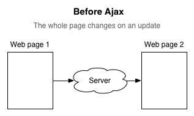
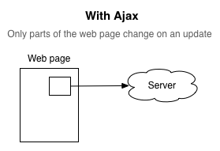
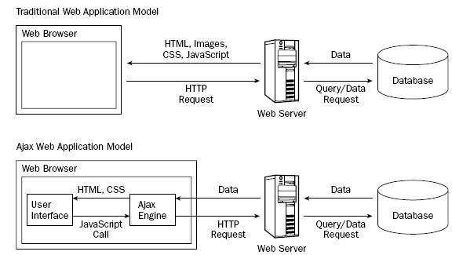
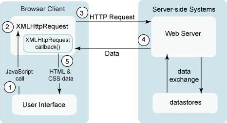
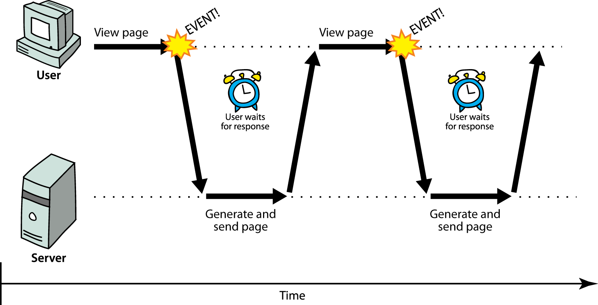
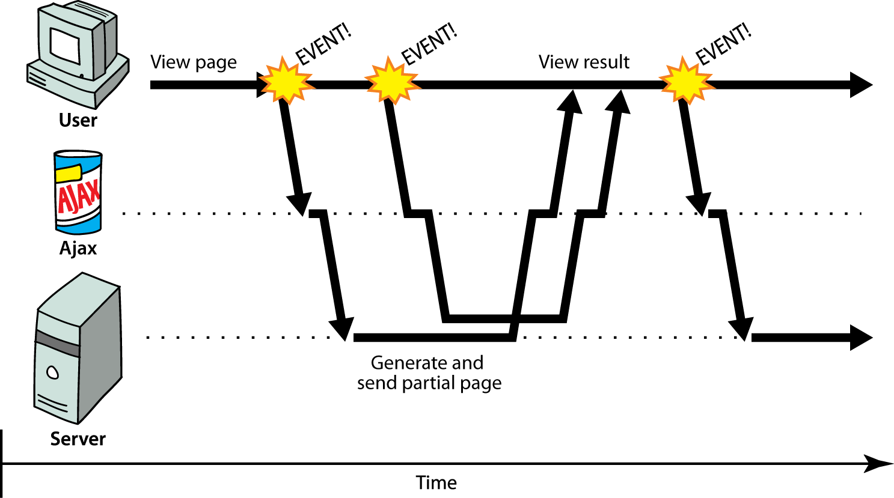
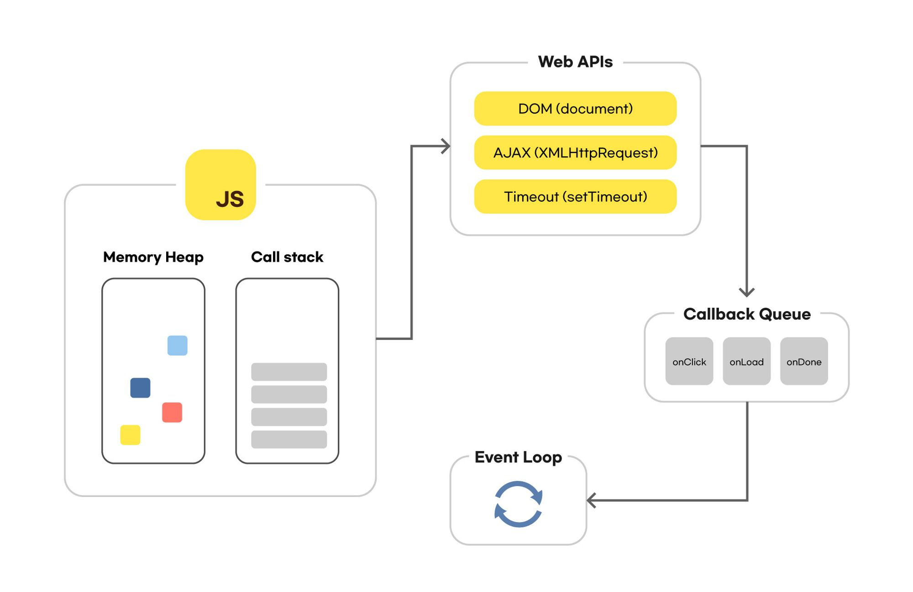
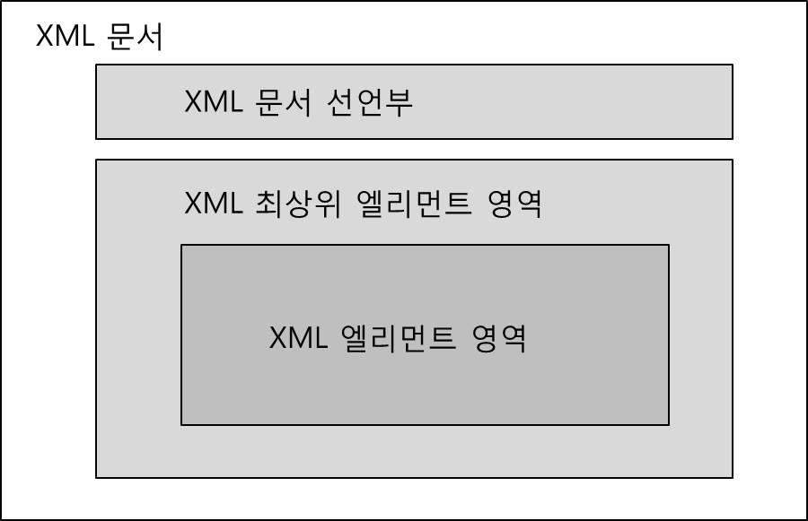

# AJAX

- 비동기 자바스크립트 & XML (Asynchronous Javascript And XML)
- 웹 통신에 대한 방법들 중 하나이며, 기존의 동기식으로 웹을 구성했던 방식과 달리 비동기식으로 구성할 수 있음
- 비동기식으로 서버와 통신하기 위해서는 기본적으로 `XMLHttpRequest`객체를 사용함
<br>(ES6는 promise 기반인 `fetch`, node는 `axios`를 사용 )
- 텍스트 일부만 변경하고 싶을 때 기존의 웹 페이지 기술을 적용한다면 페이지 전체를 새로고침했어야 하지만,
`AJAX`를 사용한다면 필요한 데이터만 서버에 요청하여 받은 다음 변경될 부분만 반영해주면 된다.
<br> => AJAX를 사용함으로써 빠르게 동적인 웹 페이지를 생성할 수 있게 됨









## AJAX 동작 과정



1. 이벤트 발생에 의해 이벤트핸들러 역할의 JavaScript 함수를 호출함
2. 핸들러 함수에서 XMLHttpRequest객체를 생섬함
<br> (요청이 종료되었을 때 처리할 기능을 콜백함수로 만들어서 등록함)
3. XMLHttpRequst 객체를 통해 서버에 요청을 보냄
4. 요청을 받은 서버는 요청 결과를 적당한 데이터로 구성하여 응답함
5. XMLHttpRequest 객체에 의해 등록된 콜백함수를 호출하여 응답 결과를 현재 웹 페이지에 반영함


## SOP (Same Origin Policy)

- 브라우저에서 보안상의 이슈로 인해 `동일 사이트의 자원(resource)에만 접근`해야 한다는 제약
- AJAX는 SOP 제약의 영향을 받으므로 `origin 서버가 아니면 AJAX로 요청한 컨텐츠를 수신할 수 없음`


## CORS (Cross Origin Resourse Sharing)

- `Origin이 아닌 다른 사이트의 자원에 접근하여 사용`한다는 뜻
- Open API의 활성화와 공공 DB의 활용에 의해 CORS의 중요성이 강조되고 있음
- HTTP header에 CORS와 관련된 항목을 추가함


<BR>

## 동기

- 요청을 보낸 다음 응답을 받아야만 다음 동작을 실행하는 방식
- 순차적으로 실행해야 하며, 어떤 작업이 수행중이라면 이후 작업들은 현재 작업이 완료될 때까지 중단됨
- 웹은 기본적으로 동기 통신임
<BR> (AJAX를 사용하면 동기/비동기 통신을 선택할 수 있음)




## 비동기


- 요청을 보낸 다음 응답과 상관없이 다음 동작을 실행함
- 병렬적으로 실행되며, 현재 작업이 종료되지 않더라도 다음 작업들은 현재 작업에 대해서 응답을 대기하지 않고 현재 작업이 실행된 후 즉시 실행됨
<br>(하나의 동작이 완료되지 않아도 다음 코드가 실행되는 것을 뜻함)




### 비동기 이해

- 자바스크립트는 싱글 스레드를 가진다.
- 그럼에도 비동기로 동작할 수 있는 것은 브라우저의 Web API가 멀티스레드로 동작하기 때문이다
<br> (스레드: 기본적으로 프로그램이 작업을 완료하는데에 있어 사용할 수 있는 단일 프로세스. 각 스레드는 한 번에 하나의 작업만 수행할 수 있음)



JS 실행환경을 살펴보면 JS엔진의 콜스택에 실행될 함수가 쌓이게 되고, 비동기로 실행될 때에는 Web API를 호출하게 된다
<BR>
Web API에서는 콜백 함수를 콜백 큐(테스크 큐)에 추가하게 되고, 이벤트 루프는 콜백 큐의 함수를 꺼내서 콜 스택에 넣는다
<BR>
이벤트 루프와 콜백 큐가 있기 때문에 콜 스택이 하나여도 비동기 동작이 가능하다

### 비동기 처리의 필요성

- 웹에서 서버에 데이터를 요청했을 때 요청이 완료되기 전까지 아무것도 실행하지 않는다면
화면이 멈춘것처럼 보일 뿐만 아니라 프로그램을 실행하는 데 많은 시간이 소요될 것이다


- 하지만 실행 순서가 중요할 경우가 존재하는데 이 경우 비동기 통신이 필요하다
<BR> EX) 다른 코드가 서버에 요청한 데이터 값을 이용해야할 경우, 데이터를 받아온 다음 코드가 실행되어야 함
```JS
let response = fetch('mySnack.jpg');
let snackImg = response.snackImg(); 
// 서버에서 이미지를 가져오면 이미지 크기, 네트워크 환경에 따라 실행 불가한 경우 발생
// 따라서 비동기 처리 필요 
```
=> 이러한 경우 서버에 요청을 보내고 결과가 돌아오지 않아도 다음 코드를 실행하는 비동기 처리가 필요하다


### 비동기 처리 종류

#### 1. Promise
  - 응답에 관환 정보를 가지고 있는 객체
  - then, catch를 통해 결과값을 처리함


#### 2. await/async

- Promise를 기반으로 함
- (then-catch 대신) try-catch를 사용함

#### 3. fetch

- 접근하고자 하는 url과 매개변수로 네트워크 요청을 보낼 수 있음


<BR>


# XML (eXtensible Markup Language)

- OS에 무관한 규격화된 문서를 만드는 언어
- 파싱이 끝난 XML DOM 객체를 쓸 수 있게 해줌



- XML 문서 선언부
  - 반드시 맨 앞에 명시 및 XML 문서 유형을 지정함
  - XML 문서 구조를 정의한 DTD(또는 XML 스키마)를 선언함
  - 스타일을 정의한 CSS연결에 대한 선언 명세


- 태그를 목적에 알맞게 직접 설계하는 것에는 `DTD`, `XML Schema`가 존재


## 폴링

- 하나의 장치(또는 프로그램)가 충돌 회피 또는 동기화 처리 등을 목적으로 다른 장치(또는 프로그램)의 상태를 주기적으로 검사하여 일정한 조건을 만족할 때 송수신 등의 자료처리를 하는 방식
<br>
ex) 우편물이 왔는지를 매번 내가 가서 확인하는 것


- 주기적으로 알아보는만큼 오지 않았을 때 나가보는 동안 비효율이 발생함 

## 이벤트

- 어떤 상태가 되면 알려주는 것
<br>
ex) 매번 가는 것이 아니라 우편물이 도착했을 때 문자를 보내는 것

- 폴링 방식보다 효율적
- 정기적으로 뭔가를 감시하거나 검사를 해야하는 경우, 폴링방식도 하다.<br>
하지만 이벤트 방식으로 트리거를 발생시켜서 인지를 하게되면 효율적으로 처리할 수 있다

  - 시스템 내에서는 대게 이벤트 방식으로 처리를 한다
  <br> => 이벤트가 발생하게 되면 interrupt와 같이 하던 일을 중단시키고 해당 이벤트가 원하는 일을 해주기도 함


<br>


# JSON (JavaScript Object Notation)

- 자바스크립트에서 객체를 표현하는 형식으로 데이터를 표현한 것 (텍스트로 표현된 정보의 덩어리로 보면 됨)
- 클라이언트와 서버간의 HTTP 통신을 위한 텍스트 포맷
- 자바스크립트에 종속되지 않는 언어 독립형 포맷
  <br> => 따라서 대부분의 언어에서 사용할 수 있음

- key & value로 구성된 순수한 텍스트 (js의 객체 리터럴과 유사)
- 유니코드로 인코딩하며 표현할 수 있는 자료형에는 `수`, `문자열`, `참/거짓`, `null`, `배열`, `객체`등이 있다
- 다른 방식에 비해 가볍고 JS와의 호환성이 높기 때문에 널리 사용됨

- JSON은 단일 인용부호('')를 지원하지 않으므로 더블 인용부호("")를 써야함


## XML vs JSON

```xml
<!--xml-->
<students>
  <student>
    <name>김길동</name><gender>남</gender>
  </student>
  <student>
    <name>김길순</name><gender>여</gender>
  </student>
</students>
```


```json
// JSON

{
  "students": {
    "student": [
      {
        "name": "김길동",
        "gender": "남"
      },
      {
        "name": "김길순",
        "gender": "여"
      }
    ]
  }
}
```


## XMLHttpRequest 객체

- 서버측과 비동기 통신을 제어하는 역할 수행

- `XMLHttpRequest`객체를 이용해서 지금까지 브라우저가 실행해온 서버와의 통신 부분을 JS가 제어할 수 있게 됨

- XMLHttpRequest 객체는 서버와 데이터 교환할 떄 (상호작용)에 사용되며, 전체 페이지의
새로고침없이 서버에서 데이터를 받는 것이 가능하다
<br> => 이를 이용해서 페이지를 사용하고 있는 행동을 방해하지 않고, 페이지의 일부를 업데이트하는 것 또한 가능할 것이다


### XMLHttpRequest 객체의 생성

```js
var 변수명 = new XMLHttpRequest()   // 인스턴스 생성
```

### 서버에 요청 (request)

- XMLHttpRequst 인스턴스의 `open()`메서드를 이용해서 요청을 초기화하고, `send()`메서드를 이용해서
서버로 요청함

#### 1. open() 메서드

- 서버로 보낼 AJAX 형식을 초기화함
- 어떤 방식으로 누구에게 데이터를 보내야할지를 결정함

```js
open(전달방식, URL주소, 동기여부); 

open(HTTP 메서드, URL, [,비동기 모드 통신 여부]);
```

- `전달방식(요청을 전달할 방식)`: HTTP 메서드.  GET, POST, PUT, DELETE, ...
<BR> (GET 방식의 경우 인자 생략)

- `URL주소`: AJAX로 요청을 처리할 서버의 파일 주소 URL
- `동기 여부`: 동기(false), 비동기(true) 설정


#### 2. send() 메서드

- `open()`메서드로 작성한 AJAX 요청을 서버로 보냄
- 비동기식으로 설정 후 전송할 경우 바로 리턴되고, 동기식일 경우 서버에서 응답이 올 때까지 대기함

```js
send(요청 파라미터)

send();   // GET
send(문자열);   // POST -> POST의 경우 Query 문자열을 인수로 지정
```


### GET과 POST 방식의 HTTP 요청


- 웹 클라이언트에서 웹 서버에게 요청을 보낼 때 `name=value & name=value`로 구성된 데이터를
  함께 전달할 수 있음
- 요청방식: GET 방식, POST 방식
- GET방식
  - 요청 대상 URL 문자열 뒤에 `?`기호와 함께 추가되어 전달되는 방식
  - 전달되는 name&value쌍의 길이에 제한이 있음
  - 외부로 보여지기 때문에 보안에 취약함
  - 서버에게 전달하면서 추가로 전달하는 데이터 : 쿼리 문자열

- POST방식
  - 요청 body안에 담아서 전달
  - 길이에 제한이 없음
  - 전달되는 데이터가 외부에 보여지지 않음 
  - 전달되는 데이터열의 길이가 가변적
  - 서버에게 전달하면서 추가로 전달하는 데이터 : 요청 파라미터


- majortype/minortype
  - `MIME type 문자열` (주고받는 문서가 어떤형식인지를 알리는 표준화된 형식)
  - 예시
    - text/thml
    - text/xml
    - text/plain
    - application/json(text/json)
    - image/gif
    - image/jpg
    - image/png (이미지는 가급적 png 권장. 용량은 작고 해상도가 높으므로0)


#### 1. GET

- 주소에 데이터를 추가하여 전달하는 방식
<br> (브라우저에 의해 캐시되어 저장)

- URL 주소 뒤에 `?`를 사용하여 다음 데이터를 표현함
```JS
https://www.google.com/search?q=검색 
```

- 전송할 때 문자열의 길이 제한이 있으므로 대용량 데이터 전송에 제한이 있음
- 보안에 취약함

##### GET 방식으로 요청

```JS
httpRequest.open("GET", "/examples/media/request_ajax.php?city=Seoul&zipcode=06141", true);
httpRequest.send();
// GET 방식으로 요청을 보내면서 데이터를 동시에 전달함.
```


#### 2. POST

- 데이터를 별도로 첨부하여 전달하는 방식
<BR> (브라우저에 의해 캐시되지 않으므로 브라우저 히스토리에도 남지 않음)

- 데이터는 쿼리 문자열과는 별도로 전송됨
<BR> url 주소를 `http://example.com/imageupload?imagename=이미지이름.jpg` 형태로 요청하고
데이터에 이미지 파일을 넣어 요청하는 방식이 가능함
<br> (이미지 파일 전송시 쿼리에 이미지 이름을 넣음)

  
- 데이터의 길이 제한이 없음
- GET 방식보다 보안성이 높음


##### POST 방식으로 요청

- 서버로 전송하고자하는 데이터는 `HTTP 헤더의 body 영역`에 넣어서 보냄
- Header Content-type에 데이터 타입을 명시해주어야 함
<br> (요청하고자 하는 형태에 따라서 Content-type을 잘 설정해주어야 함)

```JS
httpRequest.open("POST", "http://example.com/imageupload?imagename=이미지이름.jpg", **true**);
httpRequest.setRequestHeader("Content-Type", "application/x-www-form-urlencoded");
httpRequest.send(data);//데이터는 이미 있는상태라고 가정
```


##### 비동기식 요청

- `send()`의 세번째 인수
- `true`
  - 비동기식 요청
  - 서버로 비동기식 요청을 보내면, JS는 서버로부터의 응답을 기다리면서 동시에 다른일을 할 수 있음
  - 하지만 응답이 오기전에 요청에 대한 응답을 읽으려고 할 경우, 문제가 생길 수 있으므로 유의하도록 하자


- `false`
  - 동기식 요청
  - 비동기식 요청과 달리 요청을 보내고 응답이 올 때까지 기다림
  - 응답이 도착해야 다음 동작을 수행하는 방식이기 때문에 요청이 길어지면 기다려야하는 시간도 길어짐


### 서버로부터의 응답

#### 1. 서버로부터의 응답 확인

- 서버로부터 전송받은 응답을 확인하는데 사용되는 것들
  - `readyState` 프로퍼티
  - `status` 프로퍼티
  - `onreadystatechange` 프로퍼티


#### 2. readyState 프로퍼티

- XMLHttpRequest의 상태에 변화가 생기면 readystate의 상태가 변경됨

#### 반환값

1.UNSENT (숫자 0) : XMLHttpRequest 객체가 생성됨(초기화는 되지 않은 상태)

2.OPENED (숫자 1) : 로드중. (open() 메소드는 호출됨. send() 메서드는 호출되지 않음)

3.HEADERS_RECEIVED (숫자 2) : 로드완료. (send() 메소드가 호출됨. 응답 state/header 미취득)

4.LOADING (숫자 3) : 일부 응답을 취득. 응답 본문을 수신중 (응답 state/header만 취득. 본체는 미취득)

5.DONE (숫자 4) : 모든 응답 데이터 요청 완료


```js
// mdn
var xhr = new XMLHttpRequest();
console.log('UNSENT', xhr.readyState); // readyState will be 0

xhr.open('GET', '/api', true);
console.log('OPENED', xhr.readyState); // readyState will be 1

xhr.onprogress = function () {
    console.log('LOADING', xhr.readyState); // readyState will be 3
};

xhr.onload = function () {
    console.log('DONE', xhr.readyState); // readyState will be 4
};

xhr.send(null);
```


#### 3. statue 프로퍼티


- 응답에 따른 상태를 뜻함
- http에 따른 status를 제공하는 규약임
- 3자리 숫자로 구성되어 있으며, 첫번쨰 자리는 1~5까지 제공됨
- [HTTP 상태코드](https://developer.mozilla.org/ko/docs/Web/HTTP/Status)

<BR>


## HTTP 헤더

- HTTP 헤더는 클라이언트와 서버가 요청 또는 응답을 통해 다양한 데이터 정보를 전송하도록 도와줌

- HTTP 요청 헤더는 원래 웹 브라우저가 자동으로 설정해서 보내므로, 사용자가 직접 설정할 수 없었다
<BR> => 하지만 Ajax를 사용하면 HTTP 요청 헤더를 직접 설정할 수도 있고, HTTP 응답 헤더의 내용을 직접 확인할 수도 있음

<BR>


# JSP

