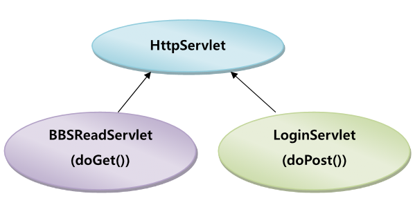

# ES6

## 1. var, let, const

|변수 선언|설명|
|:---:|:---:|
|var|재할당 가능<br> 재선언 가능|
|let|재할당 가능<br> 재선언 불가능|
|const|재할당 불가능<br> 재선언 불가능|

- 스코프: 식별자(변수명, 함수명, 클래스명 등..)의 유효범위

### var의 문제점

1. 변수 선언이 유연하기 때문에 예기치 못한 값을 반환할 수 있음
2. 코드가 길어진다면 어디에서 사용될지 파악하기가 어려움
3. 함수 레벨 스코프로 인해 함수 외부에서 선언한 변수는 모두 전역 변수가 됨
4. 변수 선언문 이전에 변수를 참조하면 언제나 undefined를 반환함 (호이스팅 발생)

=> 따라서 `var`보다 `let`, `const`사용을 권장함


<br>

## 2. 템플릿 리터럴

- 문자열 생성시 따옴표 대신 백틱(`)을 사용함
- 따옴표와 달리 백틱 내에서는 줄바꿈이 반영됨
- 문자열 사이에 변수나 연산을 넣을 때에는 `$[]` 사이에 표현식을 삽입함
- [예제1](./es6exam/exam1.html)

```JS
// 기존 코드
var js = "자바스크립트";

// 템플릿 리터럴 방식
console.log("이건 " + js + "입니다.");

// 출력 결과 -> 이건 자바스크립트입니다.
console.log(`이건 ${js}입니다.`);
```

## 3. 화살표 함수


## 4. 모듈 내보내고 가져오기 (export/import)


- named export 기본형식
```js
export { 모듈1, 모듈2 }
import { 모듈1, 모듈2 } from 'js 파일 경로'; 
```

한 파일에서 여러개를 export할 때 사용 가능함<br>
export한 이름과 동일한 이름으로 import 해야하며, 중괄호에 묶어서 import 해야함
다른 이름으로 import하려면 as를 사용하고, 한 파일에 있는 클래스나 변수들을 한 번에 import 하려면 *를 사용함

<br>


- default export 기본 형식
```js
export default 모듈명;
import 모듈명 from 'js 파일 경로'; 
```


<br>

## 5. 클래스

- 객체를 생성하기 위한 틀
- 클래스 선언은 let, const와 같이 블록 스코프에 선언되며 호이스팅이 일어나지 않음
  <br>(따라서 클래스는 반드시 정의한 다음에 사용할 것)


<BR>

## 6. 구조분해할당 (destructing)

- 구조분해할당을 이용하면 객체와 배열의 값을 쉽게 변수로 저장할 수 있음
- [예제1](./es6exam/exam1.html)

```JS
const introduce = {name: 'unico', age: 23};
// key와 같은 이름으로 변수 선언

const { name, age } = introduce;
// 다른 이름으로 변수 선언 -> 변수이름: 키값

const { name : myName, age : myAge } = introduce;
console.log(myName) // unico
console.log(myAge) // 23
//배열에서 값을 꺼낼 때는 대괄호를 사용해서 앞에서부터 순차적으로 꺼내올 수 있다.

const fruits = ['apple', 'mango', 'grape'];
// 앞에서부터 순차적으로 변수 선언 가능

const [zero, one, two] = fruits;
console.log(zero) // apple
```


## 7. Rest Operator / Spread Operator

### Rest Operator

- 배열과 함수의 인자 중 나머지를 가리키며, 객체의 나머지 필드를 가리킴
- 나머지 후속 매개변수들을 묶어서 하나의 배열에 저장해서 사용하는 것
- 묶어줄 매개변수 앞에 `...`을 붙여서 작성하면 됨
- 자바스크립트상 Rest Operator는 항상 마지막에 위치해야 함

```js
function func1(...args) {
    console.log(`args: [${args}]`) // args: [1,2,3,4,5]
}

func1(1,2,3,4,5);
// args에 1,2,3,4,5가 한꺼번에 배열로 담겨 인자로 넘겨진다.

```

```js
function func2(arg1, arg2, ...arg3) {
    console.log(`arg1: ${arg1}, arg2: ${arg2}, arg3: [${arg3}]`) 
    // arg1: 1, arg2: 2, arg3: [3,4,5]
}
// arg1에는 1, arg2에는 2, arg3에는 나머지 3,4,5가 배열로 담겨 인자로 넘겨진다. 

func2(1,2,3,4,5);
```

- func(인자1, 인자2, ...인자들)로 넘겨주게 되면 인자1, 인자2처럼 지정된 인자는 앞에서부터 각각의 값을 넣어주고 그 뒤의 나머지 후속 인자들을 배열에 인자들로 묶어서 보내주는 것이다.
- Rest Operator는 함수 정의에는 하나의 ...만 존재할 수 있으며, 반드시 마지막 매개변수여야 한다.


```js
func(...wrong, arg2, arg3)
// 틀린 예. ...wrong이 마지막으로 와야 한다.
```

### Spread Operator (전개구문)

- Spread Operator(전개구문)은 묶인 배열 혹은 객체를 개별적인 요소로 분리함
- 전개할 매개변수 앞에 `...`를 붙여서 작성하면 됨
- 배열과 함수에서는 또 다른 배열과 함수의 인자로의 전개를, 객체에서는 또 다른 객체로의 전개를 함

```js
let arr = [1,2,3,4,5];
console.log(...arr);  // 1 2 3 4 5 
```

```js
var str = 'javascript';
console.log(...str);   // "j" "a" "v" "a" "s" "c" "r" "i" "p" "t"
```

- 전개구문은 등장 순서에 따라서 덮어씌워질 수 있으므로 `...`의 작성 순서에 유의해야 한다. 

```js
var obj = { name: '짱구', species: 'human'};
obj = { ...obj, age: 5};
console.log(obj)
// {name: "짱구", species: "human", age: 5}

obj = { ...obj, name: '짱아', age: 1};
console.log(obj);
// {name: "짱아", species: "human", age: 11}
```

`...obj`가 먼저 나오고 name과 age가 나중에 등장함으로써 덮어씌워져 값이 변경된 것을 확인할 수 있다.
<br>

- `Spread Operator(전개구문)`: 개별적인 요소로 분리하는 역할을 수행
- `Rest Operator(나머지 매개변수)`: 배열로 묶는 역할을 수행


## 8. forEach() / map() / reduce()

- [예제1](./es6exam/exam2.html)

### forEach()

```js
배열.forEach((요소, 인덱스, 배열) => {return 요소})
```
    
- 반복문을 돌면서 배열 안의 요소들을 `일대일`로 짝지어주는 역할을 함
- 배열 요소마다 한 번씩 주어진 함수(콜백)를 실행
- 리턴값: 없음 (각 요소별로 작업을 수행하며, `기존의 배열을 변경`함)

### map()

```js
배열.map((요소, 인덱스, 배열) => { return 요소 });
```

- 배열 내의 모든 요소 각각에 대해 주어진 (콜백)함수를 호출한 결과를 모아서 새로운 배열을 반환
- forEach와 달리 map()은 `새로운 배열`을 결과값으로 반환함

```js
/* forEach - 기존의 배열을 변경 */
var arr = [1,2,3,4,5];
var newArr = arr.forEach(function(e,i){
    return e;
})  
// return => undefined
```


```js
/* map - 새로운 배열을 결과값으로 반환 */
var arr = [1,2,3,4,5];
var newArr = arr.map(function(v, i, arr){
    return v+1;
})
// return => 2,3,4,5,6
```

### reduce()

- 배열의 각 요소를 순회하면서 콜백함수의 실행결과값을 누적하여 하나의 결과값을 반환함

```js
배열.reduce((누적값, 현재값, 인덱스, 요소) => {return 결과}, 초깃값)
```

```js
const sum = [1,2,3];

result = sum.reduce((prev, cur, i) => {
    console.log(`prev: ${prev} , cur: ${cur}, i: ${i}`)
    return prev+cur;
},0)

// prev: 0 , cur: 1, i: 0
// prev: 1 , cur: 2, i: 1
// prev: 3 , cur: 3, i: 2
// return -> 6
```

- 초기값을 기재하지 않으면 자동으로 초기값의 0번째 인덱스의 값이 초기값이 됨
- `reduce()`는 초기값을 배열로 만들고, 배열에 값들을 push하면 `map()`과 동일해짐


## 9. 비동기 프로그래밍

- fetch를 이용해서 AJAX 프로그래밍을 할 수 있음


<br>


# HTTP (HyperText Transfer Protocol)

- 웹 통신에서 사용되는 표준 통신 프로토콜 
- 웹상에서 정보를 주고받을 수 있는 프로토콜
- `웹 클라이언트와 웹 서버 사이에 이루어지는 요청&응답(request&response)에 대한 프로토콜`
<br> => 클라이언트인 웹 브라우저가 HTTP를 통해 서버로부터 웹 페이지나 그림 정보를 요청하면, 서버는 이 요청에
응답하여 필요한 정보를 해당 사용자에게 전달하게 됨


<BR>

- HTTP 통신 프로토콜 기반 동작 그림


<BR>

- 절대로 서버가 클라이언트를 찾아오는 일은 없고 항상 클라이언트가 서버를 찾아옴
<BR> => 서버에 요청을 보내면 서버는 그에 따름 응답(response)을 줌


  
- HTTP 프로토콜은 `Connection Oriented & Stateless 방식`으로 동작하는 프로토콜
<BR> => 신뢰성있는 통신을 하면서 처리 효율을 강조함
<BR> => 따라서 인터넷 환경에 가장 적합한 통신구조로 인정 받음

## Connection oriented & stateless

- 접속 상태는 항상 유지되는게 아니라 클라이언트가 접속 요청을 보내면 접속 응답을 함
- 그러지 않으면 접속 상태가 끊어짐 (default 상태는 끊어진 상태)
<br> => 보다 많은 클라이언트들에게 방문 기회를 줌
<br> 서버 입장에서는 클라이언트는 매번 새로운 클라이언트임


## HTTP 1.1에서 지원되는 요청 방식


|요청방식| 설명                                                                                                                                                                          |
|:---|:----------------------------------------------------------------------------------------------------------------------------------------------------------------------------|
|GET| URI에 지정된 파일을 얻고자 할 때 사용되는 요청 방식<br> 디폴트 방식<br> `name = value`로 구성되는 간단한 데이터(Query 문자열)를 URI 뒤에 추가하여 전달하면서 요청하고자 하는 경우에 사용<BR>http://localhost:8080/test.jsp?productid=00001 |
|POST| GET을 보완하기 위해 등장<BR> 클라이언트 프로그래밍을 직접 짜거나 form 태그를 이용해야 POST 방식으로 요청 가능<br/>원하는 방식으로 인코딩 된 데이터를 요청 바디에 포함하여 전송하면서 파일을 요청할 때 사용<br/>Query 문자열 전달시 GET 방식을 보완한 요청 방식            |
|PUT| 데이터를 수정하는 요청에 사용함                                                                                                                                                           |
|DELETE| 서버에서 요청 URI에 지정된 자원을 지울 수 있음                                                                                                                                                |
|HEAD|GET과 동일하나 바디 내용은 받지 않고 HTTP 헤더 정보만 받음|
|OPTIONS|요청 URI에 대해 허용되는 통신 옵션을 알고자 할 때 사용됨|
|TRACE|클라이언트의 요청을 그대로 반환<BR> 서버의 상태를 확인하기 위해 사용됨|


## TCP


## UDP


## HTTP 동작 방식


1. 클라이언트가 서버에 연결함
2. 클라이언트가 서버로 HTTP 요청(request)을 보냄
<br> 이때의 HTTP 요청은 요청 헤더(Request Header)라고 하는 요청에 관련된 정보를 함께 보냄
<br> 몇몇 정보는 요청 바디(Request body)에 넣는 경우도 있음
3. 서버가 클라이언트에게 HTTP 응답(response)을 보냄
<br> 이때, 응답과 관련된 정보는 응답 헤더(response header)에, 서버가 보내준 데이터는
응답 바디(response body)에 들어 있음


- 응답 파트는 2가지로 나뉨(응답 헤더, 응답 바디)
- 상태 코드를 통해 성공/실패 여부를 알 수 있음
- header와 body는 `빈 행`으로 구분 (header가 끝나면 빈 행이 온다)


<br>


# Java EE 기반의 웹 애플리케이션

- Servlet 과 JSP 는 Java 의 Enterprise Edition 에 속하는 웹 어플리케이션 기술로서 웹 클라이언트의 요청에 의 해 웹 서버에서 수행되고 그 수행 결과가 클라이언트에 응답되는 기술임
- Servlet 기술: 프로그래밍 성격이 강함
- JSP: 프리젠테이션 성격이 강하다
- Java EE 환경에서 Servlet 과 JSP 는 웹 컨테이너(엔진이라고도 함)에 의해 관리되고 수행되는 웹 컴포넌트로서 여러 웹 컴포넌트들이 모여 하나의 웹 어플리케이션을 구성하게 됨


## Servlet

- 상속 구문과 메서드 오버라이딩 구문을 적용한 Java 로 구현된 프로그램으로서 수행 결과를 HTML 로 응답하도록 구현하는 기술
- 자바클래스로 서블릿을 생성
- 서블릿 수행결과를 브라우저로 응답할 때 HTML로 응답하게 만듦


## JSP

- HTML 문서 안에 JSP 태그와 동적인 처리를 담당하는 Java 코드를 삽입하여 구현하는 기술
- HTML과 JSP태그가 주인공
- JSP는 태그기술
- JSP 결과를 동적으로 보여주려고 하는데 동적 처리를 서버에서 하려고하면 JSP에 JAVA를 포함
  (클라이언트에서 구현하려고 하면 JS를 포함)
- 서블릿보다 JSP를 많이 사용함 (두개를 혼용해서도 많이 사용함 - 요청은 서블릿. 응답은 JSP)
- 사용자에게 보여주는 기능을 구현하기에 적합함


## WAS

- 웹 애플리케이션 서버
- 애플리케이션 기능을 내장하고 있는 서버


- 여기서의 웹 컴포넌트가 JSP, 서블릿임
- 웹 컨테이너에 의해 각각의 애플리케이션 기능이 수행됨
- 웹 애플리케이션(context)은 IDE에서 `프로젝트`라고 불림 (우리가 쓰는것들 중 `edu`)
- 온라인 학습 사이트를 개발하는 경우, 어떤 기능의 서비스가 필요할까?
  - 우리가 오픈하고 있는 교육과정을 보여주는 페이지
  - 수강신청 기능
  - 학습 기능 (수강신청 한 사람만이 학습을 할 수 있게 만듦)
  - 하나의 웹 애플리케이션으로 만들기 보다 학습 기능 따로, 수강신청 기능을 각각의 웹 애플리케이션(웹 프로젝트)으로 만드는게 좋다
  - 각각의 웹 프로젝트를 톰캣서버에 배치(deploy)하면 됨
  - 수강신청쪽에 문제가 생기면 수강신청쪽 애플리케이션은 내려놓고 학습 기능 애플리케이션은 돌릴 수 있음

<br>


- 등록된 웹 애플리케이션이 늘어나는대로 context 객체를 또만들고, 또만들고..함
- 하나의 웹 애플리케이션은 이클립스에서 하나의 프로젝트가 됨
  (내부에서는 필요한만큼의 웹 컴포넌트들이 존재)

- static resourse: 클라이언트가 요청했을 때 찾아서 주면 끝! (서버입장에서 내부에는 js도 포함)
- 웹 클라이언트 입장에서는 서버에서 실행시키고 그 결0과를 주는 것임


## 웹 애플리케이션의 디렉토리 구조


- 개발자마다 구조가 다르지 않기 위해 기본적으로 지정되어 있음
- `edu`가 여기서는 `Assembly Root`임
- web.xml이 필요한 경우 `WEB-APP`에 web.xml이 있어야 함


<BR>


# MVC 패턴

# 서블릿 (SERVLET)

- Server Side Applet. Applet 축소버전
- `Application`: 단독으로 수행되는 자바프로그래밍
- `Applet`: 브라우저에서 수행되는 자바프로그래밍. 따라서 기능이 한정적. 웹 클라이언트에서 수행됨
- 클라이언트가 서블릿 요청시 스레드를 기동시켜서 응답
- 멀티 스레드임 (멀티 프로세스가 아님)
<br> => 서블릿 객체가 각각 만들어지는게 아닌 하나만 만들어져서 공유됨


- 한 번 객체 생성되면 객체 구조를 유지함
<br> => 객체 생성후 로딩하는 번거로움을 덜 수 있음 (바로 실행)

## 서블릿 구동


- CGI는 요청이 있을 때마다 새로운 프로세스가 생성되어 응답하는 데 비해, 서블릿은 요청마다 프로세스보다 가벼운 스레드 기반으로 응답하므로 보다 가볍게 클라이언트 요청 처리할 수 있음
- 서블릿은 Java로 구현 되므로 다양한 플랫폼에서 동작 가능함
- 웹 클라이언트로부터의 수행 요청으로 생성된 서블릿 객체는 수행이 종료되어 응답된 후에도 객체 상태를 계속 유지하면서 다음 요청에 대하여 바로 수행될 수 있는 상태를 유지함
- 하나의 서블릿을 여러 클라이언트가 동시 요청했을 때 하나의 서블릿 객체를 공유하여 다중 스레드 기반에서 처리되므로 응답 성능을 향상시킬 수 있다

## 서블릿 구현 방법

- HttpServlet 이라는 클래스를 상속하여 구현하며 어떠한 요청 방식을 지원하는 Servlet 인가에 따라 doGet() 또는 doPost() 메서드를 오버라이딩하여 구현




## 서블릿 등록과 매핑

```xml
<?xml version="1.0" encoding="UTF-8"?>
<web-app xmlns:xsi="http://www.w3.org/2001/XMLSchema-instance" xmlns="http://xmlns.jcp.org/xml/ns/javaee" xsi:schemaLocation="http://xmlns.jcp.org/xml/ns/javaee http://xmlns.jcp.org/xml/ns/javaee/web-app_4_0.xsd" id="WebApp_ID" version="4.0">
  <servlet>
    <servlet-name>HelloWorldServlet</servlet-name>
    <servlet-class>mypkg.HelloServlet</servlet-class> </servlet>
  <servlet-mapping>
    <servlet-name>HelloWorldServlet</servlet-name> 
    <url-pattern>/hello</url-pattern>
  </servlet-mapping>
</web-app>
```

- 초기 파라미터 전달
```html
<servlet>
    <servlet-name>ServletName</servlet-name> 
    <servlet-class>ServletClassFile</servlet-class> 
  <init-param>
    <param-name>initParam1</param-name>
    <param-value>initParam1Value</param-value> 
  </init-param>
  <init-param>
    <param-name>initParam2</param-name> 
    <param-value>initParam2Value</param-value>
  </init-param> 
</servlet>
```


## 요청 및 응답 객체 생성


## Servlet 객체 생성과 객체 해제


1. HttpServlet와 HttpServletResponse 객체 생성
2. Servlet 컨테이너는 요청된 Servlet의 객체가 생성된 상태인지를 검사하게 됨
3. 만일 서블릿 객체가 생성되어 있는 상태라면(최초 요청이 아닌 경우) 바로 수행시키고
4. 객체가 생성된 상태가 아니라면 (최초 요청인 경우) 해당 서블릿의 클래스 파일을 찾아서 로딩 후 객체를 생성하여 수행시킴
5. 또한 생성된 서블릿 객체는 서버 종료시까지 또는 웹 애플리케이션이 리로드될 때까지 객체 상태를 계속 유지 시킴


## 서블릿 실행


- 서블릿은 HttpServlet 클래스를 상속받아 어떠한 요청 방식을 지원하는 Servlet인가에 따라서 doGet() 또는 doPost() 메소드를 재정의하여 구현함

- 웹 클라이언트로부터 서블릿이 요청된 방식에 따라서 doGet() 또는 doPost() 메소드가 Servlet 컨테이너에 의해 호출되어 서블릿의 기능을 처리함

```
- 하이퍼링크 텍스트(<A>태그)를 클릭하여 요청한다. → GET 방식
- URL 을 주소필드에 입력하여 직접 요청한다. → GET 방식
- 태그로 요청한다. → GET 방식
- <FORM>태그로 요청한다. → method 속성의 값에 따라서 GET 방식 또는 POST 방식
- <IFRAME> 태그로 요청한다. → GET 방식
```

- GET방식: 외부에 보여줘도 상관없을시 사용
- POST방식: 그게 아니라면 POST방식 사용


<br>


## FORM 태그

- HTML 문서에서 사용자의 입력을 서버로 전달하는 기능은 `<FORM>` 태그를 이용해 구현됨

### FORM 태그에서 지원하는 속성

#### 1.`action` 
- 사용자의 입력 데이터를 처리할 CGI 프로그램의 URL 주소를 지정함


#### 2.`method` 

- 사용자 데이터를 넘겨주는 방식을 지정하는데, GET과 POST 방식 두 가지다.
- GET은 입력 내용을 요청 URI 뒤에 붙여서 보내고, POST는 요청 바디에 담아서 보낸다.


#### 3.`enctype` 

- 파일 업로드시 사용
- 서버로 보내지는 데이터의 형식을 지정한다. 종류는 세가지가 지원된다

1. `application/x-www-form-urlencoded`
<br>디폴트 값은 이거다. 서버로 전송되기 전에 url-encode 된다는 뜻이다.

##### 예제


```url
// ABCabc 123가나다 검색
// GOOGLE

https://www.google.com/search?
q=ABCabc+123%EA%B0%80%EB%82%98%EB%8B%A4&hl=ko&source=hp&ei=Cew0ZKTaIdeU2roP8K2YgAo&iflsig=AOEireoAAAAAZDT6GSklJfj0ooZaGWk7WPtac_XoNWaO&ved=0ahUKEwjkgpO1iKH-AhVXilYBHfAWBqAQ4dUDCAs&uact=5&oq=ABCabc+123%EA%B0%80%EB%82%98%EB%8B%A4&gs_lcp=Cgdnd3Mtd2l6EAMyBQghEKABMgUIIRCgATIFCCEQoAFQAFgAYM4EaABwAHgAgAGSAYgBkgGSAQMwLjGYAQCgAQKgAQE&sclient=gws-wiz
```

```
// ABCabc 123가나다 검색
//DAUM

https://search.daum.net/search?w=tot&DA=YZR&t__nil_searchbox=btn&sug=&sugo=&sq=&o=&q=ABCabc+123%EA%B0%80%EB%82%98%EB%8B%A4
```


- `q` : input 태그의 name 속성


- GET방식으로 전달되는 데이터: 쿼리 문자열
```
// GOOGLE
ABCabc+123%EA%B0%80%EB%82%98%EB%8B%A4&hl=ko&source=hp&ei=Cew0ZKTaIdeU2roP8K2YgAo&iflsig=AOEireoAAAAAZDT6GSklJfj0ooZaGWk7WPtac_XoNWaO&ved=0ahUKEwjkgpO1iKH-AhVXilYBHfAWBqAQ4dUDCAs&uact=5&oq=ABCabc+123%EA%B0%80%EB%82%98%EB%8B%A4&gs_lcp=Cgdnd3Mtd2l6EAMyBQghEKABMgUIIRCgATIFCCEQoAFQAFgAYM4EaABwAHgAgAGSAYgBkgGSAQMwLjGYAQCgAQKgAQE&sclient=gws-wiz
```

- GET방식은 쿼리문자열이 `?`와 함꼐 전달되도록 함


<br>


2. `mutipart/form-data`
<br>파일 받으면서 설정해준게 이 값인데 이미지나 파일을 서버로 전송할 경우 이 방식을 사용한다고 한다.


3. `text/plain`
<br>인코딩을 하지 않은 문자 그대로의 상태를 전송한다는 의미이다.

### form 태그의 타입속성값

```
text : 텍스트 입력

password : 암호 입력

checkbox : 체크 박스

radio : 라디오 버튼

file : 서버로 업로드할 파일 선택

submit : 입력 데이터 전송

reset : 입력 데이터 취소

hidden : 서버로 전달할 name=value 쌍의 데이터 정의
```


<br>

## 쿼리 문자열 (요청 파라미터)

- 웹 클라이언트에서 웹 서버에 요청을 보낼 때 추가로 전달하는 name과 value로 구성되는 문자열
- 요청 파라미터라고도 함
- 주로 다음과 같은 형식으로 전달되며 전달방식에는 GET과 POST가 존재
```
name1=value1&name2=value2&name3=value3
```

- value: 사용자가 입력한 것, 사용자가 선택한 것
- GET은 쿼리 없이 요청 가능, 쿼리 뒤에 붙여서 요청할 수 있음


### GET 방식

- 전달되는 Query 문자열의 길이에 제한이 있고 내용이 브라우저의 주소 필드에 보여짐
- `<FORM>` 태그를 사용해도 되고 요청 URL 에 ? 기호와 함께 직접 Query 문자열을 붙여서 전달하는 것도
가능함


### POST 방식


- 전달되는 Query 문자열의 길이에 제한이 없고 내용이 브라우저의 주소 필드에 보여지지 않음
- 전달 내요이 요청 바디에 담겨져서 전달된다. <FORM> 태그를 사용하여 요청할 때만 사용할 수 있음


### 쿼리 문자열 추출

- name 으로 하나의 value 값이 전달될 때
```java
String address = request.getParameter(“address”);
// address인것이 없으면 null이 리턴됨
```


- name 으로 여러 개의 value 값들이 전달될 때
```java
String hobby[ ] = request.getParameterValues(“hobby”);
```


### 쿼리 문자열 추출시의 한글 문제

- 자바에서는 UTF-16방식이지만 외부에서는 UTF-8혹은 EUC-KR 방식임 
- 쿼리 문자열이면 요청 파라미터를 추출할 때 전달하는 value가 한글인 경우 한글이 꺠질 수 있음
- 서블릿에서 쿼리 문자열을 추출할 때 한글이 꺠지는 현상이 발생할 수 있음


#### 해결 방법

##### GET 방식

- `Tomcat 8.0` : 한글 문제가 발생하지 않는다.

- `Tomcat 7.0 이하` : 환경 파일인 server.xml 파일에서 protocol="HTTP/1.1" 속성을 포함하고 있는
  `<Connector>` 태그를 찾아 URIEncoding=”utf-8” 속성을 추가한다.


###### `http://localhost:8088/edu/clientexam/query.html` - form 태그의 입력내용

```
http://localhost:8088/edu/queryget?guestName=%EB%8C%80%EB%8B%88&num=10&food=%EB%B3%B6%EC%9D%8C%EB%B0%A5&food=%ED%83%95%EC%88%98%EC%9C%A1
```


##### POST 방식

- Query 문자열을 추출하기 전에 HttpServletRequest 에서 제공되는 `setCharacterEncoding(“utf-8”)` 을 호출한다.


- 전달되는 name & value쌍의 길이 제한이 없게 만들고 싶거나 내용이 외부에 안보이게 만들고 싶을 떄 사용


<BR>


## 요청 재지정

- 클라이언트에서 요청한 페이지 대신 다른 페이지를 클라이언트가 보게 되는 기능으로서 redirect 방법과 forward 방법으로 나뉜다

### forward


- 클라이언트가 요청했을 때 빨간녀석이 대신 응답함 (근데 클라이언트는 빨간녀석이 대신했다는 사실을 모름)
- MVC 패턴에서 많이 사용함
- 다른 웹 어플리케이션에서는 불가능 (같은 애플리케이션 내에서 많이 사용)

#### 구현

- RequestDispatcher 의 forward() 메서드를 사용한다.

##### 예시

- http://localhost:8088/forward 입력시 에러 발생
- http://localhost:8088/edu/forward 입력시 에러 발생

```java
package core;
import java.io.IOException;
import javax.servlet.RequestDispatcher;
import javax.servlet.ServletException;
import javax.servlet.annotation.WebServlet;
import javax.servlet.http.HttpServlet;
import javax.servlet.http.HttpServletRequest;
import javax.servlet.http.HttpServletResponse;
@WebServlet("/forward")  // 매핑정보. 요청시 /edu/forward 입력시 doGet 메서드가 호출됨
public class ForwardServlet extends HttpServlet {
	private static final long serialVersionUID = 1L;
	protected void doGet(HttpServletRequest request, HttpServletResponse response) throws ServletException, IOException {
		System.out.println("ForwardServlet 수행");
// 호출되자마자  출력
		RequestDispatcher rd =
				request.getRequestDispatcher("/edu/clientexam/output.html");
		// context path인 edu를 추가하면 에러가 발생 - 스스로 /edu를 무조건 붙임
		// 같은 웹 애플리케이션 안에서만 되고 다른 웹 애플리케이션에서는 안되게 하기 위해 스스로 /edu를 이미 붙임
		// 따라서 포워드할 대상을 지정할 경우에는 context path를 빼고 나머지만 주는것임

//				request.getRequestDispatcher("/clientexam/output.html");
		// 리퀘스트 디스패쳐 객체를 생성해서 포워드 대상정보를 넘겨줌
		// 대상: /clientexam/output.html


		/*RequestDispatcher rd = 
				request.getRequestDispatcher("http://www.naver.com/");*/
		rd.forward(request,  response);
	}
}

```


### redirect


- 클라이언트로 다시 왔다감

- 노란애가 수행하다가 만든결과를 빨간애한테 넘길 수 있음 (객체 공유)
- 클라이언트가 노란애를 응답시 응답코드: 302, 303
- 클라이언트 유저는 요청이 바뀌었다고 느낌
- 같은 웹 애플리케이션이어야 한다는 제한이 없고, 다른 웹 사이트여도 가능함
<BR> (클라이언트가 다음,구글, 네이버,... 등으로 넘겨도 됨)
- 점선은 클라이언트와 서버간의 action

- 스프링에서 자기 보다 일을 더 잘하는 컨트롤러가 있으면 redirect해서 더 일을 잘하는 컨트롤러를 요청
<br> (이러한 케이스를 제외하고 대부분은 forward)

#### 구현
- HttpServletResponse 의 sendRedirect() 메서드를 사용한다


