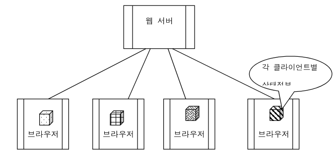
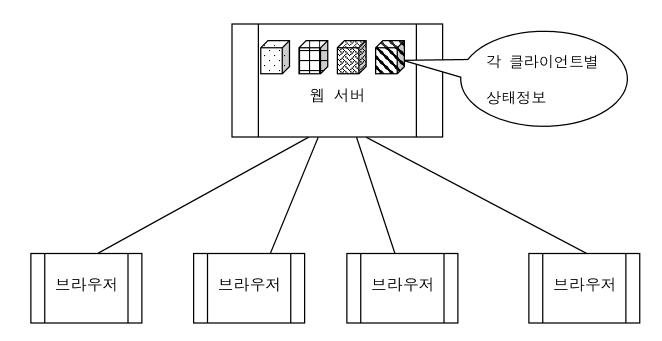
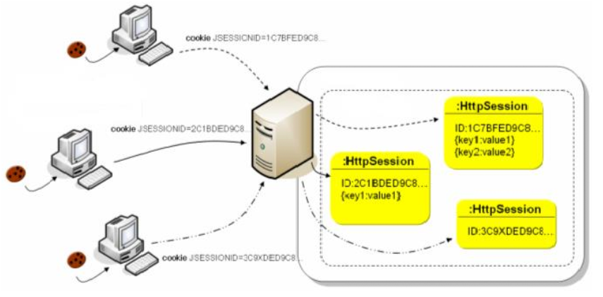
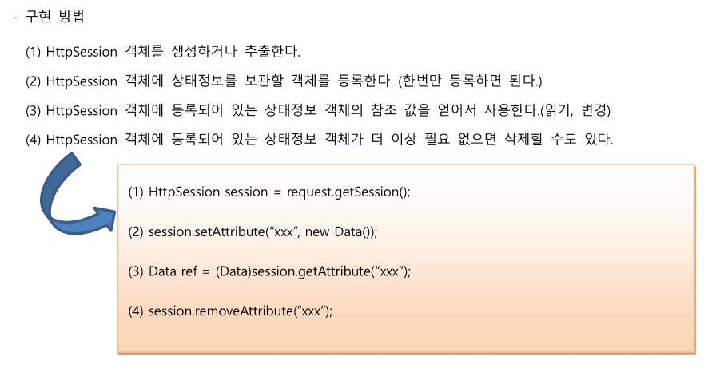

# 서블릿

## 500 에러

- `(HTTP) 500 Internal Server Error 서버 에러 응답 코드` 
- 요청을 처리하는 과정에서 서버가 예상하지 못한 상황에 놓였다는 것

## 상태정보 유지 기술

- 웹 브라우저에서 웹 서버에 정보를 요청할 때 이전 접속시의 결과물(상태정보)를 일정시간 동안 유지하는 것 

- HTTP 프로토콜에서는 서버에서 클라이언트에 대한 정보를 어디에도 보관하지 않는다
  (클라이언트에서 서버에게 접속하면 접속 상태가 유지되는 프로토콜이 아니고, 응답받으면 끝. 다시 접속하면 다시 요청하고 응답받아야 함)
   웹 사이트를 개발하고 비즈니스 로직이 늘어나면서 이전 사이트 방문 기록을 저장해야하는 비즈니스 로직의 필요성이 대두되었고 이에 대한 상태정보 유지 기술이 화두로 떠올랐다

### 상태정보 유지 기술 방법

#### :one: 쿠키를 이용한 방법

- 응답헤더에 쿠키정보 삽입
- 브라우저안에 저장하는 기술임
- `장점`: 클라이언트에 보관하므로 서버에 오버헤드가 되지 않음
- `단점`: 보안적으로 위험함 (중요한 정보가 지워지거나 유출될 우려가 있다)
- 따라서 중요성이 떨어지는 정보를 다룰 떄 사용
  (오늘 하루동안 장바구니에 품목 담아두기 등)

- 서버에 접속한 클라이언트를 잊지 않기 위해 쿠키를 만듦
- 쿠키는 유효시간을 설정할 수 있음
  (브라우저가 살아있는 동안 유효한 쿠키 등)

- 웹스토리지로 인해 쿠키의 효용성이 줄어듦

#### :two: HttpSession 객체를 이용한 방법

- 클라이언트에 대한 상태정보를 서버에 보관하는 것
- HttpSession이라는 세션 객체를 만들어서 이용함 
  (자동으로 객체 생성되는 것이 아니라, 필요할 때 우리가 만들어서 사용함)

- `장점`: 서버에 보관하므로 클라이언트에 보관하는 쿠키에 대해서 보안성이 높음
- `단점`: 모든 클라이언트에 대한 상태정보를 서버에 보관하므로 서버에 오버헤드가 됨
  (따라서 너무 많은 양의 데이터를 보관하는 것은 적합하지 않음)

##### 세션ID

- 서버에 만들어진 HttpSession 객체를 어떤 세션객체가 어떤 클라이언트것인지를 판별해서 사용할까?
  => 세션 객체가 만들어질때 고유ID(세션 ID)가 만들어짐
  => 쿠키 기술을 가지고 세션ID를 클라이언트에 보관함
  => 클라이언트가 요구할때마다 세션 ID를 보내줌

- `세션 객체의 최대 유지시간`: 브라우저가 살아있는 시간
 (쿠키는 브라우저가 삭제할 수 있음)

- 요청 후 아무것도 안하면 30분있다가 세션객체는 자동으로 삭제됨
  (개발 당시 썬사에서 지정함. -> 일정시간 후 자동로그아웃 되는것을 떠올리면 됨)
  (자동 로그아웃이 안되는 것은 사용자 편의성을 위해 수정을 한 것)

- 세션은 쿠키 내에 보관할떄 name&value 쌍으로 보관함

- 내 브라우저에서는 어떤 쿠키도 허용하지 않겠다! 하는 것?
  => 인터넷을 사용하지 않겠다는 것과 같은 이치이다
  => 세션 객체는 내부적으로 쿠키를 사용한다!

 

##### HttpSession객체 구현 방법

- 세션객체는 보관하고 싶은 정보가 있기 떄문에 만들어서 사용함 (name & value상이어야 함)

 

###### request.getSession()

- HttpSession 객체를 추출하거나 새로이 생성함
- `request.getSession(true)` 와 `request.getSession()` 동일함
- `request.getSession(false)` 는 HttpSession 객체를 추출하여 리턴하는데 없으면 null을 리턴함

###### session.setAttribute(“xxx”, new Data())

- 보관하려는 정보를 객체로 만들어 HttpSession객체에 저장함
- "xxx"라는 이름으로 객체의 참조 값을 보관함

###### session.getAttribute(“xxx”)

- "xxx"라는 이름으로 보관된 객체에 대한 참조값을 리턴함

###### session.removeAttribute(“xxx”)

- “xxx” 라는 이름으로 보관된 객체에 대한 참조 값을 삭제

###### session.invalidate()

- 장바구니에 상품을 담을때에는 setAttribute 이용
- 장바구니에 상품을 담아놨다가 취소하면 removeAttribute 이용
- 직접 삭제하려면 invalidate이용

##### HttpSession의 기타 주요 메서드

###### public Enumeration getAttributeNames()

- 세션에 등록된 객체들의 이름을 열거한다.

###### public long getCreationTime()

- 1970.1.1 GMT 부터 세션이 만들어졌을 때까지의 시간을 밀리초의 단위로 리턴한다.

###### public String getId()
      
세션에 지정된 세션 ID를 리턴한다.

###### public long getLastAccessedTime()

클라이언트 요청이 마지막으로 시도된 시간을 밀리초로 리턴한다.

######  public int getMaxInactiveInterval()
      
클라이언트의 요구가 없을 때 서버가 현재의 세션을 언제까지 유지할지를 초시간 단위로 리턴한다.
 이때 디폴트 세션마감시간은 30분으로 지정되어 있다.
      
###### public boolean isNew()
      
서버측에서 새로운 세션을 생성한 경우에는 true를 리턴하고 기존의 세션이 유지되고 있는 경우라면
false를 리턴한다.
      
###### public void setMaxInactiveInterval(int seconds)
      
세션 유지 시간을 설정한다. 이 시간이 지나면 세션은 자동 종료(HttpSession객체 삭제)된다.

#### :three: URL 문자열 뒤에 추가하는 방법

- GET 방식에서 쿼리문자열 붙여서 전달하는 것
- 쿼리문자열을 붙여서 전달하면 외부에 공개됨
- 삭제할 게시판 id를 삭제할 때 이 방법을 사용 (url 문자열 뒤에 붙임)

#### :four: `<form>` 태그의 hidden 타입을 사용하는 방법

- form 태그를 이용해서 무엇인가를 입력 후 서버에 전달할 때 어떤 클라이언트인지 심어넣고 전달할 때 hidden 타입의 input 태그를 사용하는 것

