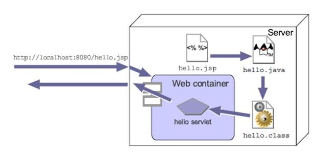
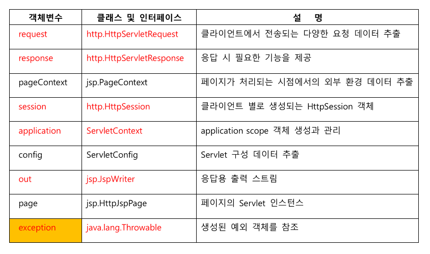

# JSP (Java Server Pages)

- 웹 페이지의 컨텐츠를 구현하는 HTML 파일 내 서버상에서 동적으로 처리하려는 
부분을 적당한 JSP 태그와 Java 코드를 삽입하여 구현하는 기술

- 서블릿의 구현 장점은 그대로 가져가며 서블릿보다 구현이 편리함

- JSP는 실행시에 알아서 자바 서블릿으로 변환된 다음에 실행되므로 서블릿이라고도 할 수 있음
  하지만 서블릿과는 달리 HTML 문서에 스크립트 방식으로 작성되므로 서블릿보다 구현하기 
쉬우며 웹 페이지의 디자인과 연계하여 개발하기 편리함

- 웹 페이지로 표현하고자하는 HTML 내 동적인 처리 내용을 포함하고자 하는 부분에
JSP 태그와 Java 코드를 사용하여 구현함

## JSP 처리 구조

- 웹 클라이언트에서 JSP 요청 
  => 서버의 JSP 컨테이너(컨버터)에 의해 서블릿 코드로 변환
  => 컴파일 이후 실행가능한 서블릿 클래스가 됨
  => 이때부터 서블릿 컨테이너에 의해 객체 생성되어 실행되며 실행 흐름과 특성은 서블릿과 동일함

## JSP 태그 종류

### 수햄문 태그

- 서버단에서 수행할 코드를 자유롭게 정의할 수 있음

### 선언문 태그

- 멤버변수를 만들거나 메서드를 만드려면 선언문 태그 사용

### 표현식 태그

`<%= %>`
- 서블릿으로 변환될 때 out.print로 바뀜
- 내부에 주어진 식을 수행하고 결과를 이 자리에 나타내려면 표현식 태그 사용
- 내부에 자바의 식만 와야하고 세미콜론(;)이 오면 에러

## JSP 내장 객체

