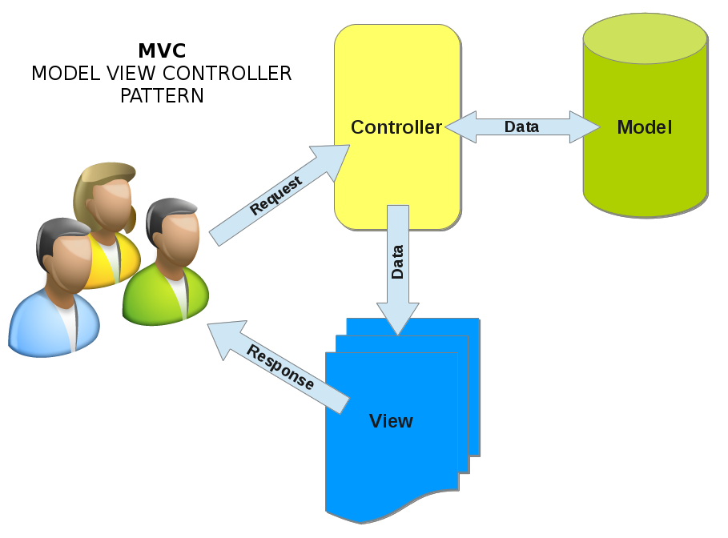
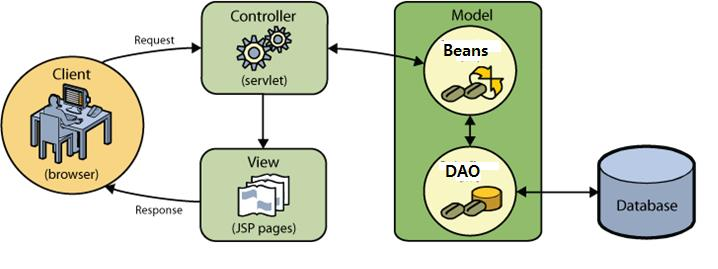
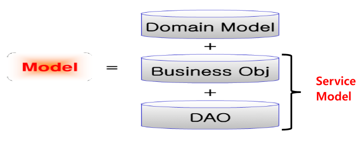
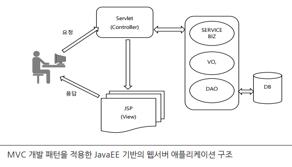

# JSP

## ServletContext

### ServletContext에서의 `Context`은 무엇을 뜻할까?

- 실행 환경
- 실행 컨테이너
- 실행 엔진 

#### 실행 엔진

- (썬사에서 처음에 개발시 엔진이라고 했다가 컨텍스트로 바꿈)
- (실행엔진: JVM 위에서 실행시켜줌)
- 이러한 실행엔진 덕분에 main 메서드 작성없이 동작시킬 수 있음
- 실행엔진이 main을 가지고 있으므로 룰에 따라 서블릿이나 JSP에 대한 객체를 생성해서 실행시켜줌
- (우리가 현재 사용하고 있는 톰캣에서는 `카탈리나`가 실행엔진에 해당됨)


### 서블릿 컨텍스트
- 서버에 등록된 웹 프로젝트 단위로 만들어짐
- 우리가 지금은 `edu`라는 웹 프로젝트 하나만 등록하고 있음
- 하지만 여기에 추가적으로 몇개든 등록할 수 있음
- 여러개 등록시 톰캣이 웹 프로젝트 단위로 서블릿 컨텍스트 객체가 하나씩 만들어짐
- 등록된 웹 프로젝트가 5개라면 서블릿 컨텍스트 객체는 5개임

- 서블릿 컨텍스트 객체에 데이터를 보관할 수 있음
  - 서블릿 컨텍스트 객체는 서버가 기동될 때 만들어져서 서버가 죽을 때 죽음
  - 따라서 서블릿 컨텍스트에 데이터를 보관하면 서버가 죽을 때까지 그 데이터를 쓸 수 있음


#### 서블릿 컨텍스트로 무엇을 처리할 수 있을까?

- 서버의 정보를 얻을 수 있음
```jsp
application.getContextPath()
```

<br>

## 컨테이너 API

- 데이터 보관 기능을 제공하는 API
- 보관하는 역할의 API
- ServletContext
- HttpSession
- HttpServletRequest

### ServletContext

- 서블릿 컨텍스트 객체에 데이터를 보관하면 서버가 죽을 떄까지 보관됨 (단, 직접 지우지 않는경우에 한함)
- 해당 프로젝트 파일을 요구하는 모든 클라이언트들에게 공유됨
- 모든 클라이언트가 공유

### HttpSession

- 브라우저가 기동되는 동안, 클라이언트 별로
- 보관하는 데이터 중 하나 : 상태정보 유지 데이터

### HttpServletRequest

- 요청이 올 때 `HttpServletRequest`객체가 생성 / 응답될 때 객체가 사라짐

- MVC 패턴에서 많이 사용함
- 서블릿/JSP만으로 개발한다면 HttpServletRequest에 데이터를 보관할 일이 없을 것이다
- 서블릿이 수행한 결과를 가지고 jsp가 응답하게 하려면 HttpServletRequest 객체에 담아서 jsp에게 줌
- 다음 요청시에도 그 데이터가 필요하면 HttpSession에 데이터를 보관
- 다음 요청시에 그 데이터가 필요없다면 HttpServletRequest 객체에 데이터를 보관

#### 데이터 보관 및 삭제 메서드

- 모든 데이터는 반드시 객체로 만들어서 등록해야 함

- 무엇을 구현하느냐에 따라 구현하는 방의 객체만 달라질뿐 구현 방법은 거의 비슷함

##### :one: setAttribute("이름", 객체)


##### :two: removeAttribute("이름")


##### :three: getAttribute("이름"

<br>

## 크롬을 여러개 띄우기

- 크롬을 여러개 띄우더라도 로그인 정보 상황은 공유됨

<br>

## EL (Expression Language)

- 표현식 태그(`<%=    %>`) 구현을 더욱 간단하게 처리할 수 있게 해줌

- 특정 스코프 영역에 보관되어 있는 객체를 추출하여 이 객체의 값 또는 속성 값을 추출하여 표현하고 하는 경우 사용됨

- 적절한 Java 코드와 함께 표현식 태그를 사용해도 되지만 JSP 가 추가로 지원하는 Expression Language 라는 구문으로 좀 더 간단하게 구현하는 것이 가능함
- EL 은 `$`와 `블록({ })`으로 구현하는 것으로 표현하는 것과 관련된 연산자와 EL 만의 내장 객체를 사용할 수 있음
- Query 문자열을 추출하여 표현하는 경우도 다음과 같이 스크립팅 태그를 사용하는 것보다 간단하게 구현함


### 예제

```jsp
<%-- 수행문 태그 --%>
<% out.print(request.getParameter("addr"); %> 


<%-- 표현식 태그 --%>
<%= reqeust.getParameter("addr") %>

${param.addr}

```

- `EL`
  - 어딘가에 저장되어있는 데이터를 꺼내어서 출력하는 역할을 수행
  - 어떤 식의 수행결과를 출력하고자 할 때 사용
  - EL은 VO와 DTO가 가지고 있는 getter와 친함
  - 따라서 자바 객체가 가지고 있는 정보를 추출함
  - HashMap 객체 내의 키값으로 가지고 있는 value를 꺼낼 때 사용하면 편리함
  - EL만의 내장 객체를 이용해서 표현하고자 하는 구현을 편하게 함
  - EL에서 setter를 호출하는 방법은 없다 (EL은 뭔가를 표현하는데에만 집중되는 구문임)
  - 따라서 EL은 어딘가에 저장되어 있는 데이터를 가져와서 출력함

### EL 변수

- EL에서의 변수는 일반변수가 아니라 어딘가에 보관되어있는 객체의 이름임


```JSP
${name}

<%-- name이라는 이름으로 보관된 객체를 출력하려고 하는 것 -->
```


#### pageContext

- JSP에서만 사용됨
- JSP가 수행되는 동안에만 유효함
- pageScope

- `${name}` : name이라는 이름으로 저장된 데이터를 출력하라는것
<br> => 맨 처음 pageContext에 방문
<br> => 없다면 그 다음으로 HttpServletRequest에 방문해서 출력하려고 시도
<br> => 거기에도 없다면 HttpSession으로 감
<br> => HttpSession에도 없다면 ServletContext에 방문해서 출력 시도
<br> (유지범위가 좁은곳 => 넓은곳으로 이동함)

##### 스코프

- 객체가 언제까지 유효한가 / 데이터가 언제까지 유지되느냐를 결정


- PageContext
  - page Scope


- HttpServletRequest
  - Request Scope


- HttpSession
  - Session Scope


- ServletContext
  - Application Scope


### EL의 내장 객체 변수


- `pageContext`: PageContext 객체
- `pageScope` : page 스코프에 포함된 객체들 
- `requestScope` : request 스코프에 포함된 객체들 
- `sessionScope` : session 스코프에 포함된 객체들 
- `applicationScope` : application 스코프에 포함된 객체들 
- `param` : HTTP의 파라메터들
- `paramValues` : 한 파라메터의 값들
- `header` : 헤더 정보들
- `headerValues` : 한 헤더의 값들
- `cookie` : 쿠키들
- `initParam` : 컨텍스트의 초기화 파라미터들

<br>

## 객체 공유

- 객체가 생성되어 유지되는 기간을 의미하며 `Page Scope`, `Request Scope`, `Session Scope`
  그리고 `Application Scope` 로 구성됨

### Page Scope

- 서블릿 또는 JSP가 수행되는 동안 유효


### Request Scope

- 웹 클라이언트로부터의 요청이 끝날때까지 유효한 객체가 됨
- `HttpServletRequest` 객체에 객체를 보관함

### Session Scope

- 요청을 보내온 웹 클라이언트가 가동되어있는 동안 유효한 객체가 됨
- `HttpSession` 객체에 객체를 보관함


### Application Scope

- 서버가 기동되어 있는 동안 유효한 객체가 됨
- `ServletContext` 객체에 객체를 보관함

<br>

# MVC 패턴 (Model - View - Controller)





## Model



- 어플리케이션의 정보(데이터)를 담당
- VO, DTO, DAO 등의 자바 객체로 구현함
- 다양한 비즈니스 로직(SERVICE, BIZ), DB 연동 로직(DAO) 그리고 처리 결과를 저장(VO, DTO) 하는 기능을 지원 하는 Java 객체로서 도메인 모델과 서비스 모델로 구성됨


## View

- 텍스트, 체크박스 항목등과 같은 사용자 인터페이스 요소를 담당함
- JSP로 그림

## Controller

- 데이터와 비즈니스 로직 사이의 상호동작을 관리하며 어플리케이션의 기능을 담당함
- 서블릿 객체로 구현

<BR>

## MVC & JavaEE




<BR>


- 요청: 서블릿이 받음
- 응답: JSP

