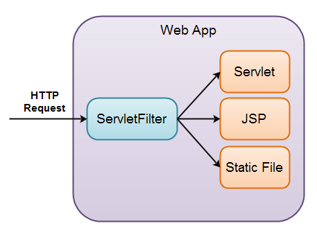

# 프로젝트상 SSR vs CSR

## 1차 프로젝트


- `DB연동`
  - Mybatis (스프링의 JDBC 대신 사용)

- 모든것을 서버에서 수행할 수는 없다
  - 따라서 일부는 클라이언트단에서 수행하고 Ajax를 이용하도록 하자


## 2차 프로젝트

- 프로젝트 경험을 기반으로 수행

<br>


# 서블릿

- 싱글톤임. 객체를 하나만 생겅해서 모든 일을 처리함

<br>

# Filter



- 서블릿, JSP처럼 웹 컴포넌트 중 하나임
  <BR> (컨테이너: 웹 컴포넌트를 보관하는 장소)

- 클라이언트로부터 요청이 왔을 때 서블릿/JSP보다 먼저 수행되는 프로그램
- 혹은 응답될 때 서블릿/JSP보다 먼저 수행되는 프로그램

- 클라이언트가 filter를 요청할 수는 없다 (클라이언트는 서블릿/JSP를 요청할 수 있음)
  - 단, 추가 구현할 것이 있다면 filter로 구현해야 함


- 필터인터페이스를 상속해서 구현
<br> => 필터는 인터페이스이므로 doFilter등의 구현은 필수임


- 클라이언트로부터 요청되는 필터가 있을 때 마다 doFilter가 호출됨


- 웹 클라이언트에서 요청한 웹 자원들(JSP 또는 서블릿)이 수행되기 전 또는 후에 수행되는 객체로서
request 또는 response에 영향을 주거나 또는 특정 처리를 할 수 있음


- Filter 예시
  - 인증
  - 로깅
  - 이미지 변환
  - 데이터 압축
  - 암호화
  - 스트림 토큰화
  - XML 변환


## Filter 구현


```java
public void doFilter(ServletRequest req, ServletResponse res, FilterChain chain)
  throws IOException, ServletException {
  // 웹 자원의 수행 전에 처리할 기능
  
        
  //수행이 끝나고 되돌아옴
  chain.doFilter(req, res);  //  doFilter 메서드를 호출 -> 얘가 아닌 서블릿 컨테이너가 다음에 수행할 객체를 찾아서 수행
  // 웹 자원의 수행 후에 처리할 기능
}
```

- Filter 구현 시에는 javax.servlet.Filter 라는 인터페이스를 상속하여 init(), doFilter(), destroy() 를 오버라이딩함

- 필터 체인 객체에는 얘 다음에 수행될 대상에 대한 객체 정보가 들어있음
  - 서블릿 컨테이너가 호출시 객체 정보를 보내줌

- 체이닝 되어있다는 것은 연쇄적으로 엮어있는 것

<br>

# JUnit

- (전체를 테스트하기보다는) Java 단위 테스트를 도와주는 프레임워크 
- JUnit을 이용하면 클래스에 구현된 메서드가 주어진 기능을 제대로 수행하는지에 대해 단위테스트를 처리할 수 있음

- TDD가 실패했다 생각할 수는 있어도, DB연동시 단위테스틑 알아둬야 함

## JUnit 5 Assumptions

- 메서드별 조건을 만족할 경우 진행시키고 아닌 경우 스킵하는 메서드임
- if문과 비슷한 용도로 사용함

<br>

# Spring

- `스프링 프레임워크`
  - 자바 기반의 애플리케이션 프레임워크
  - 엔터프라이즈급 애플리케이션을 개발하기 위해 다양한 기능을 제공함
  - 구조가 정해져있으므로 개발자가 비즈니스 로직에만 집중하도록 도와줌


- 전자정부 프레임워크
  - 전산화할 떄 스프링이 메인이 됨


- DI(Dependency Injection), DL(Dependency Lookup)을 이용해서 IoC를 하는것이 스프링


##`DI`
  - 내가 필요할 때마다 객체를 만드는 것이 아니라, 스프링 컨테이너가 객체를 넣어줌)
  <BR> => 내가 뭘 먹어야하는지, 언제 먹어야하는지를 알려줘야함 => 얘가 DI 구현방법


## DL
  - 객체가 필요할 떄 찾아오는 것


## IoC

- 제어의 역전
  <br>  => 객체를 직접 만드는 것이 아니라 받아서 사용


- `@Autowired`
  - 변수의 타입에 알맞게 스프링 컨테이너가 알아서 넣어줌


### IoC와 DI


- IoC의 Spring DI는 객체간의 결합도를 느슨하게 만들어줌
<br> => 재사용성 증가
<BR> => 확장성 증가