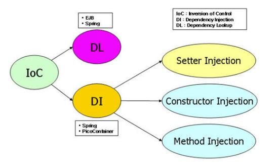
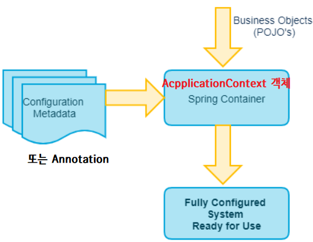

# Spring IoC & DI

- `스프링 프레임워크`

  - 프로그램에서 `필요한 객체의 생성`을 (우리가 직접하는 것이 아니라) 스프링 프레임워크에서 함
  <BR> => 디펜던시 인젝션과 룩업에서 필요로 할떄 마다 제공
  - `객체를 필요로 하는 곳에 주입하는 것`과
`객체를 찾을 때 제공하는 것` 모두 스프링 프레임워크가 대신 처리한다.


- `bean`
  - 스프링 프레임워크에 의해 관리되는 자바 객체


- `스프링 컨테이너 (IoC 컨테이너)`
  - 스프링 프레임워크의 구성요소


- `스프링 DI`
  - 객체간의 결합도를 느슨하게 만듦

## Spring IoC





### Spring IoC 초기화



- 스프링 컨테이너를 기동하는 것이 `Spring IoC 초기화`

```java
ApplicationContext context = new ClassPathXmlApplicationContext("빈 설정 파일");
```
- `Context`
  - 스프링 컨테이너 역할을 하는 프로그래밍


- `ClassPathXmlApplicationContext`
  - 생성된 객체
  - 이 객체가 생성되는 동안 내부적으로 스프링의 IoC 컨테이너가 초기화됨


- `빈 설정 파일`
  - 스프링 컨테이너에게 어떤 형식의 bin을 만들어달라고 요구하는 xml 
  - 부가적인 요구사항에 맞춰서 서브태그나 속성이 있을 수 있음
  - Configuration Metadata라고도 함


- 이 과정을 통해 스프링 컨테이너가 초기화되어 스프링 컨테이너가 일을 하게 됨

<BR>

## Spring DI

- MVC에서 주로 사용


### DL 예시

```java
타입명 bean = (타입명)context.getBean("빈이름"); 
```

- 선언적인 프로그래밍
  - 코딩이 아닌 정해진 규격의 문서를 작성하여 프로그래밍에 영향을 미치도록 하는 것

- getBean 호출하면서 어떤 bean을 달라고 요청하는 것
<br> 기본은 싱글톤이라 미리 생성함 (서블릿도 싱글톤)
<br> 싱글톤 말고 프로토 타입으로 설정하면 요청할 때마다 객체생성을 또하고 또함


### DI 예시

1. Construction Injection 
    - 생성자를 통해서 객체 바인딩(의존관계를 연결)
    - annotation 방법도 사용가능

   
2. Setter Injection
   - setter 메서드를 이용해서 객체 바인딩(의존관계를 연결)
   - annotation 방법도 사용가능
   

3. method Injection
 - 어노테이션을 정의한 메서드를 이용해서 객체 바인딩(의존관계를 연결)


4. field Injection
   - 어노테이션을 정의한 메서드를 이용해서 객체 바인딩(의존관계를 연결)


anntation 방법은 스프링2.0에서 어느정도 정리가 됨 (현재 우리는 5.0 사용)

<BR>

## XML 설정

- `<bean>` 태그
  - Spring IoC 컨테이너가 관리할 Bean 객체 (자바 클래스) 설정
  - `id`: 주입받을 곳에서 호출할 이름. bean을 어떤이름을 접근할 것인지를 결정
  - `class`: 주입할 객체의 클래스명. 
  - `factory-method`: 생성자를 통해 객체 생성하지 않고 팩토리 메서드를 통해 객체를 생성할 경우 factory-method를 통해 팩토리 메서드 지정


- `<constructor-arg>` 태그
  - <bean>의 하위태그로 다른 bean 객체 또는 값을 생성자에 주입하도록 설정
  - `<ref bean="bean name"/>`: 객체 주입시
  - `<value>값</value>`: 문자, Primitive data 주입시
  - `type 속성`: 값의 타입을 명시해야 하는 경우
  - 속성 이용 
    - `ref = "bean 이름"`
    - `value = "값"`


- `<property>`태그
  - <bean>의 하위 태그로 다른 bean 객체 또는 값을 setter 메서드를 통해 주입하도록 설정
  - `name 속성`: 객체 또는 값을 주입할 property명을 설정 (setter명)


