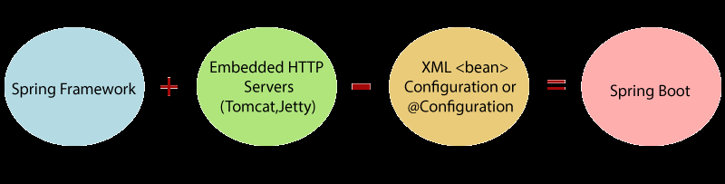

# Java IoC 

## ANNOTATION 설정

- 있다면 객체 생성하고 주입

### @Component

- 킄래스에 선언하며 해당클래스를 bean 객체로 등록함
- bean의 이름: 해당 클래스명(첫글자는 소문자로 변경해서 )이 사용됨
- `@Scope`를 사용하여 지정할 수 있음
- 얘가 있다면 스프링에 의해 관리되는 bean 객체임
- Component 어노테이션은 클래스 앞에서만 쓸 수 있음


#### 사용법

- 빈 설정 파일에 태그가 작성되어 있어야 함

```xml
<!--요즘 많이 사용하는 방식-->
<context: component-scan base-package="xxx"/>  

<!--옛날 방식-->
<context: annotation-config>
```

base-package
- annotation이 정의된 클래스인지 아닌지 하나하나 꺼내어서 확인할 때 
어떤 패키지 폴더에서 해당 작업을 할 것인지에 대해 클래스를 지정
<br> (패키지 지정)


### @Scope

- Spring MVC에서는 `@Scope`가 의미있음. 하짐나 애플리케이션 단꼐에서는
scope와 singleton을 주의깊게 보자

### @Autowired

- 객체를 주입하고 싶은 대상 (멤버변수, 생성자 메서드, 일반 메서드 등이 될 수 있음)
- 멤버변수 앞에 오는경우, 이 변수의 타입에 맞춰서 객체를 자동으로 할당(대입) 해주라는 것
- 생성자를 앞에 오는 경우, 생성자에 맞춰서 객체를 주입해주라는 것
- 얘만 넣어주면 매개변수의 사양에 맞춰서 객체를 주입해줌
- 필요로 하는 객체를 자동으로 정의해줌
- `@Autowired`를 통해 객체를 주입받겠다고 하면
  - byType이 우선시됨 (해당 타입이 없다면 에러 발생)
  - 2개 이상이 있는 경우, 멤버변수의 이름과 같은애가 대입됨.
  - 생성자 매개변수의 똑같은 이름이 있다면 걔가 대입뒴
  - 타입이 우선시되고 그다믕이 이름임
  

### @Qualifier  


### @Resource

- 스프링과 관계없이 자바가 가지고 있는 annotation

<br>


# 스프링 부트

- 스프링으로 애플리케이션을 만들 떄 초기 설정을 간편하게 처리해주는 프레임워크
- 자체 웹 서버를 내장하고 있으므로 빠르고 간편하게 배포를 진행할 수 있음
- 스프링 부트를 사용하면 독립적으로 실행 가능한 Jar 파일로 프로젝트를 빌드할 수 있으므로
클라우드 서비스 및 도커와 같은 가상화 환경에 빠르게 배포할 수 있음



- 스프링
  - 자바 기반 애플리케이션 개발을 위한 오픈소스 프레임워크


- 스프링 부트
  - 스프링 설정들을 자동화하는 스프링 기반 프레임워크

- Spring MVC
  - 웹 애플리케이션에 개발에 있어 MVC 패턴을 적용할 수 있도록 스프링에서 제공하는 프레임워크

- jar
  - java archive
  - war보다 광범위하게 사용


- war
  - web archive
  - 하나의 웹 애플리케이션을 배포할 때 생성하는 파일 포맷
  - WAS에게만 인정받는 파일이며 WAS에 war 파일로 배치(배포)
  - jar 내부에 포함


## 스프링 부트의 특징

1. 의존성 관리

- 개발에 필요한 의존성을 직접 설정하는 스프링과 달리 스프링 부트는
`spring0boot-starter`를 이용하여 의존성을 제공해주고 서로 호환되는 버전의 
모듈 조합을 제공함


2. 자동 설정

- 스프링 부트는 애플리케이션에 추가된 라이브러리를 실행하는 데 필요한 환경설정을 자동으로 해줌


3. 내장 WAS

- 스프링부트의 각 웹 애플리케이션에는 내장 WAS(Web Application Server)가 존재함
- 가장 기본이 되는 의존성인 'spring-boot-strater-web'의 경우 톰캣을 내장함
- 스프링부트의 자동 설정 기능을 통해 특별한 설정 없이도 톰캣을 실행할 수 있으며 
필요에 따라서는 다른 웹서버로도 대체할 수 있음


4. 모니터링

- 스프링부트의 자체 모니터링 도구인 스프링 부트 엑추에이터를 이용해서 서비스 운영에서 필요한 요소들을 모니터링 할 수 있음


