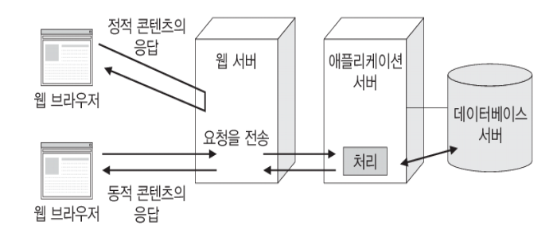
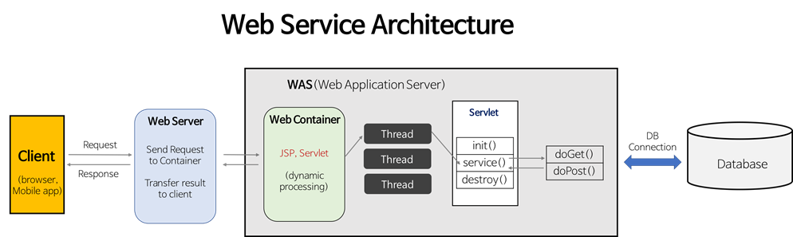
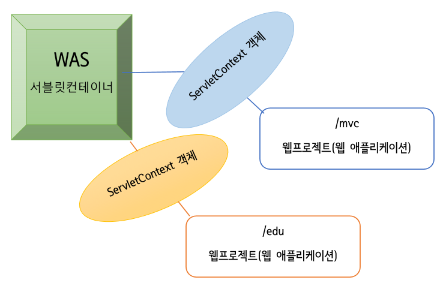
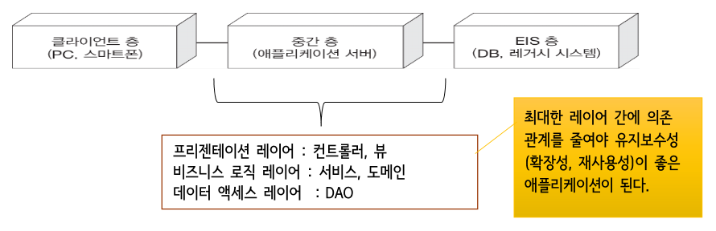
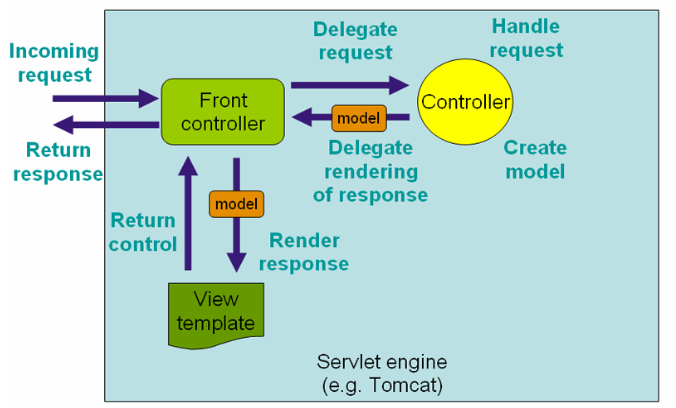
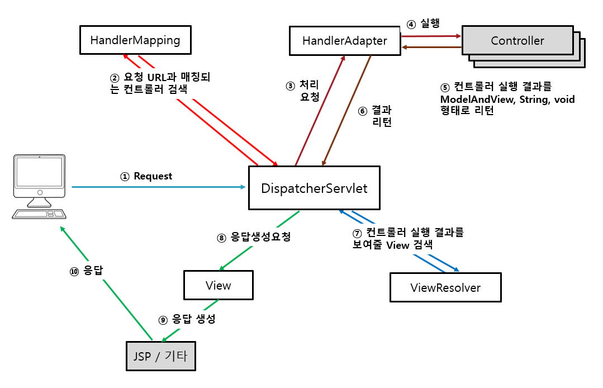
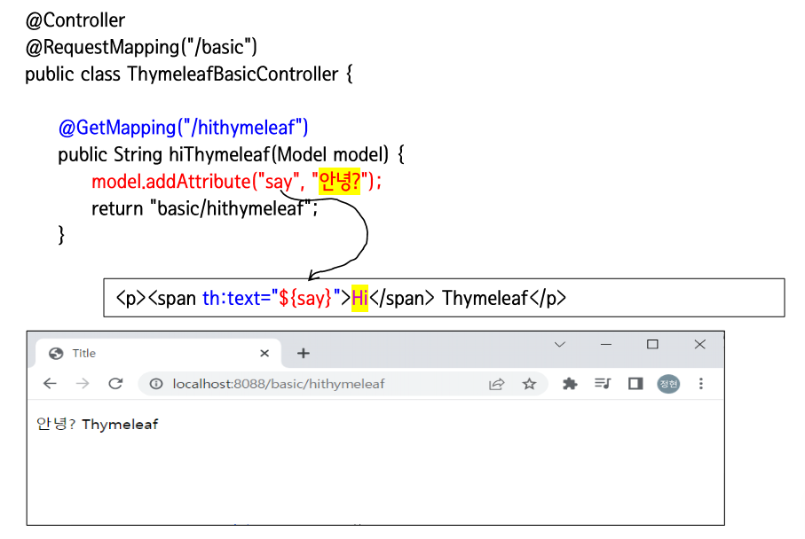

# 웹 애플리케이션

- 클라이언트(사용자)와 서버 사이에 HTTP 프로토콜을 이용하여 
데이터를 주고 받으면서 동작하는 S/W 프로그램



- 톰캣으로 알아보는 웹 애플리케이션
  - `코요테`: 웹 서버
  - `카탈리나`: 애플리케이션 서버


<br>

## 웹 서비스 아키텍쳐

- 서블릿의 처리 흐름






<br>

## 웹 애플리케이션 구조

- `티어`: 어플리케이션 구조를 물리적으로 나눈 것
- `레이어`: 어플리케이션 구조를 논리적으로 나눈 것

<br>



- 규모가 있는 경우 비즈니스 로직을 분리해서 별도로 관리함


<BR>

# Spring MVC

## 스프링 MVC 처리 흐름

- 스프링MVC는 프론트 컨트롤러 패턴을 적용함

- 프론트 컨트롤러 패턴
  - 하나의 핸들러 객체를 통해 요청을 할당하고, 일관된 처리를 작성할 수 있도록 하는 개발패턴




- 도메인 모델 객체: 수행결과를 담고 있음


<BR>

### 스프링MVC 처리흐름 세부 내용



#### :one: Dispatcher Servlet

- 모든 요청은 DispatcherServlet이 가장 먼저 받음
- DispatcherServlet는 스프링상에 존재하는 핸들러매핑의 도움을 받아서 누가 요청한지를 파악

#### :two: HandlerMapping

- 클라이언트의 요청 URL을 처리할 컨트롤러를 결정하여 DispatcherServlet에 반환
- `@Controller` 어노테이션이 적용된 객체의 `@RequestMapping`값을 이용해 요청을 처리할
컨트롤러 탐색

#### :three: HandlerAdapter

- DispatcherServlet의 처리 요청을 변환해서 컨트롤러에게 전달
- 컨트롤러의 응답 결과를 DispatcherServlet이 요구하는 형식으로 변환


#### :four: Contorller

- 실제 클라이언트의 요청을 처리한 다음, 처리 결과를 void, String, ModelAndView 형태로 반환
- GET, POST 방식 등 전송방식에 대해 어노테이션으로 처리함


#### :five: ViewResolver

- 컨트롤러 처리 결과를 보여줄 뷰를 결정


<BR>

## 스프링 MVC 구현에서 사용되는 어노테이션

- 어노테이션을 해석하고 등록하는 작업이 필요함

### @Controller

- Spring MVC의 Controller 클래스 선언을 단순화시켜줌
- 스프링의 컨트롤러 클래스는 서블릿을 상속할 필요가 없음
- `@Controller`로 등록된 클래스 파일에 대한 Bean 객체를 자동으로 생성함
<BR> (Controller로 사용하고자 하는 클래스에 @Controller 지정하면 component-scan 으로 자동 등록됨)

```html
<context:component-scan base-package=“패키지명"/>
```

#### 컨트롤럴 메서드의 파라미터 타입

- 컨트롤러 메서드의 매개변수들이 가질 수 있는 타입은 다음과 같음

```
HttpServletRequest, HttpServletResponse, HttpSession 


java.util.Locale
- 요청을 보내온 클라이언트가 어느 지역인지 알고싶을 때 사용

InputStream, Reader

OutputStream, Writer

@PathVariable 어노테이션 적용 파라미터 

@RequestParam 어노테이션 적용 파라미터 

@RequestHeader 어노테이션 적용 파라미터 

@CookieValue 어노테이션 적용 파라미터 

@RequestBody 어노테이션 적용 파라미터

Map, Model, ModelMap
- 에러처리 전용 컨트롤러


커맨드 객체

Errors, BindingResult

SessionStatus

```

pojo: Plain Old Java Object. 일반 자바 객체


#### 컨트롤러 메서드의 리턴 타입


<br>

# Thymeleaf

- 컨트롤러에서 전달받은 데이터를 추출하여 동적인 페이지를 만들 수 있음
- JSP와 같은 SSR 방식 사용


## 특징

- HTML 태그의 속성으로 작성되므로 기존의 HTML구조를 건드리지 않음

### 네추럴 템플릿

서버를 구동하지 않으면 순수 HTML로 구성되는 정적인 페이지를, 서버를 구동하면 동적으로 페이지가 생성됨

  
```html
<h2 th:text=”${title}”>서버없이 브라우저로 오픈하여 랜더링 하면 보임</h2>
<h2 data-th-text=”${title}”>서버없이 브라우저로 오픈하여 랜더링 하면 보임</h2>
```

- title이라는 이름으로 작성된 content가 없다면 `서버없이 브라우저로 오픈하여 랜더링 하면 보임`를 내보냄


## Thymeleaf 맛보기

- Thymeleaf의 default prefix는 `src/main/resources/templates`이어야함
- Thymeleaf의 suffix는 `.html` 이어야 함


```html
<!DOCTYPE HTML>
<HTML xmlns:th="http://www.Thymeleaf.org"> 
<head>
    <meta charset="UTF-8">
<   title>Title</title>
</head>
<body>
    <p><span th:text="${say}">Hi</span>Thymeleaf</p>
</body>
</HTML>
```

타임리프식은 브라우저가 모르지만, 브라우저는 자기가 모르는 태그나 속성을 무시함<br>
따라서 스프링 부트 서버를 기동하지 않고 브라우저에서 열어보면 `th:text="${say}"`는 무시되고 Hi Thymeleaf가 출력됨

<br>

그러나 Spring Boot 서버를 기동 시키고 브라우저로 정해진 URL 문자열로 요청하면 다음과 같이
컨트롤러를 거쳐서 Thymeleaf 템플릿이 서버상에서 처리되고 그 결과가 브라우저로 출력됨


- 브라우저/hithymeleaf가 `뷰`

- 타임리프는 HTML에 만드는 것이므로 JSP처럼 서버를 반드시 거치지 않아도 됨


## Thymeleaf 문법


### Spring EL

- Spring Expression Language라는 뜻의 SpringEL (SpEL)은 런타임 시 메서드 호출 및 기본 문자열 템플릿 등의 기능을 제공함


#### :ONE: ${...}

- 변수 표현식
- ${...} 표현식을 이용해 컨트롤러에서 전달받은 변수에 접근할 수 있으며 th:속성명 에서만 사용 가능함


#### :TWO: @{...} 표현식

- URL 표현식
- @{...} 표현식은 서버의 contextPath를 추가한 URI 로 변경됨

```java
@{/} -> "/contextPath/"
@{/images/1.png} -> "/contextPath/images/1.png"
```


#### :three: 문자열 합치기

- 합치고 싶은 문자열을 "|" 으로 감싸거나 + 연산자를 이용해 문자를 합칠 수 있음

```html
<div th:text="|My name is ${info.name} !! |"></div>
<div th:text="'My name is '+ ${info.name} + ' !! '"></div>
```


#### :four: 비교 연산자

```html
<!-- 이항 연산자 -->
<div th:text="${info.name != 'kim'}"></div> 
<div th:text="${info.age >= 30}"></div>

<!-- 삼항 연산자 -->
<div th:text="${info.name == 'kim' ? 'ok' : 'no'}"></div>
```


#### :five: HTML 태그의 content 설정

- `th:text`꼴 이용

```html
<div th:text="${info.name}">김민재</div>
```


#### :six: HTML 태그의 value 속성의 값 설정

- `th:value`

```html
<input type='text' th:value="${info.name}" value="둘리" >
```

#### :seven: th:if, th:unless

- `if else`문과 유사
- 조건을 체크하여 참이면 `<th:if>`, 거짓이면 `<th:unless>`컨텐츠를 표시함

```html
<!--참-->
<th:block th:if="${info.age > 18}"><p>입장 가능</p></th:block>
<!--거짓-->
<th:block th:unless="${info.age <= 18}"><p>입장 가능</p></th:block>
```


#### :eight: th:switch, th:case

- switch 구문과 유사
- `th:case`속성에 지정된 값과 동일한 서브 태그를 표현함

```html
<th:block th:switch = "${info.name}">
  <div th:case="올라프">겨울왕국</div>
  <div th:case="또치">아기공룡둘리</div>
</th:block>
```


#### :nine: th:each

- for 반복문과 유사

```html
<th:block th:each="data:${datas}">
  <h1 th:text="${data}"></h1>
</th:block>
```

- 변수명 앞에 status 변수를 추가해서 row에 대한 추가정보를 얻을 수 있음

```html
<th:block th:each="data, status:${datas}">
  <h1 th:text="|${status.count} $data}|"></h1>
</th:block>
```

###### [ status 속성 ]

- index : 0부터 시작
- count : 1부터 시작
- size : 총 개수
- current : 현재 index의 변수
- event/odd : 짝수/홀수 여부
- first/last : 처음/마지막 여부

#### :one::zero: 링크될 대상 URL : th:href="@{}"

```html
<a th:href="@{/boardListPage?currentPageNum={page}}"></a>
```


#### :one::one: th:with="${}"

- 변수의값을 재정의하는 속성
- `th:with`를 이용하여 새로운 변수값을 생성할 수 있음

```html
<div th:with=”userId=${number}” th:text=”${usesrId}”>
```

<br>

## Thymeleaf 구문

### 표현식

#### 변수 표현식

- ${...}


#### 선택 변수 표현식

- *{...}

#### 메시지 표현식

- #{...}

#### 링크 URL 표녓기

- @{...}


#### 조각 표현식


- ~{...}

<BR>

### 리터럴

#### 텍스트

- 'one text'
- 'Another one!'

#### 숫자

- 0, 24, 2, 13, ...


#### boolean

- true, false


#### null

- null

<br>

### 문자연산

#### 문자 합치기

- `+`

#### 리터럴 대체


- |The name is ${name}|


<br>

### 산술 연산

#### Binary operators
- +, -, *, /, %


#### Minus sign (unary operator)

- `-`

