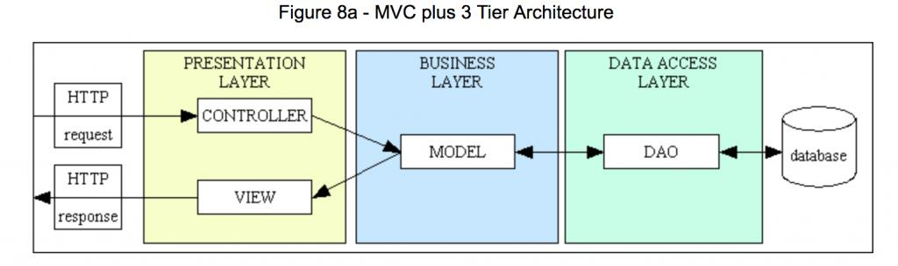
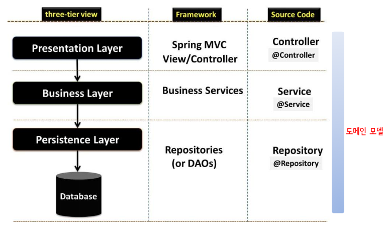
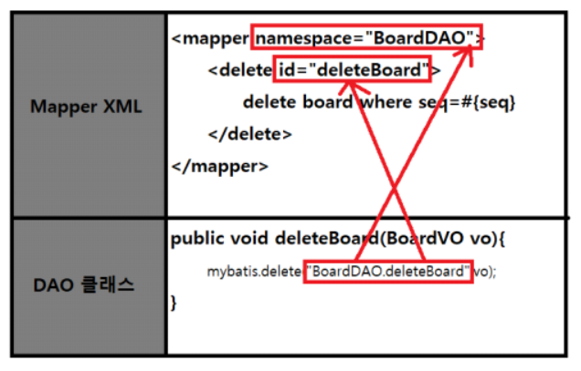

# Spring MVC

## MVC 패턴 & 3-tier Architecture







- `컨트롤러`
  - `@Controller`
  - 프레젠테이션 레이어
  - 웹 요청과 응답을 템플릿을 통해 처리 (또는 직접 처리)


- `로직 처리`
  - `@Service`
  - 서비스 레이어
  - 필요시 내부에서 비즈니스 로직을 처리함


- `외부 I/O 처리`
  - `@Repository`
  - 퍼시스턴스 레이어
  - DB나 파일같은 외부 I/O 작업을 처리함


### 3-tier Architecture

- `프레젠테이션 계층 - 비즈니스 계층 - 데이터 계층`을 각각 물리적으로 독립된 모듈로 개발하고 유지하는 구조


<br>

# MyBatis

- 선택적으로 예외처리를 수행함
- 


## MyBatis의 SQL mapper fiel 생성 및 활용


```html
<!-- root element : mapper-->
<mapper namespace=”……”> 
    <select id=”…” resultType=”…” parameterType=”…”> 
    <insert id=”…” parameterType=”…”>
    <delete id=”…” parameterType=”…”>
    <update id=”…” parameterType=”…”>
    <sql id=”…”> 
</mapper>
```





- where 절이 없다면 모두 delete 
  - 따라서 `seq=#{seq}`라는 조건을 추가함
  - `#{}`는 동적 매개변수 지정하는 것임
  - 전달된 값을 매개변수 값의 속성으로 지정
  

- `parameterType` 
  - select 명령에 따라서 어느것을 받아올지에 대한 형태 지정


## 예제1


### 구문1

```html
<mapper namespace = "testdb">
    <select id = "countEmp" resultType="int">
        select count(*) from emp
    </select>
</mapper>
```

- 모든 행의 개수 추출
- select 절의 추출한 결과는 스칼라값 (14라는 하나의 데이터 값) (스칼라값 - 1행 1열)
  - VO나 DTO형으로 받아올 필요가 없으므로 `resultType=int`로 지정함 (숫자 1개만을 받아가므로)


```java
@Autowired
SqlSession session;  // DAO 생성시점에 session에 SQL session 객체를 주입
// DAO에 @Repository를 만들어놓지 않으면 객체 생성 후 주입블 하지 않음 (Null Pointer Exception 발생하게 됨)
public int getAllDataNum(){
    // 두번쨰 매개변수 생략
    String statement = "testdb.countEmp";
    int num = session.selectOne(statement);
    return num; // select 태그에 정의되어있는 resultType에 대한 ~을 리턴
}

```


### 구문2


```html
<select id="selectEmp" resultType="EmpVO">
    select empno, ename, job, date_format(hiredate, '%Y년 %m월 %d일') hiredate, sal from emp
</select>
```


```java
public List<EmpVO> listAll() { // select 결과를 EmpVO에 넣어서 전달하라는 것
        String statement = "testdb.selectEmp"; 
        List<EmpVO> list = session.selectList(statement); 
        return list;
    // select list는  추출된 행만큼 EmpVO에 담아서 list 객체를 리턴
        // 리스트형으로 변수만 준비해서 담으면 끝 (RESULT SET을 준비할 필요 없음 - 리스트 객체 만들어서 넣고.. 하는 작업 불필요)
}
```


### 구문3

```html
<select id="partEmp" resultType="EmpVO" parameterType="PageDTO" >
select empno, ename, job, date_format(hiredate, '%Y년 %m월 %d일') hiredate,
sal from emp order by sal limit #{startNum}, #{countNum}
</select>
```

- limit 절을 줘서 `#{startNum}}`, `#{countNum}` 설정 
  - `#{}`부분은 동적으로 세팅하겠다는 것
  - 5,7을 주면  5행부터 12행까지.
  - startNum과 countNum을 세팅할 때 parameterType이 유용하게 쓰임 (-> 도메인 객체인 PageDTO 이용 -> 여기에 멤버변수가 있으므로 이를 추출해서 값을 세팅)
  - 동적 파라미터를 사용할 때에는 그에 알맞은 파라미터 타입을 지정해주어야 함

- 파라미터 타입이 있으므로 반드시 두번째 매개변수로 PageDTO 객체를 전달해주어야 함 (구문1,2는 파라미터 타입이 없으므로 생략해도 됨)


```java
public List<EmpVO> listPart(PageDTO vo) {
    String statement = "testdb.partEmp"; 
    vo.setCountNum(vo.getEndNum()-vo.getStartNum()+1); 
    List<EmpVO> list = session.selectList(statement, vo); 
    return list;
}
```

- setCountNum을 세팅
  - `num`은 `vo.getEndNum()-vo.getStartNum()+1`임

- selectList
  - 몇개가 추출될지 모를 떄 사용
  - 1개만 추출하려면 select1을 사용하면 됨


<br> 


## 예제2


```html
<mapper namespace="resource.VisitorMapper">
  <select id="selectVisitor" resultType="VisitorDTO">
  select id, name, date_format(writedate, '%Y년 %m월 %d일') writedate, memo from visitor </select>
  <select id="selectVisitorOne" resultType="VisitorDTO" parameterType="_int" >
  select id, name, date_format(writedate, '%Y년 %m월 %d일') writedate, memo from visitor
  where id = #{id}
  </select>
  <insert id="insertVisitor" parameterType="VisitorDTO">
  insert into visitor (name, writedate, memo) values (#{name}, now(), #{memo})
  </insert>
  <select id="searchVisitor" parameterType="java.lang.String" resultType="VisitorDTO">
  select id, name, date_format(writedate, '%Y년 %m월 %d일') writedate, memo from visitor
  where memo like concat('%',#{key},'%') </select>
  <delete id="deleteVisitor" parameterType="_int" >
  delete from visitor where id = #{id}
  </delete>
  <update id="updateVisitor" parameterType="VisitorDTO">
  update visitor set name = #{name}, memo = #{memo} where id = #{id}
  </update> 
</mapper>
```

```java
@Autowired
SqlSession session;
public List<VisitorDTO> list() {
  List<VisitorDTO> list = null; 
  try {
    String statement = "resource.VisitorMapper.selectVisitor";
    list = session.selectList(statement); } 
  catch (Exception e) {
    e.printStackTrace();
  }
  return list;
}
  
public VisitorDTO one(int id) {
  VisitorDTO vo = null; 
  try {
    String statement = "resource.VisitorMapper.selectVisitorOne";
    vo = session.selectOne(statement, id); } 
  catch (Exception e) {
    e.printStackTrace();
  }
  return vo;
}

public List<VisitorDTO> search(String keyword) {
        List<VisitorDTO> list = null; try {
        String statement = "resource.VisitorMapper.searchVisitor";
        list = session.selectList(statement, keyword); } catch (Exception e) {
        e.printStackTrace();
        }
        return list;
        }
        
public boolean insert(VisitorDTO visitor) {
        boolean result = false; try {
        String statement = "resource.VisitorMapper.insertVisitor"; session.insert(statement, visitor);
        result = true;
        } catch (Exception e) {
        e.printStackTrace();
        }
        return result;
        }
        
public boolean delete(String id) {
        boolean result = false; try {
        String statement = "resource.VisitorMapper.deleteVisitor"; session.delete(statement, Integer.parseInt(id));
        result = true;
        } catch (Exception e) {
        e.printStackTrace();
        }
        return result;
        }
        
public boolean update(VisitorDTO visitor) {
        boolean result = false; try {
        String statement = "resource.VisitorMapper.updateVisitor"; session.update(statement, visitor);
        result = true;
        } catch (Exception e) {
        e.printStackTrace();
        }
        return result;


```


### 구문1

```html
<select id="selectVisitorOne" resultType="VisitorDTO" parameterType="_int" >
    select id, name, date_format(writedate, '%Y년 %m월 %d일') writedate, memo from visitor
    where id = #{id}
</select>
```

- selectOne으로 호출하면 됨
- visitorDTO 객체에 담아서 전달해야함


- `parameterType="_int"`
  - int로 써도되고 _int로 써도됨. Interger로 쓸거면 패키지명 기재해야함 (java.lang.Integer)


- 동적으로 사용되는 데이터가 하나일 경우에는 도메인 객체가 아닌 그 데이터 하나에 대한 타입을 지정해서 타입의 값을 전달하면 됨


- `where id = #{id}`
  - 동적 파라미터 네임


<br>

### 구문2

```html
<select id="searchVisitor" parameterType="java.lang.String" resultType="VisitorDTO">
select id, name, date_format(writedate, '%Y년 %m월 %d일') writedate, memo from visitor
where memo like concat('%',#{key},'%') 
</select>
```


- `where memo like concat('%',#{key},'%')`
  - 포함된 데이터를 찾으라는 것
  - `%` : all을 뜻함 (0개 이상의 데이터)
  - 검색기능은 등가비교가 아닌 패턴비교를 해야하므로 like 연산자를 사용함


### 구문3

```html
<insert id="insertVisitor" parameterType="VisitorDTO">
insert into visitor (name, writedate, memo) values (#{name}, now(), #{memo})
</insert>
```

- 파라미터 타입이 VisitorDTO
  - 알아서 getting 해서~


- visitor 테이블은 컬럼이 4개 (id, name, writedate, memo)
  - `id`: AUTO_INCREMENT -> 다른 칼럼에 데이터를 삽입하면 ID는 자동부여됨. (우리가 값을 부여하지 않음)
  - 컬럼명 리스트가 있어야 함


- `now()`
  - 직접 자바데이터에서 얻어오지 말고 DB에서 제공하는 함수를 사용하는것이 편함

  
### 구문4

```html
<delete id="deleteVisitor" parameterType="_int" >
delete from visitor where id = #{id}
</delete>
```

- 특정데이터의 id값을 알아와서 delete


### 구문5

```html
<update id="updateVisitor" parameterType="VisitorDTO">
update visitor set name = #{name}, memo = #{memo} where id = #{id}
</update>
```


- update 컬럼명 = 값
- name과 memo만 업데이트 가능 (작성날짜는 업데이트 불가)
  - 게시판글이 수정했다고 해서 작성날짜가 바뀌지는 않기 떄문

- 파라미터 타입이 필요하다면 호출할때 두번쨰 매개변수로 알맞은 파라미터 타입을 넣어주어야 함


### 구문6

```java
public VisitorDTO one(int id) {
  VisitorDTO vo = null; 
  try {
    String statement = "resource.VisitorMapper.selectVisitorOne";
    vo = session.selectOne(statement, id); } 
  // VisitorDTO형 객체의 두번쨰 인자로 id값 전달
  catch (Exception e) {
    e.printStackTrace();
  }
  return vo;
}
```


