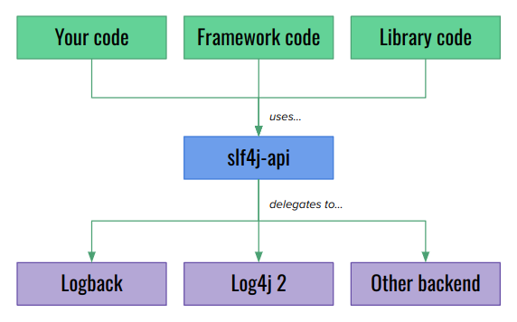
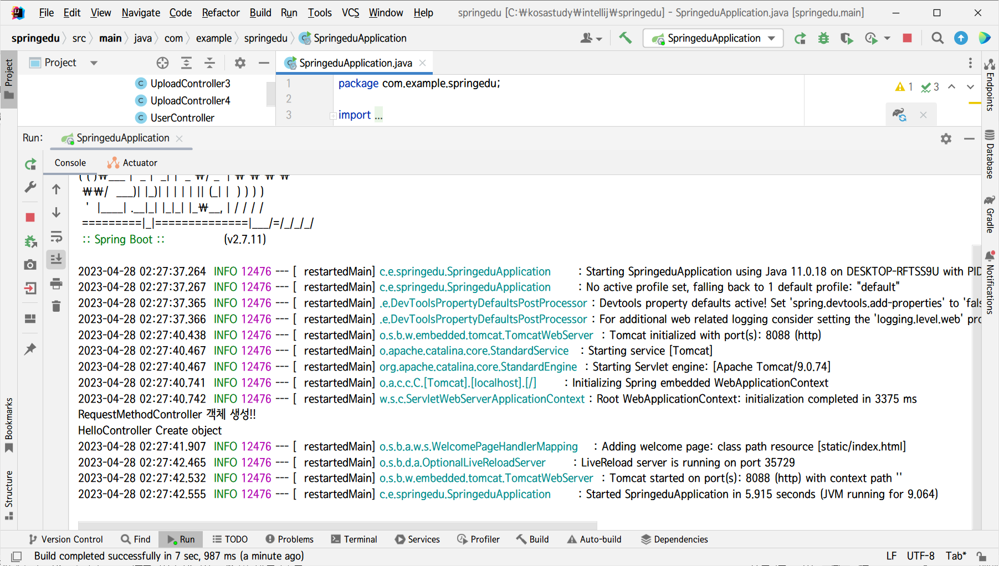
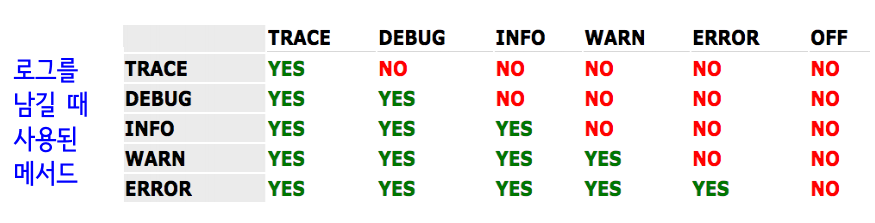
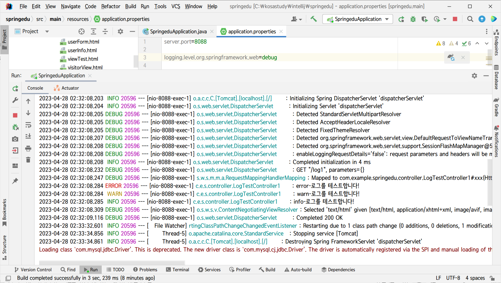
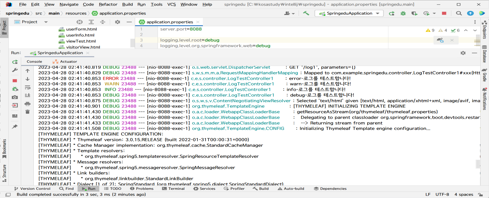

# LOG

## 디자인 패턴

- 자주 사용되는 패턴

### 퍼사드 패턴

- 복잡한 서브 시스템의 의존성을 최소화하는 패턴
- 서브 시스템에 있는 인터페이스들에 대한 통합 인터페이스를 제공하여 서브 시스템을 더 쉽고
일관성 있게 사용할 수 있도록 만드는 더 수준 높은 인터페이스

<BR>

## SLF4J (Simple Loggin Facade For Java)

- 단순한 `파사드 패턴` 을 수단으로 하는 자바 로깅 API를 제공함
- 여러 다양한 로그 라이브러리들의 통합된 인터페이스를 제공



<BR>

## 스프링에서의 로그

- 스프링 부트에서는 스프링 부트 로깅 라이브러리 spring-boot-starter-logging가 함께 포함되며 
이 안에 `SLF4J` 와 `Logback` 이 포함됨<BR>

- . 스프링은 기동될 때 INFO 레벨의 로그들이 콘솔창에 출력됨



<BR>

## DEBUG 레벨

- 레벨을 설정하면 그 레벨부터 상위레벨까지 모두 출력됨


<BR>

## 로그를 남기는 컨트롤러 예제

```java
import lombok.extern.slf4j.Slf4j;
@Controller
@Slf4j
public class LogTestController1 {
    @RequestMapping("/log1") 
    public ModelAndView xxx(){
        log.error("error-로그를 테스트합니다!"); // 에러가 발생했을 때 남기는 로그 log.warn("warn-로그를 테스트합니다!"); // 경고에러가 발생했을 때 나기는 로그 log.info("info-로그를 테스트합니다!"); // 수행 흐름에 대한 정보를 남기는 로그 log.debug("debug-로그를 테스트합니다!"); // 개발자에게 필요한 정보를 남기는 로그 log.trace("trace-로그를 테스트합니다!");// 자세한 수행 흐름을 남기는 로그
        ModelAndView mav = new ModelAndView();
        mav.setViewName("logView");
        mav.addObject("msg", "톰캣콘솔창에서 확인하세요!!");
        return mav;
    }
}
```

<BR>

## 시스템에 설정된 로그 레벨



- 로그레벨에 따라서 해당 레벨~ 상위레벨까지 나타남

### 로그 레벨 예제

- Spring 디폴트로 `INFO 레벨`이 설정되어있음 
  - INFO 레벨의 에러메시지부터 WARN, ERROR까지 나옴
  - DEBUG와 TRACE는 빠짐




스프링의 디폴트 로그 레벨이 INFO 이므로 위에서 브라우저에서 /log1 을 요청하여 위의 컨트롤러를 실행하면 다음과 같이 info() 메서드의 로그부터 error() 메서드의 로그까지 출력되는 것을 볼 수 있다.<BR>


### 스프링 로그 수정




스프링의 디폴트 로그 레벨을 DEBUG 로 변경한 후에 수행을 요청한 화면이다. 
debug() 메서드의 로그부터 error() 메서드의 로그까지 출력되는 것을 볼 수 있다. 
그런데 스프링의 디폴트 로그 레벨을 DEBUG로 하면 스프링 부트 애플리케이션 기동시 
개발자 레벨의 로그 메시지가 엄청 많이 출력되는 것을 볼 수 있다.<BR>
-> DEBUG 포함 상위레벨 모두 나타남


<BR>

## Logback의 로그

- Logback 은 5개의 로그레벨을 지원하며 ERROR, WARN, INFO, DEBUG, TRACE 이다. 설정 파일에 대상별(자바에서는 패키지 또는 클래스)로 레벨 지정이 가능하고 그 등급 이상의 로그만 저장하는 방식이다

```
LEVEL : TRACE > DEBUG > INFO > WARN > ERROR
// TRACE -> ERROR로 갈수록 상위 레벨
```

개발 서버는 DEBUG 레벨을 설정하여 로그를 남기고 운영 서버는 INFO 레벨로 로그를 남기도록 설정하는 것이 일반적이다.

<BR>


## 로그 설정 상세 내용

- 하단의 로그는 기본값으로 설정시 모두 등장함
  
- 각각은 FALSE가 기본값

### jdbc.sqlonly 

- 수행도ㅓ는 SQL 문을 보여준다.

### jdbc.sqltiming 

- SQL 문과 이 SQL 문을 수행하는 시간(ms)을 같이 보여준다.

### jdbc.audit

- ResultSet 을 제외한 모든 JDBC 호출 정보를 로그로 보여준다.
- 상당히 많은 양의 로그가 나오기 때문에 권장하지 않음.


### jdbc.resultset

- ResultSet 을 포함한 모든 JDBC 호출 정보를 로그로 보여준다.
- audit 처럼 많은 로그가 나오기 때문에 권장하지 않음.


<br>


## 래퍼파일 작성시 #{xxx}와 ${xxx}의 사용


### `#{xxx}`

- `#{xxx}`을 사용하면 자동으로 타입에 맞춰서 단일 인용부호가 붙어서 처리되므로 SQL문에 사용되는 동적 데이터 값 설정에 적절함
<br>(#을 붙이면 인용부호가 붙게됨)

- character 데이터로 사용하고 싶으면 `#`를 사용


### `${xxx}`

- 테이블명 또는 컬럼명을 동적 파라미터로 설정하는 경우에 사용
<br> (단일 인용부호가 필요 없기 때문임)
<br> (#을 붙이면 인용부호가 붙게됨)


- 인용부호 없이 사용하고 싶으면 `$`기호륿 붙여서 사용


- `${xxx}`의 경우, xxx 가 반드시 전달되는 객체의 프로퍼티명이거나 HashMap
  객체의 키값이어야 함

<br>

## mapper 파일 대신 annotation으로 처리하기

- mapper 파일
  - sql명령을 자바코드와 분리시킴


- mybatis
  - select시 여러가지 허드렛일을 대신 해줌
  - sql mapper역할을 대신 해줌
  - sql 명령을 분리시킬 때 mapper파일 (xml문서) 대신 애노테이션 방법을 사용할 수 있음

### 구현방법

#### 1. mapper interface

- `@`과 SQL이 정의된 (수행할 기능이 정의된) 인터페이스(mapper interface)를 이용하는 방법
- DAO가 정의되어 있는 인터페이스
- 자바 클래스로 구현할 것이 없음
- 인터페이스 SQL 명령을 넣어도됨

#### 2. `@`이 정의된 인터페이스 + SQL이 정의된 매퍼 파일

- `@`이 정의된 인터페이스 + SQL이 정의된 매퍼 파일
- 자바 클래스로 구현할 것이 없음

#### 3. `@`이 정의된 인터페이스 + SQL과 `@`이 정의된 매퍼 클래스

- 세부적으로 해야할 일이 많음
- 매퍼 클래스로 직접 구현

#### 그외

- 그외 구현 방법은 [다음 사이트 참고](https://mybatis.org/mybatis-3/java-api.html)


