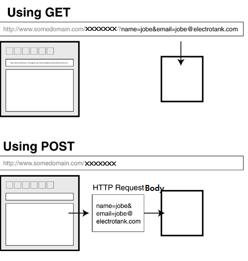

# 개인학습내용 정리

## `<form>`

- HTML 문서에서 사용자의 입력을 서버로 전달하는 기능은 `<form>`을 이용하여 구현함

### `<form>`에서 지원하는 속성

#### :one: action

- 사용자의 입력 데이터를 처리할 URI(Uniform Resource Identifier. 하나의 리소스를 가리키는 문자열 <br> Ex) URL -> 인터넷상 웹 페이지, 이미지, 비디오 등 리소스의 위치를 가리키는 문자열 )

#### :two: method

- 사용자 데이터를 넘겨주는 방식을 지정함 (GET 방식, POST 방식)

##### GET

- 입력 내용을 요청 URI 뒤에 붙여서 보냄
<BR>(입력 데이터를 `action`의 URL과 `?` 구분자 뒤에 이에 붙여서 전송함)

##### POST

- 입력 내용을 request body에 담아서 보냄

#### :three: enctype

- 서버에 보내지는 데이터의 양식을 지정함
- method 특성이 `post`인 경우, enctype은 양식 제출 시 데이터의 `MIME 유형`을 나타냄

##### `application/x-www-form-urlencoded`

- 기본값
- 서버로 전송되기 전에 url-encode 된다는 의미

##### `multipart/form-data`

- 파일을 받으면서 설정해준것이 이 값이므로 이미지나 파일을 서버로 전송할 경우 이 방식을 사용한다고 알려줌

- `<input type="file>"`이 존재하는 경우에 사용


##### `text/plain`

- 인코딩을 하지 않은 문자 그대로의 상태를 전송한다는 뜻
- HTML5에서 디버깅용으로 추가된 값


<br>


## Query 문자열 (요청 파라미터)

- 웹 클라이언트에서 웹 서버에 요청을 보낼 때 추가로 전달하는 name과 value로 구성되는 문자열

- 주로 다음과 같은 형식으로 전달됨
```
name1=value1&name2=value2&name3=value3
```


- 쿼리문자열(요청 파라미터) 전달 방식은 다음 2가지가 존재함



### - :one: GET 방식

- 쿼리문자열(요청 파라미터) 전달 방식
- 전달되는 쿼리문자열의 길이에 제한이 있고 내용이 브라우저의 주소 필드에 보여짐
- `<form>`를 사용해도 되고 요청 URL에 `? 기호`와 함께 직접 쿼리문자열을 붙여서 전달하는 것도 가능함


### :two: POST 방식

- 쿼리문자열(요청 파라미터) 전달 방식
- 전달하는 쿼리 문자열의 길이에 제한이 없고 내용이 브라우저의 주소 필드에 보여지지 않음
- 전달 내용이 request body에 담겨서 전달됨. `<form>`를 사용하여 요청할 때에만 사용할 수 있음


<br>

### 쿼리 문자열의 추출

- name으로 하나의 value가 전달되는 경우

```java
String address = request.getParameter("address");
```


- name으로 여러 개의 value값들이 전달되는 경우

```java
String hobby[] = request.getParameterValues("hobby");
```


