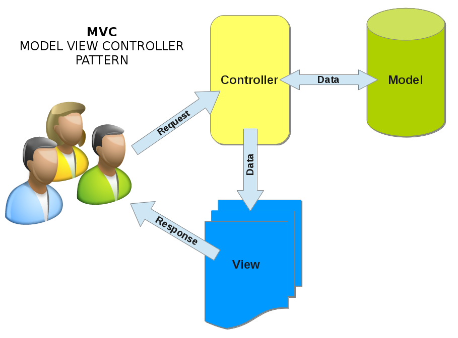
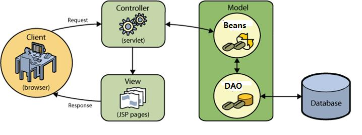
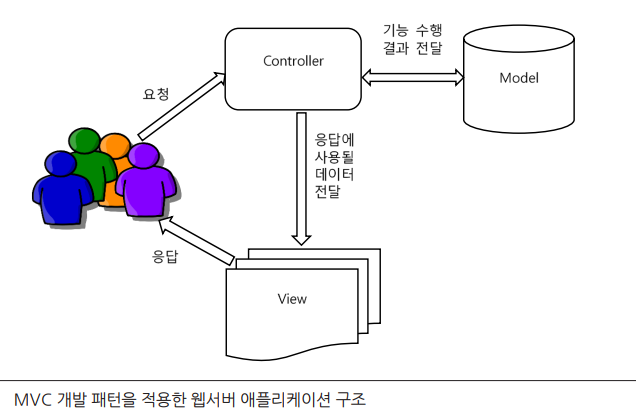
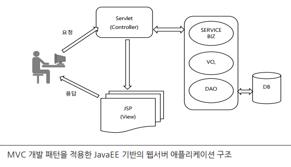
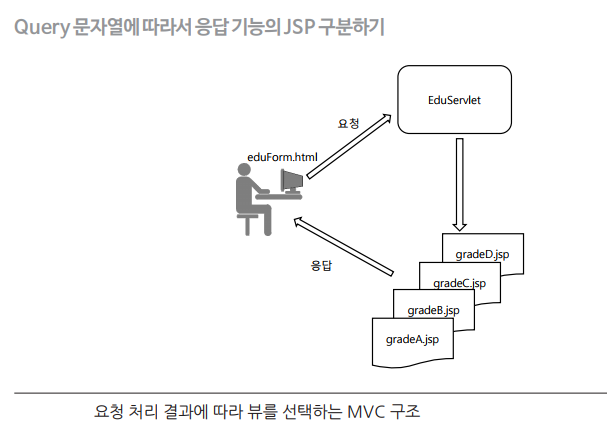
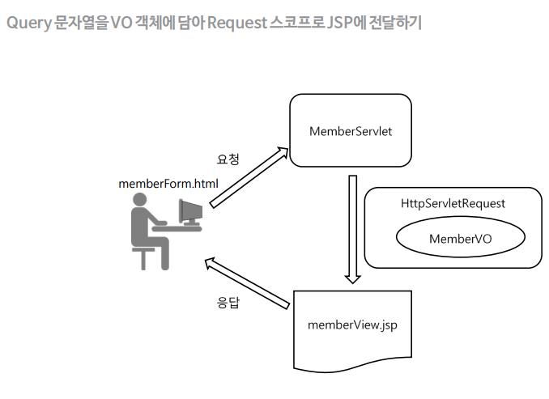
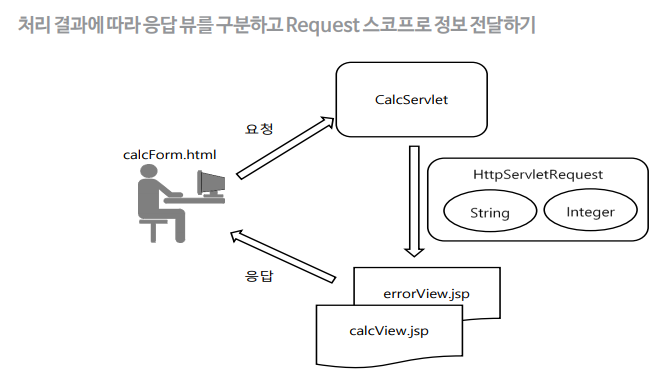
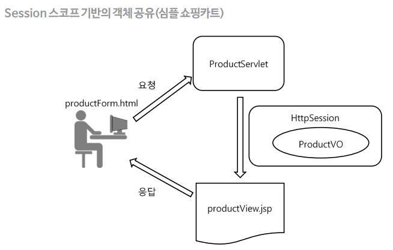
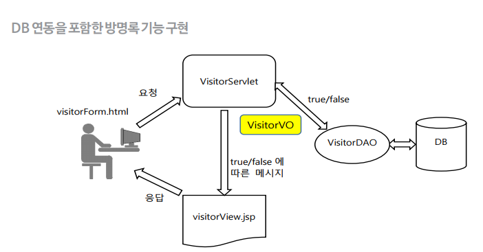
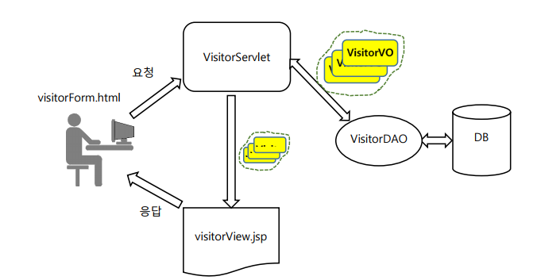

# 개인 학습 내용

## MVC (Model-View-Controller) 패턴

-  S/W 공학에서 사용하는 아키텍쳐 패턴으로서, 이 패턴을 성공적으로 사용하면 사용자 인터페이스로부터 비즈니스 로직을 분리하여
어플리케이션의 시각적 요소 혹은 그 이면에서 실행되는 비즈니스 로직을 서로의 영향 없이 쉽게 고칠 수 있는 어플리케이션을 만들 수 있음



### Model


- 어플리케이션의 정보(데이터)를 담당함
- `다양한 비즈니스 로직(서비스)과 DB 연동 로직(DAO), 처리 결과를 저장(VO, DTO)하는 기능을 
지원하는 자바 객체`로서 도메인 모델과 서비스 모델로 구성됨
- VO, DTO, DAO 등의 자바 객체로 구현





### View

- 텍스트, 체크박스 항목 등과같은 사용자 인터페이스 요소를 담당함
- JSP로 구현


### Controller

- 데이터와 비즈니스 로직 사이의 상호동작을 관리함
- 어플리케이션의 기능을 담당함
- 서블릿 객체로 구현

<br>

### MVC 패턴 기반의 웹 프로그래밍 모음

#### MVC 개발 패턴을 적용한 웹 서버 애플리케이션 구조


#### MVC 개발 패턴을 적용한 JavaEE 기반의 웹서버 애플리케이션 구조


#### 쿼리 문자열에 따라서 응답 기능의 JSP 구분하기 (요청 처리 결과에 따라 뷰를 선택하는 MVC 구조)



#### 쿼리 문자열을 VO객체에 담아 Request 스코프로 JSP에 전달하기



#### 처리 결과에 따라 응답 뷰를 구분하고 reqeust 스코프로 정보를 전달하기



#### Session 스코프 기반의 객체 공유 (심플 쇼핑카트)



#### DB 연동을 포함한 방명록 기능 구현





<br>

## 예제1

### TestModelController1.java

```java
package week09.day35.course.ex1;

import org.springframework.stereotype.Controller;
import org.springframework.web.bind.annotation.ModelAttribute;
import org.springframework.web.bind.annotation.RequestMapping;

import java.util.ArrayList;
import java.util.Date;
import java.util.List;

@Controller  // 해당 클래스가 컨트롤러임을 명시
public class TestModelController1 {
	  // 해당 메서드가 컨트롤러의 요청 처리 메서드가 호출되기 전에 미리 생성된 객체를 Model 객체에 추가해줌
	// 여기서는 v1 메서드가 정의된것
	@ModelAttribute("v1")
	public String createString() {
		System.out.println("객체 생성 자동호출1");
		return "테스트!!";
	}

	// @ModelAttribute("v2") 해석
	// v2 메서드 정의. 해당 메서드가 컨트롤러의 요청 처리 메서드가 호출되기 전에 미리 생성된 객체를 Model 객체에 추가해줌
	// v2 메서드는 int 배열 반환
	@ModelAttribute("v2")
	public int[] createArray() {
		System.out.println("객체 생성 자동호출2");
		return new int[]{10, 20, 30, 40, 50};  // int 배열 반환
	}


	// v3 메서드는 MyVO 객체 반환
	@ModelAttribute("v3")
	public MyVO createVO() {
		System.out.println("객체 생성 자동호출3");
		MyVO vo = new MyVO( 23, "yellow");
		return vo;  // v3 메서드는 MyVO 객체 반환
	}

	// v4 메서드는 Date 객체 반환
	@ModelAttribute("v4")
	public Date createDate() {
		System.out.println("객체 생성 자동호출4");		
		return new Date();   // v4메서드는 Date 객체 반환
	}

	// 이 메서드는 v5라는 이름으로 모델에 추가됨
	// v5 메서드는 MyVO 객체의 리스트를 반환
	@ModelAttribute("v5")
	public List<MyVO> createList() {
		System.out.println("객체 생성 자동호출5");
		List<MyVO> list = new ArrayList<MyVO>();
		MyVO vo = new MyVO(7, "red");
		list.add(vo);
		vo = new MyVO(11, "pink");
		list.add(vo);
		return list;  // v5 메서드는 MyVO 객체의 리스트를 반환
	}

	// 요청이 들어오면 handle 메서드가 실행됨
	// 이 때, @ModelAttribute 어노테이션을 가진 메서드들이 자동으로 호출되어 생성된 객체들이 Model 객체에 추가됨
	// 이 메서드는 "/modeltest1" URL에 대한 요청을 처리함
	@RequestMapping("/modeltest1")
	public String handle() {
		System.out.println("handle() 메서드 호출");		
		return "modelResult1";   // modelResult1을 반환하면 해당 View 이름에 해당하는 템플릿 파일이 렌더링되며, Model 객체에 추가된 데이터들을 템플릿에서 사용할 수 있음.
	}
}
```

- `@ModelAttribute`
  - 해당 메서드가 커멘드 객체를 생성하며, 이 객체를 View에 전달하고 싶을 때 사용함
  - `@ModelAttribute`의 어노테이션의 value는 커맨드 객체의 이름을 지정해줌. (여기서는 v1~v5로 지정)
  - Spring MVC에서 컨트롤러의 메서드에 사용되며, 메서드의 리턴값을 Model 객체에 자동으로 바인딩하여 뷰로 전달할 수 있도록 함
  - `createString()`, `createArray()`, `createVO()`, `createDate()`, `createList()` 메소드에서 생성한 객체는 컨트롤러에서 `@RequestMapping` 어노테이션이 붙은 메소드에서 해당 이름의 모델 속성으로 사용됨

<br>

- `@RequestMapping`
  - 클라이언트 요청 URL과 매핑되는 핸들러 메서드를 지칭
  - 여기서는 `/modeltest1` 요청이 들어올 경우 `handle()`메서드가 호출되어 `modelResult1` 뷰를 반환함
  - `createString()`, `createArray()`, `createVO()`, `createDate()`, `createList()` 메소드에서 생성한 객체들이 모델에 자동으로 추가되어 뷰에서 사용할 수 있음

### MyVO.java

```java
package week09.day35.course.ex1;

import lombok.AllArgsConstructor;
import lombok.Getter;
import lombok.ToString;

@Getter
@AllArgsConstructor
@ToString
public class MyVO {
	private int myNumber;
	private String myColor;	
}

```


### modelResult1.html


```html
<!DOCTYPE html>
<html xmlns:th="http://www.thymeleaf.org">
<head>
<meta charset="UTF-8">
<title>JSP 테스트 예제</title>
</head>
<body>
<h2>Receiving data from the controller</h2>
<hr>
<ul>
<li th:text="${v1}">Thymeleaf</li>
<hr>
<li>Array</li>
	<ul>
	<li th:text="${v2[0]}">Thymeleaf</li>
	<li th:text="${v2[1]}">Thymeleaf</li>
	<li th:text="${v2[2]}">Thymeleaf</li>
	<li th:text="${v2[3]}">Thymeleaf</li>
	</ul>
	<br>
	<ul th:each="elem : ${v2}">
		<li th:text="${elem}">Thymeleaf</li>
	</ul>
<hr>
<li th:text="${v3}">Thymeleaf</li>
	<ul>
	<li th:text="${v3.myColor}">Thymeleaf</li>
	<li th:text="${v3.myNumber}">Thymeleaf</li>
	</ul>
<li th:text="${v4}">Thymeleaf</li>
<li>List</li>
	<ul>
	<li th:text="${v5[0].myColor}">Thymeleaf</li>
	<li th:text="${v5[1].myColor}">Thymeleaf</li>
	</ul>
	<br>
	<ul th:each="elem : ${v5}">
		<li th:text="${elem.myColor}">Thymeleaf</li>
	</ul>
</ul> 
</body>
</html>

```


<br>


## 예제2 (컨트롤러)


```java
package com.example.springedu.controller;
import org.springframework.stereotype.Controller;
import org.springframework.web.bind.annotation.ModelAttribute;
import org.springframework.web.bind.annotation.RequestMapping;

// 컨트롤러 메서드 1개 (핸들)
@Controller   // 해당 클래스를 컨트롤러로 사용하기 위해 선언함
public class TestModelController2 {
	// @ModelAttribute
	// 해당 메서드가 커맨드 객체를 생성하며, 이 객체를 View에 전달하고 싶을 때 사용함
	// @ModelAttribute 어노테이션의 value값은 커맨드 객체의 이름을 지정해줌
	// 여기서는 data1, data2라는 이름으로 커맨드 객체를 생성함

	/* 커멘드 메서드 - 데이터를 하나로 묶어주는 메서드 */
	// 핸들러보다 먼저 수행
	// 최대 유지시간 - 요청이 끝날때까지
	@ModelAttribute("data1")
	public int createModel1() {
		System.out.println("createModel1() 호출");
		return 100;
	}
	/* 커멘드 메서드 - 데이터를 하나로 묶어주는 메서드 */
	// 핸들러보다 먼저 수행
	// 최대 유지시간 - 요청이 끝날때까지
	@ModelAttribute("data2")
	public int createModel2() {
		System.out.println("createModel2() 호출");
		return 200;
	}


	// 클라이언트 요청이 들어왔을 때, 해당 요청과 매핑될 메서드를 지정함
	// 여기서는 /modeltest2라는 URL과 매핑됨
	@RequestMapping(value="/modeltest2")
	public String handle(@ModelAttribute("data1") int vo1,
						 @ModelAttribute("data2") int vo2) {   // 클라이언트 요청이 들어왔을 때 실행되는 메서드
		// 컨트롤러 메서드에서도 커멘드 메서드가 보관한 객체를 사용하고 싶으면 ModelAttribute를 지정하면 됨
		// 지정하지 않으면 쿼리문자열을 세팅
		// 지정하면 data1, data2 이라는 이름으로 보관된 객체를 전달받겠다는 것 (클라이언트에서 전송된 쿼리를 받는것이 아님)
		System.out.println("handle 에서 출력 : "+vo1 + " - " + vo2);
		System.out.println("=============================");
		return "modelResult2";
	}
}

```


<br>

