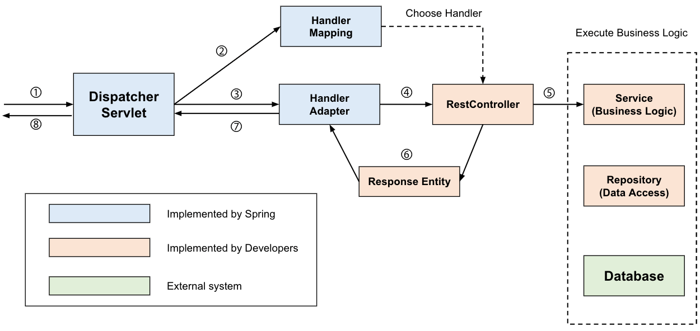
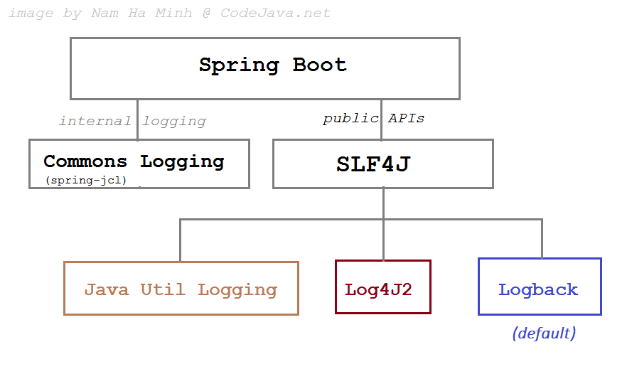

# 스프링 2단계 학습 내용

- 로그 (Logback - 설정파일)
- 스케줄링
- filter & interceptor `(기술면접 빈출)`
- 에러처리
- AOP (여기서부터 `springiocedu 패키지` 이용)
- JPA(`jpaedu 패키지`이용)
- Spring Data JPA (여기서부터 `springedu2 패키지` 이용)
- Spring WebSocket
- Spring Security
- Spring REST

 

## DispatcherServlet 동작 과정

여기서는 일반컨트롤러가 아닌 REST 컨트롤러가 응답하는 예시를 제시 
(어떤 컨트롤러를 사용하든 응답방식이 조금 달라질뿐임) 
=> REST 컨트롤러 설정하지 않으면 뷰가 직접 응답 (html 응답, 텍스트 응답, xml 응답 등)
 

- response entity
  - 응답용 name & value 쌍을 담고 있는 객체

 

- 여기서 클라이언트로부터 서버에게 request를 하였을 때 과정이 어떻게 흘러가는 것인지 이해하는것이 중요

- 디스패처 서블릿
  - 컨트롤러

- `handler mapping`
  - 요청 paht(uri)를 해석해서 어떤 컨트롤러가 서비스에 대해 담당하게 할것인지를 `핸들러 매핑`이라는 프로그램을 통해 판단함
  - 스프링 내장 기본 핸들러 매핑이 처리함 (우리가 하지않음)
  - 응답시 템플릿을 거치지 않고 static by를 가지고 응답하게 한 예시 참고 -> 이것 이외에는 스프링 내장 핸들러 매핑을 사용

 

- `handler adapter`

- `controller`
  - 서비스 로직을 분리시켜 서비스 객체를 독립적으로 만들 수 있음

- `서비스`
  - 뷰를 통해 응답하게 하는 예제를 다루었음
  - 실무에서는 서버단에서 처리해야할 서비스 로직이 굉장히 많음  => 컨트롤러가 직접하는게 아닌 서비스 로직에 알맞은 서비스 객체를 통해 처리하게 만듦
  - 각 객체를 만들 때에는 `단일 책임의 원칙`을 고수하는것이 좋음

- `repository`
  - 스프링 data jpa에서 경험
  - CRUD repository, sorting repository, ...
  - 리포지토리를 이용하여 db 연동

- 이 중에서 하늘색에 해당되는 부분은 스프링이 제공

- 주황색에 해당되는 부분을 우리가 개발함
- 연두색은 DB 시스템을 뜻함

 

## 스프링 부트 로깅

- 스프링의 기본 로깅 구조

- 스프링 부트는 DEFAULT로 log4j를 지원하였으나 보안 문제가 발생함
  - 이후에는 logback으로 옮겨간 상태임 (앞으로 log4j 2로 옮겨갈수도 있음)

- SLF4J
  - 인터페이스로 설계되어 있는 api
  - 인터페이스 기반 API만 제공
  - LOG API의 스펙만 정의
  - JDBC가 구현체 역할의 드라이브가 있어야 하는것처럼 실제 스펙은 `LogBack`에서 정의함

### Log4j

- 자바 기반 로깅 유틸리티
- 로그를 자동으로 출력해주는 도구
- 서버, 프로그램의 운영 유지 관리 목적을 위해 범용으로 사용됨

### LogBack

- Log4j의 성능을 더욱 좋게 만든 java 오픈 소스 logging 프레임워크
- SLF4J의 실제 구현체
- [Log4J의 보안 취약점](https://www.lgcns.com/blog/cns-tech/security/22605/77)

#### 로깅을 수행하기 위해 필요한 주요 설정 요소

- Logger
- Appender
- Encoder

각각은 다음의 역할을 수행함

##### LogBack의 수행 레벨

1. ERROR  요청을 처리하는 중 `오류가 발생한 경우`표시함
2. WARN  처리 가능한 문제나 `향후 시스템 에러의 원인이 될 수 있는 경고성 메시지`를 나타냄
3. INFO  상태변경과 같은 `정보성 로그`를 표시함 스프링 부트 기동시키면 INFO레벨이 등장 내부적으로 톰캣이 기동됨을 알 수 있었음  기본적으로 context path가 8088임을 INFO를 통해 알 수 있었음
4. DEBUG  프로그램을 `디버깅하기 위한 정보`를 표시함
5. TRACE  처리 흐름을 추적하기 위해 `DEBUG 보다 상세한 메시지`를 표시함

- 로그에서 설정할 수 있는 레벨은 총 5가지임
- 출력 레벨의 설정에 따라서 설정 레벨 이상의 로그를 출력함
- 설정된 로그 레벨에 따라서 해당 로그레벨부터 상위 로그레벨까지 출력됨
  - 기본 로깅 레벨 설정을 `DEBUG`로 한다면 `TRACE`레벨은 무시됨
  - 로깅 레벨 설정을 `INFO`로 하였을 경우 `TRACE`, `DEBUG`레벨은 무시함

