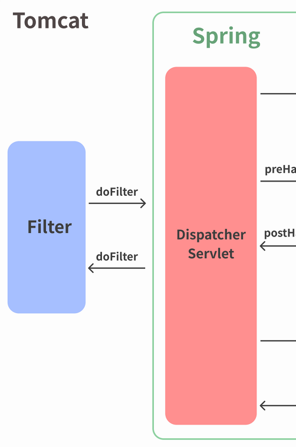
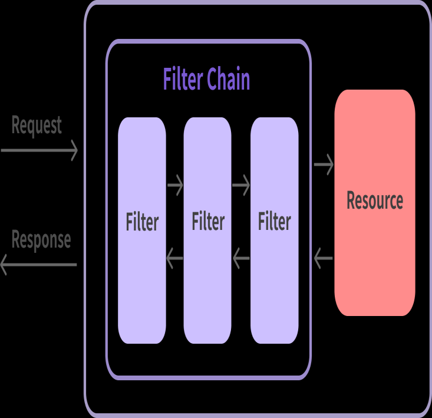
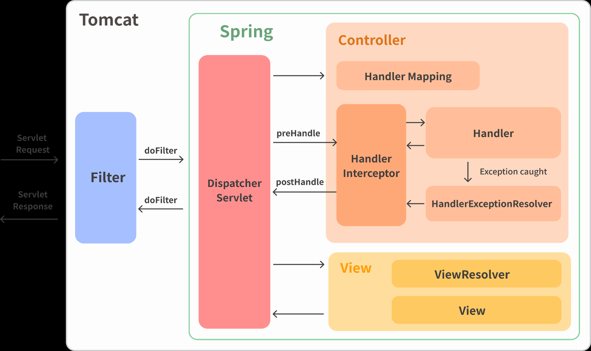

# **스프링부트 로깅**


## log

- 기본적인 스프링의 log level (`import`)은 건드리지 않는것이 좋다

<br>

## 패키지별 로깅 레벨 지정

- `application.properties`에 지정


- `logging.level.com.example.springedu=debug`
  - `com.exmaple.springedu`에 있는 것들은 debug라는 것부터 log를 내보내겠다는 것


<br>


## appender

- 로그 메시지가 출력된 대상을 결정하는 요소
  <br>(콘솔에 출력할지, 파일로 출력할지 등을 설정)

```html
<appender name="STDOUT" class="ch.qos.logback.core.ConsoleAppender">
  <layout class="ch.qos.logback.classic.PatternLayout">
    <!--로그 레벨을 같이 내보냄-->
      <pattern>[%d{yyyy-MM-dd HH:mm:ss}][%thread] %-5level %logger{36} - %msg%n</pattern>
  </layout>
</appender>
```

콘솔창에 찍히는 약어는 패키지명의 첫글자임<br>

```html
logger(36)
```

이 로그를 내보내게한 클래스의 이름을 패키지명과 함께 내보냄(얘를 `logger라고 부르고 최대 36개의 문자로 구성해서 내보내겠다는 것`)<br>


### appender의 class 종류

- **유의**
  - appender의 name값을 아래 3개의 예시처럼 모두 달라야 함

#### :one: ch.qos.logback.core.ConsoleAppender

- 콘솔에 로그를 찍음
- 로그를 OutputStream 에 작성하여 콘솔에 출력되도록 함

<br>

#### :two: ch.qos.logback.core.FileAppender

- 파일에 로그를 찍음
- 최대 보관일 수 등을 지정할 수 있음

```html
<appender name="FILE" class="ch.qos.logback.core.FileAppender">
  <file>${LOGS_ABSOLUTE_PATH}/mylogback.log</file> 
  <encoder>
    <pattern>[%d{yyyy-MM-dd HH:mm:ss}] %-5level %logger{35} - %msg%n</pattern>
  </encoder>
</appender>
```

- LOGS_ABSOLUTE_PATH
  - 절대 경로로 설정
  - `logback-spring.xml`에 경로가`value="./logs"`로 지정되어 있음


<br>

#### :three: ch.qos.logback.core.rolling.RollingFileAppender

- 여러 개의 파일을 롤링, 순회하면서 로그를 찍음
  <br>(지정 용량이 넘어간 Log File 을 넘버링 하여 나누거나 일별로 로그 파일을 생성하여
  저장할 수 있음)

```html
<appender name="ROLLINGFILE" class="ch.qos.logback.core.rolling.RollingFileAppender">
  <encoder>
    <pattern>[%d{yyyy-MM-dd HH:mm:ss}:%-3relative][%thread] %-5level %logger{35} - %msg%n</pattern>
  </encoder>
  <rollingPolicy class="ch.qos.logback.core.rolling.TimeBasedRollingPolicy">
    <fileNamePattern>${LOGS_ABSOLUTE_PATH}/logback.%d{yyyy-MM-dd}.log</fileNamePattern>
  </rollingPolicy> 
</appender>
```

- rollingPolicy
  - RollingFileAppender를 이용할 때에는 무엇을 기준으로 파일을 롤링할 것인지를 지정하는 해야하는데 이것을 지정하는 역할을 수행
  - 여기서는 `TimeBasedRolling`설정 <br> => 일자별로 로그 파일을 새로 만들겠다는 설정

  
<br>


## root (default logger) & logger

- root 태그
  - root logger 역할을 함
  - 전역 로거 설정임 (최상위 logger)<br> => 어떤 일반 logger를 가지고 로그가 적용이 되어서 처리되었다고 하면 root logger도 처리됨 (root logger는 항상 마지막에 수행됨)<br> => 이러한 이유 때문에 log가 2번이상 남는것임
  - 항상 마지막에 수행되는 기본 로거

<br>

- (지역) logger
  - 지역 로거 설정<br> => 지역 로거 설정 후 전역 로거가 설정됨 <br> => additivy 설정을 해야 이를 방지 (additivity default value = true)
  - additivity 속성으로 root 설정을 마저 수행할 것인지의 여부를 결정 가능

```html
<!-- root logger는 꼭 있어야 함 -->
<root level="INFO">
    <appender-ref ref="STDOUT" /> 
</root>

<!-- 지역 logger 2개 -->
<logger name="com.example.springedu.controller.LogTestController1" level="DEBUG">
    <!-- appender를 2개 지정: STDOUT, ROLLINGFILE -->
  <appender-ref ref="STDOUT" />
  <appender-ref ref="ROLLINGFILE" />
</logger>
<logger name="com.example.springedu.controller.LogTestController2" level="TRACE" additivity="false">
  <appender-ref ref="STDOUT" />
  <appender-ref ref="FILE" /> 
</logger>
```

- 지역 logger의 default level = "DEBUG"

<br>

# Spring Scheduling

- 스프링에서는 특정 시간에 반복적으로 처리되는 코드를 스케줄링 할 수 있음
- 이때 반복적으로 수행되는 코드를 `Task`라고 함

## Task 기능의 메서드 정의

- 설정된 주기(스케줄링)에 맞춰서 호출되는 Task 메서드 앞에 `@Scheduled` 어노테이션을 
다음에 제시한 속성 중 하나를 정의하여 추가함

1. cron<br> CronTab에서의 설정과 같이 `cron = "10 30 12 * * 5`와 같은 설정이 가능함
2. fixedDelay<br>이전에 실행된 Task 종료시간으로부터 정의된 시간이 지난 후에 Task를 실행함
3. fixedDate<br> 이전에 실행된 Task의 시작시간으로부터 정의된 시간이 지난 후에 Task를 실행함


<br>

# filter & interceptor

- Spring이 공통된 작업을 대신 처리하여 개발시 중복된 코드를 제거하려할 때 지원하는 기능

## filter

- DispatcherServlet(Dispatcher Servlet)에 요청이 전달되기 전/후에 url 패턴에 맞는 모든 요청에 대해 부가작업을 처리할 수 있는 기능을 제공
<br> (DispatcherServlet은 스프링의 가장 앞단에 존재하는 프론트 컨트롤러이므로, 필터는 스프링 범위 밖에서 처리가 됨)




- 수행시점
  - 클라이언트가 요청한 타겟(리소스)가 수행되기 전 (혹은 수행 이후)에 수행되도록 함


- 필터를 2개 이상등록하는 것이 가능함
- 필터가 3개 등록된 케이스

수행되고 나서 chaindofilter를 하면 다음 필터로 이동
  (리소스가 수행되기 전뿐만 아니라 리소스가 기능을 수행하고 나서도 필터가 수행되게 만들 수 있음)<br>
  (do filter를 어떻게 오버라이딩 하느냐에 따라 달라짐)

<br>


- `@order`를 통해 몇번째로 수행될 것인지를 지정할 수 있음

<br>

### 필터의 메서드

```java
public interface Filter{
    public default void init(FilterConfig filterConfig) throws ServletException{}
    
}
```
- 인터페이스가 default로 되어있으므로 오버라이딩은 선택임

<br>

### 필터 등록

- `@Component`를 사용하여 스프링 컨테이너의 빈으로 등록 하기만 하면 됨

<br>


## filter vs interceptor

- **`filter와 interceptor`의 차이점은 매우 중요**
  

- 웹 컨테이너(서블릿 컨테이너)에서 동작하는 필터와 달리 인터셉터는 스프링 컨텍스트에서 동작을 함
- 스프링과 관련없는 기능은 `filter`로 수행

<br>

## 인터셉터 (Interceptor)


- J2EE (Java Enterprise Edition) 표준 스펙인 필터(Filter)와 달리 Spring이 제공하는 기술
- DispatcherServlet(Dispatcher Servlet)이 컨트롤러를 호출하기 전과 후에 요청과 응답을 참조하거나 가공할 수 있는 기능을 제공함
- 웹 컨테이너(서블릿 컨테이너)에서 동작하는 필터와 달리 인터셉터는 스프링 컨텍스트에서 동작을 함
- 인터셉터는 스프링 컨테이너 내에서 동작하므로 필터를 거쳐 프론트 컨트롤러인 DispatcherServlet이 요청을 받은 이후에 동작함

<br>

### 인터셉터의 메서드

- 인터셉터를 추가하려면 org.springframework.web.servlet의 HandlerInterceptor 인터페이스를 구현(implements)해야 하며, 이는 다음의 3가지 메서드를 가지고 있음

```java
public interface HandlerInterceptor {
    /* 핸들러 메서드가 수행되기 이전에 수행할 사항은 preHandle에 정의 */
  default boolean preHandle(HttpServletRequest request,
        HttpServletResponse response, Object handler) throws Exception {
    return true;
  }
  default void postHandle(HttpServletRequest request, HttpServletResponse response,
    Object handler, @Nullable ModelAndView modelAndView) throws Exception {
  }
  default void afterCompletion(HttpServletRequest request, HttpServletResponse
    response, Object handler, @Nullable Exception ex) throws Exception {
  }
}
```

- 모두 default 메서드 이므로 오버라이딩은 선택사항임

#### preHadle() 메서드

- 리턴값
  - `true`: 핸들러 메서드 수행
  - `false`: 핸들러 메서드 수행하지 않음

#### postHandle() 메서드

- 에러가 발생하면 수행되지 않음 <br>(정상적으로 리턴 되었을 때 수행됨)
- ModelAndView 객체를 받아서 수행하도록 설계
- 컨트롤러의 메서드가 ModelAndView 객체를 리턴하면 postHandle() 메서드를 가지고 처리
<br> (rest controller처럼 컨트롤러가 직접응답하면 postHandle은 활용할 일이 없음)


#### afterCompletion() 메서드

- 에러가 발생하였을 경우 postHandle() 메서드는 수행되지 않으나 afterCompletion() 메서드가 수행됨

<br>


### 인터셉터의 등록

- 필터와 달리 인터셉터는 등록을 해주어야 함
- 필터는 `@Component`를 써서 이 필터객체를 스프링 컨테이너가 관리하게 하면 됨
<br> (스프링 컨테이너 안에서 사용되는 것은 아니지만 등록은 해주어야 함)
- 인터셉터에서의 등록 작업을 해주어햐 함 <br> => Configuration 클래스를 만듦

```java
package com.example.springedu.config;

import com.example.springedu.interceptor.TestInterceptor;
import org.springframework.context.annotation.Configuration;
import org.springframework.web.servlet.config.annotation.InterceptorRegistry;
import org.springframework.web.servlet.config.annotation.WebMvcConfigurer;

//@Configuration  // 인터셉터와 관련된 설정을 담고 있음 (당장은 수행되지 않도록 주석처리 해놓음)
public class WebMvcConfig implements WebMvcConfigurer {
  @Override // 오버라이딩해서 인터셉터를 등록 해줌
  public void addInterceptors(InterceptorRegistry registry) {
    registry.addInterceptor(new TestInterceptor())    // 등록하고 싶은 인터셉터를 등록
            .addPathPatterns("/hello");  // 클라이언트가 어떤 컨트롤러를 호출했을 떄 인터셉터가 수행되도록 하는지를 설정함

        /*
        registry.addInterceptor(인터셉터객체)   // 등록하고 싶은 인터셉터 객체
                .addPathPatterns("/*") -  모든 Path 적용
                .addPathPatterns("/sample") - /sample Path 에 대해서만 적용
                .excludePathPatterns("/sample"); - /sample Path과 관련된 컨트롤러에 대해서만 제외 (이외의 모든 요청은 수락)
        */
  }
}

```


