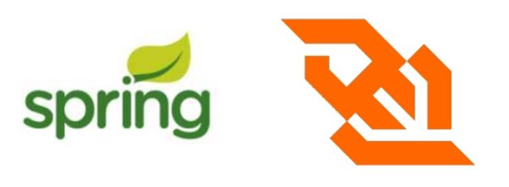
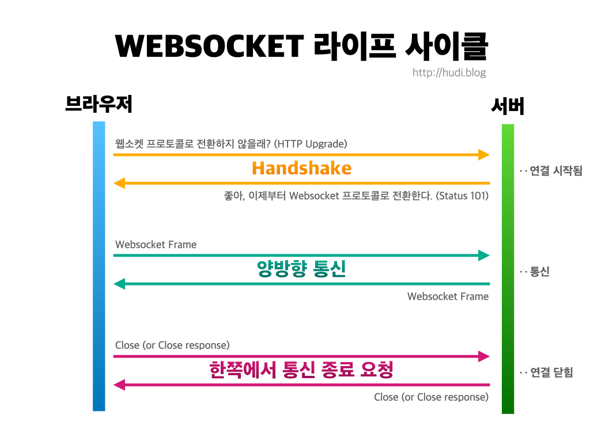
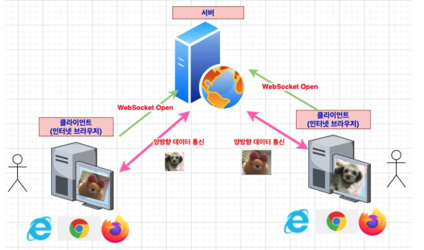
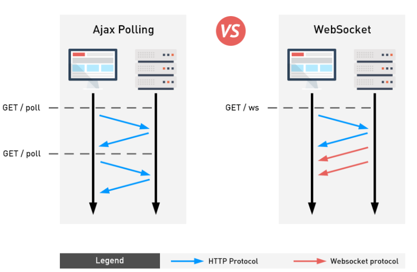
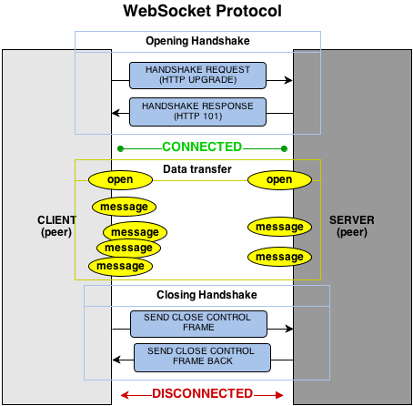
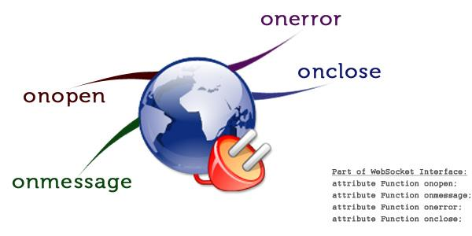
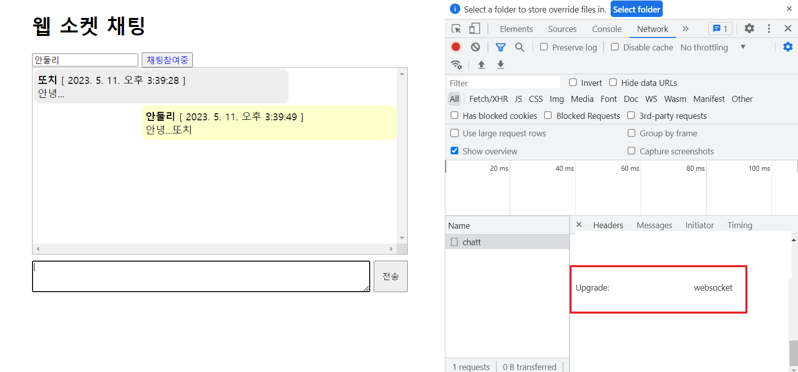

# **스프링부트 로깅**


## log

- 기본적인 스프링의 log level (`import`)은 건드리지 않는것이 좋다

<br>

## 패키지별 로깅 레벨 지정

- `application.properties`에 지정


- `logging.level.com.example.springedu=debug`
  - `com.exmaple.springedu`에 있는 것들은 debug라는 것부터 log를 내보내겠다는 것


<br>


## appender

- 로그 메시지가 출력된 대상을 결정하는 요소
  <br>(콘솔에 출력할지, 파일로 출력할지 등을 설정)

```html
<appender name="STDOUT" class="ch.qos.logback.core.ConsoleAppender">
  <layout class="ch.qos.logback.classic.PatternLayout">
    <!--로그 레벨을 같이 내보냄-->
      <pattern>[%d{yyyy-MM-dd HH:mm:ss}][%thread] %-5level %logger{36} - %msg%n</pattern>
  </layout>
</appender>
```

콘솔창에 찍히는 약어는 패키지명의 첫글자임<br>

```html
logger(36)
```

이 로그를 내보내게한 클래스의 이름을 패키지명과 함께 내보냄(얘를 `logger라고 부르고 최대 36개의 문자로 구성해서 내보내겠다는 것`)<br>


### appender의 class 종류

- **유의**
  - appender의 name값을 아래 3개의 예시처럼 모두 달라야 함

#### :one: ch.qos.logback.core.ConsoleAppender

- 콘솔에 로그를 찍음
- 로그를 OutputStream 에 작성하여 콘솔에 출력되도록 함

<br>

#### :two: ch.qos.logback.core.FileAppender

- 파일에 로그를 찍음
- 최대 보관일 수 등을 지정할 수 있음

```html
<appender name="FILE" class="ch.qos.logback.core.FileAppender">
  <file>${LOGS_ABSOLUTE_PATH}/mylogback.log</file> 
  <encoder>
    <pattern>[%d{yyyy-MM-dd HH:mm:ss}] %-5level %logger{35} - %msg%n</pattern>
  </encoder>
</appender>
```

- LOGS_ABSOLUTE_PATH
  - 절대 경로로 설정
  - `logback-spring.xml`에 경로가`value="./logs"`로 지정되어 있음


<br>

#### :three: ch.qos.logback.core.rolling.RollingFileAppender

- 여러 개의 파일을 롤링, 순회하면서 로그를 찍음
  <br>(지정 용량이 넘어간 Log File 을 넘버링 하여 나누거나 일별로 로그 파일을 생성하여
  저장할 수 있음)

```html
<appender name="ROLLINGFILE" class="ch.qos.logback.core.rolling.RollingFileAppender">
  <encoder>
    <pattern>[%d{yyyy-MM-dd HH:mm:ss}:%-3relative][%thread] %-5level %logger{35} - %msg%n</pattern>
  </encoder>
  <rollingPolicy class="ch.qos.logback.core.rolling.TimeBasedRollingPolicy">
    <fileNamePattern>${LOGS_ABSOLUTE_PATH}/logback.%d{yyyy-MM-dd}.log</fileNamePattern>
  </rollingPolicy> 
</appender>
```

- rollingPolicy
  - RollingFileAppender를 이용할 때에는 무엇을 기준으로 파일을 롤링할 것인지를 지정하는 해야하는데 이것을 지정하는 역할을 수행
  - 여기서는 `TimeBasedRolling`설정 <br> => 일자별로 로그 파일을 새로 만들겠다는 설정

  
<br>


## root (default logger) & logger

- root 태그
  - root logger 역할을 함
  - 전역 로거 설정임 (최상위 logger)<br> => 어떤 일반 logger를 가지고 로그가 적용이 되어서 처리되었다고 하면 root logger도 처리됨 (root logger는 항상 마지막에 수행됨)<br> => 이러한 이유 때문에 log가 2번이상 남는것임
  - 항상 마지막에 수행되는 기본 로거

<br>

- (지역) logger
  - 지역 로거 설정<br> => 지역 로거 설정 후 전역 로거가 설정됨 <br> => additivy 설정을 해야 이를 방지 (additivity default value = true)
  - additivity 속성으로 root 설정을 마저 수행할 것인지의 여부를 결정 가능

```html
<!-- root logger는 꼭 있어야 함 -->
<root level="INFO">
    <appender-ref ref="STDOUT" /> 
</root>

<!-- 지역 logger 2개 -->
<logger name="com.example.springedu.controller.LogTestController1" level="DEBUG">
    <!-- appender를 2개 지정: STDOUT, ROLLINGFILE -->
  <appender-ref ref="STDOUT" />
  <appender-ref ref="ROLLINGFILE" />
</logger>
<logger name="com.example.springedu.controller.LogTestController2" level="TRACE" additivity="false">
  <appender-ref ref="STDOUT" />
  <appender-ref ref="FILE" /> 
</logger>
```

- 지역 logger의 default level = "DEBUG"

<br>

# Spring Scheduling

- 스프링에서는 특정 시간에 반복적으로 처리되는 코드를 스케줄링 할 수 있음
- 이때 반복적으로 수행되는 코드를 `Task`라고 함

## Task 기능의 메서드 정의

- 설정된 주기(스케줄링)에 맞춰서 호출되는 Task 메서드 앞에 `@Scheduled` 어노테이션을 
다음에 제시한 속성 중 하나를 정의하여 추가함

1. cron<br> CronTab에서의 설정과 같이 `cron = "10 30 12 * * 5`와 같은 설정이 가능함
2. fixedDelay<br>이전에 실행된 Task 종료시간으로부터 정의된 시간이 지난 후에 Task를 실행함
3. fixedDate<br> 이전에 실행된 Task의 시작시간으로부터 정의된 시간이 지난 후에 Task를 실행함


<br>

# filter & interceptor

- Spring이 공통된 작업을 대신 처리하여 개발시 중복된 코드를 제거하려할 때 지원하는 기능

## filter

- DispatcherServlet(Dispatcher Servlet)에 요청이 전달되기 전/후에 url 패턴에 맞는 모든 요청에 대해 부가작업을 처리할 수 있는 기능을 제공
<br> (DispatcherServlet은 스프링의 가장 앞단에 존재하는 프론트 컨트롤러이므로, 필터는 스프링 범위 밖에서 처리가 됨)


- 수행시점
  - 클라이언트가 요청한 타겟(리소스)가 수행되기 전 (혹은 수행 이후)에 수행되도록 함


- 필터를 2개 이상등록하는 것이 가능함
- 필터가 3개 등록된 케이스

수행되고 나서 chaindofilter를 하면 다음 필터로 이동
  (리소스가 수행되기 전뿐만 아니라 리소스가 기능을 수행하고 나서도 필터가 수행되게 만들 수 있음)<br>
  (do filter를 어떻게 오버라이딩 하느냐에 따라 달라짐)

<br>


- `@order`를 통해 몇번째로 수행될 것인지를 지정할 수 있음

<br>

### 필터의 메서드

```java
public interface Filter{
    public default void init(FilterConfig filterConfig) throws ServletException{}
    
}
```
- 인터페이스가 default로 되어있으므로 오버라이딩은 선택임

<br>

### 필터 등록

- `@Component`를 사용하여 스프링 컨테이너의 빈으로 등록 하기만 하면 됨

<br>


## filter vs interceptor

- **`filter와 interceptor`의 차이점은 매우 중요**
  

- 웹 컨테이너(서블릿 컨테이너)에서 동작하는 필터와 달리 인터셉터는 스프링 컨텍스트에서 동작을 함
- 스프링과 관련없는 기능은 `filter`로 수행

<br>

## 인터셉터 (Interceptor)


- J2EE (Java Enterprise Edition) 표준 스펙인 필터(Filter)와 달리 Spring이 제공하는 기술
- DispatcherServlet(Dispatcher Servlet)이 컨트롤러를 호출하기 전과 후에 요청과 응답을 참조하거나 가공할 수 있는 기능을 제공함
- 웹 컨테이너(서블릿 컨테이너)에서 동작하는 필터와 달리 인터셉터는 스프링 컨텍스트에서 동작을 함
- 인터셉터는 스프링 컨테이너 내에서 동작하므로 필터를 거쳐 프론트 컨트롤러인 DispatcherServlet이 요청을 받은 이후에 동작함

<br>

### 인터셉터의 메서드

- 인터셉터를 추가하려면 org.springframework.web.servlet의 HandlerInterceptor 인터페이스를 구현(implements)해야 하며, 이는 다음의 3가지 메서드를 가지고 있음

```java
public interface HandlerInterceptor {
    /* 핸들러 메서드가 수행되기 이전에 수행할 사항은 preHandle에 정의 */
  default boolean preHandle(HttpServletRequest request,
        HttpServletResponse response, Object handler) throws Exception {
    return true;
  }
  default void postHandle(HttpServletRequest request, HttpServletResponse response,
    Object handler, @Nullable ModelAndView modelAndView) throws Exception {
  }
  default void afterCompletion(HttpServletRequest request, HttpServletResponse
    response, Object handler, @Nullable Exception ex) throws Exception {
  }
}
```

- 모두 default 메서드 이므로 오버라이딩은 선택사항임

#### preHadle() 메서드

- 리턴값
  - `true`: 핸들러 메서드 수행
  - `false`: 핸들러 메서드 수행하지 않음

#### postHandle() 메서드

- 에러가 발생하면 수행되지 않음 <br>(정상적으로 리턴 되었을 때 수행됨)
- ModelAndView 객체를 받아서 수행하도록 설계
- 컨트롤러의 메서드가 ModelAndView 객체를 리턴하면 postHandle() 메서드를 가지고 처리
<br> (rest controller처럼 컨트롤러가 직접응답하면 postHandle은 활용할 일이 없음)


#### afterCompletion() 메서드

- 에러가 발생하였을 경우 postHandle() 메서드는 수행되지 않으나 afterCompletion() 메서드가 수행됨

<br>


### 인터셉터의 등록

- 필터와 달리 인터셉터는 등록을 해주어야 함
- 필터는 `@Component`를 써서 이 필터객체를 스프링 컨테이너가 관리하게 하면 됨
<br> (스프링 컨테이너 안에서 사용되는 것은 아니지만 등록은 해주어야 함)
- 인터셉터에서의 등록 작업을 해주어햐 함 <br> => Configuration 클래스를 만듦

```java
package com.example.springedu.config;

import com.example.springedu.interceptor.TestInterceptor;
import org.springframework.context.annotation.Configuration;
import org.springframework.web.servlet.config.annotation.InterceptorRegistry;
import org.springframework.web.servlet.config.annotation.WebMvcConfigurer;

//@Configuration  // 인터셉터와 관련된 설정을 담고 있음 (당장은 수행되지 않도록 주석처리 해놓음)
public class WebMvcConfig implements WebMvcConfigurer {
  @Override // 오버라이딩해서 인터셉터를 등록 해줌
  public void addInterceptors(InterceptorRegistry registry) {
    registry.addInterceptor(new TestInterceptor())    // 등록하고 싶은 인터셉터를 등록
            .addPathPatterns("/hello");  // 클라이언트가 어떤 컨트롤러를 호출했을 떄 인터셉터가 수행되도록 하는지를 설정함

        /*
        registry.addInterceptor(인터셉터객체)   // 등록하고 싶은 인터셉터 객체
                .addPathPatterns("/*") -  모든 Path 적용
                .addPathPatterns("/sample") - /sample Path 에 대해서만 적용
                .excludePathPatterns("/sample"); - /sample Path과 관련된 컨트롤러에 대해서만 제외 (이외의 모든 요청은 수락)
        */
  }
}

```


<br>


### 필터 VS 인터셉터

|대상|필터(Filter)|인터셉터(Interceptro)|
|:---:|:---:|:---:|
|a|a|a|


<br>

## 에러 처리

### @ExceptionHandler

- 예외와 관련된 전용 어노테이션
- 어떤 예외가 발생했을 때 어느 메서드가 수행되어 예외처리를 대신하게 만듦
<br> (try-catch로 대신해도 되지만, 그러면 컨트롤러 메서드마다 try-catch를 각각 설정해야하는 불편함이 존재)
<br> (AOP를 사용해도됨)

- 스프링 컨트롤러에서 정의한 메서드 `@RequestMapping`에서 기술한 예외가 발생할 경우 자동으로 받아낼 수 있음
- 이를 이용하여 컨트롤러에서 발생하는 예외를 View단인 JSP 등으로 보내서 처리할 수 있음
- 지역적으로 각 컨트롤러에 적용이 됨 
<br>(특정 컨트롤러 안에서만 예외처리가 적용됨)


<br>

### @ControllerAdvice

- `@Controller`나 `@RestController`에서 발생하는 예외 등을 catch하는 기능을 가지고 있음
- 클래스 위에 `@ControllerAdvice`를 붙이고 어떤 예외를 잡아낼 것인지 내부 메서드를 선언하여 메서드 상단에 `@ExceptionHandler(예외클래스명.class)`와 같이 기술함
- 클래스에 정의하는 어노테이션
- 전역적으로 모든 컨트롤러에 적용되는 exception
<br> (예외에 대한 핸들러 메서드를 필요한만큼 만들것)

- **지역과 전역이 만났을 때 지역이 우선순위가 높다**


<br>

# Spring WebSocket

- http 프로토콜은 `단방향 통신` (무전기로 통신하는 것과 같이 동시에 얘기할 수 없고, 한쪽에서 얘기가 마쳐야 다른 한쪽에서 얘기할 수 있음)
- 웹 소켓을 사용하면 이와 달리 `양방향 통신`이 가능해진다


- 단방향 통신
  - TV방송, 라디오
  - 데이터를 수신만 할 수 있고 TV, 라디오를 통해 데이터를 보낼 수 없음

## 웹 소켓

- HTTP 환경에서 클라이언트와 서버간에 하나의 TCP 연결을 통해 실시간으로 전이중 통신 (전송 및 수신 시스템이 동시에 서로 통신)을 가능하게 하는 프로토콜
<br> (가정집 전화기 처럼 `양방향으로 송신과 수신이 가능한 것`)


|                                         HTTP                                          |                                                                                                                                                                                              웹 소켓                                                                                                                                                                                               |
|:-------------------------------------------------------------------------------------:|:-----------------------------------------------------------------------------------------------------------------------------------------------------------------------------------------------------------------------------------------------------------------------------------------------------------------------------------------------------------------------------------------------:|
| 클라이언트가 서버에게 접속 요청을 해야함 <br/>stateless (접속상태가 유지되지 않는 프로토콜)<br/>웹 소켓 통신과 달리 주고받고가 불가능함 | 서버에게 웹 소켓 통신을 하자라고 요청을 보냄<br/>-> 서버가 웹 소켓 통신을 할 마음이 없거나 준비가 되어있지 않으면 reject<br/><br/>하지만 허용해주면 이때부터 프로토콜이 바뀌어서 웹 소켓 통신으로함<br/>-> 이때부터 클라이언트한테 줌<br/>http 프로토콜 처럼 url 문자열을 웹 소켓 통신을 클라이언트가 먼저 요청<br/>-> 이에대해 서버가 허용해서 handshaking이 일어나면 접속상태를 끊지 않고 원하는 만큼 주고 받음<br/>=> 일반적인 HTTP 통신과의 차이점<br/><br/> 필요한만큼 계속 보낼 수 있음 <br/><br/>여기서 빨간선이 웹 소켓 통신 <br/>(원하는 만큼 주고받을 수 있는 양방향 통신이 웹소켓 통신의 기본 처리구조)<br/> |


- 실시간 알림, 실시간 채팅 등 실시간이라는 키워드가 들어가는 기능들을 위해서는 대부분 웹 소켓 기술이 필요함


- 예시




### 웹 소켓 통신 방식

- `웹 소켓`
  - `전 이중 통신`
  - 연속적인 데이터 전송의 신뢰성을 보장하기 위해 Handshake 과정을 진행함
  - HTTP 요청 기반으로 Handshake 과정을 거쳐서 연결을 수립함<br> (기존의 다른 TCP 기반 프로토콜은 TCP layer에서의 handshake를 통해 연결을 수립)



- 원래 HTTP 프로토콜 기반으로만 통신이 가능한 것들이 웹 소켓 기반으로 통신이 가능하게 만들어짐
  (프로토콜을 바꾸게됨 = 업그레이드를 함)

- 클라이언트가 서버에게 '통신할까?' 라고 요청했을 때 서버가 'OK'를 해주면 통신하게 되고 '끊자' 하면 끊어짐



<br>


### 웹 소켓 탄생 배경


- 폴링
  - 주기적으로 클라이언트가 서버에게 request
  - 요청받았는데 response할게 없으면 종료
  - 인터넷 사용자가 많을 때 사용 


- 롱폴링
  - 서버가 줄 response가 없으면 기다렸다가 response가 생기면 받아서 돌아옴
  - 인터넷 사용자가 적을 때 사용

=> 통신 횟수를 줄이고자하는 판단에서 사용<br>
=> 웹 소켓이 없었을 때에는 폴링이나 롱폴링 등의 방식으로 통신<br>
=> 웹 소켓이 도입된 이후에 원하는 만큼 주고받을 수 있게 통신을 할 수 있게됨<br>



<br>

### 웹 소켓 통신의 동작 방식



서버가 통신을 허용하면 응답코드를 응답을 받아들이는 클라이언트에게 응답을 함
<br>


### 웹 소켓 통신 방식의 특징

- 양방향 통신이 가능해짐
- 실시간 통신이 가능해짐

<br>

### 웹 소켓 통신의 구현



- 서버와 클라이언트에 관계없이 웹 소켓 관련 이벤트 핸들러를 구현하여 처리함
- 웹 소켓 통신과 관련된 이벤트
  - 오픈 이벤트 (웹 소켓 통신이 시작 될 때 발생)
  - close 이벤트 (웹 소켓 통신이 끊어질때 발생)
  - 메세지 이벤트 (상대방에게서 메세지가 올때마다 발생하는 이벤트)
  - 에러 이벤트 (에라가 발생할 때 발생하는 이벤트)


<br>


### 웹 소켓 클라이언트 구현

- HTML5에서 제공하는 웹소켓 API + JS를 이용


- `서버 연결`
  - HTML5가 제공하는 WebSocket 객체를 통해 서버 연결을 수행
  - 일반 통신은 ws, 보안 통신은 wss 프로토콜을 이용

```JS
let ws = new WebSocket("웹 소켓 URL 문자열");  // 웹 소켓 객체 생성 
웹 소켓 URL 문자열 : ws://서버주소/웹 소켓 서버 프로그램의 매핑명 
```
ws를 줌으로써 이 문자열은 웹 소켓 문자열임을 알림
<br>

웹 소켓 객체가 생성되는 동안 인자로 주어지는 웹 소켓 URL 문자열을 가지고 웹 소켓이 생성됨


<br>

- `데이터 송신`
  - 웹 소켓 객체의 send() 메서드로 데이터를 서버로 송신함

```js
ws.send("전송하려는 메시지")
```

<br>

- `데이터 수신`
  - 서버에서 전송되는 데이터를 받으려면 message 이벤틀르 구현함
  - js는 단일 스레드 환경임 -> 비동기를 기본 모토로 삼음

```js
ws.onmessage = function(e){
  e.data로 추출되어 수신받은 메시지 처리
}
```

전역 이벤트 모델인 경우 `on+이벤트명`으로 함수를 등록


<br>

### 웹 소켓 관련 이벤트

```
open : 웹 소켓 서버와 접속이 일어나면 발생하는 이벤트이다.
close : 웹 소켓 서버와 접속이 해제되면 발생되는 이벤트이다.
message : 웹 소켓 서버로 부터 메시지가 수신되면 발생되는 이벤트이다. 
error : 웹 소켓 오류가 생기면 발생되는 이벤트이다.
```


<br>

### 웹 소켓으로 구현한 채팅 클라이언트 예제


```html
<body>
  <div id='chatt'>
    <h1>웹 소켓 채팅</h1>
    <input type='text' id='mid' value='게스트'>
    <input type='button' value='채팅참여' id='btnJoin'> <br/>
    <div id='talk'></div>
    <div id='sendZone'>
    <textarea id='msg' >안녕...</textarea>
    <input type='button' value='전송' id='btnSend'>
    </div>
  </div>
  <script>
    function getId(id){
        return document.getElementById(id);
    }
    let data = {};//전송 데이터(JSON)
    let ws ;
    let mid = getId('mid');
    let btnJoin = getId('btnJoin');
    let btnSend = getId('btnSend'); let talk = getId('talk');
    let msg = getId('msg');
    btnJoin.onclick = function(){
        ws = new WebSocket("ws://" + location.host + "/chatt");
        ws.onmessage = function(msg){
            let data = JSON.parse(msg.data); let css;
            if(data.mid == mid.value){
                css = 'class=me';
            }else{
                css = 'class=other';
            }
         let item = `<div ${css}>
        <span><b>${data.mid}</b></span> [ ${data.date} ]<br/> <span>${data.msg}</span>
         </div>`;
        talk.innerHTML += item; talk.scrollTop=talk.scrollHeight;//스크롤바 하단으로 이동
    }
    this.style.color = 'blue'; this.value = '채팅참여중';
    }
    msg.onkeyup = function(ev){
      if(ev.keyCode == 13){ send();
      }
    }
    btnSend.onclick = function(){
     send();
    }
    function send(){
      if(msg.value.trim() != ''){
        data.mid = getId('mid').value;
        data.msg = msg.value;
        data.date = new Date().toLocaleString(); let temp = JSON.stringify(data); ws.send(temp);
      }
      msg.value ='';
    }
    </script> 
</body>
```



프로토콜 통신방식을 `웹 소켓`방식으로 바꾸자고 제안한 것을 확인할 수 있음

- `http://192.168.0.227:8088/chattstart/`처럼 입력해서 옆의 동료와 채팅을 활 수 있음

<br>

