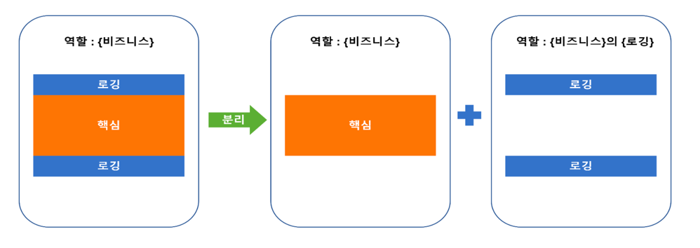
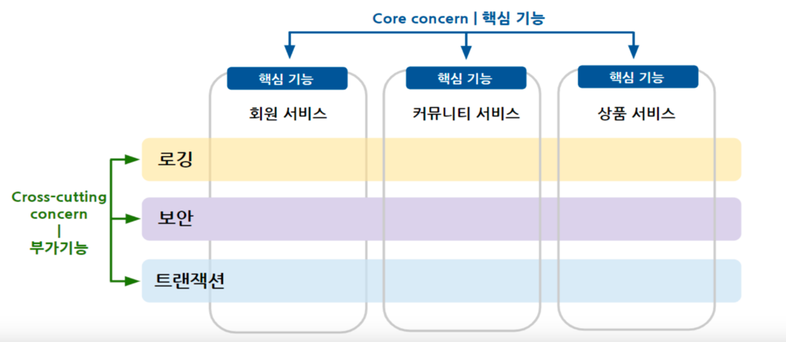
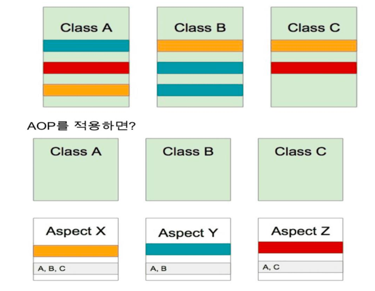
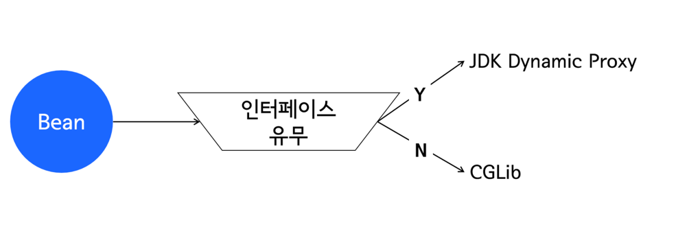
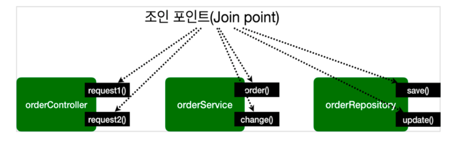
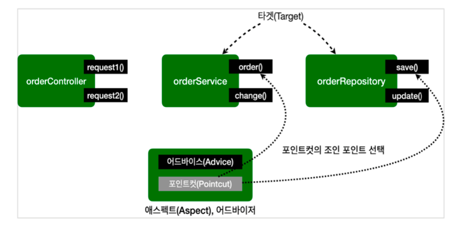
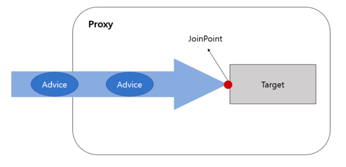
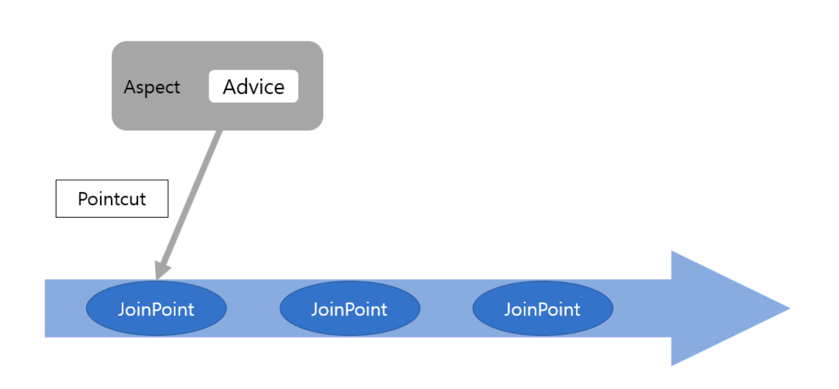
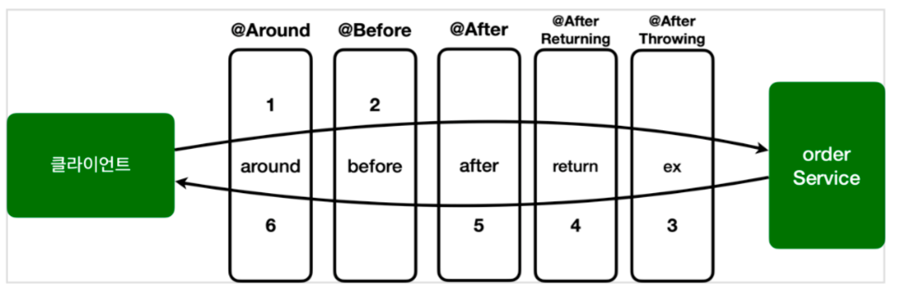

# AOP (Aspect Oriented Programming)

- 관점 지향 프로그래밍
- 어떤 기능을 구현할 때 그 기능을 **핵심기능** 과 **부가 기능**으로 구분한 각각의 기능

|              **핵심 기능**              |             **부가 기능**              |
|:-----------------------------------:|:----------------------------------:|
|            Core concern             |           Cross concern            |
|        비즈니스 로직이 처리하려는 목적 기능         | 여러 비즈니스 로직 사이에서 공통적이고 반복적으로 필요한 기능 |
| 회원 서비스<br/>커뮤니티 서비스<br/>상품 서비스<br/> |         로깅<br/>보안<br/>트랜잭션         |


- AOP는 **어떤 기능을 구현할 때 각각을 하나의 관점으로 보며 그 관점을 기준으로 묶어서
개발하는 방식을** 뜻함
<br> (즉, **핵심 기능과 부가 기능을 나누어서 개발**하는 것)
<br>


- 여러 비즈니스 로직에 반복되는 부가 기능을 하나의 공통 로직으로 처리하도록 모듈화하여 삽입하는 방식




- AOP는 재사용성을 고려한 기능이다
- 여기저기 흩어진 로직을 하나의 프로그램으로 만들어서 적용함으로써 유지보수하기가 좋다
  - 변경을 하기로했으면 한군데에서만 변경해주면 된다


## 예시




## 예시2



- 각 클래스 마다의 필요한 기능이 다르다고 가정
- 주황색은 세 클래스 모두에게 필요함 -> **공통모듈(부가적인 모듈)**이라 함
- 각 클래스마다 클래스의 고유기능만 구현하고 각 부가 기능은 주황색따로, 파란색따로, 빨간색 따로 구현
- 각 클래스마다 독립되게 만든 주황색/파란색/빨간색에 해당되는 부가기능을 필요한 위치에 넣어 수행되도록 만드는것이 좋다
- 각 클래스마다 어느시점에 어떤 부가 기능이 필요한지가 다르다 <br>-> **Aspect**이라 함 (혹은 **advice**라함)

<br>


## AOP 구현 방법

- 스프링은 이 중에서 프록시 패턴과 LTW를 지원함


### :one: 컴파일 과정에 삽입

- 공통부분의 부가기능에 해당되는 애들(advicde)을 메모리에 올라갈 때 조작해서 집어넣는 것


### :two: 바이트코드를 메모리에 로드하는 과정에서 삽입 (LTW)


### :three: 프록시 패턴을 이용

- 스프링은 프록시 패턴을 이용해서 실행시 삽입함

- 기능이 항상 필요한 것이 아니라 필요한 시점이 정해져 있는 경우 (클래스가 가진 기능에 내가 추가로 집어 넣고자하는 기능이 항상 필요한 것이 아닌 매달 첫째날에 필요한 경우, 한 여름에만 필요한 경우 등) 혹은 일부 사람에게만 필요한 경우
<br> => 이런 경우 해당 클래스 소스는 건드리지 않고 해당 클래스를 지원하는 대리자인 프록시 패턴을 만들 것

- 어떻게 구현할까
  - a클래스를 상속하는 대리자를 만듦
  - 여기에 부가기능을 넣어서 얘가 실제 A클래스의 각각의 기능을 호출하게 만들 것
  - 그러면 a클래스를 손대지 않아도 대리자가 대신 수행하면서 부가기능까지 수행할 수 있게 됨





- bean
  - 클라이언트가 사용하고자 하는 객체
  - 얘가 인터페이스를 상속하는지 유무에 따라 프록시 클래스를 만드는 방법이 다름
  - 인터페이스를 상속하는 경우<br> -> jdk dynamic proxy 상속
  - 인터페이슬르 상속하지 않는 경우<br> -> CGLib 상속

  
<br>


## AspectJ

- 언제를 작성하는 내용인 pointcut을 정의하는 방법을
aspectJ를 이용해서 간단하게 나타낼 수 있다

- 어떤 advice를 만들어서 이 advice는 특정 클래스안에서만 수행가능하도록 만드는 등의 작업을 지원

- 스프링쪽에서 개발한 것이 아니므로 따로 설치해주어야 한다 (스프링 고유 API가 아니다)


<br>


## AOP 용어








- 메서드를 호출할 경우에만 advice를 적용하는, 메서드 호출하는 pointcut을 적용할 수 있다

- order와 save메서드가 호출되는 시점은 pointcut임
  - 부가적인 advice가 호출되는 시점
  - advice가 적용되는 시점이 pointcut


### JoinPoint

- 프로그램이 수행되면서 각각의 기능이 수행되는 시점
- advice가 적용될 수 있는 모든 위치
  - Ex) 메서드 실행시점, 생성자 호출 시점, 필드 값 접근 시점 등

- 스프링 AOP는 프록시 방식을 사용하므로 조인 포인트는 항상 메서드 실행시점


### PointCut

- JoinPoint 중 advice가 적용될 위치를 선별하는 기능
- advice가 적용되는 시점이 pointcut
- 스프링 AOP는 프록시 기반이므로 JoinPoint가 메서드 실행시점뿐이고, PointCut 또한 메서드 실행 시점만 가능
- 여기서 order, save메서드가 호출될때 수행되도록 정의


### Target

- advice의 대상이 되는 객체
- Pointcut으로 결정됨

- pointcut을 가지고 있는 객체
  - orderService 
  - orderRepository


### Advice

- 실질적인 부가 기능 로직을 정의하는 곳
- 특정 JoinPoint에서 Aspect에 의해 취해지는 조치


### Aspect


- 실질적인 부가 기능 로직을 정의하는 곳
- 특정 JoinPoint에서 Aspect에 의해 취해지는 조치
- advisor라고도 함


### Advisor

- 스프링AOP에서만 사용되는 용어로 **Advice + Pointcut**한쌍
- 스프링에서는 Aspect보다 Advisor라고 많이 부름


### Weaving

- Pointcut으로 결장한 타겟의 JoinPoint에 Adivce를 적용하는 것


### AOP 프록시

- AOP 기능을 구현하기 위해 만든 프록시 객체





<br>


### Advice와 JoinPoint의 관계





<br>


## advice & pointcut



- 여러개인 경우 around advice가 제일 먼저 수행됨
<br> (항상 around가 제일 먼저 호출)

- 호출되기 전에는 around와 before만


<br>

## 포인트컷 정의

- Pointcut
  - advice가 적용될 위치를 선별하는 기능
  - 스프링 AOP는 프록시 기반이므로 메서드에만 적용이 가능하다. 따라서 어느 메서드에 적용할 것인지를 명시하는 것

### 포인트컷 종류

#### execution

```java
execution([접근제어자] 반환타입 [선언타입]메서드명(파라미터) [예외])
```


#### within

- withmin은 클래스 타입을 지정하는것으로 내부에 모든 메서드가 매칭됨
- execution에서 타입부분만 사용하는 것과 동일
- 정확하게 타입이 맞아야만 동작함


#### bean


- 스프링 빈의 이름으로 AOP적용 여부를 지정
- 스프링에서만 사용할 수 있는 특별한 지시자
