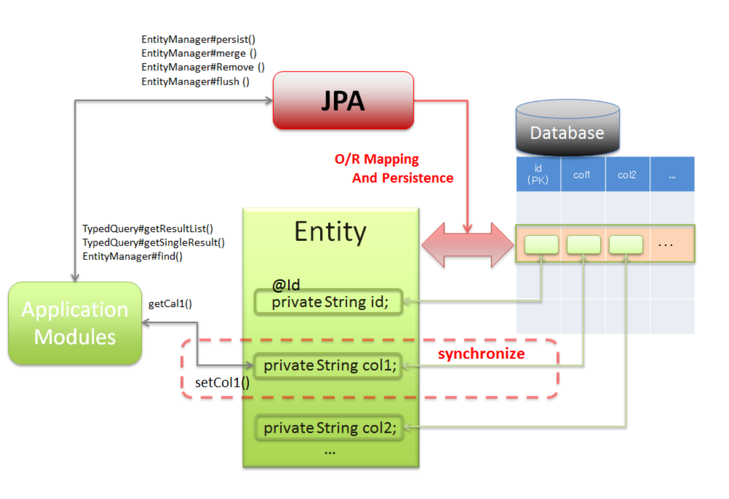
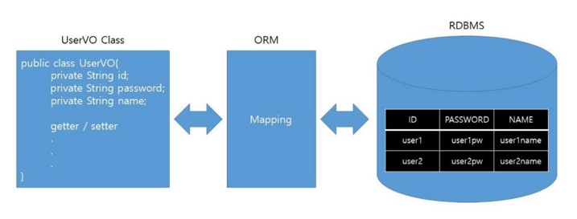
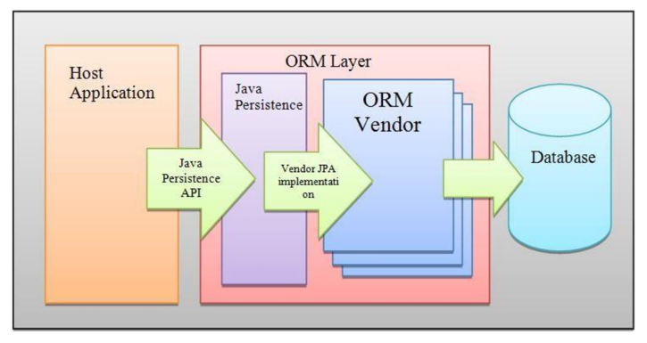
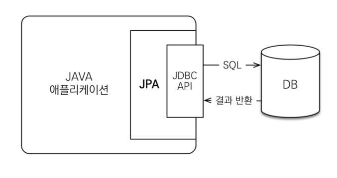
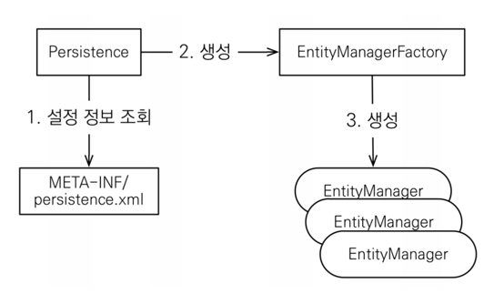
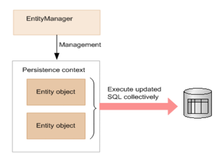
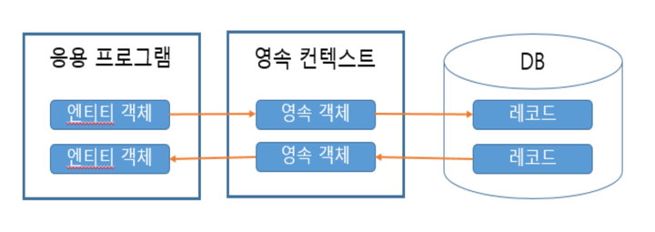
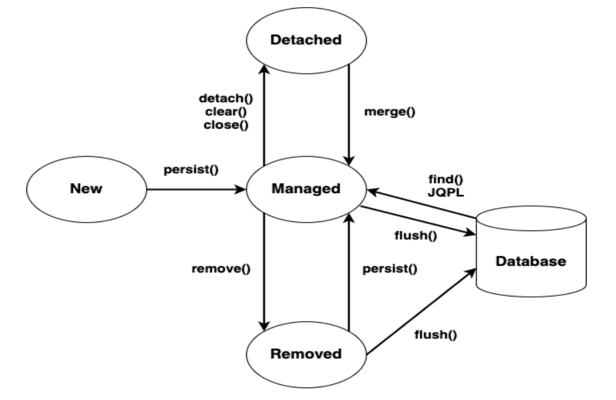

# JPA

- Java Persistence API
- RDBMS와 OOP 객체 사이의 불일치에서 오는 패러다임을 해결하기 위해서 만들어진
ORM(Object Relational Mapping)기술

- **자바 ORM에 대한 API 표준 명세이자 인터페이스의 모음**
<br> (구현체가 없으므로 JPA를 사용하기 위해서는 JPA의 구현체인 ORM프레임워크를 선택해야 함. ex)하이버네이트 )




JPA는 자바 객체와 테이블을 연관시켜주며 데이터를 보존시켜줌
<br>

- entity
  - db테이블과 매핑되는 자바 객체
  - 꼭 클래스명까지 엔티티여야하는 것은 아님 (클래스명은 vo여도되고 dto여도됨)
  - vo나 dto와 같은 도메인 클래스를 만들면서 `@entity`라 붙이면 db테이블과 연동이 가능한 클래스임을 알 수 있음


## ORM

- Object Relational Mapping (객체-관계 매핑)
- OOP의 객체 구현 클래스와 RDBMS에서 사용하는 테이블을 자동으로 매핑하는 것



클래스와 테이블은 호환 가능성을 두고 생성된 것이 아니므로 불일치가 발생하는데, 이를 ORM을 통해서
객체간의 관계를 바탕으로 SQL문을 자동으로 생성하여 불일치를 해결함<br>
=> 이 방법을 통해서 SQL문을 구현할 필요없이 객체를 통해 간접적으로 데이터베이스를 조작할 수 있음


<br>

## Persistence Framework

- JDBC 프로그래밍에서 경험하게 되는 복잡함이나 번거로움 없이 간단한 작업만으로 데이터베이스
연동되는 시스템을 빠르게 개발할 수 있음. 일반적으로 SQL Mapper와 ORM으로 나눠짐


### SQL Mapper

- 직접 작성한 SQL 문장으로 데이터베이스 데이터를 다룸
- MyBatis, jdbcTemplates(Spring)

```
sql <-> sql mapper <-> object 필드
```


### ORM

- 객체를 통해서 간접적으로 데이터베이스의 데이터를 다룸
- 객체와 관계형 데이터베이스의 데이터를 자동으로 매핑시킴
- jpa, hibernate

```
database data <-> orm <-> object 필드
```


<br>


## JPA 동작과정




- jpa는 혼자서 수행하지는 못하고 hibernate와 같은 구현체가 있어야 함
- jpa와 mybatis는 내부적으로 Jdbc를 사용함



- JPA는 애플리케이션과 JDBC 사이에서 동작을 함
- JPA 내부에서 JDBC API를 사용하여 SQL을 호출하여 DB와 통신함
- 개발자가 ORM 프레임워크에 저장하면 적절한 INSERT문을 생성해서 데이터베이스에 저장해주고, 검색을 하며
적절한 SELECT SQL을 생성해서 결과를 객체에 매핑하고 전달함


<br>


## JPA 장점


### 1. 생산성

- jpa를 사용하면 자바 컬렉션에 저장하듯이 jpa에게 저장할 객체를 전달하면 됨
- 반복적인 코드를 개발자가 작성하지 않아도 되며, DDL문 또한 자동으로 생성해주므로 데이터베이스 설계 중심을 객체 설계 중심으로 변경할 수 있음


### 2. 유지보수

### 3. 패러다임의 불일치를 해결


### 4. 성능


### 5. 데이터 접근 추상화와 벤더 독립성


<br>


## JPA 프로그래밍



1. persistence.xml 파일을 통해서 JPA를 설정함
2. EntityManagerFactory를 생성함
```java
EntityManagerFactory factory = Persistence.createEntityManagerFactory("emptest");
EntityManager em = factory.createEntityManager();
```

3. EntityManager를 생성하여 Entity를 `영속성 컨텍스트(persistence context)`를 통해서 관리함


<br>


- 엔티티 매니저 객체가 JPA에서 가장 중요함
<br> (데이터베이스 테이블에 매핑되는 자바 객체)


- CRUD 관련된 API는 엔티티 매니저에 들어가 있음
- `엔티티 매니저 팩토리`가 엔티티 매니저의 객체를 생성해줌


### EntityManagerFactory

- 데이터베이스와 상호 작용을 위한 EntityManager 객체를 생성하기 위해 사용되는 객체
- 애플리케이션에서 한번만 생성하고 공유해서 사용함


### EntityManager

- Entity를 관리하는 객체
- 데이터베이스 대한 CRUD 작업은 모두 영속성 컨텍스트를 사용하는 EntityManager 객체를 통해 이루어짐
- `동시성의 문제가 발생할 수 있으므로 스레드간에 공유하지 않음`
<br> (모든 데이터 변경은 트랜잭션 내에서 이루어 져야함. 즉, 트랜잭션을 시작하고 처리해야 함)

- 다 수행하고 나서는 트랜잭션을 종료하는 처리가 필요함
- `트랜잭션`: 데이터베이스의 데이터를 처리하는데에 있어 여러개의 작업들을 처리하는 논리적인 작업 단위





#### EntityManaer 메서드

##### flush()

- `영속성 컨텍스트(persistence context)의 변경 내용을 실제 데이터베이스에 반영함`
- 일반적으로 fluse() 메서드를 직접 사용하지는 않고, 자바 애플리케이션에서 커밋 명령이 들어왔을 때 자동으로 실행됨


##### detach()

- 특정 엔티티를 준영속 상태 (영속 컨텍스트의 관리를 받지않음)로 바꿈

##### clear()

- persistence context를 초기화함

##### close()

- persistence context를 종료함


##### merge()

- 준영속 상태의 엔티티를 이용해서 새로운 영속 상태의 엔티티를 반환함

##### find()

- 식별자 값을 통해 entity를 찾음 (데이터베이스의 테이블의 데이터 또는 행을 찾음)


##### persist()

- 생성된 엔티티 객체를 영속성 컨텍스트에 저장함

##### remove()

- 식별자 값을 통해 영속성 컨텍스트에서 엔티티 객체를 삭제함

<br>


## JPA에서의 엔티티

- DB테이블에 대응하는 하나의 객체
- `@Entity`가 붙은 클래스를 JPA에서는 엔티티라함
- 이 엔티티는 영속성 컨텍스트에 담겨 EntityManager에 의해 관리됨




```java
@Entity
public class EntityTest {
  @Id
  @GeneratedValue(strategy = GenerationType.IDENTITY)
  private int id;
  private String name;
  private int age;
  private LocalDateTime birthday;

  public int getId() {
    return id;
  }

  public void setId(int id) {
    this.id = id;
  }

  public String getName() {
    return name;
  }

  public void setName(String name) {
    this.name = name;
  }
}
// ...
```


<br>

## 엔티티 생명주기

1. 비영속 상태(new/transient)
   - 영속성 컨텍스트와 전혀 관계가 없는 상태

2. 영속(managed)
   - 영속성 컨텍스트에 저장된 상애

3. 준영속(deteched)
   - 명속성 컨텍스트에 저장되었다가 분리된 상태


4. 삭제(removed)
   - 삭제된 상태





<br>


## 엔티티 생성과 저장


<BR>


## 표준 API (자바만의 API)


- `java.`
  - 코어
  - 기본


- `javax.`
  - 확장


<br>

## JPA 객체지향 쿼리 언어

- JPA는 다양한 쿼리 방법을 지원함
- JPQL
- QueryDSL


<BR>


## JPQL

- Java Persistence Query Language
- sql을 추상화한 객체 지향 쿼리 언어
- sql과 문법이 유사함
- `엔티티 객체를 대상`으로 쿼리를 수행함
- sql을 추상화하였으므로 특정 db문법에 의존하지 않음

```java
List<Member> result = em.createQuery("select m from Member m where m.username like
'%kim%'", Member.class).getResultList();
```


<br>

## Query DSL

- 문자열이 아닌 자바코드로 JPQL로 작성이 가능함
- JPQL 빌더 역할을 하며, 컴파일 시점에 문법 오류를 찾을 수 있음
- 동적 쿼리를 작성하기에 편함
- SQL과 비슷하여 단순하고 쉬우며 실무 사용에 권장됨


```java

```


<br>


## TypedQuery

- 반환할 타입을 명확하게 지정할 수 있을 때 사용

```java
TypedQuery<Member> query = em.createQuery("select m from Member as m",Member.class);

List<Member> members = query.getResultList();
TypedQuery<String> query = em.createQuery("select m.username from Member as m",String.class);

List<String> names = query.getResultList();


// count -> 결과는 하나의 행. 1행 1열
TypedQuery<Long> query = em.createQuery("select count(m.username) from Member as m", Long.class);
// 따라서 singleresult에 담음. 
        //결과를 예측할 수 있을 때 typedquery 사용
Long su = query.getSingleResult();
```


<br>

## Query

- 반환 타입을 명확하게 지정할 수 없을 때 사용

```java
Query query = em.createQuery("select m.username, m.age from Member m");
```

- 조회 타입이 `String 타입의 username과 Integer 타입의 age`이므로 반환 타입이 명확하지 않음
- Query 객체는 조회 대상이 둘 이상이면 `Object[]`를 반환하고 조회 대상이 하나면 Object를 반환함


```java
List<Object[]> resultList = query.getResultList();

for (Object[] objects : resultList) {
 String userName = (String) objects[0];
 Integer age = (Integer) objects[1];
 }

List resultList = query.getResultList();
for (Object o : resultList) {
 Object[] objects = (Object[]) o;
 String userName = (String) objects[0];
 Integer age = (Integer) objects[1];
}


// 카운트한 결과가 어떤 타입으로 추출될지 모른다면 쿼리객체 생성해서 object 형으로 받아도 됨
Query query = em.createQuery("select count(m.username) from Member m");
Object su = query.getSingleResult();


// string 형으로 추출할 떄에도 object형으로 받게끔 쿼리 객체로 처리해도 됨
Query query = em.createQuery("select m.username from Member m");
List<Object> resultList = query.getResultList();
```


<br>


## 결과 조회 API


<BR>


## JPA 기본키 매핑

- mysql 사용시 identity 방법을 이용하자

### IDENTITY

- 기본키 생성을 DB에 위임하는 전략
- 