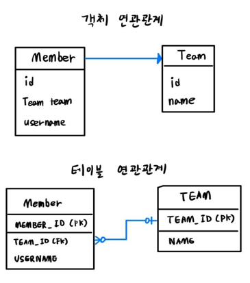

# JPA

## JPA 연관관계 매핑

- 엔티티는 다른 엔티티와의 연관관계가 존재하는 경우가 많다
- 연관관계는 `단방향`과 `양방향`이 있다

```
회원 -> 팀 
// 회원은 팀을 참조

팀 -> 회원
// 팀은 회원을 참조
```
위 두 관계에서 하나만 성립하는 경우 `단방향 관계`, 두 가지 관계 모두 서로를 참조하면 
`양방향 관계`


### 단방향 연관 관계



- Member가 Team을 참조하고 있음 
  

- 멤버는 하나의 팀에만 속할 수 있다
- 게시판 짤 때 댓글이 여러 글의 댓글이 될 수는 없다

- 객체간의 연관관계에서는 단방향 관계이므로 member → team 조회는 가능하지만 반대의 경우에는 조회를
할 수 없음

- Member.team 필드를 통해서 팀을 알수 있으나 반대로 팀은 회원을 알 수 없음


<BR> 

### 양방향 연관 관계

- JOIN등을 이용하여 양방향 연관 관계를 형성할 수 있음


<br>


## `@JoinColumn`

- 외래키를 매핑할 때 사용
- 생략 가능 (생략시 외래키를 찾을 때의 기본 전략을 사용함)
- 기본 전략: `필드명 + _ + 참조하는 테이블의 컬럼명`
  - ex) team_TEAM_ID


<br>

