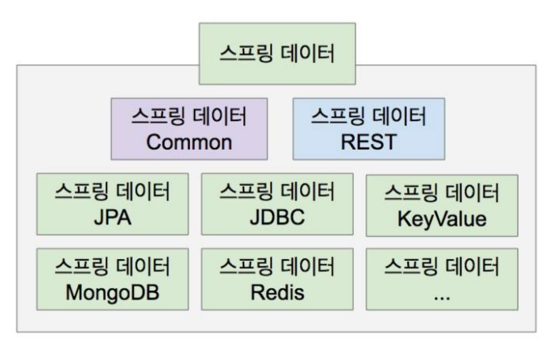

# Spring Data 와 Spring Data JPA



- 센서 수치 데이터를 저장할 때에는 key & value 쌍이 유리

- 스프링 데이터는 relational Data 뿐만 아니라 다양한 데이터를 다룰 수 있는 서브 모듈을 제공함


- spring data jpa 에서는 Dao라는 이름 대신 Repository라는 이름을 사용
<br> (이미 crud기능을 내장하고있는 jpa respository를 제공함 -> 이를 상속하여 나만의 repository를 만들면 됨. ex)emp repository)
<br> (하지만 더 나아가 특화된 데이터를 다루려면 jpql등을 추가로 사용해야 함)


- casandra 
  - 분산환경을 더 잘 지원하는 데이터베이스 시스템
  - nosql
  - mongo db와 유사


<br>


## Spring Data JPA

- 스프링 프레임워크에서 JPA를 편리하게 사용할 수 있도록 지원하는 프로젝트
- CRUD 처리를 위한 공통 인터페이스를 제공함


- Repository 개발 시 인터페이스만 작성해도 실행 시점에 Spring Data JPA가 구현 객체를
동적으로 생성해서 주입시키므로 데이터 접근 계층을 개발할 때 구현 클래스 없이 인터페이스만 작성해도 개발을 완료할 수 있도록 지원함
<br> (사실 repository는 메서드 호출방식만 정해놓았고 알맹이는 없음)


- Spring Data JPA를 사용하기 위해서는 일반적으로 `JpaRepository<T, ID>` 인터페이스를 상속한
  나만의 Repository 인터페이스를 정의하면 됨
<br> (`T`: 엔티티 클래스이름. `ID`: ID에 해당되는 PK에 해당되는 필드의 타입 -> 이것들을 지정하면 curd관련 기능을 알아서 넣어줌. 어느정도의 crud관련 메서드는 jparepository가 가지고 있기 때문임)
<br> (어떤 엔티티를 위한 repository인지 알아볼 수 있도록 `엔티티클래스명Repository명`으로 repository 인터페이스를 작명함)
<br> (ex. EmpRepository, MeetingRepository, VisitorRepository 등)


- 기본적인 메서드가 이미 포함되어있음 
- 스프링이 알아서 구현체를 넣어주므로 정의한 인터페이스를 구현할 필요가 없음
<br> (구현체가 알아서 정의 되어있음)


<br>


### JpaRepository 주요 메서드

| 메서드                        | 설명                                                                                                                                                                                                      |
|:---------------------------|:--------------------------------------------------------------------------------------------------------------------------------------------------------------------------------------------------------|
| `<S extends T> S save(S)`  | 새로운 엔티티는 저장하고, 이미 있는 엔티티는 병합함                                                                                                                                                                           |
| `delete(T)`                | 엔티티 하나를 삭제함                                                                                                                                                                                             |
| `Optional<T> findById(ID)` | ID로 엔티티 하나를 조회함<br/>리턴값의 유형에 Optional 객체 존재 -> 제네릭스 사용<br/>Optional<T> -> 엔티티 객체를 담고있는 Optional 객체. null이 리턴되면 Optional객체를 이용해서 wrapping함. 따라서 NullpointerException에서 자유로워짐 (리턴 결과를 Optional객체로 묶어서 처리) |
| `List<T> findAll(...)`     | 모든 엔티티를 조회함<br/>정렬(sort)이나 페이징(Pageable) 조건을 파라미터로 제공할 수 있음<br/>대문자 t에 대한 리스트 객체를 보관 -> 대문자 t는 `JpaRepository<T, ID>`의 T임. emp객체를 담고 있는 리스트 객체를 리턴해주고 싶으면 T자리에 emp를 사용<br/>                             |


- 상속 구조
  - repository를 만들 때에는 JpaRepository를 상속한다. 조상들이 가지고 있는 메서드는 내가 가지고 있는것과 동일하다


- 상기 그림에서의 T는 모두 Optional로 변경되었다.


- 이 메서드들을 우리가 직접 구현할 필요가 없다.
- 인터페이스 구현은 메서드 사양을 맞춰주는 것이다.


- 어떤 엔티티에 대한 repository인지에 따라 작명
- 엔티티 클래스가 가지고 있는 id의 타입 정보를 같이 지정하여 상속해야함
- itemrepository의 경우 T에 Item이 와야함
- 내부에 정의된 메서드들이 없더라도 조상의 인터페이스를 상속하면 조상의 메서드는 가지고 있음
- 구현체는 Spring Data JPA가 제공함
<br> => 개발 생산성 향상

<br>


- 엔티티만의 Repository인 인터페이스만 만들어주면 구현체는 알아서 넣어준다


### 쿼리 메서드

- 

- 쿼리를 처리하는 메서드
- 메서드명이 결국 쿼리임 (메서드명을 보면 어떤 쿼리를 구성할것인지를 알 수 있음)
  - `findByEname`
  - `findByno`

- 위의 메서드들은 모든 엔티티에 대해 공통으로 쓰일 수 있는 메서드를 제공하지만, 사실 비즈니스
  로직을 다루는 것은 그리 간단하지 않다. 조건을 지정하여 조회하거나, 제거하거나 저장할 수 있는
  기능들을 커스터마이징 해야 한다.

- 따라서 Spring Data JPA는 Repository를 커스터마이징 하기위해 쿼리 메서드 기능을 제공하는데, 3가지 방
  법이 있다.

1.  메서드 이름으로 쿼리 생성 -> 간단한 쿼리 처리 시 좋음
2. @Query 안에 JPQL 정의 -> 복잡한 쿼리 처리 시 좋음
3. 메서드 이름으로 JPA NamedQuery 호출 (잘 안쓰임)


#### :one: 메서드 이름으로 쿼리 생성

|쿼리 종류|                           이름 규칙                            |
|:---:|:----------------------------------------------------------:|
|조회| `find ... By`, `read ... By`, `query ... By`, `get ... By` |
|COUNT|               `count ... By`<br/>반환 타입: Long               |
|EXISTS|             `exists ... By`<br/>반환 타입: boolean             |
|삭제|              `delete ... By`, `remove ... By`              |
|DISTINCCT|           `findDistinct`, `findMemberDistinctBy            |
|LIMIT|      `findFirst3`, `findFirst`, `findTop`, `findTop3`      |

- 쿼리 메서드 예시

```java
public interface EmpRepository extends JpaRepository<Emp, Integer>{
}

public interface VisitorRepository extends JpaRepository<Visitor, Integer>{
  public List<Visitor> findByMemoContains(String keyword);
}

public interface MeetingRepository extends JpaRepository<Meeting, Integer>{
  public List<Meeting> findByTitleContains(String keyword);
  public List<Meeting> findByName(String name);
}

public interface ReplyRepository extends JpaRepository<Reply, Integer>{
  public List<Reply> findByRefid(Meeting vo);
}

public interface EmpRepository2 extends JpaRepository<Emp, Integer>{
  public List<Emp> findByEname(String name);
  public List<Emp> findByEnameIgnoreCase(String name);
  public List<Emp> findByJob(String job);
  public List<Emp> findByJobOrDeptno(String job, int dno);
  public List<Emp> findByJobAndDeptno(String job, int dno);
  public List<Emp> findDistinctByJob(String job);
  public List<Emp> findByDeptno(int dno);
  public List<Emp> findBySalGreaterThan(int inputsal);
  public List<Emp> findBySalGreaterThanEqual(int inputsal);
  public List<Emp> findBySalLessThan(int inputsal);
  public List<Emp> findBySalLessThanEqual(int inputsal);
  public List<Emp> findBySalBetween(int minsal, int maxsal);
  public List<Emp> findByCommNull();
  public List<Emp> findByCommNotNull();
  public List<Emp> findByHiredateAfter(java.sql.Date d);
  public List<Emp> findByHiredateBefore(java.sql.Date d);
  public List<Emp> findByEnameStartsWith(String partname);
  public List<Emp> findByEnameContains(String partname);
  public List<Emp> findByDeptnoOrderBySalDesc(int dno);
  public List<Emp> findTop3ByDeptnoOrderBySalDesc(int dno);
}

public interface MemberTeamRepository extends JpaRepository<Member, Integer>{
  @Query("select m from Member m join m.team t where t.teamname = :tn")
  public List<Member> aaa(@Param("tn") String tname);
  @Query("select t.teamname from Member m join m.team t where m.username = :un")
  public String bbb(@Param("un") String uname);
  public List<Member> findByUsername(String username);
  public Long countByUsername(String username);
  public Long countBy();
}
```


```java
@JoinColumn(name = "TEAM_ID")
// 매칭되는 테이블의 컬럼명이 TEAM_ID로 지정됨
```


<br>


#### :two: @Query 안에 JPQL 정의 ()

```java
public interface SpringDataJpaItemRepository extends JpaRepository<Item, Long> {
  List<Item> findByItemNameLike(String itemName);
  List<Item> findByPriceLessThanEqual(Integer price);
  //쿼리 메서드 (아래 메서드와 같은 기능 수행)
  List<Item> findByItemNameLikeAndPriceLessThanEqual(
  String itemName, Integer price);
  //쿼리 직접 실행
  @Query(
   "select i from Item i where i.itemName like :itemName and i.price <= :price")
  List<Item> findItems(@Param("itemName") String itemName,
  @Param("price") Integer price);
}
```

- 직접 이름을 정의하면 됨
- 이름이 길다는 단점이 존재
- 이름으로 검색하거나, 가격으로 검색하는 기능은 공통으로
  제공할 수 있는 기능이 아님. 따라서 이런 경우네는 쿼리 메서드 기능을 사용하거나 @Query 를
  사용해서 직접 쿼리를 실행해야함

- 위의 코드 데이터를 조건에 따라 4가지로 분류해서 검색함 (jpql 수행)

1. 모든 데이터를 조회 -> findAll()
2. 이름을 가지고 조회 -> findByItemNameLike()  (`like`를 붙이지 않으면 등가연산. like를 붙이면 like를 붙여서 비교하라는것)
3. 가격 조회 -> findByPriceLessThanEqual()
4. 이름 & 가격 조회 -> findByItemNameLikeAndPriceLessThanEqual()

조건이 많아질수록 메서드명이 길어지고 이름만으로 조건을 다 처리하기가 어렵다.<br>
이러한 경우에는 JPQL 쿼리를 작성하여 처리할 것.<br>

##### :one: findAll()

- 코드에는 보이지 않으나 JpaRepository 공통 인터페이스가 제공하는 기능
- 모든 Item을 조회함
- 실행되는 JPQL

```sql
select i from Item i
```

##### :two: findByItemNameLike()

- 이름 조건만 검색했을 때 사용하는 쿼리 메서드
- 실행되는 JPQL

```sql
select i from Item i where i.name like ?
```


##### :three: findByPriceLessThanEqual()

- 가격 조건만 검색했을 때 사용하는 쿼리 메서드
- 실행되는 JPQL

```sql
select i from Item i where i.price <= ?
```


##### :four: findByItemNameLikeAndPriceLessThanEqual()

- 이름과 가격 조건을 검색했을 때 사용하는 쿼리 메서드
- 실행되는 JPQL

```sql
select i from Item i where i.itemName like ? and i.price <= ?
```


<br>


#### findItems()

- 메서드 이름으로 쿼리를 실행하는 기능은 다음과 같은 단점이 있다

1. 조건이 많으면 메서드 이름이 너무 길어진다.
2. 조인 같은 복잡한 조건을 사용할 수 없다.

메서드 이름으로 쿼리를 실행하는 기능은 간단한 경우에는 매우 유용하지만, 복잡해지면 직접
JPQL 쿼리를 작성하는 것이 좋다. <br>쿼리를 직접 실행하려면 `@Query` 어노테이션을 사용한다.


### spring data jpa 상 db 서버 정보

- persistence.xml의 내용이 스프링의 고유 configuration file인 application.properties로 넘어감

<br>


### Spring Boot Application에 설정된 어노테이션 

```springdataql
@SpringBootApplication

@ComponentScan(basePackages={"com.example.demo","thymeleaf.exam","springjpa.exam"})
// 스캔 위치를 설정 

@EnableJpaRepositories(basePackages = {"springjpa.exam.repository"})

@EntityScan(basePackages = {"springjpa.exam.entity"}) 
// JPA와 관련된 어노테이션
// 엔티티 클래스들이 만들어진 패키지를 지정
```


- @SpringBootApplication 어노테이션은 스프링 부트의 가장 기본적인 설정을 선언함
  - 내부적으로 @ComponentScan과 @EnableAutoConfiguration을 설정함


- @ComponentScan 어노테이션은 스프링 3.1부터 도입된 어노테이션이며 스캔 위치를 설정

- @EnableJpaRepositories 어노테이션은 JPA Repository들을 활성화하기 위한 어노테이션

- @EntityScan 어노테이션은 엔티티 클래스를 스캔할 곳을 지정하는데 사용함


<br>


## Spring Boot


- Boot가 붙으면 자동 초기화하는 부분이 달라짐
- 스프링 프레임워크는 스프링부트보다 초기 환경설정에 걸리는 시간이 더 길어짐
- 스프링 프레임워크는 스프링부트와 달리 WAS가 내장되어있지 않음

- `DAO`: 대표적인 서비스모델. 여기서는 Repository를 뜻함


- 먼저 요청을 받는것은 수많은 filter와 dispatcher servlet
- 컨트롤러만 수행하고 리턴할수도, 직접 리턴(rest controleer)할 수도 있음
<br> (view를 통해 리턴하는 것은 thymeleaf를 사용함으로써 가능해짐)


<br>

### Spring Boot test

- 스프링부트 기반 프로그램 각각이 잘 작동하는지는 확인하고 싶을 때 사용
- 스프링 부트는 서블릿 기반의 웹 개발을 위한 spring-boot-starter-web, 
유효성 검증을 위한 spring-boot-starter-validation 등 spring-boot-starter 의존성을 제공하고 있음


- 테스트를 위한 spring-boot-starter-test 역시 존재하는데, 다음과 같은 라이브러리들이 포함됨
1. JUnit 5
   - 자바 애플리케이션의 단위 테스트를 위한 사실상의 표준 테스트 도구
2. Spring Test & Spring Boot Test
   - 스프링 부트 애플리케이션에 대한 유틸리티 및 통합 테스트 지원
3. AssertJ
   - 유연한 검증 라이브러리
4. Hamcrest 
   - 객체 Matcher를 위한 라이브러리
5. Mockito
   - 자바 모킹 프레임워크
6. JSONassert
   - JSON 검증을 위한 도구
7. JsonPath
   - JSON용 XPath


<br>

#### 테스트를 위해 클래스에 정의하는 어노테이션

- `spring-boot-starter-test 의존성`을 추가하면 스프링이 미리 만들어둔 테스트를 위한 다양한 어노테
  이션을 사용해 편리하게 테스트를 작성할 수 있음

```java
@SpringBootTest
// 프로젝트 전체를 테스트. 필요한 컴포넌트를 등장시켜서 테스트가 가능하도록 해줌

@WebMvcTest
// webMVC를 단위테스트 해줌
// 웹 부분만 테스트할 때 사용
// 내가 만든 컨트롤러의 결과가 원하는 응답 결과를 제대로 불러오는지 확인
// 추가로 필요한 repository, service등은 직접 객체 지정해주어야 함

@DataJpaTest
// JPA부분만 단위 테스트를 해주는 클래스 (repository만 테스트)
// 단위 테스트 -> 내가 만든 repository가 제대로 작동하는지 테스트하는 것


@RestClientTest
@JsonTest
@JdbcTest
```


##### `@DataJpaTest`

```java
@DataJpaTest
@Rollback(false)
class MyRepositoryTests {
 // ...
}
```

테스트용으로 수행한 DML명령은 자동으로 롤백 (default가 롤백) (테스트 프로그램이 아니라면 default가 commit)
<br>

- 테스트하고나서 수행결과가 반영되게 하고 싶으면 `@Rollback(false)`로 설정


- mysql이라는 데이터베이스를 연동하면 `@AutoConfigureTestDatabase(replace = Replace.NONE)`설정해서 내장 데이터베이스를 쓰지 않게끔 해주어야 함


- 내장 데이터베이스(`H2`)를 쓴다면 이를 설정할 필요가 없다