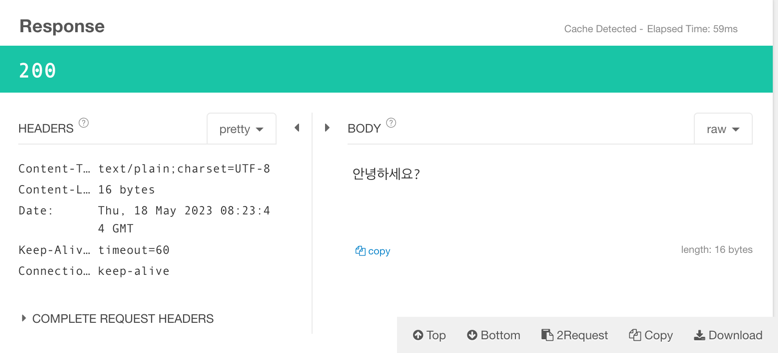
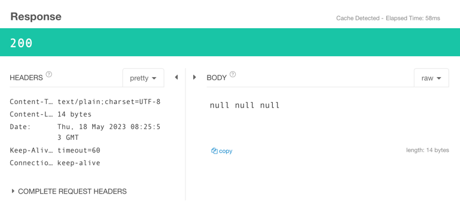
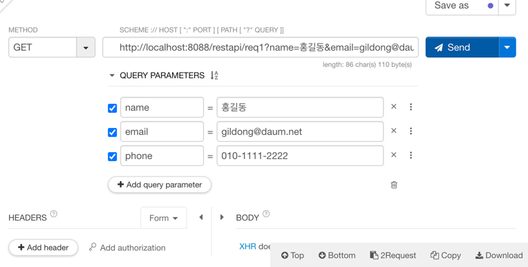
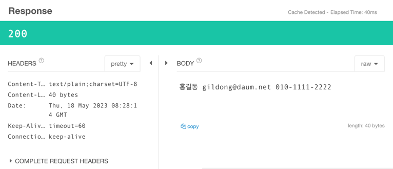

# Spring REST API

## Talend API

- 테스트 수행해보자
- 기본적으로 https로 되어있으나 `http`로 바꾸어서 수행

- 다음 url을 입력하고나서 send

```url
http://localhost:8088/restapi/hello
```

- 응답 결과



<br>


```
http://localhost:8088/restapi/req1
```



쿼리 파라미터를 주지 않았으므로 null값이 등장함<br>
따라서 쿼리파라미터를 넣어서 전달할 것
- `text/plain` : 응답된 파라미터 형태


<br>


- 위 에러를 수정하면 다음과 같다

repuest


response


<br>


## REST

- `RE`presentational `S`tate `T`ransfer의 약어
- World Wide Web과 같은 분산 하이퍼미디어 시스템을 위한 소프트웨어 아키텍쳐의 한 형태
<br> (웹의 장점을 최대한 활용할 수 있는 아키텍쳐)
- 하나의 URI는 하나의 고유한 리소스(resource)를 대표하도록 설계된다는 개념
- 즉, `자원을 이름으로 구분하여 해당 자원의 상태(정보)를 주고받는 모든 것`


### REST 등장배경

- http 프로토콜을 매개체로 하여 통신하는 웹이 세상에 나오면서 전세계의 웹통신망을 연결함<br>
웹을 통해서 온라인 학습이나 하는 정도로만 웹 통신을 이용하는 상황에서 만약 회사와 회사간 비즈니스 로직을 위해 통신 프로그램을 개발하는 경우에도 웹을 사용해서 개발할 수 있도록 설계된 것이 `REST`<br>

- 비즈니스 통신할 떄 각 회사간 정보를 주고받을 때 검증된 통신 기술인 웹을 사용하면 좋겠다는 생각에서 비롯됨


- MSA
    - 한 덩어리의 서버가 아닌 기능별로 서버를 쪼개어서 여러개의 서버 환경을 구축하는 것 
    - 사이트를 구축할 때 구축하고자하는 서비스를 여러개의 기능으로 나누어서 각각의 웹 컴포넌트가 되도록 하는 것
    - ex) spring, springedu1, springedu2, ... (url을 가지고 나눌수도 있음)


- 점점 클라이언트의 역할이 많아지고, 클라이언트 머신 자체가 다양해졌다 (스마트폰, 태블릿, ...)
- 클라이언트 단에서 vue, react등을 이용할 때 서버에서 데이터를 받아다가 클라이언트 측에서 처리하는 클라이언트 사이드 렌더링의 중요성이 대두되면서 필요한 것만 받아올 수 있는
  REST 프로그래밍이 필요해짐


- 관공서에서 제공하는 API는 REST API로 개발되었다


- url 문자열을 가지고 url문자열과 쿼리문자열을 사용해서 원하는 바를 가져감
- 우리가 가진 응욮프로그램에서 REST API를 사용하게 만듦

- 네이버 블로그에서 뭔가를 검색해서 가져가게 만들기 위해 REST API를 설계
  - 요청된 URL이 정해짐
  - 검증된 사용자만 사용가능
  - 응답해주는 형식이 정해져 있음 (.xml 또는 .json)


  <br>

## 무엇을 REST API라고 볼 수 있는가?

- 웬만한 SNS나 관공서에서 제공하는 것은 진정한 REST API라고 보기 어렵다

- 쇼핑몰 사이트에서 상품이미지를 자세히 보고 싶을 경우 이미지를 클릭해서 상품에 대한 상세페이지로 들어간다
  - 이러한 서비스 페이지는 html가지고 이미지를 보여주고 이미지에 링크 설정을한다
  - 만약, 상품 이미지의 링크가 바뀐 경우 엮인 모든 코드를 수정해야한다.
  - html만으로만 만들어놓으면 클라이언트는 반드시 브라우저여야 한다 (일반 애플리케이션은 안됨)
  - 일반 애플리케이션(모바일 앱 등)에서도 우리가 제공하는 상품 이미지들, 상품 이미지를 클릭했을 떄 보여질 상세 정보등을 고정된 컨텐츠(html)들로 만들어놓고 서비스하면 html을 사용해야만 서비스를 제공받을 수 있다
  - 이와 달리 `rest`를 이용한다면 클라이언트가 브라우저가 아니더라도 사용자에게 이미지와 이미지에 대한 상세설명을 보여주는 기능을 만들 수 있다. (꼭 html이 아니라 하더라도 말이다!)
    - 이러한 경우 관련된 정보로 옮겨갈 수 있는 url이 같이 와야한다. (`application/hal`)
    - 그때그떄 동적인 처리가 가능해지므로 상품의 이미지가 바뀌어도 금방 처리할 수 있다


- `자원을 이름(자원의 표현)으로 구분하여 해당 자원의 상태를 주고 받는 모든 것`

<br>


## RESTful 방식

- 클라이언트에게 제공할 자원(상품 정보 리스트, 상품의 상세 정보)에 자원만의 이름을 붙여주어야 한다. ->  uri문자열
  - 클라이언트가 그 자원을 읽거나 삭제하거나 수정하는 작업들을 서버에게 요청할 수 있는 그러한 operation이 가능하도록 사이트를 만들어서 서비스하는것이 진정한 restful방식이다

<br>


## REST API 설계

- 영화 관련 데이터가 자원일 경우 영화관련 데이터에 대한 이름을 정하는 경우 movies라고 이름을 정할 수 있다. 
- crud중 무슨 작업을 하든간에 `/movies/...`처럼 작업하도록 명칭을 하나로 통일 해야 한다.
- uri는 똑같고 무슨 방식으로 요청하는 것인지에 따라 작업 방식을 구분함
- 따라서 REST API를 설계할 때 자원의 명칭을 정하는 것이 매우 중요하다.


