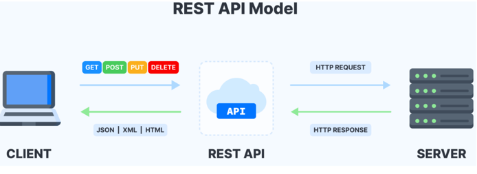
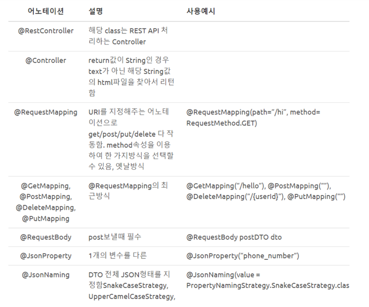
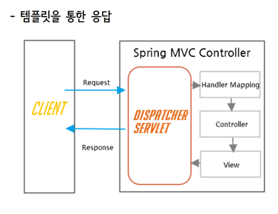
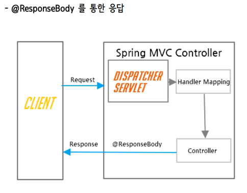
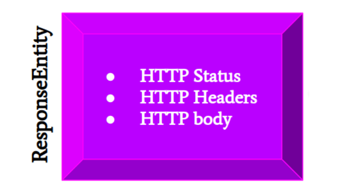

# Spring REST API

## REST

- `RE`presentatinal `S`tate `T`ransfer
- 과거 웹(HTTP) 설계의 우수성에 비해 제대로 사용되지 못하였을 때, 웹의 장점을 최대한 활용하기 위한 아키텍처로서 `REST`가 등장 (웹 기반의 처리 구조)
- 자원을 정의하고 자원에 대한 주소를 지정하는 전반적인 방법인 `네트워크 아키텍처 원리`의 모음
- Client와 Server 사이의 통신 방식
- `웹의 기존 기술과 HTTP 프로토콜을 그대로 활용`하므로 `웹의 장점을 최대한 활용`할 수 있는 아키텍처 스타일
- 자원 기반의 주소 (ROA, Resource Oriented Architecture) 설계의 중심에 Resource가 있고 HTTP method를 통해 Resource를 처리하도록 설계된 아키텍처

- 웹 사이트의 이미지, 텍스트, DB 내용 등 모든 자원에 고유한 ID인 HTTP URI를 부여함

| CRUD   | Operation |
|:-------|:----------|
| Create | POST (생성) |
| Read   | GET (조회)  |
| Update | PUT (수정)  |
|Partial Update| PATCH (부분 수정)|
|Delete| DELETE (삭제)|
|HEAD| header 정보 조회 (HEAD)|

- 즉 REST란, `자원을 표현하는 이름으로 구분하여 해당 자원의 상태를 주고 받는 모든 것`을 뜻함


- 4개의 URL은 모두 같으나 get,post,put인지 등에 따라 여떠한 방식의 요청을 하는지가 달라짐


### RESTful
- 필딩의 REST의 원리를 따르는 시스템

<br>

### REST는 왜 필요한가?

- 애플리케이션의 분리 및 통합
- 웹을 기반으로 하는 C&S환경의 다양한 프로그램 개발
- 다양한 클라이언트의 등장 (스마트폰 등)


- 웹 기반의 통신을 할 경우 REST를 사용하는 것이 좋다
- 요기요, 배달의 민족등은 웹앱으로 구현
  - 필요한 부분만 받아서 사용함을 알 수 있음 -> REST


<br>

### REST의 특징

#### :one: Server-Client (서버-클라이언트 구조)

- `Server`: 자원이 있는 쪽
- `REST Server`: API를 제공하고 비즈니스 로직 처리 및 저장을 책임짐
- `Client`
    - 자원을 요청하는 쪽
    - 사용자 인증 및 context(세션, 로그인 정보)등을 직접 관리하고 책임짐


#### :two: Stateless (무상태)

- HTTP 프로토콜은 stateless 프로토콜이므로 REST 또한 무상태성을 가짐
- `Client`의 context를 서버에 저장하지 않음
<br> (세션과 쿠키와 같은 context 정보를 신경쓰지 않아도 되므로 구현이 단순해짐)
- `Server`는 각각의 요청을 완전히 별개의 것으로 인식하고 처리함
  - 각 API 서버는 클라이언트의 요청만을 처리함
  <BR> (이전 요청이 다음 요청의 처리에 관련되어서는 안됨. 단, 이전 요청이 DB를 수정하여 DB에 의해 바뀌는 것은 허용함)
  - 서버의 처리방식에 일관성을 부여하므로 부담이 줄어들고 서비스의 자유도가 높아짐


#### :three: Cacheable (캐시 처리 기능)

- 웹 표준 HTTP protocol을 그대로 사용하므로 웹에서 사용하는 기존의 인프라를 그대로 활용할 수 있음
<br> (HTTP가 가진 가장 강력한 특징 중 하나인 캐싱 기능을 적용할 수 있음)
  - HTTP protocol 표준에서 사용하는 Last-Modified 태그나 E-Tag를 이용하면 캐싱 구현이 가능함


- 대량의 요청을 효율적으로 처리하기 위해 캐시가 요구됨
- 캐시 사용을 통해 응답시간이 빨라지고 REST Server 트랜잭션이 발생하지 않기 때문에 전체 응답시간, 성능, 서버의 자원 이용률을 향상시킬 수 있음

<br>


#### :four: Layered System (계층화)

- 클라이언트는 REST API Server만 호출함
- REST Server는 다중 계층으로 구성될 수 있음
  - API Server는 순수 비즈니스 로직을 수행하고 그 앞단에 보안, 로드밸런싱, 암호화, 사용자 인증 등을 추가하여 구조상의 유연성을 줄 수 있음
  - 또한 로그밸런싱, 공유 캐시 등을 통해 확장성과 보안성을 향상시킬 수 있음

- PROXY, 게이트웨이 같은 네트워크 기반의 중간 매체를 사용할 수 있음


#### :five: Code-On-Demand (optional)

- 서버로부터 스크립트를 받아서 클라이언트에서 실행함
- 자바스크립트 코드가 전달되어 사용됨
- 반드시 충족할 필요는 없음

#### :six: Uniform Interface (인터페이스 일관성)

- URI로 지정한 Resource에 대한 조작을 통일되고 한정적인 인터페이스로 수행
- HTTP 표준 프로토콜에 따르는 모든 플랫폼에서 사용이 가능함
- 특정 언어나 기술에 종속되지 않음


1. 리소스가 URI로 식별되게 함
2. 리소스를 만들거나 업데이트를 하거나 삭제를 할 때 등 REST Message에 표현을 담아서 전송하고 처리함 <br> (representation 전송을 통한 resource 조작)
3. Self-descriptive message (자체 표현 구조)
4. Hypermedia As The Engine of Application State(HATEOAS)

<br>


##### Uniform Interface를 만족해야하는 이유?

- 서버와 클라이언트의 독립적인 진화를 위하여
<br> (서버의 기능이 변경되어도 클라이언트를 업데이트할 필요가 없어짐)


## Talend 실습


- 응답내용
  - `안녕하세요?`
- desciption
  - url에 대한정보
- response header
  - default값이 text/plain
  - html을 html로 처리하기를 원한다면 설정을 바꾸어야 함
- content-length
  - 바이트수. 문자하나가 2바이트. (안+녕+하+세+요+? = 16 바이트)
- 응답 상태코드를 바꾸고 싶거나 응답 헤더에 뭔가를 추가하고 싶으면 `response entity`를 사용할 것


- 컨트롤러가 클라이언트로부터 요청 받을 떄 데이터를 받는 방법
  - 쿼리문자열로 받기
  - request path로 받기 (path variable)
  ```java
    @GetMapping(value = "/var1/{variable}")   // path variable이용해서 지정한 내용 테스트
    public String getVariable1(@PathVariable String variable) {
        log.info("@PathVariable을 통해 들어온 값 : {}", variable);
        return variable;
    }
  
  // http://localhost:8088/restapi/var1/danny 꼴로 확인
  ```
  


<br>

## REST

- 스마트폰과 태블릿 등 서버에 접근하는 디바이스의 종류가 다양해지고 있기에 디바이스의 종류에 상
  관없이 공통으로 데이터를 처리할 수 있도록 하는 방식


<br>

## REST API?



- `REST 아키텍처 스타일을 따르는 API` 로서 분산 하이퍼미디어 시스템(웹)을
  위한 아키텍처 스타일(제약조건 집합)

- REST API는 사용자가 어떠한 요청을 했을 때 HTML을 리턴하지 않고, 사용자가 필요로 하는 결과(데이터)만을 리턴해주는
  방식(JSON, XML)


- REST 기반으로 서비스 API를 구현한 것으로 최근 `OpenAPI(누구나 사용할 수 있도록
  공개된 API: 구글 맵, 공공 데이터 등)`, `마이크로 서비스(하나의 큰 애플리케이션을 여러 개의 작은
  애플리케이션으로 쪼개어 변경과 조합이 가능하도록 만든 아키텍처)` 등을 제공하는 업체 대부분은
  REST API를 개발하고 활용함


### REST API의 특징


<br>


### URI 설계시 유의 사항


#### :six: 파일 확장자는 URI에 포함시키지 않음

```

```


<br>

## REST API 설계 예시

- 프론트엔드 웹에서 서버에 데이터를 요청하거나 배달 앱에서 서버에 주문을 넣거나 할 때 오늘날 널
리 사용되는 것이 REST 란 형식의 API임


- 과거의 SOAP (Simple Object Access Protocol)이라는
  복잡한 형식을 대체한 것이라 볼 수 있음


- REST 의 가장 중요한 특성은 각 요청이 어떤 동작이나 정보를 위한
  것인지를 그 요청의 모습 자체로 추론 가능하다는 것임


- 어떤 학원에서 반과 학생들에 대한 API
  를 만들 때 다음과 같이 사용하는 주소만으로도 대략적으로 이것이 무슨 요청인지 파악할 수 있음

```
https://(사이트도메인)/classes
https://(사이트도메인)/classes/2
https://(사이트도메인)/classes/2/students
https://(사이트도메인)/classes/2/students/15
https://(사이트도메인)/classes/2/students?sex=male
https://(사이트도메인)/classes/2/students?page=2&count=10
```

또한 요청을 보낼 떄 HTTP 요청 메서드를 사용해서 정보를 조회하는 것뿐만 아니라 생성, 수정, 삭제 등 또한 처리할 수 있음


<br>


## 오늘날의 REST API

- 오늘날의 대부분의 “REST API”는 사실 REST를 따르지 않고 있음<br>
  (REST의 제약조건 중에서 특히 Self-descriptive와 HATEOAS를 잘 만족하지 못함)


- REST를 따를 것인지는 API를 설계하는 이들이 스스로 판단하여 결정해야 함
<br> (REST를 따르겠다면 Self-descriptive와 HATEOAS를 만족시켜야 함)
  - Self-descriptive 는 custom media type이나 profile link relation 등으로 만족시킬 수 있음
  - HATEOAS는 HTTP 헤더나 본문에 링크를 담아 만족시킬 수 있음


<br>


## Spring에서의 Rest API 개발 지원


- Spring REST는 코어 모듈이 포함되어있다. 따라서 이를 따로 설치할 필요가 없다.
  <br> (단, HATEOAS는 따로 설치해야한다)


- Spring REST
  - 응답용 view가 따로 있는게 이나라 컨트롤러가 직접 응답하는 것


### RestController

- default는 JSON
- SpringBoot 에서는 별도의 xml파일 설정 없이 어노테이션으로 등록
- Spring4부터 @RestController 어노테이션 지원
- `RsetController = Controller + ResponseBody`
- View를 갖지 않는 REST Data(JSON/XML)를 반환 (데이터 포맷으로 반환)

<br>


### 사용 가능한 어노테이션



- request body는 post방식만 가능 + 기본이 JSON임


<br>


## @ResponseBody 와 @esponseEntity

- 클라이언트한테 응답이 오면 디스패처 서블릿이 응답함


### `@ResponseBody`


- 컨트롤러가 직접 클라이언트에게 응답함 (디스패처 서블릿이 응답하지 않음)

- 클라이언트에게 응답할 바디를 직접 담아서 보냄

- 응답헤더에 추가하거나 status설정은 어렵다. 따라서 이럴 떄에는 ResponseEntity객체를 사용함 

### `ResponseEntity`

- 어노테이션이 아닌 API임
- 컨트롤러가 직접응답할 때 최적화된 API
- ResponseBody를 정의한 컨트롤러는 컨트롤러가 직접 응답하겠다는 것임


- ResponseEntity에는 응답상태코드, 응답헤더, 응답바디를 포함하고 있다
<br> (각각을 설정하여 보내는것이 가능)



- Constructor보다는 Builder 패턴을 사용하는 것이 좋다


<br>

## HAL

- Hypertext Application Language
- JSON 또는 XML 코드 내의 외부 리소스에 대한 링크와 같은 하이퍼미디어를 정의하기 위한 Internet Draft ("진행 중인 작업")표준 규칙
- 하이퍼링크: url 문자열


<br>

## HATEOAS

- 클라이언트가 필요에 의해 추가적인 액션을 취할 수 있도록 하는 문자열 개발 기술
- HATEOAS를 적용하는 것은 HAL방식을 제공하는 것과 동일하다


<br>
