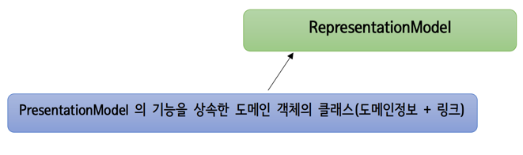

# Spring REST API

## Sprint HATEOAS 


- RepresentationModel
  - 응답하고자 하는 JSON내용을 도메인 객체에 링크를 포함시켜서


- 응답 되는 내용이 하나의 도메인 객체인 경우 엔티티 모델 사용
  - 배우 하나하나의 정보를 받아가야하는 경우 엔티티 모델 사용
  - 한 덩어리의 JSON객체 또는 도메인 객체를 응답하는 경우 엔티티 모델 사용
- 응답되는 내용이 여러개의 도메인 객체인 경우 컬렉션 모델 사용
  


### 응답할 도메인 객체가 1개인 경우

#### :one: EntityModel 객체 사용 


- 응답할 도메인 객체가 하나인 경우 (또치하나만 보내면 될 경우) 엔티티 모델 객체를 생성해서 보내면 됨
- 도메인 객체는 DAO 객체라고 보면 됨
- 링크는 필요에 따라서 하나가 들어갈수도 있고, 여러개가 들어갈 수도 있다
- 엔티티 모델 API를 사용 -> HATEOAS를 지원하겠다는 것
- 엔티티 모델은 RepresentationModel객체를 상속함
- 링크까지 응답할 내용이 없는 경우, Response 객체에 DTO 객체를 담아서 응답하면 됨

<br>

#### :two:  RepresentationModel 을 상속한 커스텀 모델 클래스 생성



-  RepresentationModel 을 상속해서 우리들만의 모델 클래스를 만들어서 return하는 방법
- 내부에 도메인 정보와 링크정보가 포함해야 함
- 커스텀 모델이 어떤 데이터를 응답하는 모델이냐에 따라 응답할 내용에 대해 저장하는 부분만 구현하면 됨
-  RepresentationModel 클래스는 링크를 추가하는 기능을 내부에 가지고 있음


<br>


### 응답할 도메인  객체가 여러개인 경우


- 상품 정보를 응답하는데, 여러개의 상품정보인 경우가 이에 해당되고 도메인 객체가 여러개인 것임
- 이러한 경우 CollectionModel을 사용
  - 여러 모델 객체를 저장하여
  - 컬렉션 모델 내에는 도메인 객체 여러개, 링크 객체 여러개를 저장해도 되고, 도메인과 링크를 포함하고 있는 모델 객체를 여러개 저장해서 처리할 수 있음

- 커스텀 모델 객체를 arraylist에 담아서 responseEntity로 응답해도 됨


<br>


### 링크 객체 생성

- 생성된 링크 객체를 모델 객체에 추가 시키는것은 RepresentationModel이 이미 가지고 있음
- 링크 객체를 생성해서 넣어줘야할 경우 다음 2가지를 이용하면 됨

#### :one: 컨트롤러 메서드의 호출 URL 정보를 추출하여 Link 객체 생성

- `WebMvcLinkBuilder의 static 메서드 linkTo( )`
    - 여기에 정적 URL 문자열을 작성하면 됨
    - 이에 맞춰 어떤 컨트롤러에 어떤 컨트롤 메서드에 대한 요청 path를 추출하여 지정
    - 컨트롤러 메서드가 가지고 있는 특정 컨트롤 메서드에 대한 링크를 설정하는 경우 static method인`linkTO()`를 사용

```java
linkTo(methodOn(getClass()).hateoasTest1()).withSelfRel();
// hateoasTest1()에 대한 요청 path 추출하는 것. withSelfRel()를 붙여줘야 링크객체 추출.  & 링크에 이름을 부여

        
linkTo(methodOn(UserController.class).retrieveUser(2)).withRel("test3")  
// withRel
// retrieveUser -> 유저 객체 응답. (2)는 2번째 데이터.
// 인자로 받아야되는 녀석은 인자로 받아야하는 애를 지정하면 얘를 포함한 URL문자열이 지정됨.


// getClass() -> 어떤 객체든 데리고오면 getClass().getName() -> 클래스에 대한 객체 추출
// 여기서는 컨트롤러 자기자신에 대한 클래스 객체를 추출하기 위해 getClass()를 붙임. this.getClass()로 쓰는게 가독성이 좋다. (이 클래스 객체의 클래스 객체)
```

- methodOn
  - 내부에서 proxy 객체를 만들어서 처리


- 예제

```java
EntityModel<Person> model = EntityModel.of(p)
 .add(linkTo(methodOn(getClass()).hateoasTest1()).withSelfRel())
 .add(linkTo(methodOn(UserController.class).retrieveAllUsers()).withRel("test1"))
 .add(Link.of("http://localhost:8088/ajaxHome", "test2"))
 .add(linkTo(methodOn(UserController.class).retrieveUser(2)).withRel("test3"));


//들어가는 도메인 객체가 `Person`
// 하나의 모데인 객체에 링크를 몇개 넣는지는 우리가 결정함 -> 여기서는 .add가 4번 나옴 -> link 4개 생성

/*  .add(Link.of("http://localhost:8088/ajaxHome", "test2")) */
// 정적으로 URL 문자열을 지정할 경우 Link.of 사용
```


#### :two:  URL 문자열을 직접 지정해서 Link 객체 생성


