# JavaScript

## CDN

- Content Delivery Network
- 데이터 사용량이 많은 애플리케이션의 웹 페이지 로드 속도를 높이는 상호 연결된 서버 네트워크
- 라이브러리를 적용하여 기존에 구현했던 것을 API를 이용하여 동적으로 구성할 수 있게 만들어줌

## 웹 렌더링 방식 (SSR, CSR, SSG)

### 초창기 웹 렌더링

- 초창기에는 모든 웹 페이지가 정적인 페이지였음
- 대부분의 로직은 서버에서 수행되었고, 브라우저는 서버로부터 전달받은 정적인 HTML과 CSS를 단순히 렌더링하는 방식으로 동작하였음
  <BR> (즉, 우리가 웹 사이트가 접속을 하면 브라우저가 서버에 HTTP 요청을 전송하고 서버로부터 전달받은 HTML을 렌더링하는 방식)

- `화면에 어떠한 변화를 주려고 화면을 전환하면 그떄마다 서버로부터 새로운 HTML을 전송받아서 다시 렌더링해야헀음`
  <br> => 매번 처음부터 새로 렌더링하므로 성능적인 문제가 많았고, 화면이 전환될때마다 화면이 깜빡이는 등의 문제가 존재하였음

<br>

### AJAX의 등장

- 자바스크립트를 통해서 `서버와 브라우저가 비동기로 데이터를 주고 받을 수 있는 Ajax`가 등장하게 되었음
  <br> => 매번 전체 페이지에 대한 데이터를 가져올 필요없이 `필요한 부분의 데이터만 불러와서 동적으로 웹 사이트 화면을 변경`할 수 있게 됨
  <br> => 항상 새롭게 렌더링하지 않아도 되므로 깜빡임 없이 자연스러운 화면 전환이 가능해졌고, 더 나은 UX를 제공할 수 있게 됨
  <br> (서버에서만 이루어지던 다양한 로직 처리나 HTML 생성 중 상당한 부분을 클라이언트에서 처리할 수 있게 됨)

- 이러한 과정에서 Client Side에서 쉽게 화면 처리를 할 수 있도록 여러 가지 라이브러리와 프레임워크가 만들어지기 시작하였음
  <br> => 오늘날에는 훨씬 복잡하고 거대해진 웹 애플리케이션을 보다 쉽게 구축할 수 있도록 도와주는 `Angular, React, Vue`등의 다양한 프레임워크가 활발하게 사용되고 있음

<br>

### Client Side Rendering (CSR)

- React와 같은 다양한 프론트엔드 프레임워크들이 유행하면서 클라이언트 사이드에서 전적으로 웹
  렌더링을 책임지는 방식이 보편화되었음

- 이제는 `서버에서 아무 내용이 없는 빈 HTML 껍데기를 보내면 클라이언트에서 동적으로 태그들과 스타일을 생성하여 페이지를 채움`
  - 이렇게 되면 최초에 HTML을 받는 것 외에는 페이지 렌더링을 위해서 별도의 HTTP 통신을 할 필요가 없어짐
  - 따라서 서버는 오직 AJAX를 통홰 필요한 데이터를 주고 받는 역할만 수행함
  - 이러한 방식을 `Single Page Applications(SPAs)`라 부름
    - 즉, `최초의 Single Page만 서버로부터 불어와서 렌더링하고 그 이후에는 모든 것을 클라이언트 사이드에서 렌더링하는 어플리케이션`임

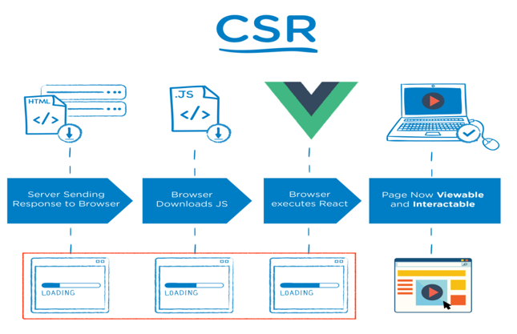

- 하지만 Client Side Rendering 방식은 여러가지 문제점을 야기할 수 있다

#### CSR 방식의 문제점

- 모든 소스가 다 내려온 다음 클라이언트에서 자바스크립트를 실행시켜서 그제서야 사용자에게 보여질 화면을 제공하므로 첫 화면 렌더링이 늦다
  <br> (하지만 첫 페이지가 보여지면 그 다음은 빠르다)

- 클라이언트에게 제공되는 첫 페이지는 빈껍데기만 오므로 검색에 있어 제한사항이 있을 수 있다

- `SEO(Search Engine Optimization)`문제

  - 구글 크롤러와 같은 여러 웹 크롤러들은 웹 사이트의 HTML을 읽어들이고 인덱싱하여 검색 엔진이 해당 페이지를 잘 찾아낼 수 있도록 함
  - 하지만 CSR방식으로 만들어진 웹 사이트는 최초의 빈 HTML만 렌더링하므로 크롤러들이 제대로 컨텐츠를 읽어들일 수 없다는 문제가 있음
    - 최근에 대부분의 웹 크롤러들이 클라이언트 사이드에서 필요로 하는 자바스크립트를 실행하고 있어 이러한 문제들이 어느정도 해소되었으나 여전히 완벽하지는 않음

<br>

- 페이지 렌더링을 위해 `많은 양의 자바스크립트 코드가 실행되다보니 성능적인 이슈`가 존재함

  - CSR 방식은 첫페이지 로딩이 느림 (최초로 서버에서
    받은 빈 HTML은 페이지 로드에 필요한 자바스크립트를 참조하고 있는데, 클라이언트에서 렌더링할
    때 페이지 로드에 필요한 자바스크립트 코드, 프레임워크나 라이브러리 소스 코드를 모두 불러오기
    때문임)
    - (물론 페이지를 한 번 렌더링하고 난 이후에는 필요한 부분만 렌더링하기 때문에 비교적
      효율적이다.)

<br>

- 이러한 CSR의 문제점이 대두되어 React, Vue와 같은 자바스크립트 라이브러리나 프레임워크를 사용하여 서버 사이드 렌더링을 할 수 있기 때문에 다시 서버 사이드 렌더링을 사용하자는 움직임이 일어남

<br>

- 서버 사이드 렌더링은 마크업 생성을 클라이언트 다비이스에서하는 것이 아니라 서버에서 한다는 점에서 차이점이 있다
  - 이 방식은 CSR보다 더 빠르고 SEO 문제를 해결해준다는 장점이 존재함

<br>

### modern Server Side Rendering (SSR)

- 브라우저가 서버에 페이지를 요청하면 서버가 필요한 데이터로 HTML을 구성하여 브라우저에 전송함
- 그러면 브라우저에서 응답으로 받은 HTML을 그대로 렌더링함


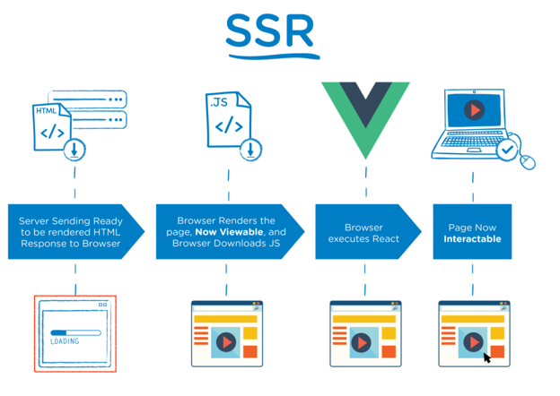

#### SSR의 장단점

- 서버에서 모든 컨텐츠를 로드하여 전달하므로 SEO점에서 이점이 있음
- 첫 페이지 로딩이 빨라짐
  <br> (이미 페이지 로드에서 필요한 데이터를 서버에서 미리 불러왔으므로 Client Side에서 별도의 자바스크립트 코드를 더 불러올 필요가 없기 때문)

- 서버에서 매번 동적으로 계산하여 페이지를 렌더링하므로 서버 부하가 생길 수 있음
- 서버 비용이 많이듬
- 서버로부터 매번 페이지를 새로 전달하므로 서버에서 페이지를 생성하는 시간이 소요됨

- 유저의 데이터에 따라 다르게 보여주는 페이지의 경우, 매번 서버에서 동적으로 생성해야하나 모든 유저에게 항상 같은 내용을 보여주는 페이지는
  매번 동적으로 생성할 필요가 없을 것이다. 이러한 의문점에서 `Static Site Generation`이 탄생하였다

### Static Site Generation (SSG)

- 예를 들어 회사 소개 페이지같은 경우 모든 유저에게 항상 동일한 화면이 보이기 때문에 매 번 동적
  으로 생성할 필요가 없다.
  - 즉, `한번만 생성한 이후에 CDN으로 어딘가에 저장해두고 필요할 때마다
로드하면 되는 것`이다 - 웹 개발에 React와 같은 프레임워크를 사용하고 있다면 Next.js나 Gatsby.js
    등의 도움을 빌려 아주 쉽게 정적 페이지를 생성할 수 있다.

#### SSG 생성과정

- 정적으로 웹 페이지를 빌드한 다음 산출물을 CDN으로 배포함

  - 이제 필요할 때마다 CDN으로부터 전달받은 정적 페이지를 유저에게 빠르게 제공함
  - CSR과 SSR의 단점을 보완하기 위해, 좀 더 매끄러운 서비스를 위해 `미리 서버에 화면을 저장해두었다가 꺼내쓰는 방식`이다

- 그렇다면 정적 페이지가 동적으로 매번 새롭게 추가되는 경우에는 어떻게 될까?
  <br> 예를 들어 Gatsby로 개발된 블로그에 새로운 포스트를 계속 업로드한다고 생각해보자.
  - 새로운 포스트가 업로드되면 그때마다 블로그는 다시 빌드되어야 한다.
  - 이러한 작업을 매번 수동으로 직접 처리할 필요는 없고, 현대 기술을 이용하여 정적 페이지에 무엇인가 변화가 생길 때마다 매우 쉽게 다시 빌드하여 배포할 수 있다

<br>

### Jamstack

- Javascrtip + Api + MarkUP + stack
- SSG와 함께 Jamstack이라는 새로운 웹 아키텍처가 생겨났다
- 서버를 전혀 사용하지 않고 정적인 페이지를 만들어서 저렴한 비용으로 호스팅하는 방식임
- 모든 웹 페이지는 빌드 타임에 정적 페이지로 최적화되며 CDN으로부터 서빙되어 적은 비용으로 쉽게 관리됨
  <br> (높은 비용이 필요한 서버를 사용하지 않아도 됨)

- 로드 타임 코드 실행을 웹 서버가 아닌 브라우저 내 자바스크립트나 API로 접근할 수 있는 외부 서비스에서 진행함

  - 궁극적으로 렌더링 속도를 높이고 여러 플랫폼에 맞춤화할 수 있는 정적 웹사이트를 구축할 때 사용됨

- Jamstack 개발을 쉽게 할 수 있도록 도와주는 여러 기술
  - Gatsby
  - Hugo
  - Jekyll
  - Next.js
  - Netlify
  - 이러한 기술을 사용하여 배포된 정적 블로그에 새로운 글이 업로드되면 자동으로 새로운 빌드와 배포가 진행되며, 그 과정이 모두 끝나면 유저에게 새로운 컨텐츠가 보여지게 됨

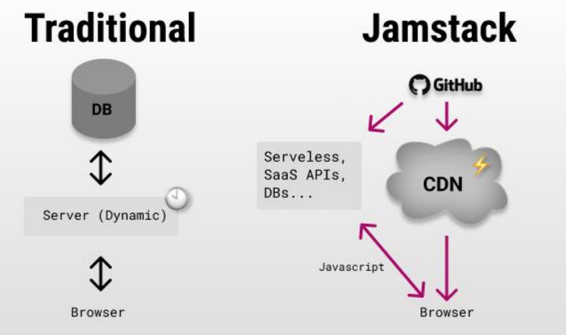

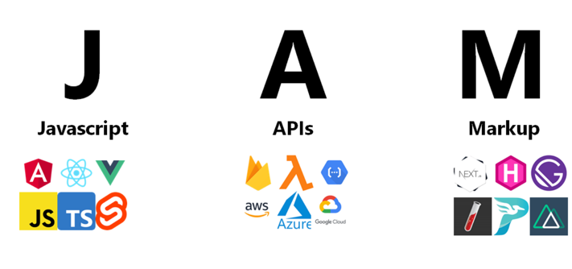

<br>

### SPA (Single Page Application)

- 현재 페이지를 동적으로 작성함으로써 사용자와 소통하는 웹 애플리케이션
- 연속되는 페이지간의 사용자 경험을 향상시키고, 웹 애플리케이션이 데스크톱 애플리케이션처럼 동작하도록 도와줌
- 이러한 구성을 위해서는 기본적으로 `프론트엔드와 백엔드 영역의 분리`가 선행되어야 함
  - 아래의 그림과 같이 기존의 페이지 덩어리 (JSP/Servlet)를 `CSR View 영역`과 `SSR View 영역`, `API`로 분리함으로써
    프론트엔드와 백엔드 영역에서 담당하는 페이지의 역할을 나눌 것

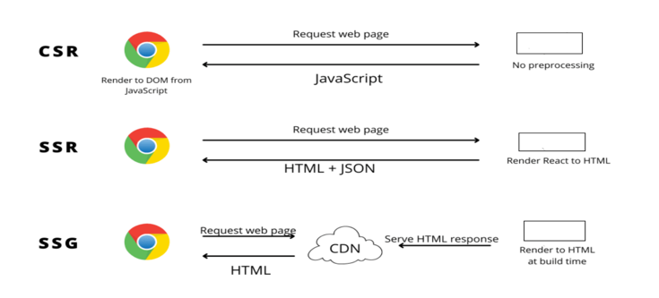

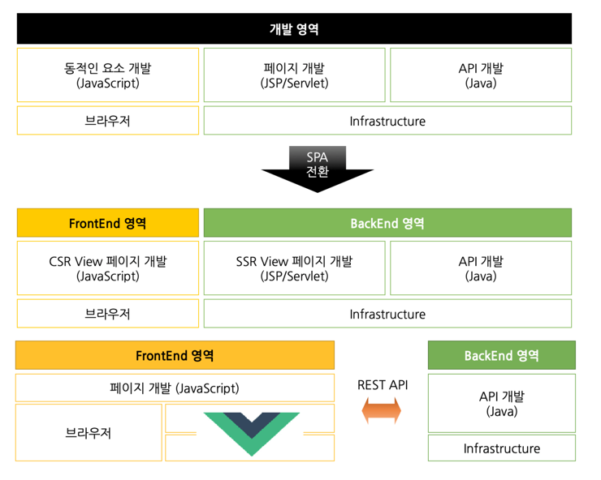

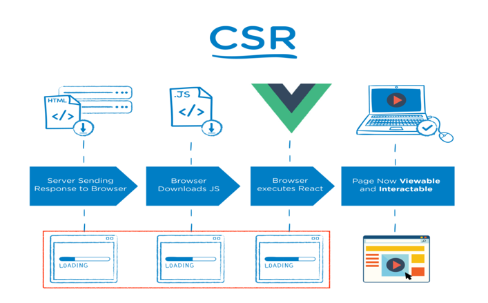


<br>

## Node.js


- Chrome V8 JavaScript 엔진으로 빌드된 JavaScript 실행환경임

## npm


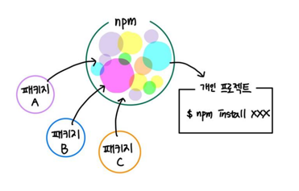

- npm(Node Package Manager)은 자바스크립트 프로그래밍 언어를
  위한 패키지 관리자

- NPM(Node Package Manager)은 전 세계의 개발자들이 만든 다양한 기능(패키지, 모듈)들을 관리
  하는 거대한 생태계

- 자바스크립트 런타임 환경인 Node.js의
  기본 패키지 관리자

- npm init

  - npm을 사용할 수 있는 초기 환경 설정

- npm install 패키지명
  - 지정된 패키지 설치

### 패키지 설치

```shell
npm install 패키지명
```

- 위 명령어를 통해 해당 패키지가 우리의 프로젝트에 설치됨
- 이때, `package-lock.json` 파일과 `node_modules` 폴더도 함께 생성됨

### package.json

- 프로젝트를 진행하다 보면 수많은 패키지들을 추가하게 된다. 이러한 패키지들은 저마다의 고유한
  버전이 있는데, 이것들을 기록하고 관리해주는 파일이 바로 package.json 임

- 때문에 기본적으로 프로젝트 내에서 npm을 사용하려면 프로젝트 내에 package.json 파일이 존재해야 함

- package.json 파일을 생성하기 위해선 `npm init`명령어를 터미널에 입력해야 함
  <br> (npm으로 패키지를 관리하곘다는 뜻)
- package.json 파일에는 devDependencies 또는 dependencies 옵션이 생기고, 그 안에는 현재 프로젝트에서 사용할 패키
  지의 이름과 그 버전이 명시되어 있음

- package-lock.json과 달리 package.json은 직접적으로 관리할 수 있음

### package-lock.json

- package-lock.json 파일에는 설치한 패키지 내부에서 사용되는 다른 패키지들의 정보가 들어있음
- package-lock.json은 자동으로 관리됨 (이와달리 package.json은 직접적으로 관리할 수 있음)

### node_modules

- node_modules 폴더 안에는 설치한 패키지 폴더 이외에도 해당 패키지가 만들어지고 활용될 때 필요한 다른 패키지들의 폴더가 함께 포함되어 있음

- node_modules 폴더가 삭제되더라도, package.json 파일에 devDependencies 또는
  dependencies 옵션에 명시되어 있는 패키지 정보를 보고 node_modules를 다시 설치할 수 있음
  <br> (node_modules 설치 명령어: `npm install` 또는 `npm i`)

### 개발용 의존성 패키지 설치

- npm install 명령을 실행할 때 -D 또는 --save-dev 플래그와 함께 패키지를 설치하게 되면, 개발용
  의존성 패키지가 설치됨

- 개발 과정에서만 필요하고 웹 브라우저에서 동작할 때에는 필요하지 않은 패키지를 설치할 때 이 옵션을 사용함

- 개발 의존성 패키지들은 package.json 파일을 devDependencies 옵션에 명시되어 있음
- 일반 의존성 패키지들은 package.json 파일을 dependencies 옵션에 명시되어 있음

<br>

### npx

- Package Runner (실행)
- 자바스크립트 패키지 관리 모듈인 npm(Ndoe Package Mdoule)의 5.2.0 버전부터 새로 추가된 도구

### npx serve

- 간단한 웹서버는 server라는 패키지로 실행시킬 수 있음

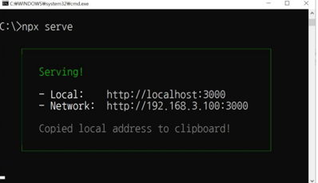

<br>

## 수업 환경설정

- 다음 명령어를 입력

```shell
npx serve
```

- 3000번으로 기동됨
- http://localhost:3000/exam1으로 요청할것 (.html 확장자를 줘도되고 안줘도 됨)

<br>

## CORS

### CORS란?

- Cross Origin Resources Sharing
- HTTP 헤더를 사용해서 서로 다른 출처에서 리소스를 공유하는 방식
- 서로 다른 출처(domain, scheme, port 포함)의 접근권한을 브라우저가 알 수 있도록 정리한 규칙
- 악의를 가진 모방 사이트를 제지하기 위해 필요한 제약사항

### CORS 동작방식

- 브라우저는 다른 출처로 판단한 리소스에 접근할 경우 HTTP Origin 헤더에 출처를 추가하여 요청함
- 요청을 받은 서버는 Origin 헤더를 기반으로 리소스 접근 허용 정책을 `Access-Control-Allow-Origin` 헤더에 추가하여 응답함
- 이후 브라우저는 `Access-Control-Allow-Origin` 헤더값을 확인하고 현재 출처와 비교하여 권한 유무를 결정함

### CORS 예시

- 같은 도메인이라도 scheme (웹 애플리케이션을 호스팅하는 서버의 프로토콜. `https://`, `http://`) 또는 port(HTTP 요청을 보낼 때 80번 포트, HTTPS 요청을 보낼 때 443번 포트를 사용함)가 다르다면 브라우저가 해당 요청을 다른 출처로 판단하고 CORS 정책을 기반으로 권한 여부를 확인함
- 만약 출처가 `https://daum.net`인 웹 애플리케이션에서 아래의 목록으로 리소스 요청을 한다면 모두 다른 출처로 판단함

```
http://daum.net
-> 서로 다른 scheme 사용
```

```
https://daum.net:8088
-> 서로 다른 Port 사용
```

### CORS 해결책

- [해결책 참고자료](https://www.zerocho.com/category/NodeJS/post/5a6c347382ee09001b91fb6a)

1. 스프링 또한 필터가 존재하므로 필터에 등록하는 방법

   - 전역적으로 처리하는것

2. 컨트롤러에 구현하는 방법

   - 이 컨트롤러에만 허용하겠다는 것

<br>

#### BoardController.java

- 이 방법은 컨트롤러에 구현하는 방법임

- 위 자바 파일에 아래의 코드를 추가

```java
@CrossOrigin(origins= "*", allowedHeaders ="*")
// 어떤 요청방식도 모두 허용하겠다는 것
// 가장 간단한 방식. 이를 통해 CORS 스펙을 만족하는 컨트롤러 프로그램이 됨
```

- 추가한 이후의 BoardController.java 전체 코드

```java
package springrest.exam.controller;

import java.time.LocalDateTime;
import java.util.ArrayList;
import java.util.List;

import org.springframework.http.HttpStatus;
import org.springframework.http.ResponseEntity;
import org.springframework.web.bind.annotation.*;

import lombok.extern.slf4j.Slf4j;
import springrest.exam.domain.Board;

// 기본적이 CRUD가 구현된 소스 -> 플젝시 참고

@Slf4j
@RestController
@RequestMapping("/boards")
@CrossOrigin(origins= "*", allowedHeaders ="*")  // 어떤 요청방식도 모두 허용하겠다는 것
public class BoardController {

	List<Board> boardList = new ArrayList<>();

	public BoardController() {
		Board board = new Board();
		board.setBoardNo(1);
		board.setTitle("아기공룡 둘리 한자대탐험");
		board.setContent("둘리 학습만화 시리즈");
		board.setWriter("김수정");
		board.setRegDate(LocalDateTime.now());

		boardList.add(board);

		board = new Board();

		board.setBoardNo(2);
		board.setTitle("고래 도서관");
		board.setContent("바다 도서관 이야기");
		board.setWriter("지드루");
		board.setRegDate(LocalDateTime.now());

		boardList.add(board);
	}

	@GetMapping
	public ResponseEntity<List<Board>> list() {
		log.info("list");

		ResponseEntity<List<Board>> entity = new ResponseEntity<>(boardList, HttpStatus.OK);

		return entity;
	}

	//http://localhost:8088/boards
	// body에 {"boardNo":3, "title":"자바의정석", "content": "자바의 구문 소개", "writer":"남궁성", "regDate":"2020-11-10T09:15"}를 넣고 post
	@PostMapping
	public ResponseEntity<String> register(@RequestBody Board board) {
		log.info("register");
		boardList.add(board);
		ResponseEntity<String> entity = new ResponseEntity<>("성공적으로 삽입했어용", HttpStatus.OK);

		return entity;
	}

	// http://localhost:8088/boards/1 등으로 확인
	@GetMapping("/{boardNo}")
	public ResponseEntity<Board> read(@PathVariable("boardNo") int boardNo) {
		log.info("read");

		Board board = new Board();
		board.setBoardNo(boardNo);
		int index = boardList.indexOf(board);
		if (index >= 0)
			board = boardList.get(index);

		ResponseEntity<Board> entity = new ResponseEntity<>(board, HttpStatus.OK);

		return entity;
	}

	@DeleteMapping("/{boardNo}")
	public ResponseEntity<String> remove(@PathVariable("boardNo") int boardNo) {
		log.info("remove");
		Board board = new Board();
		board.setBoardNo(boardNo);
		boardList.remove(board);

		ResponseEntity<String> entity = new ResponseEntity<>("성공적으로 삭제했어용", HttpStatus.OK);

		return entity;
	}


	// 어떤 글을 수정할 것인지 글 번호를 요청 path에 기입
	@PutMapping("/{boardNo}")
	public ResponseEntity<String> modify(@PathVariable("boardNo") int boardNo, @RequestBody Board board) {
		// 요청 파라미터를 전달

		log.info("modify");

		Board board1 = new Board();
		board1.setBoardNo(boardNo);
		int index = boardList.indexOf(board1);
		if (index >= 0)
			board1 = boardList.get(index);
		board1.setWriter(board.getWriter());
		board1.setContent(board.getContent());
		board1.setTitle(board.getTitle());
		board1.setRegDate(board.getRegDate());

		ResponseEntity<String> entity = new ResponseEntity<>("성공적으로 수정했어용", HttpStatus.OK);

		return entity;
	}
}
```

### exam21.html

- Same Origin Policy 제약 떄문에 에러가 발생함
  <br> (Same Origin Policy 제약조건은 content를 보호하기 위함임)

- 이러한 제약조건(서버가 보내온 내용을 처리할 권한을 가지고 있는지 유무를)은 브라우저가 판단함

  - 어떤 origin을 가지고 있는 content이든 이 응답을 받아가도 된다는 설정을해서 응답 header에 담아서 보내주면 반응을 함

- exam21.html의 origin은 localhost:3000 (`서버주소+port` 까지가 Origin. port가 다르면 다른 origin으로 판단.)

  - 다다음 페이지의 Origin은 `localhost:8088`이므로 다른 origin으로 판단하는 것

- 서버가 누구든지 가져가도 된다는 응답 header를 같이 클라이언트에 내려보내줘야 함

<br>

## 비동기 프로그래밍

### 비동기 처리

- 특정 코드의 연산이 끝날 때까지 (특정 로직의 실행이 끝날 떄까지) 코드의 실행을 멈추지 않고(기다려주지 않고) 다음 코드를 먼저 실행하는 자바스크립트의 특성

### 비동기 처리의 필요성

- 화면에서 서버로 데이터를 요청했을 때 서버가 언제 그 요청에 대한 응답을 줄지도 모르는 상황에서 다른 코드를 실행하지 않고 마냥 기다릴 수는 없기 때문에 비동기 처리가 필요하다

  - 동기적 처리를 하면 코드를 실행하고나서 기다려야하므로 웹 애플리케이션을 실행하는데 있어 시간이 길어질 것이다

- 웹에서 서버로 데이터를 요청했을 때 요청이 완료되기 전까지 아무것도 실행되지 않는다면 화면이 멈춘것처럼 보일 뿐만 아니라 하나의 프로그램을 실행하는데 많은 시간이 소요됨
  - 하지만 실행순서가 중요할 떄가 있다. 예컨대 코드가 서버에서 요청한 데이터값을 이용해야하는 경우 데이터를 받아온 다음에 코드가 실행되는것이 필요한데, 이러한 경우에 `비동기 처리`가 필요하다

### 콜백함수

- 다른 함수의 인자로 전달되는 함수 (매개변수로 넘겨진 함수)
- 함수 A의 호출에서 매개변수로 함수 B가 전달되어, 특정 이벤트가 발생했거나 특정 시점이 되면 다시 호출되는 함수B를 `콜백함수`라 함

```javascript
function dessert(count, eat, good) {
  count < 3 ? eatDessert() : goodDessert();
}

function eatDessert() {
  // 콜백함수
  console.log("오늘 먹어야 할 간식을 먹어주세요");
}

function goodDessert() {
  // 콜백함수
  console.log("오늘 먹어야할 간식을 모두 먹었습니다");
}

dessert(4, eatDessert, goodDessert);
```

### 비동기 처리의 종류

#### :one: Promise

- 자바스크립트 비동기 처리에 사용되는 갳체
- 주로 서버에서 받아온 데이터를 화면에 표시할 때 사용함
- 응답에 관한 정보를 가지고 있는 객체로 then, catch를 통해 결과값을 처리함

##### 프로미스의 3가지 상태 (처리과정)

- `new Promise()`로 프로미스를 생성하고 종료될 때까지 3가지 상태를 가짐

###### Pending(대기)

- 비동기 처리 로직이 아직 완료되지 않은 상태

```javascript
new Promise();
// new Promise() 메서드를 호출하면 대기(Pending)상태가 됨
```

```javascript
new Promise(function (resolve, reject) {
  // 로직
});
// new Promise()를 호출할 때 콜백함수를 선언할 수 있고, 콜백함수의 인자는 resolve, reject임
```

###### Fullfilled(이행)

- 비동기 처리가 완료되어 프로미스가 결과값을 반환해준 상태

- 콜백 함수의 인자 `resolve`를 아래와 같이 실행하면 이행(Fulfilled) 상태가 됨

```javascript
new Promise(function (resolve, reject) {
  resolve();
});
```

- 이행 상태가 되면 아래와 같이 `then()`을 이용하여 처리 결과값을 반환 받을 수 있음

```javascript
function getData() {
  // Promise 객체를 반환하는 비동기 함수
  return new Promise(function (resolve, reject) {
    // Promise 객체 생성 (Promise 객체는 콜백함수로 resolve, reject를 인자로 받음)
    var data = 100;
    resolve(data);
    // resolve 함수를 호출하여 Promise를 성공상태로 바꿈
    // Promise의 완료 결과로 data값을 갖게 됨
  });
}

/* resolve()의 결과값 data를 resolvedData로 받음*/
getData().then(
  // then 메서드를 사용하여 Promise 객체의 성공 콜백을 등록함
  // then 메서드는 Promise가 성공상태가 되었을 때 실행될 함수를 등록하능 역할을 함
  function (resolvedData) {
    console.log(resolvedData); // 100
  }
);
```

Promise의 fulfilled 상태는 `완료`라고 볼 수 있다

###### Rejected(실패)

- 비동기 처리가 실패하거나 오류가 발생한 상태

- `new Promise()`로 프로미스 객체를 생성하면 콜백 함수의 인자로 `resolve`, `reject`를 사용할 수 있음
- 이때 `reject`를 아래와 같이 호출하면 실패(Rejected)상태가 됨

```javascript
new Promise(function (resolve, reject) {
  reject();
});
```

- 그리고, 실패 상태가 되면 실패한 이유(실패 처리의 결과값)를 `catch()`로 받을 수 있음

```javascript
function getData() {
  return new Promise(function (resolve, reject) {
    reject(new Error("요청에 실패했습니다."));
  });
}

/* reject()의 결과 값 Error를 err에 받음*/
getData()
  .then()
  .catch(function (err) {
    console.log(err); // Error: 요청에 실패했습니다.
  });
```

#### :two: async/await

- Promise를 기반으로 하지만 then, catch를 사용하지 않고 try-catch를 사용함

#### :three: fetch

- 접근하고자하는 url과 매개변수로 네트워크 요청을 보낼 수 있음

<br>

## 모듈

- 자바스크립트의 코드 중 일부를 재사용할 때 모듈 개념을 사용함
- 모듈은 자바스크립트 소스 파일 하나에 불과함


- 모듈에 특수한 지시자 `export`, `import`를 적용하면 다른 모듈을 불러와서 불러온 모듈에 있는 함수를
  호출하는 것과 같은 기능 공유가 가능함

### 모듈 내보내기

- `export`지시자를 변수나 함수 앞에 붙이면 외부 모듈에서 해당 변수나 함수에 접근할 수 있음

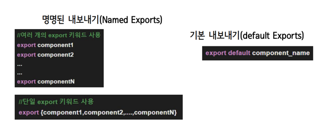

### 모듈 가져오기

- `import`지시자를 사용하면 외부 모듈의 기능을 현재 모듈로 가져올 수 있음

- 하나의 js파일에서 또 다른 js파일을 import 하는 것은 가능하다.

- 명명된 내보내기를 가져올 때

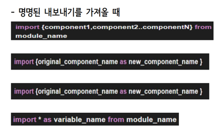

- 기본 내보내기를 가져올 떄

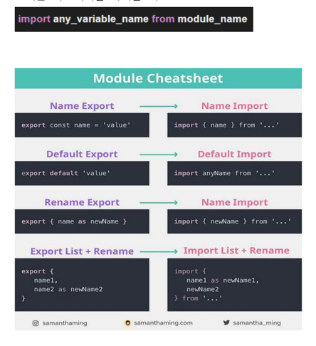
