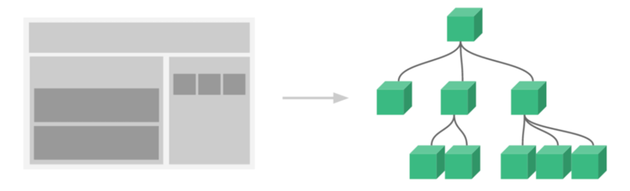
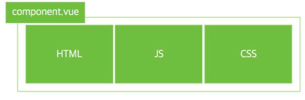
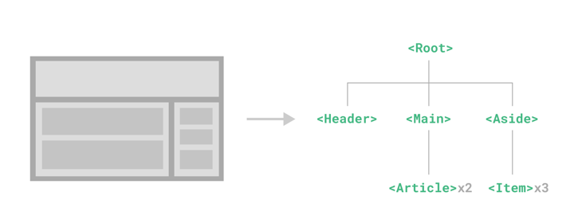
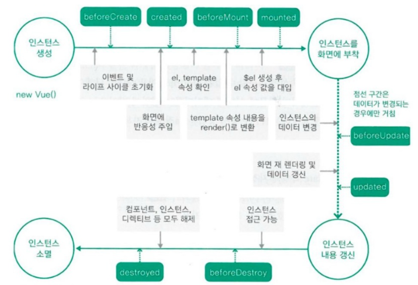
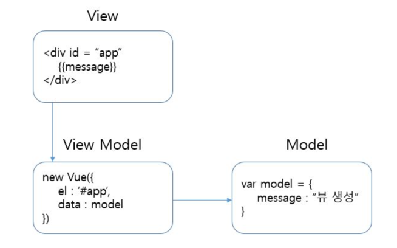

# Vue

## Vue method

- 특정 기능별로 묶을 수 있는 자바스크립트 함수

- 메서드는 Vue template의 버튼 이벤트 처리부터 HTTP 통신까지 다양한 성격의 코드로 구성됨

```vue
<button v-bind:click="clickBtn">클릭</button>
```

```javascript
new Vue({
    methods:{
        clickBtn(){
            alert("클릭!")
        }
    }
})
```


- 메서드는 단순 화면 조작 기능 외에도 특정 로직을 담아놓는 저장소로 활용할 수 있음

```vue
<button v-bind:click="displayProducts">Refresh</button>
```

```js
new Vue({
  data: {
    products: []
  },
  methods: {
    displayProducts() {
      this.fetchData();
      // ..
    },
    fetchData() {
      axios.get('/products').then(function(response) {
        this.products = response.data;
      }).catch(function(error) {
        alert(error);
      });
    }
  }
})

```


## Vue computed


## Vue watch

- `watch`와 `computed`는 하나의 데이터를 기반으로 다른 데이터를 변경할 필요가 있을 때 사용합니다.
  주로 긴 처리 시간이 필요한 비동기 처리에 적합하다는 특징을 가지고 있습니다.


## v-cloak

- 일시적으로 화면 초기에 컴파일되지 않은 템플릿이 나타날 수 있는데, 이런 경우에 사용하는 것이 `v-cloak`임


```vue
<style>
[v-cloak] {display : none;}
</style>

<div id="example" v-cloak>
...
</div>
```


<br>


## Vue Component


### 컴포넌트 정의



- 화면에 비춰지는 뷰의 단위를 쪼개어 재활용이 가능한 형태로 관리하는 것
- Vue에서 컴포넌트는 미리 정의된 옵션을 가진 Vue 인스턴스임
<br> (전역 등록과 지역 등록이 존재함)




- Vue에서 재사용이 가능한 컴포넌트로 웹 페이지를 구성할 수 있음
<br> (확장자가 `.vue`인 단일 파일에 HTML, CSS, JavaScript 코드로 구성하여 사용함)


- 빌드 방식을 사용할 때 일반적으로 `싱글 파일 컴포넌트(SFC)`라고 하는 `.vue`확장자를 사용하는
  전용 파일에 각 Vue 컴포넌트를 정의함


### 컴포넌트 특징




- 컴포넌트를 사용하면 UI를 독립적이고 재사용 가능한 일부분으로 분할하고 각 부분을
개별적으로 다룰 수 있음
  - 따라서 앱이 중첩된 컴포넌트의 트리로 구성되는 것은 일반적임


- Vue는 각 컴포넌트에 사용자 정의 컨텐츠와 논리를 캡슐화할 수 있는 자체 컴포넌트를 구현함


- Vue는 Template과 Component를 사용하여 재사용이 가능한 사용자 인터페이스를 묶고 View Layer를 정리하여 사용함


- 컴포넌트 사용시 케밥 표기법을 사용하기를 권장


<br>


## Vue 생명주기



- 생명주기는 크게 `Creation`, `Mounting`, `Updating`, `Destruction`으로 나눌 수 있음

### Creation

- 컴포넌트 초기화 단계

### Mounting

- DOM 작성 단계

### Updating


- 상태 변화로 인한 렌더링 단계

### Destruction

- 소멸 단계


<br>

## Vue 인스턴스 

- `new Vue` 로 선언하여 만든 객체를 Vue 인스턴스라 함

```vue
<div id = “app”
    {{message}}
</div>


<script>
var model = {
    message : “뷰 생성”
}

 new Vue({  
 //옵션
    el : ‘#app’,
    data : model
})

</script>
```

- `el`
  - 태그에 지정한 ID, 클래스명, 태그명으로 해당 태그와 vue 인스턴스를 연결하는 옵션


- `data`
  - key & value를 지정하는 json형식으로 데이터 입력 옵션임


- `computed`
  - getter/setter를 지정하는 옵션





<br>

## axios

- node.js와 브라우저를 위한 Promise 기반 HTTP 클라이언트
- 개발자가 조금 더 쉽게 ajax 프로그래밍을 할 수 있도록 도와줌

### axios의 특징

- 브라우저를 위해 XMLHttpRequests 요청 생성
- node.js 환경에서 http 요청 생성
- Promise API를 지원
- 요청 및 응답 차단(intercept)
- 요청 및 응답 데이터 변환
- 취소 요청

- fetch는 `json.parse`를 해주어야 하지만 axios는 JSON 데이터를 자동변환 해줌
- 사이트 간 요청 위조(XSRF) 보호를 위한 클라이언트 사이드 지원