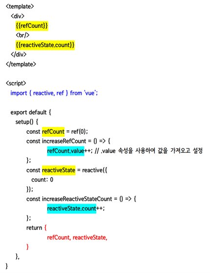

# CRS & SSR

| 특징\명칭 | CSR                                                                                                        | SSR                                                                    |
| :-------: | :--------------------------------------------------------------------------------------------------------- | :--------------------------------------------------------------------- |
|   장점    | 화면 깜빡임이 없음<br/>초기 로딩 이후 구동 속도가 빠름<br/>TTV와 TTI 사이의 간극이 없음<br/>서버 부하 분산 | 초기 구동 속도가 빠름<br/>SEO에 유리함<br/>                            |
|   단점    | 초기 로딩 속도가 느림<br/>SEO에 불리함<br/>                                                                | 화면 깜빡임이 있음<br/>TTV와 TTI 사이 간극이 있음<br/>서버 부하가 있음 |

- 서비스/프로젝트/컨텐츠의 성격에 따라 다른 전략을 사용하는것이 좋다

## CSR

- 서비스가 사용자와의 상호작용이 많은 경우에 적합
- 대부분의 페이지가 고객의 개인정보 기반이라면 SEO보다 데이터 보호가 더 중요하므로 SSR이 적합
  <br> (모든 서비스에 SEO가 필요한 것은 아니다!)

- 보다 나은 사용자 경험을 제공하고 싶은 경우에 사용

- CSR로만 사이트를 구성하면
  - 초기렌더링 속도가 느려작ㅎ
  - 서버에서 실시간 데이터를 자주 가져와야하는 경우 서버에게 ajax요청해서 데이터를 끌어와야하므로 SSR을 사용하는 것이 좋다

## SSR

- 검색의 상위 노출이 필요한 경우에 사용
- 페이지마다 데이터가 자주 바뀌는 경우에 사용

- 만약 회사 홈페이지와 같은 노출에 신경써야 하는 페이지나 누구에게나 같은 페이지를 공유해야하는 서비스라면 SSR이 적합
  <br>

# SPA vs MPA


## SPA

### 라우팅

- 출발지에서 목적지까지의 경로를 결정하는 기능

- `사용자가 테스크를 수행하기 위해 어떤 화면(view)에서 다른 화면으로 화면을 전환하는 네비게이션을 관리하기 위한 기능`

- 일반적으로 사용자가 요청한 URL 또는 이벤트를 해석하고 새로운 페이지로 전환하기 위한 데이터를 취득하기 위해
  필요한 데이터를 요청하고 화면 전환을 위한 일련의 행위

- 라우팅을 `서버가 아닌 브라우저 단에서 구현해야 하는것이 SPA의 핵심`
  <br> (`요청 URI에 따라 브라우저에서 DOM을 변경하는 방식`)

      - 요청 경로에 따라서 동적으로 렌더링 되도록 만들면 라우팅에 따라 다른 화면을 구현할 수 있음

### 컴포넌트

- 컴포넌트들이 모여서 한 페이지를 구성하고 특정 부분만 데이터를 바인딩 할 수 있음

- 쉽게 말해, index.html 파일 하나에서 js, css 등 리소스 파일과 모듈들을 로드해서
  페이지의 이동 없이 특정 영역들만 새로 모듈을 호출하고 데이터를 바인딩 할 수 있다는 것이다


위 그림에서 보이듯, 여러 컴포넌트들이 모여서 하나의 페이지를 구성하는 것임

#### 컴포넌트로 구현하는 웹 페이지의 구성과 계층구조


- 컴포넌트 간에도 부모-자식 관계가 적용이 됨
- 위 그림상 오른쪽을 보면 Root 컴포넌트에 배치되는 형태를 확인할 수 있다

#### 구현화면 관련 컴포넌트 구조 예시


<br>

# Vue

## 반응형 변수

- Vue3의 Composition API를 사용하여 뷰 컴포넌트를 개발할 떄 적용하게 되는 구현 기술


- Vue3의 setup()함수에서 만들어진 변수들은 값이 변경되었을 때 화면이 자동으로 갱신되지 않음
  - 따라서 데이터 변경이 발생하였을 때 반응형으로 자동 갱신하기 위해서는 `ref`, `reactive`를 사용해야 함





변수나 함수를 `<teamplate></template>`영역에서 사용하고 싶으면 `객체화`해서 리턴해주어야 함
<br> (위 예시에서 객체화해서 return 한것을 참고)


### ref

- 데이터 타입의 제한이 없음
<br> (`ref()`함수는 어떠한 유형의 데이터라도 반응형으로 재정의 할 수 있음 => `reactive()`의 제한 사항을 해결)


```vue
import { ref } from 'vue';
const count = ref(0)
```

<br>

- 내부의 데이터를 다룰 때, 코드영역에서 데이터 값을 변경시키는 경우 `변수명.value`값을 변경해야 함

`ref()`는 받은 인자를 `.value`속성을 포함하는 ref객체에 래핑하여 반환함

```javascript
const count = ref(0)
console.log(count) // { value: 0}
console.log(count.value) // 0

count.value++
console.log(count.value)  // 1
```

<br>

- 반응형 객체의 속성과 유사하게 ref의 `.value` 속성은 반응형임
<br> 또한 객체 유형을 가지고 있는 경우, ref는 자동으로 `.value`를 `reactive()`로 변환함

- ref가 값으로 객체를 갖는 경우, 객체 전체를 반응형으로 대체할 수 있음

```javascript
const objectRef = ref({ count: 0 })
objectRef.value = { count: 1 }  // 반응형으로 작동함
```

<br>

- 반응형 상태로 함수에 전달되거나 분해 할당될 수 있음

```javascript
const obj = {
  foo: ref(1),
  bar: ref(2)
}

callSomeFunction(obj.foo)
// 함수가 ref를 전달받음
// .value를 통해서 값에 접근해야하나 반응형 연결 상태가 유지됨

const { foo, bar } = obj;
```

- 결론
  - `ref()`를 사용하면 모든 값에 대한 "참조"를 만들어서 반응성을 잃지 않고 전달할 수 있음


#### 템플릿에서의 ref 언래핑

- 최상위 속성의 ref를 템플릿에서 접근하면 자동으로 "언래핑"되므로 `.value`를 사용할 필요가 없음

```vue
<script setup>
import { ref } from 'vue'
const count = ref(0)

function increment(){
  count.value++
}
</script>

<tempalte>
  <button @click="increment">
    {{ count }} 
<!--    value가 필요하지 않음-->
  </button>
</tempalte>
```

- 언래핑은 참조가 템플릿 렌더링 컨텍스트에서 최상위 프로퍼티인 경우에만 적용됨
<br>(`foo`는 최상위 프로퍼티이나, `object.foo`는 최상위 프로퍼티가 아님)

따라서 아래와 같은 객체가 주어졌을 경우

```js
const object = { foo: ref(1) }
```

아래 표현식은 예상대로 작동하지 않음
```javascript
{{ object.foo + 1 }}
```

`object.foo`는 ref객체이므로 렌더링된 결과는 `[Object Object]1`가 됨
<br>
이는 `foo`를 최상위 속성으로 만들어서 해결할 수 있음
```javascript
const { foo } = object
{{ foo + 1 }}  // 렌더링 결과가 2가 됨
```

- ref가 ```{{ }}``` 또는 `v-text = " "`와 같은 텍스트 보간의
최종 평가 값인 경우에도 언래핑되므로 다음은 1이 됨
<br> 이것은 텍스트 보간의 편의 기능일 뿐이며 `{{ object.foo.value }}`와 동일함
```js
{{ object.foo }}
```

<br>

#### 반응형 객체에서 ref 언래핑

- `ref`가 반응형 객체의 속성으로 접근하거나 변경되면 자동으로 언래핑되어 일반 속성처럼 작동함

```js
const count = ref(0)

/* ref가 반응형 객체의 속성으로 접근 */
const state = reactive({
  count
})
console.log(state.count) // 0

/* ref가 변경 */
state.count = 1
console.log(count.value) // 1
```

- ref가 할당된 기존 속성에 새 ref를 할당하면 이전 ref는 대체됨

```js
const count = ref(0)
/* ref가 반응형 객체의 속성으로 접근 */
const state = reactive({
  count
})


/* ref가 변경 */
state.count = 1

/* 기존 ref는 이제 state.count에서 참조가 끊어짐 */
const otherCount = ref(2)
state.count = otherCount

console.log(state.count) // 2
console.log(count.value)  // 1
```

<br>

##### 배열 및 컬렉션에서 ref 언래핑

- 반응형 객체와 달리 ref를 반응형 배열의 요소로 접근하거나 `Map`과 같은 기본 컬렉션 유형에서 접근할 때 언래핑이 실행되지 않음

```js
const books = reactive([ref('Vue 3 Guide')])
console.log(books[0].value) // .value가 필요함

const map = reactive(new Map([['count', ref(0)]]))
console.log(map.get('count').value) // .value가 필요함
```


<br>


### reactive

- `reactive()`함수를 사용하여 객체 또는 배열을 반응형으로 만들 수 있음

- 데이터 값을 변경하는 경우 `객체의 속성값`을 변경해야 함
  <br> (저장되어 있는 객체의 멤버에 접근해서 처리할 수 있음)


- 객체, 배열 그리고 Map이나 Set과 같은 컬렉션 유형에만 작동함
- string, number 또는 boolean과 같은 기본 유형(primitive 값)에 사용할 수 없음
<br> (구조체 형태로 선언하면 반응형으로 동작함)


```vue
import { reactive } from 'vue';
const state = reactive({ count : 0 })
```

<br>

- 컴포넌트의 템플릿에서 반응형 상태를 사용하려면, 컴포넌트의 `setup()`함수에서 반응형 상태를 선언하고 반환해야 함

```javascript
import { reactive } from 'vue';
export default{
  /* setup은 Composition API에서만 사용되는 특별한 훅 */
  setup(){
    const state = reactive({{ count : 0 })

    /* 상태를 템플릿에 노출 */
    return{
      state
    }
  }
}
```


<br>

- 반응형 상태를 변경하는 함수를 같은 범위에서 선언하고 상태와 함께 메서드로 노출할 수 있음

```javascript
import { reactive } from 'vue';
export default {
    setup(){
      const state = reactive({ count: 0 })
      
      function increment(){
        state.count++;
      }
      
      return{
          state, increment
      }
    }
}
```

노출된 메서드는 이벤트 리스너로 사용됨

```vue
<button @click="increment">
  {{ state.count }}
</button>
```


<br>


- 반응형 객체는 [JavaScript의 Proxy](https://developer.mozilla.org/ko/docs/Web/JavaScript/Reference/Global_Objects/Proxy)이며, 일반 객체처럼 동작함


#### reactive()의 제한 사항

- Vue의 반응형 변경 감지는 속성에 접근함으로써 작동하므로, 항상 반응형 객체에 대한 동일한 참조를 유지해야함
<br>(즉, 첫번째 참조에 대한 반응형 연결이 손실되므로 반응형 객체를 쉽게 "교체"할 수 없음)

```javascript
let state = reactive({ count: 0 })
// 얘는 반응형 연결이 끊어졌으므로 더이상 추적되지 않음

state = reactive({ count : 1 })
```

- 또한 반응형 객체의 속성을 로컬 변수에 할당하거나 분해 할당 또는
함수에 전달할 때 반응형 연결이 끊어짐을 뜻함

```javascript
const state = reactive({ count: 0 })

/* 반응형 객체의 속성을 로컬 변수에 할당  */
let n = state.count // n: state.count에서 연결이 끊긴 로컬 변수
n++ // 원본의 상태(state.count)에 영향을 미치지 않음

/* 반응형 객체의 속성을 분해 할당 */
let { count } = state // 로컬변수 count는 state.count로부터 연결이 끊김
count++ // 원본의 상태(state.count)에 영향을 미치지 않음

/* 반응형 객체의 속성을 함수에 전달 */
callSomeFunction(state.count)
// 함수는 일반적인 숫자를 수신하며, state.count의 변경사항을 감지할 수 없음
```


<br>


#### 반응형 객체와 일반 객체와의 차이점

- Vue가 속성에 접근할 수 있음
- Vue가 반응형 객체의 변경사항을 감지할 수 있음


#### Proxy

- 반응형 객체는 [JavaScript의 Proxy]()이며, 일반 객체처럼 동작함


<br>

## `<script setup>`

- SFC(Single File Components) 내에서 Composition API를 사용하기 위한 컴파일 타임 syntatic sugar

```vue
<script setup>
//   컴파일 될 때 setup() 함수에 들어가는 내용이 됨
</script>
```


### `<script setup>`의 특징

#### :one: 변수 선언 / 함수정의 / import 처리 등 모두 템플릿 영역에서 사용되도록 자동 바인딩됨

```vue
<script setup>
const msg = "Hello!";
function log() {
  console.log(msg);
}
</script>
<template>
  <button @click="log">{{ msg }}</button>
</template>
<script setup>
import { capitalize } from "./helpers";
</script>
<template>
  <div>{{ capitalize("hello") }}</div>
</template>
```

<br>

- `setup()`훅을 통해 상태와 메서드를 노출하는 것은 장황할 수 있음
  - 따라서 싱글 파일 컴포넌트(`*.vue`)를 사용할 경우, `<script setup>`과 같이 표기하기만 하면 되므로 복잡성을 크게 단순화할 수 있음


```vue
<script setup>
  import { reactive } from 'vue';
  const state = reactive({ count : 0 })
  function increment(){
    state.count++;
  }
</script>

<template>
  <button @click="increment">
    {{ state.count }}
  </button>
</template>
```


<br>

#### :two:  반응형 변수들을 사용해야 템플릿과 바인딩 됨

```vue
<!-- composition api 사용한 구현을 위해 script setup을 사용함 -->
<script setup>
import { ref } from "vue";
const count = ref(0);
</script>

<template>
  <button @click="count++">{{ count }}</button>
</template>
```


<br>


#### :three: import 된 컴포넌트도 컴포넌트 등록을 하지 않아도 템플릿에서 태그로 사용 가능함

- 컴포넌트의 `<script setup>`에서 import 또는 최상위 레벨로 선언된 변수나 함수는 해당 템플릿에서 바로 사용할 수 있음


```vue
<script setup>
import MyComponent from "./MyComponent.vue";
</script>

<template>
  <MyComponent />
</template>
```

#### :four: defineProps() & defineEmits()을 사용해서 부모 컴포넌트와 데이터를 송수신 할 수 있음

```vue
<script setup>
const props = defineProps({
  foo: String,
});

const emit = defineEmits(["change", "delete"]);
// setup code
</script>
```

- 태그를 가지고 사용할 때 태그의 속성을 통해 전달 (props를 통한 전달)
- 자식 => 부모로 데이터 전달시 emit 처리


<br>

## Vue3의 컴포넌트간 통신 방법


### :one: props

- 속성을 통한 전달
- 컴포넌트 객체를 만들어서 전달
<br> (중간 중간 전달하고 싶으면 ref객체 만들어서 전달해야 함)

- 만들어지고 나서 전달하고 싶은 경우, 대부분은 여러 컴포넌트에게 전역적으로 공유되도록 만드는 경우가 더 많다
<br> => 이때 vuex, pinia등을 사용함

- 부모가 자식을 포함할 떄에는 태그를 통해 포함하고, props를 통해서 데이터를 전달

### :two: emit

- 자손 => 부모로 데이터를 전달할 때 사용
- 자식 컴포넌트가 부모 컴포넌트에게 어떤 상태인지 알릴 때 사용
- option API 사용할 때와 Composition API를 사용하는 경우는 상이함
- emit API를 사용하여 event를 발생시켜 자식에서 부모로 데이터를 전달

- 자식이 부모 컴포넌트에게 데이터를 보내는 목적에 알맞게 커스텀 이벤트를 정의하여 사용할 것

### emit 예제1

```vue
<template>
  <h2>Child Component</h2>
  <button @click="onClicked">Emit from script</button>
  <button @click="$emit('event2',2)">Emit from template</button>
</template>
<script>
export default {
  emits: ["event1", "event2"], setup(props, context) {
    const { emit } = context;
    const onClicked = () => {
      emit("event1", 10);
    }; return {
      onClicked, };
  }, };
</script>
```
### emit 예제2 - getCurrentInstance 사용

- 자식이 부모 컴포넌트에게 데이터를 보내는 목적에 알맞게 커스텀 이벤트를 정의하여 사용할 것


###

- setup 속성을 정의하는 방법


### :three: v-model

- 양방향 데이터 처리가 가능하게끔 하는 지시자

### :four: refs

- ref 내장 객체를 사용하여 통신
- option API 범위 내에서 사용하는 것임


### :five: provide / inject

- 부모 레벨에서 모든 자손에게 내보내는 것은 provide / inject를 사용
  <br> (혹은 자손에게서 모든 부모레벨에게 보낼 때 사용)


### :six: eventBus

- vue3상 deprecated

### :seven: vuex / pinia

- 여러 컴포넌트들이 데이터를 공유하게 만드는 전문화된 뷰 에코 라이브러리
<br> (단순히 데이터를 주고 받는게 아님)

<br>

## 컴포넌트 인스턴스

### $refs

- 템플릿 참조를 통해 등록된 DOM element 및 컴포넌트 인스턴스 객체임
- 얘를 이용해서 DOM 객체에 접근할 수 있음

```vue
<template>
  <button @mouseover="sendMessage">부모버튼</button>
<!--  // 자식영역의 특정 컴포넌트에서 이벤트가 발생하게 만들거나, 자식 컴포넌트의 함수를 호출하거나, 자식 컴포넌트의 변수에 접근할 경우에는-->
<!--  자식 컴포넌트 영역에 접근하기 위해 ref를 이용하여 자식 컴포넌트에 고유한 이름을 부여해야함 -->
  <child-component ref="child1" />
</template>
<script>
import ChildComponent from './ChildComponent';
export default {
  components: { ChildComponent },
  methods: {
    sendMessage: function () {
      this.$refs.child1.$refs.btn.click();  // 자식 DOM 객체에 이벤트 발생
      // $refs => compositionAPI에서는 undefined. optionsAPI에서는 아님
    }
  }
};
</script>
```

<br>

## built in 특수 엘리먼트


### `<slot>`

- 템플릿의 슬롯 컨텐츠가 존재하는 경우 컨텐츠를 내보낼 지점을 나타냄

- `<slot>`엘리먼트는 `name` 속성을 사용하여 슬롯 이름을 지정할 수 있음
<br> (지정하지 않으면 기본 슬롯으로 렌더링됨)
<br> (슬롯 엘리먼트에 전달된 추가 속성은 부모 내부에서 범위가 정의된 슬롯에 슬롯 props로 전달됨)

- 엘리먼트는 일치하는 슬롯의 컨텐츠로 대체됨

- 컴포넌트와 유사한 기능을 가지며, 템플릿 문법의 일부임
<br> (진정한 컴포넌트가 아니며, 템플릿 컴파일 중에 편집됨)
<br> (따라서 템플릿에서 일반적으로 소문자로 작성됨)