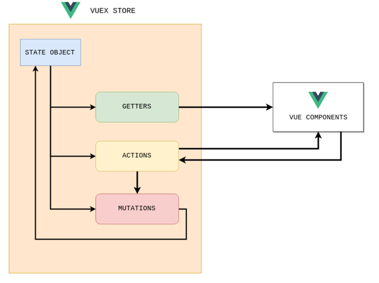

# provide & inject

- 컴포넌트간 통신 방법의 일종
- 부모 컴포넌트는 모든 자식 컴포넌트에 대한 의존성 제공자 역할을 할 수 있음
- 하위 트리의 모든 컴포넌트는 깊이에 관계없이 컴포넌트에서 `제공(provide)`하는 의존성을 `주입(inject)`할 수 있음

 

- 조상이 `provide`한것을 자손은 얼마든지 `inject`해서 받아갈 수 있음
  (다만 중간에서 조작이 가해지면 값이 달라질 수 있다)

# Vuex

- (provide와 달리 부모-자식 관계가 아니어도) 컴포넌트 간의 데이터 공유를 목적으로 하여 사용

- 웹 페이지를 뷰의 컴포넌트로 구성한다면 다음과 같이 여러개의 레이아웃으로 나누고, 나눠진 레이아웃에 뷰의 컴포넌트들이 자리잡게 만들 수 있음

 

- store 객체를 만들어서 공유하고자 하는 데이터를 보관하고 모든 컴포넌트가 이를 공유할 수 있게 만듦

- vuex에 의해 만들어진 store에 담긴 state 데이터에 대해 모든 컴포넌트들이 공유할 수 있게 됨

 

하나의 vuex에 의해 만들어지는 Store 객체 내에 공유하고자하는 state가 있고,

- state의 값을 읽어갈수 있게 해주는 getters
- mutations
  - 함수로 만들어지지만 (computed처럼)속성으로 쓰임
  - actions를 통해 mutations를 처리할 때 Actions는 비동기 호출이 가능하도록 해줌 (호출하고 기다리지않고 바로 return하게 해줌)

- getter나 setter 둘 중 최소 하나는 있어야 함

- Actions을 통해 접근하는 것을 권장

- 변화가 일어날 때마다 commit을 하기를 권장

- 단순히 state만으로는 데이터 공유 장소로 쓰일 수 없고 getter, mutations 등이 있어야 함

## Vuex 요소

### state

- 뷰 컴포넌트에서 사용되는 데이터

### getters

- 뷰 컴포넌트의 computed()와 동일한 기능을 작성하는 부분, state 데이터를 읽기만 가능

### mutations

- 뷰 컴포넌트의 methods()와 동일한 기능을 작성하는 부분
- state값 변경 가능

### actions

- 쌍방 통행 함수(methods) 이외의 함수를 작성하는 부분
- 비동기적 처리 가능
- state 데이터를 읽기만 가능
- mutations에 작성되는 로직 외 대부분의 로직을 actions에 작성하기를 권고

## Vuex store

- actions는 mutation을 통해서 바뀌도록 설계되어있음

 

# Pinia

- Vue.js용 스토어 라이브러리 및 상태 관리 프레임워크
- 프론트엔드 웹 애플리케이션 구축을 위해 설계되었으며 선언적 구문을 사용하고 자체 상태 관리 API를 제공함

## Pinia 용어

### :one: Store

- 전역 데이터가 저장되는 저장소

### :two: State

- 전역 데이터

### :three: Getters

- 데이터를 추출할 수 있는 기능
- 저장소에서 데이터를 검색하는 방법

### :four: Actions

- 데이터를 변경할 수 있는 기능
- 저장소에서 데이터를 수정하는 방법
- 기본적으로 비동기 호출 (async 호출)

 

getter나 action을 통해 store내의 데이터를 읽어가고 변경할 수 있음

