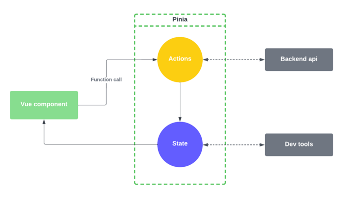

# provide & inject

- 컴포넌트간 통신 방법의 일종
- 부모 컴포넌트는 모든 자식 컴포넌트에 대한 의존성 제공자 역할을 할 수 있음
- 하위 트리의 모든 컴포넌트는 깊이에 관계없이 컴포넌트에서 `제공(provide)`하는 의존성을 `주입(inject)`할 수 있음


<br>


- 조상이 `provide`한것을 자손은 얼마든지 `inject`해서 받아갈 수 있음
<br> (다만 중간에서 조작이 가해지면 값이 달라질 수 있다)


# Vuex

- (provide와 달리 부모-자식 관계가 아니어도) 컴포넌트 간의 데이터 공유를 목적으로 하여 사용

- 웹 페이지를 뷰의 컴포넌트로 구성한다면 다음과 같이 여러개의 레이아웃으로 나누고, 나눠진 레이아웃에 뷰의 컴포넌트들이 자리잡게 만들 수 있음


<br>

- store 객체를 만들어서 공유하고자 하는 데이터를 보관하고 모든 컴포넌트가 이를 공유할 수 있게 만듦

- vuex에 의해 만들어진 store에 담긴 state 데이터에 대해 모든 컴포넌트들이 공유할 수 있게 됨


<br>


하나의 vuex에 의해 만들어지는 Store 객체 내에 공유하고자하는 state가 있고,

- state의 값을 읽어갈수 있게 해주는 getters
- mutations
  - 함수로 만들어지지만 (computed처럼)속성으로 쓰임
  - actions를 통해 mutations를 처리할 때 Actions는 비동기 호출이 가능하도록 해줌 (호출하고 기다리지않고 바로 return하게 해줌)


- getter나 setter 둘 중 최소 하나는 있어야 함

- Actions을 통해 접근하는 것을 권장

- 변화가 일어날 때마다 commit을 하기를 권장


- 단순히 state만으로는 데이터 공유 장소로 쓰일 수 없고 getter, mutations 등이 있어야 함


## Vuex 요소


### state

- 뷰 컴포넌트에서 사용되는 데이터

### getters

- 뷰 컴포넌트의 computed()와 동일한 기능을 작성하는 부분, state 데이터를 읽기만 가능


### mutations

- 뷰 컴포넌트의 methods()와 동일한 기능을 작성하는 부분
- state값 변경 가능


### actions

- 쌍방 통행 함수(methods) 이외의 함수를 작성하는 부분
- 비동기적 처리 가능
- state 데이터를 읽기만 가능
- mutations에 작성되는 로직 외 대부분의 로직을 actions에 작성하기를 권고


## Vuex store


- actions는 mutation을 통해서 바뀌도록 설계되어있음

<br>

# Pinia

- Vue.js용 스토어 라이브러리 및 상태 관리 프레임워크
- 프론트엔드 웹 애플리케이션 구축을 위해 설계되었으며 선언적 구문을 사용하고 자체 상태 관리 API를 제공함


## Pinia 용어


### :one: Store

- 전역 데이터가 저장되는 저장소


### :two: State

- 전역 데이터


### :three: Getters

- 데이터를 추출할 수 있는 기능
- 저장소에서 데이터를 검색하는 방법


### :four: Actions

- 데이터를 변경할 수 있는 기능
- 저장소에서 데이터를 수정하는 방법
- 기본적으로 비동기 호출 (async 호출)

<br>

## Pinia 흐름




getter나 action을 통해 store내의 데이터를 읽어가고 변경할 수 있음


<br>

## Pinia 메서드 - `$patch`


- Pinia의 store 상태를 업데이트할 때 사용됨
- `$patch` 메서드를 사용하면 일부 상태 속성만 업데이트 할 수 있으며, 나머지 속성은 변하지 않음 
<br> (주어진 상태 속성만 업데이트하고 나머지는 이전 상태를 유지함)


```js
import { defineStore } from 'pinia';

export const useMyStore = defineStore({
  id: 'myStore',
  state: () => ({
    count: 0,
    name: 'Danny',
    age: 25,
  }),
  actions: {
    increment() {
      this.count++;
    },
    patchNameAndAge(newName, newAge) {
      this.$patch({
        // $patch 메서드는 일부 상태만 업데이트할 때 유용
        name: newName,
        age: newAge,
      });
    },
  },
});

```


<br>


# watch

- 특정 데이터의 변화를 감지하여 자동으로 특정 로직을 수행해주는 속성

<BR>


# Spring security


- Spring Security는 Spring 기반의 어플리케이션 보안(인증과 권한, 인가 등)을 담당하는 스프링 하위 프레임워크임

- `Security는 인증과 권한에 대한 부분을 Filter의 흐름에 따라 처리`하고 있음


- IoC, AOP, JPA 등 스프링 프레임워크를 구성하는 모듈들처럼 개발자의 편의를 위해서 
원하는 목표를 어려움 없이 이룰 수 있도록 도와줌


1. Authentication (인증) <br>
특정 대상이 누구인지 확인하는 절차


2. Authorization (권한부여, 인가) <br>
인증된 주체가 특정한 곳에 접근 권한을 확인하고 허용하는 과정


필터를 거칠 때 회원여부 검증을 함


<br>

## Filter

- spring security의 핵심 기술
- Spring MVC에서의 filter는 서블릿 컨테이너가 실행시킴
  - 디스패처 서블릿이 수행되기 전에 수행됨 (디스패처 서블릿이 서블릿)
  - 인증해보니까 우리 회원인지 여부를 파악하는 것은 디스패처 서블릿이 수행되기 전에 모든 것이 다 끝남


<br>

- Spring security는 여러가지 필터로 이루어져 있고 필터들이 순서대로 동작하게되는데, 이러한 구조를 `Filter Chain`이라함
- 아래와 같이 필터의 종류는 정말로 다양함


<br>


## Spring Security의 securityConfig 작성

```java
authorizeRequest() (보안 절차를 거치고)  // 회원이어야만 볼 수 있는 페이지라는 뜻
anyRequest() (어떠한 request라도)  // 회원이 아니어도 누구든 볼 수 있는 페이지라는 것
authenticated() (인증을 받아야 함)   // 
formLogin() (그 방식은 폼 로그인)
```

형식으로 설정 클래스가 처리됨<br>


<br>

## 기본적인 formLogin 인증 API 구조

```java
http.formLogin()  // form 화면을 이용한 로그인을 할 것이고
.login("/login")    // 로그인시 `/login`을 로그인 화면으로 가질 거라는 뜻
 .defaultSuccessUrl("/home")
 .failureUrl("/login")
 .usernameParameter("username")   // 사용자로부터 받은 것 중 username을 꺼내서 쓰겠다는 것
 .passwordParameter("password")   // 사용자로부터 받은 것 중 password을 꺼내서 쓰겠다는 것
 .loginProcessingUrl("/login")
 .successHandler(loginSuccessHandler())  // loginSuccessHandler()) 핸들러 추가로 만들어서 등록
 .failereHandler(loginFailureHander())
```

<br>


## LoginForm 인증 절차


1. Http Request가 서버로 넘어온다.


2. `AuthenticationFilter`가 요청을 낚아챈다. <br>AuthenticationFilter에서 Request의 Username,
   password를 이용하여 `UsernamePasswordAuthenticationToken`을 생성한다.


3. 토큰을 `AuthenticationManager`가 받는다.


4. AuthenticationManager는 토큰을 `AuthenticationProvider`에게 토큰을 넘긴다.
   (토큰 내 계정과 패스워드를 사용자의 계정과 패스워드가 맞는지에 대한 서비스)


5. AuthenticationProvider는 `UserDetailsService`로 토큰의 사용자 아이디(username)을 전달하여
   DB에 존재하는지 확인한다.


6. UserDetailsService는 DB의 회원정보를 `UserDetails` 라는 객체로 반환한다.


7. `AuthenticationProvider`는 반환받은 UserDetails 객체와 실제 사용자의 입력정보를 비교한
   다. 비교가 완료되면 사용자 정보를 가진 `Authentication 객체를 SecurityContextHolder에
   담은 이후 AuthenticationSuccessHandle`를 실행한다.
   (실패시 AuthenticationFailureHandler를 실행한다.)


<br>


## Security Filter Chain

- DelegatingFilterProxy
  - 우리가 Configuration클래스를 따로 준비하지 않으면 얘를 건너뜀


## UserDetailService

```java
// UesrDetailService 구현 예
@Service
public class BoardUserDetailsService implements UserDetailsService {
  @Autowired
  private Member2Repository memberRepo;
  @Override
  public UserDetails loadUserByUsername(String username) throws UsernameNotFoundException {
    Optional<Member2> optional = memberRepo.findById(username);
    if (!optional.isPresent()) {
        throw new UsernameNotFoundException(username + " 사용자 없음..");
    } else {
      Member2 member = optional.get();
      return new SecurityUser(member);
    }
  }   
}
```


- 얘를 안만들면 사용자명이 `user`여야만 로그인을 할 수 있음
  - 얘를 꼭 오버라이딩해서 클라이언트가 보내온 계정을 어디에 있는 데이터와 비교해서 제공할 것인지에 따라서 직접 구현해주어야 함


<br>


## 테스트 클래스 사용자 정보(패스워드 암호화) DB 테이블에 저장하는 예


- 간단한 테스트시 활용할 것


```java
@AutoConfigureTestDatabase(replace = AutoConfigureTestDatabase.Replace.NONE)
@DataJpaTest
public class DataCreationTest {
 @Autowired
 private Member2Repository mr;
 @Autowired
 private PasswordEncoder encoder;  // 스프링이 제공하는 클래스 가져다가 쓰라는 것 
 @Test
 @Rollback(false) // rollback이 기본임. DML 문 수행한 후에 rollback 하고싶지 않다면
 @Transactional
 void test() {
 Member2 m = new Member2();
 m.setId("duke");
 m.setPassword(encoder.encode("d123"));
 m.setName("고객");
 m.setRole(Role.ROLE_MEMBER);
 m.setEnabled(true);
 mr.save(m);
 m.setId("manager");
 m.setPassword(encoder.encode("m123"));
 m.setName("매니저");
 m.setRole(Role.ROLE_MANAGER);
 m.setEnabled(true);
 mr.save(m);
 m.setId("admin");
 m.setPassword(encoder.encode("a123"));
 m.setName("관리자");
 m.setRole(Role.ROLE_ADMIN);
 m.setEnabled(true);
 mr.save(m);
 List<Member2> list = mr.findAll();
 list.stream().forEach(System.out::println);
 }
}
```


- 패스워드는 반드시 인코딩해서 넣어야 함

<br>


## 서버가 클라이언트를 확인하는 방식


### :one: 쿠키 인증

- `쿠키`
  - `Key-Value 형식의 문자열 덩어리`
  - 클라이언트가 어떤 웹사이트를 방문할 경우, 그 사이트가 사용하고 있는 서버를 통해 클라이언트의 브라우저에 설치되는 작은 기록 정보 파일
  - 각 사용자마다 브라우저에 정보를 저장하므로 고유 정보 식별이 가능함


#### 단점

- 보안에 취약함


### :two: 세션 인증


- 세션은 비밀번호 등 클라이언트의 민감한 인증 정보를 브라우저가 아닌 서버 측에 저장하고 관리함
<br> (서버의 메모리에 저장하기도 하고, 서버의 로컬 파일이나 데이터베이스에 저장하기도 함)


<br>


### :three: 토큰 인증

- 토큰 기반 인증 시스템은 클라이언트가 서버에 접속을 하면 서버에서 해당 클라이언트에게 인증되었다는 의미로 `토큰`을 부여함

<br>


<br>

## JWT (Json Web Token)


- 인증에 필요한 정보들을 암호화시킨 JSON 토큰

- JSON 데이터를 Base64 URL-safe Encode를 통해 인코딩하여 직려로하한 것
  <br> (토큰 내부에는 위변조 방지를 위해 개인키를 통한 전자서명도 들어있음. 따라서 사용자가 JWT를 서버로 전송하면 서버는 서명을 검증하는 과정을 거치게 되며 검증이 완료되면 요청한 응답을 돌려줌)

- JWT 기반 인증은 JWT 토큰 (Access Token)을 HTTP 헤더에 실어서 서버가 클라이언트를 식별하는 방식


- 클라이언트 수가 많다면 JWT를 사용할 경우, 서버의 오버헤드를 줄여듬


### JWT 구조


