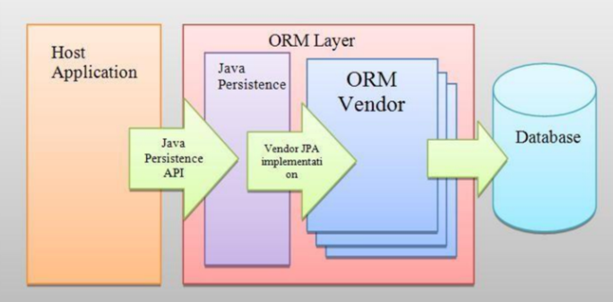
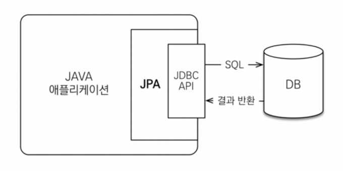

# 프로젝트 및 개인학습

## 인터페이스의 장점

- 인터페이스를 사용하면 다중 상속이 가능함
- 대규모 프로젝트 개발시 일관되고 정형화된 개발을 위한 표준화가 가능해짐
- 클래스의 작성과 인터페이스의 구현을 동시에 진행할 수 있으므로, 개발시간을 단축할 수 있음
- 클래스와 클래스간의 관계를 인터페이스로 연결하면, 클래스마다 독립적인 프로그래밍이 가능함

 

## JPA

- 동작 과정

 

- JPA는 애플리케이션과 JDBC 사이에서 동작함 JPA 내부에서 JDBC API를 사용하여 SQL을 호출하여 DB와 통신함
 개발자가 ORM 프레임워크에 저장하면 적절한 INSERT SQL을 생성해서 데이터베이스에 저장해주고, 검색을 하면 적절한 SELECT SQL을 생성해 결과를 객체에 매핑하고 전달함

### JPA 사용상 이점

1. 생산성
- 자바 컬렉션에 저장하듯 JPA에게 저장할 객체를 전달하면 됨
- 반복적인 코드를 직접 짜지 않아도 됨
- DDL문을 자동 생성해주므로 DB 설계 중심을 객체 설계 중심으로 변경할 수 있음

 

2. 유지보수
- 필드를 하나만 추가해도 관련된 SQL과 JDBC 코드 모두를 직접 수정할 필요가 없고 JPA가 이를 대신해줌

3. 패러다임의 불일치 해결
- JPA는 연관된 객체를 사용하는 시점에 SQL을 전달할 수 있음
- 같은 트랜잭션 내에서 조회할 때 동일성을 보장함
- 따라서 다양한 패러다임의 불일치를 해결함

4. 성능
- 애플리케이션과 데이터베이스 사이에서 성능 최적화 기회를 제공함
- 같은 트랜잭션 내에서는 동일한 엔티티를 반환하므로 데이터베이스와의 통신 횟수를 줄일 수 있음
- 또한 트랜잭션을 commit하기 전까지 메모리에 쌓고 한번에 SQL을 전송함

5. 데이터 접근 추상화와 벤더 독립성
- RDB는 같은 기능이라도 벤더마다 사용법이 다르므로 처음 선택한 데이터베이스에 종속되고 변경이 어려움
- 이와 달리 JPA는 `애플리케이션과 데이터베이스 사이에서 추상화된 데이터 접근을 제공`하므로 종속이 되지 않도록 함
- 만약 DB가 변경되더라도 JPA에게 알려주면 간단하게 변경이 가능함

 

## 트랜잭션

- SQL을 사용하여 INSERT나 UPDATE 명령을 사용할 때 COMMIT을 해주어야 실제 데이터베이스에 반영됨
  (커밋 하지 않아도 반영이 되었다는 생각이 든다면, 이는 `자동 커밋`기능이 동작했기 떄문임)

- `트랜잭션`은 데이터베이스 상태를 변환시키는 하나의 논리적 기능 수행 단위임
  (즉, 한 번에 수행되어야 할 일련의 연산을 뜻함)
  여기서 작업의 단위는 질의어 한 문장이 아닌, `질의어 명령문을 사람이 정하는 기준에 따라 정의하는 것`을 뜻함

### 트랜잭션은 왜 필요한가?

- 트랜잭션으로 원하는 작업의 단위를 정하게 되면 작업을 수행하는 도중 문제가 발생할 경우, 이전에 진행되었던 작업도 진행되지 않음
- 대신, 모든 작업을 안정적으로 끝마친 후에 실제 데이터베이스에 반영이 됨

### 트랜잭션의 성질

1. 원자성
- 트랜잭션과 관련된 작업들이 부분적으로 실행되다가 중단되지 않는 것을 보장
  (commit과 rollback 명령어에 의해 보장받음)

- 트랜잭션의 연산은 모두 실행되거나, 모두 실행되지 않아야 함

2. 일관성
- 트랜잭션이 실행을 성공적으로 완료하면 언제나 일관성 있는 데이터베이스 상태로 유지하는 것을 뜻함

3. 격리성
- 트랜잭션을 수행 시 다른 트랜잭션의 연산 작업이 끼어들지 못하도록 보장
- 트랜잭션 밖에 있는 어떤 연산도 중간 단계의 테이블을 볼 수 없음

4. 지속성
- 성공적으로 수행된 트랜잭션은 영원히 반영됨

 

## 엔티티

- 데이터베이스 테이블과 매핑되는 자바 클래스

