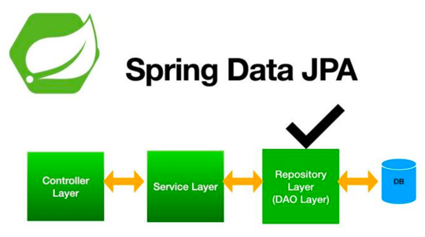
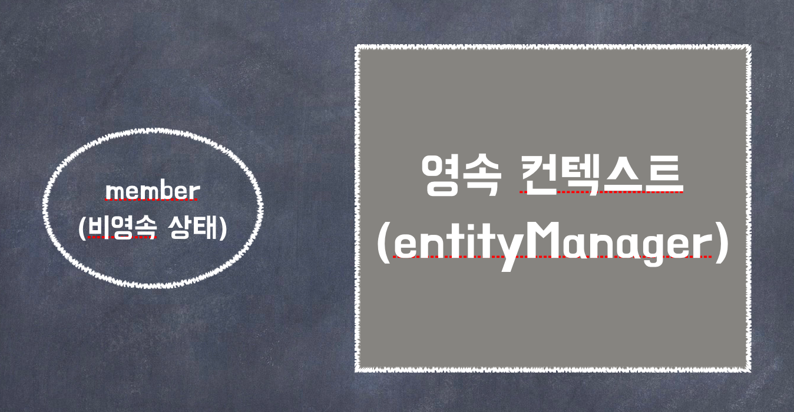

# Spring Boot와 JPA를 사용할 때 DTO가 필요한가?

- Spring Boot와 JPA를 사용할 때 DTO(Data Transfer Object)가 필요한 경우가 있습니다. DTO는 데이터를 전송하기 위한 객체로, 엔티티(Entity)와는 분리된 형태로 사용됩니다.


## :one: 뷰 또는 클라이언트에 필요한 데이터 제어

- 엔티티는 데이터베이스와 직접적으로 연결되어 있으며, 비즈니스 로직이나 데이터 처리를 위한 추가적인 필드 또는 메서드를 가질 수 있습니다. 하지만 클라이언트에게 전달되는 데이터는 해당 비즈니스 로직이나 처리와 무관할 수 있습니다. DTO를 사용하여 필요한 필드만 포함된 데이터를 전달함으로써, 뷰 또는 클라이언트에 필요한 데이터를 제어할 수 있습니다.

## :two: 성능 최적화

- 엔티티는 데이터베이스와 밀접하게 연결되어 있어서, 필요한 데이터를 로딩하는 과정에서 지연 로딩 등의 성능 이슈가 발생할 수 있습니다. DTO를 사용하여 필요한 데이터를 적절하게 로딩하고 반환함으로써 성능을 최적화할 수 있습니다.

## :three: 보안 및 무결성

- 엔티티는 데이터베이스와의 직접적인 연결을 가지고 있기 때문에, 엔티티의 모든 필드가 외부로 노출될 수 있습니다. DTO를 사용하여 클라이언트에게 전달되는 필드를 제어함으로써 보안 및 무결성을 유지할 수 있습니다.

## :four: 외부 API와의 호환성

- 외부 API와의 통신을 위해 데이터를 전송해야 할 경우, 엔티티는 해당 API와의 데이터 형식 및 구조와 일치하지 않을 수 있습니다. DTO를 사용하여 외부 API와 호환되는 데이터 형식으로 변환하여 통신할 수 있습니다.

## :five: 코드 유지 및 확장성

- 엔티티는 데이터베이스 스키마와 밀접하게 연결되어 있기 때문에, 데이터베이스의 변경이 엔티티 클래스에 영향을 미칠 수 있습니다. DTO를 사용하여 엔티티와 완전히 분리함으로써, 데이터베이스 스키마의 변경이 코드 전체에 영향을 주지 않도록 유지 및 관리할 수 있습니다.

위의 이유들로 인해 Spring Boot와 JPA를 사용할 때 DTO는 필요한 경우가 있으며, 엔티티와 DTO 간의 변환 작업을 통해 데이터 제어, 성능 최적화, 보안 및 무결성 유지, 외부 API와의 호환성, 코드 유지 및 확장성 등의 이점을 얻을 수 있습니다.


<br>

# Spring Data JPA



Entity만의 Repository인 인터페이스만 만들어주면 구현체는 알아서 넣어줌


<Br>

## Spring Data JPA의 Repository 커스터마이징을 위해 제공하는 쿼리 메서드 기능

1. 메서드명으로 쿼리 생성 (간단한 쿼리 처리시 권장)
2. @Query 안에 JPQL 정의 (복잡한 쿼리 처리시 권장)
3. 메서드명으로 JPA NamedQuery 호춣


<br>


# JPQL (Java Persistence Query Language)

- JPQL은 객체지향 쿼리 언어
- 테이블이 아닌 엔티티 객체를 대상으로 함
- SQL을 추상화해서 특정 데이터베이스 SQL에 의존하지 않음
- JPQL은 결국 SQL로 변환됨

## JPQL 문법

```jpaql
select 문 :: =
    select절
    from절
    [where절]
    [groupby절]
    [having절]
    [orderby절]
```


```jpaql
update문 :: = update절 [where절]
```


```jpaql
delete문 :: = delete절 [where절]
```


### SELECT문

```jpaql
SELECT m FROM Member AS m where m.username = "Gildong"
```


<br>

## JPQL 특징


### 대소문자 구분

- 엔티티와 속성은 대소문자를 구분함
- SELECT, FROM, AS와 같은 `JPQL 키워드는 대소문자를 구분하지 않음`


### 엔티티명

- JPQL에서 사용한 Member는 `클래스명이 아닌 엔티티명`
- 엔티티명은 @Entity(name = "xxx")로 지정할 수 있음
<br> (지정하지 않으면 클래스명이 기본값이 되어 엔티티명으로 사용됨)


### 별칭은 필수

- JPQL은 별칭을 필수로 사용해야 함
- `"AS"`는 생략가능


- 잘못된 문법 사용 예시
```jpaql
SELECT username FROM Member m
```
username -> m.username으로 고쳐야 함


<br>

# 영속성 컨텍스트 (persistence context)

- 엔티티를 영구 저장하는 환경
- 엔티티 매니저를 생성할 때 영속성 컨텍스트 하나가 만들어짐
- `엔티티 매니저`를 통해서 `영속성 컨텍스트에 접근하고 관리`할 수 있음


```jpaql
em.persist(member);
// 회원 엔티티 저장
```
엔티티 매니저를 사용해서 회원 엔티티를 `영속성 컨텍스트`에 저장함<br>





