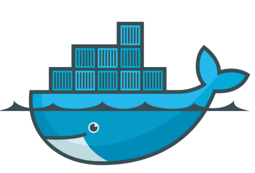
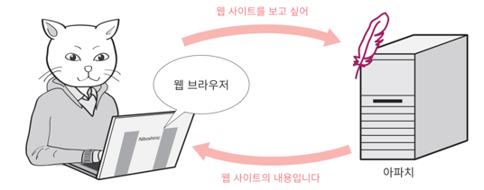
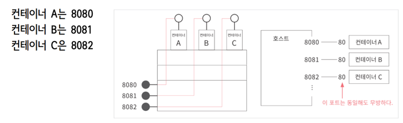
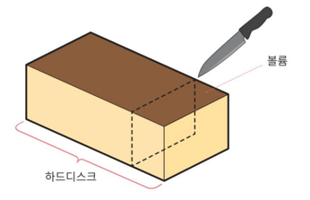
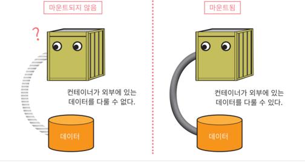

# 도커




- `데이터 또는 프로그램을 각각 독립된 환경에 격리시키는 기능`을 제공하는 S/W
- 하나의 컴퓨터에서 여러개의 운영체제를 사용할 수 있도록 도와줌
- 주로 서버에서 사용


## 도커 기술

- Linux 커널과 Cgroups 및 네임스페이스 등 커널의 기능을 사용해서 프로세스를 분리함으로써 독립적으로 실행할 수 있도록 함

- 여러 프로세스와 애플리케이션을 서로 개별적으로 실행하여 인프라를 더 효과적으로 활용하고 개별 시스템을 사용할 때와 동일한 보안을 유지할 수 있음


### 도커로 mysql 실행하는 명령어

```
docker exec -it mysql-container bash
```

<br>

## 컨테이너 통신

1. 아파치 웹 서버

- 아파치
  - 웹 서버를 제공하는 소프트웨어
  - 컨테이너는 기본적으로 외부에서 접근 불가능한 상태로 실행하므로 컨테이너 실행시 설정이 필요함
  - `docker run`명령의 옵션을 이용하자 (실행 후 변경은 불가능함)


2. 컨테이너와의 통신




- 외부와의 접속을 위해 통신포트 설정


- 컨테이너를 실행 중인 물리적 컴퓨터의 포트를 통해 컨테이너와 통신해야함


- 포트 설정
```shell
-p 호스트포트번호:컨테이너_포트번호
```

컨테이너 내부의 아파치 웹 서버에 접근할 떄만 이 포트번호를 사용할 수 있음


<br>

따라서 똑같은 아파치 웹 서버를 세개의 컨테이너로 기동한다면 아래와 같이 포트번호를 각각 다르게 줘서 mapping할 수 있음



8080을 지정하면 컨테이너A가 사용되고, 8081을 지정하면 컨테이너B가 사용되고, 8082로 지정하면 컨테이너C가 사용되는 것임


<br>

- 실습 명령어
```shell
docker run --name wserver2 -d -p 7070:80 httpd
```
80번 포트번호는 외부에서 접근시 7070번호로 접근하도록 호스트 ~를 묶어주겠다는 것


<br>

## 볼륨

- 스토리지의 한 영역을 분할한 것 



<br>

## 마운트

- 연결하는 것




<br>


## 컨테이너로 이미지 만드는 방법

### :one: commit 명령으로 컨테이너를 이미지로 변환하기

```shell
docker commit 컨테이너명 새로운이미지명
```


### :two: dockerfile이라는 스크립트로 이미지 생성하기

- dockerfile에 컨테이너에 넣을 이미지나 실행할 명령등을 기술

- Dockerfile 스크립트 예시
```shell
FROM openjdk:11-jdk
ARG JAR_FILE=build/libs/springedu3.jar    # JAR_FILE 변수 생성. 빌드 후 '='오른편이 있는것이 생성
COPY ${JAR_FILE} app.jar
ENTRYPOINT ["java","-jar","/app.jar"]
```

<br>

## 도커 컴포즈

- 시스템 관련 명령들을 하나의 파일에 작성하여 한 번에 시스템 전체를 실행하고 종료 및 폐기까지 실행하도록 도와주는 도구

- 스크립트 파일을 통해 컨테이너를 기동시키는 기능

- 컨테이너가 사용하게될 볼륨, 네트워크, 존재해야하는 다른 컨테이너에 의한 의존성 정보등을 작성

