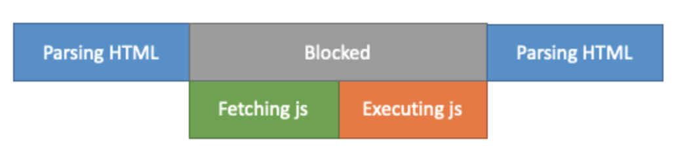
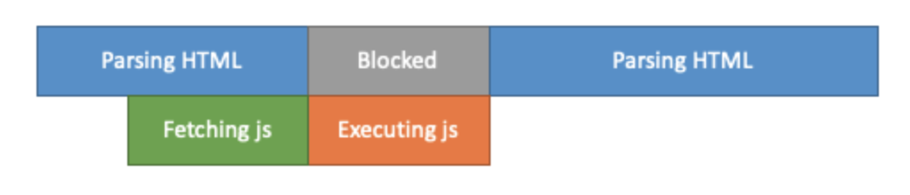
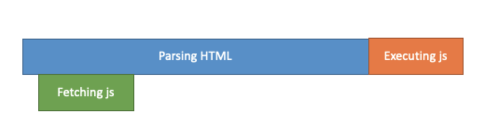

# Element.closet()

- [참고자료](https://developer.mozilla.org/ko/docs/Web/API/Element/closest)

- Element의 `closest()`메서드는 주어진 CSS 선택자와 일치하는 요소를 찾을 때까지, 자기 자신을 포함해 위쪽(부모 방향, 문서 루트까지)으로 문서 트리를 순회함

```js
closest(selectors);

// selectors
```

## 예제

- 유의사항

```
IDE에서 document.getElementById로 id값에 해당하는 태그를 불려오려고 할 때 null값이 찍힘
```

`<script></script>`를 `<body></body>` 요소의 끝에 위치시키지 않고 head 요소 내에 위치시켰다면 스크립트가 실행되는 시점에 아직 요소가 파싱되지 않아 null값을 반환할 수 있음.<br>
이 경우에는 `DOMContentLoaded`이벤트를 사용하여 요소가 준비되었을 때 스크립트를 실행하도록 할 수 있음

### 예제 관련 개념 - defer, async 스크립트 (문서와 리소스 로딩)

- 브라우저는 HTML을 읽다가 `<script></script>`를 만나면 스크립트를 먼저 실행해야 하므로 DOM 생성을 멈춘다.
- 이는 `src`속성이 있는 외부 스크립트 `<script src=""></script>`를 만났을 때에도 마찬가지이다.
  <br>(외부에서 스크립트를 다운받고 실행한 후에야 남은 페이지를 처리할 수 있다)

- 이러한 브라우저의 동작 방식은 두 가지 중요한 이슈를 만든다

  1. 스크립트에서는 스크립트 아래에 있는 DOM 요소에 접근할 수 없음<br> 따라서 DOM 요소에 핸들러를 추가하는 것과 같은 여러 행위가 불가능해짐
  2. 페이지 위쪽에 용량이 큰 스크립트가 있는 경우 스크립트가 페이지를 '막아버림' <br> 페이지에 접속하는 사용자들은 스크립트를 다운받고 실행할 때까지 스크립트 아래쪽 페이지를 볼 수 없게됨

  ```html
  <p>...스크립트 앞 콘텐츠...</p>

  <script src="https://javascript.info/article/script-async-defer/long.js?speed=1"></script>

  <!-- 스크립트 다운로드 및 실행이 끝나기 전까지 아래 내용이 보이지 않습니다. -->
  <p>...스크립트 뒤 콘텐츠...</p>
  ```

- 이러한 부작용을 피하는 방법에는 여러가지 해결책이 있음

#### :one: 스크립트를 페이지 맨 아래에 놓는 것

```html
<body>
  ... 스크립트 위 콘텐츠들 ...

  <script src="https://javascript.info/article/script-async-defer/long.js?speed=1"></script>
</body>
```

이렇게 하면 스크립트 위에 있는 요소에 접근할 수 있음<br>
또한 페이지 컨텐츠 출력을 막지 않게 됨<br>

- 하지만 이는 불완전하다
- HTML 문서가 아주 큰 경우, 브라우저가 HTML 문서 전체를 다운로드 한 다음에 스크립트를 다운받게 하면 페이지가 정말 느려질 것이다
  <br>네트워크 속도가 빠른 곳에서 페이지에 접속하고 있다면 이러한 지연은 크게 눈에 띄지 않을것이지만, 네트워크 접속이 느린곳에서는 이러한 지연이 두드러질 것이다

- 이러한 문제를 해결하기 위해 `<script></script>`의 속성인 `defer`과 `async`를 사용한다

#### :two: defer

- 브라우저는 `defer`속성이 있는 스크립트(defer 스크립트 또는 지연 스크립트)를 '백그라운드'에서 다운로드 함<br> 따라서 지연 스크립트를 다운로드 하는 도중에도 HTML 파싱이 멈추지 않음<br> 그리고 `defer`스크립트 실행은 페이지 구성이 끝날때까지 지연됨

```html
<p>...스크립트 앞 콘텐츠...</p>

<script
  defer
  src="https://javascript.info/article/script-async-defer/long.js?speed=1"
></script>

<!-- 바로 볼 수 있네요! -->
<p>...스크립트 뒤 콘텐츠...</p>
```

- 지연 스크립트(defer script)는 페이지 생성을 절대 막지 않음
- 지연 스크립트(defer script)는 DOM이 준비된 후에 실행되긴 하지만 `DOMContentLoaded` 이벤트 발생 전에 실행됨

```html
<p>...스크립트 앞 콘텐츠...</p>

<script>
  document.addEventListener("DOMContentLoaded", () =>
    alert("`defer` 스크립트가 실행된 후, DOM이 준비되었습니다!")
  ); // (2)
</script>

<script
  defer
  src="https://javascript.info/article/script-async-defer/long.js?speed=1"
></script>

<p>...스크립트 뒤 콘텐츠...</p>
```

1. 페이지의 컨텐츠는 바로 출력됨
2. `DOMContentLoaded`이벤트는 지연 스크립트 실행을 기다림. 따라서 alert창은 DOM트리가 완성되고 지연 스크립트(defer script)가 실행된 후에 뜸

<br>

- 지연 스크립트(defer script)는 일반 스크립트와 마찬가지로 HTML에 추가된 순(상대순, 요소순)으로 실행됨<br>
  <br>따라서 길이가 긴 스크립트가 앞에, 길이가 짧은 스크립트가 뒤에 있어도 짧은 스크립트는 긴 스크립트가 실행될 때까지 기다림

### 3️⃣ async

- `async`속성이 붙은 스크립트(비동기 스크립트)는 페이지와 완전히 독립적으로 동작함

### 요약

- `async`와 `defer`스크립트는 다운로드시 페이지 렌더링을 막지 않는다는 공통점이 존재함
- 따라서 async와 defer를 적절히 사용하면 사용자가 오래 기다리지 않고 페이지 컨텐츠를 볼 수 있게 할 수 있음

<br>

### script 태그 삽입 위치

```html
<script src="script.js"></script>
```

HTML 페이지를 파싱(Parsing) 하는 도중에 위와 같은 코드를 만나게 되면 DOM 생성을 멈추고 스크립트 파일 다운로드를 진행하게 된다.<br>
그리고 스크립트 파일 다운로드가 완료되고 나서야 다시 파싱을 재개하게 되는데, `<script></script>`삽입 위치에 따라서 렌더링 시간이 달라진다.<br>
따라서 `<script></script>`를 어느곳에 따라 효율성이 달라지는 것이다.

#### `<head>`에 `<script>` 포함시키기

```html
<!DOCTYPE html>
<html lang="ko">
  <head>
    <title>제목</title>
    <script src="./script.js"></script>
  </head>
</html>
```


위와 같이 `<head>`에 script 태그를 삽입할 경우, HTML 페이지를 파싱하던 도중에 js 파일을 받아오고(`fetch`) 실행(`execute`)한 다음 다시 페이지를 파싱하게 됨<br>

이 경우, JavaScript 파일 크기가 클수록 렌더링 시간이 오래걸리게 되므로 사용자가 페이지를 보기까지 오랜시간이 걸린다.<br>

<br>

#### `<body>`에 `<script>` 포함시키기

```html
<!DOCTYPE html>
<html lang="ko">
  <head>
    <title>제목</title>
  </head>
  <body>
    <div>본문</div>
    <script src="./script.js"></script>
  </body>
</html>
```

body태그의 영역에 script 태그를 삽입하게 되면 `DOM을 먼저 생성`하게 된다<br>


따라서 HTML 페이지를 먼저 파싱하고나서 JavaScript 파일을 받아온다.

- body태그영역에 script 태그를 삽입하게 된 경우, 렌더링적인 측면에서는 head태그에 삽입하는 것보다 나을 수 있으나 HTML 파일의 용량이 크다면 이 역시 JavaScript가 포함된 의미있는 컨텐츠를 보는데에 있어 시간이 오래걸린다.
- 따라서 병렬적으로 파싱을 하고 JavaScript파일을 불러오는 역할을 수행하는 `async`와 `defer`를 사용하는 것을 검토하는것이 좋다

<br>

#### async 이용하기

```html
<!DOCTYPE html>
<html lang="ko">
  <head>
    <title>제목</title>
    <script async src="./script.js"></script>
  </head>
  <body>
    <div>본문</div>
  </body>
</html>
```

`async`는 파싱과 JavaScript 파일을 불러오는 작업을 병렬적으로 수행한다.<br>


병렬적으로 진행하므로 기존 방법들보다는 다운로드를 받는 시간이 절약되므로 효율적이다<br>
하지만 JavaScript를 실행하는 단계에서는 파싱을 중지하고, JavaScript의 실행이 끝나면 파싱을 재개한다.<br> (따라서 HTML이 모두 실행되기 전에 JavaScript가 실행됨)<br>
다수의 JavaScript 파일을 다운로드 받는 경우에는 `다운로드가 완료되는 순서대로 JavaScript 파일을 실행`하므로 순서에 상관없이 이를 실행하게 된다<br>
만에하나 순서에 의존적인 페이지라면 이러한 점에 유의해서 사용하는것이 좋다<br>

#### defer 이용하기

```html
<!DOCTYPE html>
<html lang="ko">
  <head>
    <title>제목</title>
    <script defer src="./script.js"></script>
  </head>
  <body>
    <div>본문</div>
  </body>
</html>
```

defer는 병렬적으로 파싱과 JavaScript 파일 불러오기를 수행하며 파싱이 모두 끝난 경우 JavaScript 파일을 실행한다<br>



병렬적으로 진행이 되므로 다운로드 시간이 절약되며, async와 달리 파싱하는 도중에 JavaScript 파일을 다운로드 받아놓고나서 파싱이 끝난 순서대로
JS파일을 실행한다<br>
(따라서 원하는 방향대로 JavaScript 파일을 실행할 수 있다)

<br>

# DOMContentLoaded

<br>

### 추가 개념 - window.onload ()

- BOM (Browser Object Model)
  - JS를 이용하면 브라우저의 정보에 접근하거나 브라우저의 여러 기능을 제어할 수 있는데, 이때 사용할 수 있는 객체 모델이 `BOM`임
  - 문서 객체 모델(DOM)과 달리 W3C의 표준 객체 모델은 아니지만 JS가 브라우저의 기능적인 요소들을 직접 제어하고 관리하는 방법을 제공함
  - JS는 BOM 모델의 객체들을 전역 객체(global object)로 사용함

<br>

- Window 객체
  - 웹 브라우저의 창(window)을 나타내는 객체로, 대부분의 웹 브라우저에서 지원하고 있음
  - JS의 모든 객체, 전역 함수, 전역 변수들은 자동으로 window 객체의 프로퍼티가 됨
  - 문서 객체 모델(DOM)의 요소들도 모두 window 객체의 프로퍼티가 됨

<br>

# DOM(Document Object Model)

- 모든 요소와 요소의 attribute, 텍스트를 각각의 객체로 만들고 이들 객체를 부자 관계로 표현할 수 있는 트리 구조로 구성한 것
  <br> (텍스트 파일로 만들어져 있는 웹 문서를 브라우저에 렌더링하려면 웹 문서를 브라우저가 이해할 수 있는 구조로 올려함)

- DO은 자바스크립트를 통해 동적으로 변경될 수 있으며 변경된 DOM은 렌더링에 반영됨
  <br>(브라우저는 웹 문서(HTML, XML, SVG)를 로드한 후, 파싱하여 DOM을 생성함)

<br><br>

# EventTarget.addEventListener()

- [참고자료](https://developer.mozilla.org/ko/docs/Web/API/EventTarget/addEventListener)

# Element.getElementsByClassName()

- [참고자료](https://developer.mozilla.org/ko/docs/Web/API/Element/getElementsByClassName)
- [참고자료2](https://velog.io/@kojam9041/03%EC%9A%94%EC%86%8C-%EA%B0%80%EC%A0%B8%EC%98%A4%EA%B8%B0%EC%A0%91%EA%B7%BC%ED%95%98%EA%B8%B0)

# DOM HTMLCollection

- [참고자료](https://www.w3schools.com/jsref/dom_obj_htmlcollection.asp)

# div 내용 불러오기 & 수정 & 추가 & 변경 & 삭제

- [참고자료](https://hianna.tistory.com/479)

# Button Element

- [참고자료](https://developer.mozilla.org/ko/docs/Web/HTML/Element/button)

# String.prototype.substring()

- [참고자료](https://developer.mozilla.org/ko/docs/Web/JavaScript/Reference/Global_Objects/String/substring)

# JavaScript contains

- [참고자료](https://www.google.com/search?q=javascript+contains&rlz=1C5CHFA_enKR1045KR1045&oq=javascript+contains&aqs=chrome.0.69i59.6248j0j9&sourceid=chrome&ie=UTF-8)

# 깃허브 마크다운 뱃지

- [참고자료](https://velog.io/@yeoonnii/GitHub-%ED%94%84%EB%A1%9C%ED%95%84-%EB%A7%8C%EB%93%A4%EA%B8%B0)
- [참고자료2](https://github.com/Ileriayo/markdown-badges)
