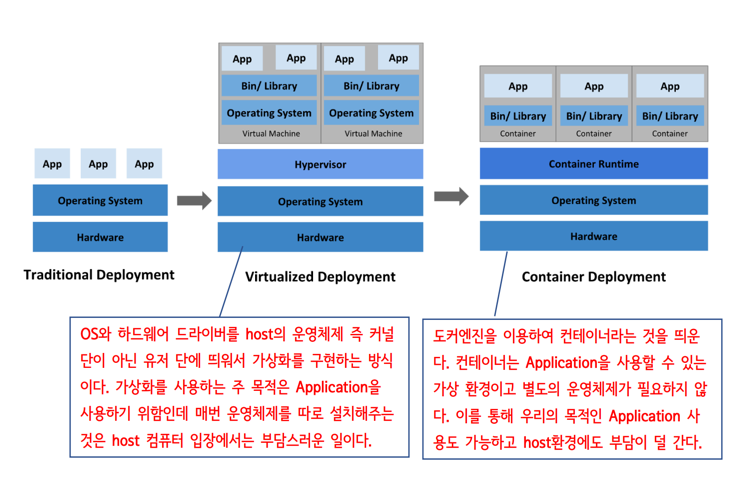

# 도커

## YAML

- XML과 JSON 포맷과 같이 타 시스템간에 데이터를 주고받을 때 약속된 포맷(규칙)이 정의되어 있는 또 하나의 파일형식
- 좀더 인간 친화적으로 작성해 가독성을 높이는 쪽으로 무게를 두었음
- 고급 컴퓨터 언어에 친화적임
- YAML은 `Docker Compose`, `쿠버네티스`, `Spring boot` 프로젝트에서 설정 파일을 정의할 때 자주 애용됨
- JSON과 유사
<br> (문법의 생김새만 다르고 데이터를 표현하고자 하는 의도는 동일함)
<br> (대부분의 웹에서 데이터 통신을 위해서 `JSON`을 사용하고, reference를 정의할 때 복잡한 object 구조를 표현하기 위해 `YAML`을 사용하는 것이 적합함)
  - 파이썬 커뮤니티에서는 파이썬 문법과 비슷한 indent로 구분하는 `YAML`을 더 선호함
  <br> (반면 자바스크립트 진영에서는 별도의 파서가 필요 없고 JavaScript Object와 구조가 유사한 JSON을 선호함)


<br>


### YAML 데이터 정의

#### 텍스트 Multi Line

- 개행이 있는 문자열을 JSON으로 표현하는 경우, 문자열 내에 `\n` 문자를 사이사이에 넣어주어야함
- YAML에서는 일반적인 프로그래밍과 다르게 다른 방법으로 지원함
- 개행된 문자열을 표현하는데 다음과 같이 두가지 방법이 존재함

1. `>` 기호 사용 (folded block scalar)


2. `|` 기호 사용 (literal block scalar)<br>
`|`는 개행문자를 개행문자로서 인식함

```shell
paragraph2": "abd def ghi\naab ccc"
```

<br>

### YAML사용분야

- 쿠버네티스
  - 쿠버네티스는 YAML파일을 정말로 많이 사용함
  - 기본적인 팟, 래플리카, deployment 등 모든 내부 object를 yml문서로 묘사하며, yaml 고유 기능 중
  하나인 문서 스트림을 사용해 클러스터 전체의 설정을 파일 하나로 관리할 수도 있음


- 스프링부트
  - YAML 방식의 설정 파일을 사용할 수 있음<br> (application.properties -> application.yaml)
  
<br>


## 도커 정의

- 데이터 또는 프로그램을 각각 독립된 환경에 격리시키는 기능을 제공하는 소프트웨어
- 컨테이너 기반의 오픈소스 가상화 플랫폼
- 리눅스 커널에서 제공하는 기능

<br>

## 가상 머신과 도커 컨테이너 비교




- 하이퍼바이저
  - 호스트 컴퓨터에서 다수의 OS를 동시에 실행하기 위한 논리적 플랫폼을 뜻함
  - 가상화 머신 모니터 또는 가상화 머신 매니저라고도 부름


- 컨테이너
  - 개발자는 컨테이너를 기록할 수 있는데 기록되는 형태를 `이미지`라고함
  - 오라클 환경을 사용할 경우, 오라클 환경에서 사용될 `이미지`만 준비하면 됨
  - 도커엔진이 설치된 환경에서 이미지만 있다면 불필요하게 우분투와 같은 OS를 설치하지 않고 Application을 실행할 수 있음

<br>


## 도커 파일

- 특정 이미지 (`컨테이너의 기록 형태`)로 컨테이너를 생성하고 일련의 작업을 수행하는 과정을 기록한 파일


<br>

## 컨테이너와 도커 엔진

- 도커 엔진을 설치하면 컨테이너를 생성하거나 구동시킬 수 있음


<br>

- 컨테이너 생성을 위해서는 이미지가 필요함


<br>


- 도커는 리눅스OS가 필요함
  - 도커는 리눅스를 기반으로 만들어졌으므로 다른 OS보다 리눅스에서 사용하기를 권장함


<br>

- 데이터나 프로그램을 독립된 환경에 격리해야 하는 이유
  - 프로그램이 수행될 때에는 관련 환경, 라이브러리 및 다른 프로그램이 필요함


ex) 워드프레스 - MySQL이 필요함


<br>


- 특정 프로그램을 업데이트하면 다른 프로그램에도 영향을 미칠 수 있음


<br>


- 프로그램 격리
  - 컨테이너 안의 프로그램은 다른 프로그램과 격리된 상태임
  - 아래의 경우, 완전히 독립된 환경이므로 동일한 버전 또는 다른 버전의 같은 프로그램 수행 가능


<br>


## 서버
- 어떤 서비스를 제공하는 것
  
### 서버 분류

- 기능적 서버 
- 물리적 서버


### 서버의 기능

- 서버의 기능은 S/W에서 제공함
- 여러 기능적인 의미를 가지는 서버가 하나의 물리적 컴퓨터에 함께 존재할 수 있음


### 서버의 대표적인 예시


#### :one: 웹 서버

#### :two: 메일 서버

#### :three: 데이터베이스 서버

#### :four: 파일 서버

#### :five: DNS 서버

#### :six: DHCP 서버

#### :seven: FTP 서버

#### :eight: 프락시 서버

#### :nine: 인증 서버

<br>


## 도커 이미지 구조

```shell
docker run -p 8888:80 unico67//unicohttppd:1.0

# unico67 -> 도커이미지의 깃허브 계정
# 버전 -> 1.0.  태그라고도함
```

- `도커 이미지`란, 컨테이너를 구동시키기 위한 파일과 설정값 등을 저장한 것
- 이미지는 변하지 않고(`Immutable`) 상태를 가지지 않음(`Stateless`)
- 이미지는 단지 컨테이너를 구동할 때만 사용할 뿐, 실행 중에 변경된 내용은 컨테이너에 저장됨


<br>

### 도커 이미지 Layer

- 도커 이미지의 핵심은 레이어 형태로 되어있다는 것임
- Writable layer과 Non writable로 구분되어 있음
- 유니온 파일 시스템을 이용하면 여러개의 레이어를 하나의 파일 시스템으로 사용할 수 있음
- 이미지는 여러개의 읽기 전용 레이어로 구성되고 파일이 추가되거나 수정될 때 새로운 레이어가 생성됨

- 여러 이미지를 가지고 있더라도 중복된 부분은 하나만 가지고 있음
  - 따라서 공간이 효율적이고 확장성이 좋음
  - 이러한 확장성을 바탕으로 Docker Hub에는 다양한 이미지들이 존재하고 80억이 넘는 다운로드가 이루어지고 있음

<br>

