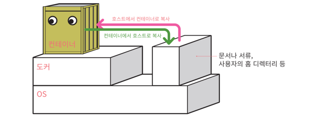

# 도커 명령의 구성


```shell
docker 
상위명령     하위명령   [옵션]                   대상                     [인자]
container  run      명령의 세부 설정 시 이용
image      pull     -d : 백그라운드 실행
           start    -i or –t : 대화형        명령을 수행할 구체적인 대상    대상에 전달할 값 지정
           start/stop/run 
           명령인 경우  container 생략 가능
```


- 상위 커멘드를 생략하면 Default는 `container`
- container와 관련된 하위 커맨드들은 옵션과 관련 지어 사용함

## 대표적인 도커 명령어


- 도커 버전 확인
```shell
docker --version
```


### 컨테이너 제어 명령
```shell
docker [container] 하위명령 옵션
```


- 주요 하위 커맨드

| 하위 커맨드 | 내용                                                                                                                                         | 생략 가능 여부 | 주요 옵션                                   |
|:-------|:-------------------------------------------------------------------------------------------------------------------------------------------|:---------|:----------------------------------------|
| start  | 컨테이너를 실행                                                                                                                                   | O        | -i                                      |
|stop| 컨테이너를 정지                                                                                                                                   |O| 거의 사용하지 않음                              |
|create| 도커 이미지로부터 컨테이너를 생성                                                                                                                         |O| --name -e -p -v                         |
|run| 도커 이미지를 내려받고 컨테이너를 생성해 실행함 (다운 로드는 필요한 경우에만)<br> docker image pull, docker container create, docker container start라는 세개의 명령을 하나로 합친 것과 같다 |O| --name -e -p -v -d -i -t                |
|rm| 정지 상태의 컨테이너를 삭제                                                                                                                            |O| -f -v                                   |
|exec| 실행 중인 컨테이널 속에서 프로그램을 실행                                                                                                                    |O| -i (interactive)  -t (실행결과를 화면에 계속 내보냄) |
|ls| 컨테이너 목록을 출력 (기동 여부와 무관하게 현재 만들어져있는 컨테이너 목록을 확인. ps는 실행중인 것만 확인.)                                                                           |*1 (생략형은 docker ps)|-a|
|cp| 도커 컨테이너와 도커 호스트 간에 파일을 복사                                                                                                                  |O|거의 사용하지 않음|
|commit| 도커 컨테이너를 이미지로 변환                                                                                                                           |O|거의 사용하지 않음|


<br>


### 이미지 제어 명령 

리포지토리: . 대표적인 리포지토리가 도커 허브

```shell
docker volume 하위명령 옵션
```

- 주요 하위 커맨드

|하위 커맨드| 내용                           |생략 가능 여부|주요 옵션|
|:---|:-----------------------------|:---|:---|
|create| 볼륨을 생성                       |X|--name|
|inspect| 볼륨의 상세 정보를 출력                |X|거의 사용하지 않음|
|ls| 볼륨의 목록을 출력                   |X|-a|
|prune| 현재 마운트되지 않은 볼륨을 모두 삭제        |X|거의 사용하지 않음
|rm| 지정한 볼륨을 삭제 (로컬에 존재하는 이미지 삭제) |X|거의 사용하지 않음|

<br> 


### 네트워크 제어 명령

A네트워크와 B네트워크는 다른 네트워크임<br>


```shell
docker network 하위명령어 옵션
```

- 주요 하위 커맨드


| 하위 커맨드     | 내용                           | 생략 가능 여부 | 주요 옵션      |
|:-----------|:-----------------------------|:---------|:-----------|
| connect    | 컨테이너를 도커 네트워크에 연결            | X        | 거의 사용하지 않음 |
| disconnect | 컨테이너의 도커 네트워크 연결을 해제         | X        | 거의 사용하지 않음 |
| create     | 도커 네트워크를 생성                  | X        | 거의 사용하지 않음 |
| inspect    | 도커 네트워크의 상세 정보를 출력           | X        | 거의 사용하지 않음 |
| ls         | 도커 네트워크의 목록을 출력              | X        | 거의 사용하지 않음 |
| prune      | 현재 컨테이너가 접속하지 않은 네트워크를 모두 삭제 | X        | 거의 사용하지 않음 |
|rm|지정한 네트워크를 삭제|X|거의 사용하지 않음|


<br>


### 기타 명령어

- 그 밖의 상위 커맨드

|상위 커맨드|내용|
|:---|:---|
|checkpoint|현재 상태를 일시적으로 저장한 후, 나중에 해당 시점의 상태로 되돌릴 수 있음|
|node|도커 스웜의 노드를 관리하는 기능|
|plugin|플러그인을 관리하는 기능|
|secret|도커 스웜의 비밀값 정보를 관리하는 기능|
|service|도커 스웜의 서비스를 관리하는 기능|
|stack|도커 스웜 또는 쿠버네티스에서 여러 개의 서비스를 합쳐 구성한 스택을 관리하는 기능|
|swarm|도커 스웜을 관리하는 기능|
|system|도커 엔진의 정보를 확인하는 기능|


<br>

### 단독 명령어

- 단독 커맨드


|단독 커맨드|내용|주요 옵션|
|:---|:---|:---|
|login|도커 레지스트리에 로그인|-u -p|
|logout|도커 레지스트리에 로그아웃|거의 사용하지 않음|
|search|도커 레지스트리를 검색|거의 사용하지 않음|
|version|도커 엔진 및 명령행 도구의 버전을 출력|거의 사용하지 않음|


<br>


### 도커 실행

```shell
docker [container] run 옵션
```

도커 생성 및 실행 기능, 필요시 이미지 다운로드 기능도 수행
<br>
<br>

docker run 커맨드는 아래의 세가지 역항을 수행함

```shell
docker pull + docer create + docker start
```


<br>

### 도커 컨테이너의 생애주기


- 동작 중인 컨테이너는 삭제를 할 수 없음
- 따라서 컨테이너를 정지한 후에 삭제를 해야함
```shell
docker stop & docker rm # 도커 정지 후 삭제 명령어
```


<br>


### 컨테이너 생성 및 실행

```shell
docker run 옵션 이미지 [인자]
```

- 컨테이너 포트 번호
    - 이미지당 정해진 포트 번호를 꼭 주어야함. (http는 80을 줌.)

<br>

- 주요 옵션

| 옵션 형식                 | 내용                  |
|:----------------------|:--------------------|
| --name 컨테이너_이름        | 컨테이너 이름을 지정함        |
| -p 호스트_포트번호:컨테이너_포트번호 | 포트 번호를 지정함          |
| -v 호스트_디스크:컨테이너_디렉터리  | 볼륨을 마운트함            |
| --net=네트워크_이름         | 컨테이너를 네트워크에 연결함     |
| -e 환경변수_이름=값          | 환경변수를 설정함           |
| -d                    | 백그라운드로 실행함          |
| -i                    | 컨테이너에 터미널(키보드)을 연결함 |
| -t                    | 특수 키를 사용 가능하도록 함    |
|-help|사용 방법 안내 메시지를 출력함|

<br>


### 컨테이너 정지 명령

```shell
docker stop 컨테이너명
```


<br>

### 컨테이너 삭제 명령

```shell
docker rm 컨테이너명
```


<br>

### 컨테이너 목록 확인 명령

```shell
docker ps [옵션]
```

```shell
docker container ls [옵션]
```


- 컨테이너 목록의 주요 항목

| 항목           | 내용                                                                              |
|:-------------|:--------------------------------------------------------------------------------|
| CONTAINER ID | 컨테이너 식별자. 무작위 문자열이 할당됨. 본래는 64글자지만 앞에서부터 12글자만 출력함. 이 12글자만으로도 식별자 역할을 수행할 수 있음 |
| IMAGE        | 컨테이너를 만들 때 사용한 이미지의 이름                                                          |
| COMMAND      | 컨테이너 실행 시에 실행하도록 설정된 프로그램의 이름. 크게 신경쓰지 않아도 됨                                    |
|CREATED|컨테이너 생성 후 경과된 시간|
|STATUS|컨테이너의 현재 상태. 실행중이라면 'Up'. 종료된 상태라면 'Exited'가 출력됨|
|PORTS|컨테이너에 할당된 포트 번호. '호스트 포트 번호 -> 컨테이너 포트 번호' 형식으로 출력됨.<br>포트 번호가 동일할 경우 -> 의 뒷부분은 출력되지 않음|
|NAMES|컨테이너 이름|

<br>

## 컨테이너의 통신

### :one: 아파치 웹서버

- 아파치
  - 웹서버를 제공하는 S/W


- 컨테이너는 기본적으로 외부에서 접근 불가능한 상태로 실행. 따라서 컨테이너 실행 시 설정이 필요함 (docker run 명령의 옵션 이용)

<br>

### :two: 컨테이너와의 통신


<br>

- 외부와의 접속을 위해 통신포트를 설정해주어야 함


컨테이너 포트번호는 80이라더라도, 밖에서 접근할 떄에는 8080으로 접근이 가능하도록 바인딩을 시킨것

```shell
-p 8080:80

# -p 호스트포트번호:컨테이너포트번호
```


<br>

- 아파치 웹 서버를 여러개 기동시키고 싶은 경우, 호스트 포트번호는 다르게 지정해주어야 함
<br>(컨테이너와 연결하는 호스트의 포트 번호를 겹치지 않게 설정함)


컨테이너C에 접근하기 위해서는 포트번호를 8082로 접근해야 함

<br>


## 파일 복사 명령

```shell
docker cp
```

```shell
docker container cp
```

<br>

- 호스트와 컨테이너 간에 파일 복사




<br>

- 컨테이너 안으로 복사해서 붙여넣고 싶을 경우


```shell
docker cp 호스트_경로 컨테이너명:컨테이너_경로
```


<br>


- 컨테이너 내부 파일을 호스트쪽으로 데리고 오고 싶은 경우

```shell
docker cp 컨테이너명:컨테이너_경로 호스트_경로
```


<br>

### 파일 복사 실습

- 아파치 컨테이너 생성

```shell
docker run --name myhttpd -d -p 8089:80 httpd
```


- index.html 복사
```shell
docker cp index.html myhttpd:/usr/local/apache2/htdocs/

# htdocs -> html document
```


- nginx 서버를 도커 컨테이너로 기동하기

```shell
docker run –-name mynginx –d –p 8084:80 nginx
```

<br>

## 이미지 삭제

- 컨테너를 삭제해도 이미지는 남아있으므로 불필요한 이미지는 즉시 삭제
- 해당 이미지의 컨테이너가 남아있으면 이미지는 삭제 되지 않음

<br>


## 도커 네트워크 생성 및 삭제

- 도커는 네트워크를 직접 생성하지 않아도 기본 네트워크가 자동으로 3개 만들어짐
- 네트워크를 명시적으로 지정하지 않고 Docker 컨테이너를 시작하면 기본값인 "bridge" 네트워크로 Docker 컨테이너를 시작함
- 컨테이너에 의해 기동된 일부 서버들만의 통신망을 구축하기 위해서 가상의 네트워크를 정의하여 사용할 수 있음

### 네트워크 생성 명령

```shell
docker network create 네트워크명
```


### 네트워크 삭제 명령

```shell
docker network rm 네트워크명
```

### 기타 네트워크명

- 주요 하위 커맨드

| 커맨드        | 내용                              | 생략 가능 여부 | 주요 옵션                |
|:-----------|:--------------------------------|:---------|:---------------------|
| connect    | 네트워크에 컨테이너를 새로이 접속              | X        | 거의 사용하지 않음           |
| disconnect | 네트워크에서 컨테이너의 접속을 끊음             | X        | 거의 사용하지 않음           |
| create     | 네트워크를 생성                        | X        | 거의 사용하지 않음           |
| inspect    | 네트워크의 상세 정보를 확인                 | X        | 거의 사용하지 않음           |
| ls         | 네트워크의 목록을 확인                    | X        | 거의 사용하지 않음           |
| prune      | 현재 아무 컨테이너도 접속하지 않은 네트워크를 모두 삭제 | X        | 거의 사용하지 않음           |
| rm         | 지정한 네트워크를 삭제                    | X        | 거의 사용하지 않음           |


<br>


## 도커 컨테이너의 저장소

- 도커 컨테이너에 쓰여진 데이터는 기본적으로 컨테이너가 삭제될 때 함께 사라짐
- 도커에서 돌아가는 많은 애플리케이션이 컨테이너의 생명 주기와 관계없이 데이터를 영속적으로 저장해야 하는경우, 그리고
여러개의 도커 컨테이너가 하나의 저장 공간을 공유해서 데이터를 읽거나 써야하는 경우가 있다
