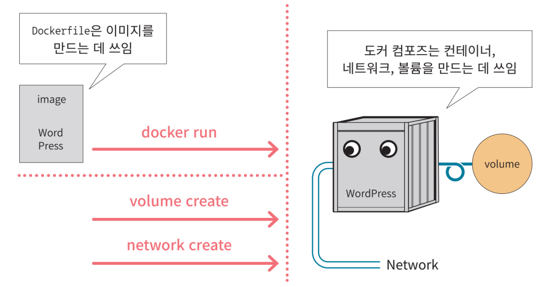

# 도커

## Dockerfile 스크립트로 이미지 생성하기


- Dockerfile에는 컨테이너에 넣을 이미지나 실행할 명령 등을 기술

```shell
docker build -t 생성할이미지이름 Dockerfile경로

# -t: tag. 버전을 뜻함
# Dockerfile경로: 현재 디렉토리에 있을경우 .이라도 찍어주어야 함
```

<br>

- Spring boot application을 기동시키는 도커 이미지를 생성하게끔 만드는 도커 파일
<br> (Dockerfile 스크립트 예시)

```shell
FROM openjdk:11-openjdk  # openjdk라는 이미지를 가져와서 baselayer로함. tag정보 -> openjdk:11
ARG JAR_FILE=build/libs/*.jar  # 이 부분없이 path정보를 아래의 JAR_FILE위치에 적어도 됨
COPY ${JAR_FILE} app.jar  # 외부에서 전달된 JAR_FILE이 전달될 때 app.jar로 대체될 수 있음을 뜻함
ENTRYPOINT ["java", "-jar", "/app.jar"]   # 실행시킬 명령어 목록. "java" : 자바 인터프리터. 
```

- jdk를 base layer로 설정


- 도커 이미지가 내장하는 심플 리눅스는 자바 환경을 포함하지 않음<br>
따라서 JAR_FILE이라는 인자를 포함시킴. (build/libs/ 경로로 포함시킴)


- 자바는 언어명이며, JVM을 기동시키는 인터프리터이기도 함

<br>

## Dockerfile 스크립트에 사용되는 주요 명령어


| 명령어        | 내용                                                                                                                 |
|:-----------|:-------------------------------------------------------------------------------------------------------------------|
| `FROM`       | 토대가 되는 이미지를 지정                                                                                                     |
| ADD        | 이미지에 파일이나 폴더를 추가                                                                                                   |
| `COPY`       | 이미지에 파일이나 폴더를 추가                                                                                                   |
| RUN        | 이미지를 빌드할 때 실행할 명령어를 지정                                                                                             |
| `CMD`        | 컨테이너를 실행할 때 실행할 명령어를 지정                                                                                            |
| `ENTRYPOINT` | 컨테이너를 실행할 때 실행할 명령어를 강제 지정<br>도커 이미지의 메인 기능을 반드시 수행해야한다면 `ENTRYPOINT`로 지정<br/>MySQL, Apache등을 `ENTRYPOINT`로 지정하는 편 |
| ONBUILD    | 이 이미지를 기반으로 다른 이미지를 빌드할 때 실행할 명령어를 지정                                                                              |
| EXPOSE     | 이미지가 통신에 사용할 포트를 명시적으로 지정                                                                                          |
| VOLUME     | persistency data를 저장할 경로를 명시적으로 지정                                                                                 |
| ENV        | 환경변수를 정의                                                                                                           |
| WORKDIR    | RUN, CMD, ENTRYPOINT, ADD, COPY에 정의된 명령어를 실행하는 작업 디렉터리를 지정                                                         |
| SHELL      | 빌드시 사용할 SHELL을 변경                                                                                                  |
| LABEL      | 이름이나 버전, 저작자 정보를 설정                                                                                                |
| USER       | RUN, CMD, ENTRYPOINT에 정의된 명령어를 실행하는 사용자 또는 그룹을 지정                                                                  |
|ARG| docker build 커맨드를 사용할 때 입력받을 수 있는 인자를 선언                                                                           |
|STOPSIGNAL| docker stop 커맨드를 사용할 때 컨테이너 안에서 실행 중인 프로그램에 전달되는 시그널을 변경                                                           |
|HEALTHCHECK| 컨테이너 헬스체크 방법을 커스터마이징                                                                                               |


<br>


### nginx에 Vue.js의 빌드 파일을 배포하여 컨테이너로 기동하는 Dockerfile의 예시

```shell
# develop stage (개발 단계)
FROM node:11.1-alpine as develop-stage   # alpine: 리눅스 종류. 우분투/centOS보다 간단함.
WORKDIR /app   # cd(change directory)와 동일한 역할을 하는 도커 명령어. 최상위 폴더의 app 디렉토리로 옮겨감
COPY package*.json ./  # vue.js에 대해 dependency한 정보를 담고있는 추가 파일을 app directory로 복사하는 것
CMD ["npm","run","install"]  
COPY . .   # 배포할 수 있는 파일을 만들 경우 만들어진 host의 모든 파일을 app 디렉토리에 복사하라는 것 

# build stage
FROM develop-stage as build-stage
CMD ["npm","run","build"]

# production stage (배포단계)
FROM nginx:1.15.7-alpine as production-stage
COPY --from=build-stage /app/dist /usr/share/nginx/html EXPOSE 80  # 도커이미지에 의해 기동되는 것이 내부적으로 80포트를 사용하게 만듦 (listening하게 만듦)
CMD ["nginx", "-g", "daemon off;"]  # nginx를 기동시키는 명령어. 이 경우 ENTRYPOINT를 사용하는게 좋다. 
# demon off: 컨테이너 내부에서 데몬으로 수행되지 않도록 함. (결국 80포트로 nginx가 수행되는 결과가 되게함)
```


<br>


### MongoDB를 기동하는 Dockerfile의 예시

```shell
FROM ubuntu
MAINTAINER Kimbro Staken

RUN apt-key adv --keyserver keyserver.ubuntu.com --recv 7F0CEB10
RUN echo "deb http://downloads-distro.mongodb.org/repo/ubuntu-upstart dist 10gen" | tee -a /etc/apt/sources.list.d/10gen.list
RUN apt-get update
RUN apt-get -y install apt-utils
RUN apt-get -y install mongodb-10gen

#RUN echo "" >> /etc/mongodb.conf

CMD ["/usr/bin/mongod", "--config", "/etc/mongodb.conf"]
```

<br>

### 명령어 사용 추가 예시


<br>

### Dockerfile에서 자주 쓰이는 명령어 정리


- Docker가 대중화되면서 많은 프로젝트들이 개발 환경을 `컨테이너화 (containerization)`시키고 있음
<br> (이런 프로젝트의 최상위 디렉터리에는 Dockerfile이 위치하게 된다)

<br>

- Dockerfile은 `Docker 이미지가 어떤 단계를 거쳐서 빌드 되어야 하는지를 담고있는 텍스트 파일`임
- 도커는 `Dockerfile에 나열된 명령문을 차례대로 수행하여 이미지를 생성`함


<br>

#### Dockerfile 포맷

- 하나의 Dockerfile은 기본적으로 다음과 같은 구조를 가진 여러개의 명령문으로 구성됨


##### 주석(Comment)

<br>

##### FROM 명령문

```shell
FROM <이미지>
FROM <이미지>:<태그>
```

- 하나의 Docker 이미지는 base 이미지부터 시작해서 기존 이미지 위에 새로운 이미지를 중첩해서 여러 단계의 이미지 층(layer)을 쌓아가며 만들어짐


- `FROM`명령문은 이 base 이미지를 지정하기 위해서 사용되는데, 보통 Dockerfile 내에서 최상단에 위치함


- base 이미지는 도커 허브와 같은 Docker repository에 올려놓은 잘 알려진 공개이미지인 경우가 많음


###### FROM 예시 - 우분투 최신 버전을 base 이미지로 사용

```shell
FROM ubuntu:latest
```

###### FROM 예시2 - NodeJS 12를 base 이미지로 사용

```shell
FROM node:12
```

###### FROM 예시3 - Python 3.8 (alpine 리눅스 기반)을 base 이미지로 사용

```shell
FROM python:3.8-alpine
```

###### FROM 예시4 - 아파치 웹 서버를 base 이미지로 사용

```shell
FROM httpd
```

<br>


##### WORKDIR 

- 작업 디렉토리의 전환 (쉘의 `cd`명령문과 같은 역할)

```shell
WORKDIR /usr/app
# WORKDIR <이동할 경로>
```

<br>

##### RUN

- 이미지 빌드 과정에서 필요한 커맨드를 실행하기 위해서 사용됨

```shell
RUN ["<커맨드>", "<파라미터1>", "<파라미터2>"]
RUN <전체 커맨드>
```


- 보통 이미지 내부에 특정 소프트웨어를 설치하기 위해서 많이 사용함


###### curl 도구 설치
```shell
RUN apk add curl
```

###### npm 패키지 설치

```shell
RUN npm install --silent
```


###### pip 패키지 설치

```shell
RUN pip install -r requirement.txt
```


<br>

##### ENTRYPOINT

- 이미지를 만들고나서 이미지를 컨테이너로 띄워서 항상 실행되어야 하는 커맨드를 지정되어야 할 때 사용함

- ENTRYPOINT 명령문은 Docker 이미지를 마치 하나의 실행 파일처럼 사용할 때 유용함


- 컨테이너가 기동될 때 ENTRYPOINT 명령문으로 지정된 커맨드가 실행되고, ENTRYPOINT 수행이 끝나면 도커 컨테이너의 라이프 사이클이 끝나므로 컨테이너도 같이 종료된다


```shell
ENTRYPOINT ["<커맨드>", "<파라미터1>", "<파라미터2>"]
ENTRYPOINT <전체 커맨드>
```


<br>

##### EXPOSE

- linstening하는 포트를 지정

##### COPY/ADD 명령문

- 둘다 소스와 목적지가 존재함. (소스는 호스트에 있는 파일. 목적지 안에 복사해서 붙여넣을 때 `COPY`, `ADD` 명령어를 사용)
- 거의 유사하지만 약간의 차이가 있음


###### :one: COPY


###### :two: ADD

- COPY보다 보다 더 다양한 기능을 지원함 (조금 더 강력한 COPY 명령어로 봐도 됨)
- 호스트의 특정 디렉토리에 복사해서 넣을 경우에는 그냥 COPY 명령어를 사용하는게 좋다

##### ENV

- 환경변수 설정할 경우에 사용하는 명령어 
- 이러한 환경 변수를 이미지로 만들어진 컨테이너를 기동시킬 떄 변경되었다면 변경된 내용을 설정해서 전달할 수 있음
- `-e`옵션과 함께 사용


##### ARG 명령문

- 빌드시 넘어올 수 있는 인자 설정


```shell
ARG <이름>
ARG <이름>=<기본값>
```

- 이 이미지를 가지고 컨테이너를 기동시킬 때, 이미지를 만들 때 쓸 수 있도록 인자에 대한 정보를 제공함

<br>

##### .dockerignore 파일

- 명령문은 아니지만 Docker 이미지를 생성할 때 (빌드할 때) 제외시키고 싶은 파일에 있다면 .dockerignore 파일에 추가하면 됨

<br>


## .tar 

- .tar
  - 파일을 패키징 하는 기술


- .jar
  - 자바 클래스를 패키징


- .tar load


### CONTAINER export/import


- 컨테이너를 파일로 저장

```shell
docker export [컨테이너명 or 컨테이너id] > 파일명.tar
```

컨테이너를 저장하더라도 볼륨은 같이 저장되지 않으므로 볼륨은 볼륨대로 따로 백업해야 함


<br>

- 저장한 컨테이너를 도커 이미지로 읽어 들임

```shell
docker import [파일명.tar or URL] - [image name[:tag name]]
```


<br>

## 컨테이너 개조 방법

- 컨테이너 내부 이미지를 바꾸고 싶을 때 bash shell로 들어가서 리눅스 명령어로 작업하면 됨


### :one: 파읿 복사 & 마운트


### :two: 컨테이너에서 리눅스 명령 이용


- 리눅스 명령 실행을 위해 bash 쉘 필요 (/bin/bash)
- docker run 또는 docker exec 명령을 이용하여 실행
<br> (`docker exec`: 컨테이너 속에서 명령을 실행하는 명령. 실행 중인 컨테이너에 사용)

- bash를 이용하여 변경이 완료되면 docker start 명령으로 재시작 필요


<br>


- docker exec 명령
```shell
docker exec [옵션] 컨테이너_이름 /bin/bash
```


```shell
docker exec –it apa000ex23 /bin/bash
```

<br>

- docker run 명령
 
```shell
docker run [옵션] 이미지_이름 /bin/bash
```
  

```shell
docker run –-name apa000ex23 –it –p 8089:80 httpd /bin/bash
```


- bash를 통해 컨테이너를 조작하는 동안에는 도커 명령을 사용할 수 없다.
- 도커 명령과 bash 명령의 차이점


- 컨테이너 조작이 끝나면 ‘exit’ 명령으로 컨테이너를 빠져나와야 함


<br>


## 도커 허브

- 도커의 이미지 저장소 역할
- 도커의 공식 레지스트리


직접 만든 이미지는 도커 허브에 업로드할 수도 있고, 비공개로 도커 허브와 같은 장소인 `레지스트리`를 만들 수도 있음

<br>


## 도커 레지스트리

- 도커 이미지를 관리 및 배포하는 공간
- 도커 허브를 기본 레지스트리로 사용함
- 레지스트리는 `Docker Hub`, `Private Docker Hub`, `회사 내부`용 등으로 나뉨


<br>

## 리포지토리 (Repository)

- 레지스트리 내에 도커 이미지가 저장되는 공간
- 이미지명이 리포지토리명으로 사용되기도 함
- 깃허브의 리포지토리와 비슷한 역할을 수행함
- 레지스트리를 구성하는 단위


도커 허브는 레지스트리가 여럿 모인 형태임

<br>

- 예제

  - unico67 이라는 레지스트리
    - unicohttpd, cicdtest 라는 리포지토리


```shell
docker run -p 8888:80 unico67/unicohttpd
```

unico67: 레지스트리<br>
unicohttpd: 

<br>


## 태그 (Tag)

- 같은 이미지이지만 버전별로 내용이 다름
- 해당 이미지를 설명하는 버전 정보를 주로 입력
- 보통 latest 태그가 붙은 최신 버전을 사용

<br>


<br>


## 도커 컴포즈


- 시스템 관련 명령들을 하나의 파일에 작성하여 한 번에 시스템 전체를 실행하고 종료 및 폐기까지 실행하도록 도와주는 도구

- 단일 서버에서 여러개의 컨테이너를 하나의 서비스로 정의해서 컨테이너의 묶음으로 관리할 수 있는 작업 환경을 제공하는 관리 도구


- 시스템 구축과 관련된 명령어를 하나의 텍스트 파일(정의 파일, Compose File)에 기재해 명령어 한번에 시스템 전체를 실행하고 종료


<br>

- 도커 컴포즈를 사용하면 여러 개의 명령어를 하나의 정의 파일로 합쳐서 실행할 수 있음


### YAML (YAML Ain't a Markup Language)포맷의 정의 파일

- 도커 컴포즈는 시스템의 모든 정보를 정의 파일에 기재함


#### 명령어

- up
  - 정의 파일대로 이미지를 내려 받고 컨테이너 생성 및 실행, 네트워크나 볼륨도 정의 가능


- down
  - 컨테이너와 네트워크를 정지 및 삭제


- stop
  - 컨테이너와 네트워크를 삭제없이 종료만 진행


<br>

### 도커 컴포즈와 Dockerfile 스크립트의 차이점

- 도커 컴포즈
  - 컨테이너와 주변 환경 및 네트워크/볼륨을 생성할 수 있음


- Dockerfile 스크립트
  - 이미지를 만들기 위한 것으로 네트워크나 볼륨은 만들 수 없음




정의 파일을 읽어서 작업을 수행함


### 도커 컴포즈 사용법


- background/foreground
주어진 명령 수행 후 바로 다음 명령을 수행할 수 있는 상황이 되느냐 `vs` 
다음 명령을 바로 수행하지 못하고 기다려야하는지에 따라 background/foreground의 차이가 생김

<br>


# 클라우드

- 네트워크상에서 다양한 서비스를 필요에 따라서 이용하는 시스템 형태
- 시스템 구축에 필요한 네트워크/서버/스토리지/애플리에키션을 서비스로 제공함


## 클라우드 컴퓨팅

- `클라우드 컴퓨팅`은 `서로 다른 물리적인 위치에 존재하는 컴퓨팅 자원을 가상화 기술로 통합해 제공하는 기술`을 뜻함

- 컴퓨팅 자원
  - 컴퓨터에 내장되어 있는 각종 S/W, H/W 및 저장 매체를 뜻함
  - 클라우드 컴퓨팅 환경을 통해 사용자는 웹에서만 접속하면 언제 어디서나 원하는 컴퓨팅 자원을 클라우드로부터 제공받아 사용할 수 있음
  - 그 대가로 사용자는 사용한 컴퓨팅 자원만큼 비용을 지급하면 됨
    - 따라서 더 이상 값비싼 S/W를 구입하고 설치할 필요가 없어짐
    - 또한 디스크 용량에 대한 걱정없이 원하는 자료를 저장하고 어디서나 확인이 가능해짐


## 클라우드 시스템

- 시스템을 보유하는 것이 아니라 필요할 때만 시스템을 이용하는 것


## 클라우드 시스템 구축 형태


### :one: on-demand 형태

- 필요할 떄마다 빌리는 것

### :two: on-premise 형태

- 자체적으로 구축하는 것

<br>

## 클라우드 종류


### 퍼블릭 클라우드

- 클라우드 서비스 기업이 인터넷을 통해 불특정 다수의 기업 및 개인에게 컴퓨팅 리소스를 빌려주는 서비스


### 프라이빗 클라우드

- 기업이 직접 클라우드 환경을 구축하고 내부에서만 컴퓨팅 리소스를 사용하는 서비스


### 하이브리드 클라우드


<br>

## AWS EC2

- EC2 (Elastic Compute Cloud)
  - AWS에서 제공하는 클라우드 컴퓨팅 서비스
  - 이 서브시를 이용하면 아마존이 각 세계에 구축한 데이터 센터의 서버용 컴퓨터들의 자원을 원격으로 사용할 수 있음
  - 즉, `아마존으로부터 한 대의 컴퓨터를 임대하는 것`


### AWS EC2의 장점

- 용량을 늘리거나 줄일 수 있음
- 사용한만큼 지불하므로 저렴하다.
- 사용자가 인스턴스를 완전히 제어할 수 있다.
- 보안 및 네트워크 구성, 스토리지 관리 효과적이다.


### 맥에서 PuTTY 대신 ssh 사용해서 EC2 접속하기

1. `.pem`파일이 있는 경로로 진입

2. 읽기 및 쓰기 권한 부여
```shell
chmod 600 awsedu.pem
```


3. 접속

```shell
ssh -i [pem 파일명] ec2-user@퍼블릭 IPv4주소
```


- 아래 결과가 나오면 성공

```shell
Are you sure you want to continue connecting (yes/no/[fingerprint])? y
Please type 'yes', 'no' or the fingerprint: y
Please type 'yes', 'no' or the fingerprint: yes
Warning: Permanently added '3.35.13.102' (ED25519) to the list of known hosts.
   ,     #_
   ~\_  ####_        Amazon Linux 2023
  ~~  \_#####\
  ~~     \###|
  ~~       \#/ ___   https://aws.amazon.com/linux/amazon-linux-2023
   ~~       V~' '->
    ~~~         /
      ~~._.   _/
         _/ _/
       _/m/'
```

#### 추가 내용

- 타임존 변경 (한국 시간으로 변경)
```shell
date
sudo rm /etc/localtime

# 이 리눅스 머신의 날짜와 시간 처리를 우리나라의 타임존에 알맞게 설정
sudo ln -s /usr/share/zoneinfo/Asia/Seoul /etc/localtime
date
```

<br>


## aws-linux에 도커 엔진과 도커 컴포즈를 설치하기

- `yum`
  - Yellodog Update Modified의 약자
  - 레드햇 계열의 리눅스 배포판에서 사용하는 프로그램(패키지) 설치 관리 도구


```shell
# yum의 저장소 업데이트를 처리
sudo yum update -y

# 도커 설치
sudo yum -y install docker

# 도커 시작
sudo service docker start

# 권한 부여 : docker 명령은 root 사용자 권한으로 수행되는 명령이다. 그러므로 일반 사용자의
# 경우에는 sudo 명령을 앞에 붙여서 도커 명령을 실행시켜야 한다. 다음 명령을 수행하면 해당 
# 사용자를 도커 그룹에 추가하여 sudo 명령을 사용하지 않고도 도커 명령을 사용할 수 있게 한다.
sudo usermod -a -G docker ec2-user

# auto-start에 docker 등록
sudo chkconfig docker on

# 도커 버전 확인
docker version

# 최신 docker compose를 해당 링크를 통해서 전달받는다.
sudo curl -L https://github.com/docker/compose/releases/latest/download/docker-compose-$(uname -s)-$(uname -m) -o /usr/local/bin/docker-compose

# 권한 부여
sudo chmod +x /usr/local/bin/docker-compose

# 설치 확인
docker-compose version

# 도서 엔진이 잘 설치되었는지 그리고 네트워크 인바운드 설정이 제대로 되었는지 확인하기 위해 다음 명령을 실행시켜서 확인한다.
# 브라우저로 요청 : http://AWS퍼블릭 IPv4 주소:8089/ --> It Works 라는 페이지가 출력된다.

sudo docker run --name myhttpd -d -p 8089:80 httpd

docker stop myhttpd
```

